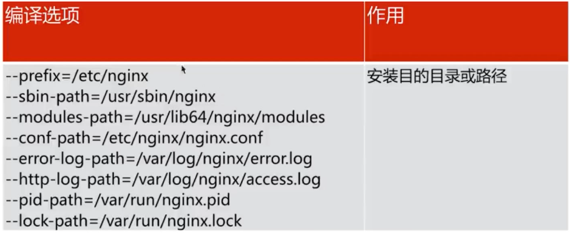
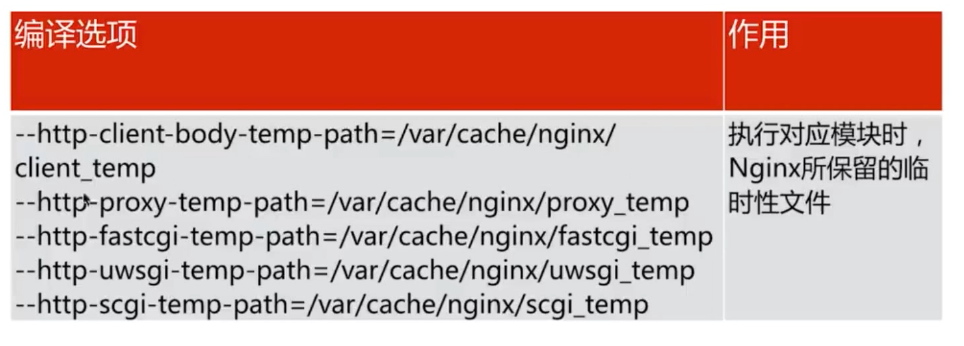
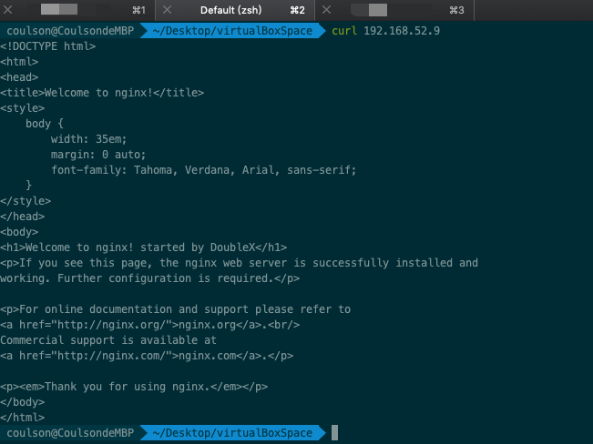
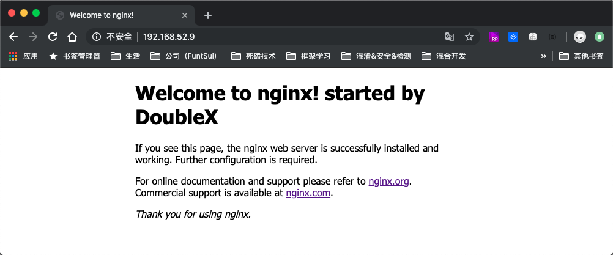
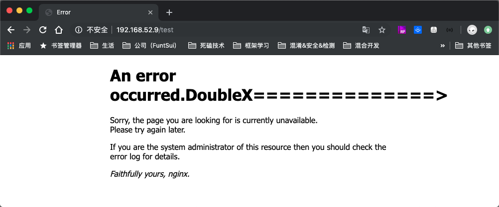

# 

#### 中间件

	> [什么是中间件？](https://www.redhat.com/zh/topics/middleware/what-is-middleware)
	>
	> [浅析深究什么是中间件](<https://www.jianshu.com/p/e2220909b597>)

这两篇文章比网上其他的对于中间件的讲述都要全面，**中间件是软件用的软件**，并没有一个标准的定义。根据位置和功能会产生很多分类的中间件。详情阅读两个链接中的文章。


#### Nginx 简述

​	  Nginx 是一个开源且高性能、可靠的 HTTP 中间件，代理服务。


#### 选择 Nginx 的理由

1. IO 多路复用 epoll

   [IO模型浅析-阻塞、非阻塞、IO复用、信号驱动、异步IO、同步IO](https://segmentfault.com/a/1190000016359495)

   [通俗讲解 异步，非阻塞和 IO 复用](https://www.zybuluo.com/phper/note/595507)

2. 轻量级

   功能模块少

   代码模块化

3. CPU 亲和（affinity）

   是一种把 CPU 核心和 Nginx 工作进程绑定方式，把每个 worker 进程固定在一个 CPU 上执行，减少了切换 CPU 的 cache miss 。获得更好的性能

4. Sendfile（零拷贝）

   通常的 httpServer 请求文件服务器对于文件的操作

   

   使用 sendfile （Linux 在2.2 之后推出的模式，减少内核态到用户态的拷贝，直接将数据从内核态拷贝到 socket）。在处理一些cdn 服务，静态文件，动静分离使用这种方式会优越很多

   


#### 快速安装

- [官方网站 nginx.org](http://nginx.org/en/linux_packages.html)

- 按照文档中，RHEL/CentOS 使用 yum 的方式安装

  

```
//首先创建配置 Nginx 的 yum 源
[root@localhost opt]# vim /etc/yum.repos.d/nginx.repo


//进入到 vim 编辑模式，copy复制下面内容，并保存退出。
//注意要将 *$releasever*  替换成对应的 CentOS 版本，我这里的是 7 
[nginx-stable]
name=nginx stable repo
baseurl=http://nginx.org/packages/centos/7/$basearch/
gpgcheck=1
enabled=1
gpgkey=https://nginx.org/keys/nginx_signing.key
~
~
~
...


// 命令查看可用的 nginx 最新版本，以及来源是或否是刚才配置  nginx-stable
[root@localhost etc]# yum list | grep nginx
nginx.x86_64                                1:1.16.1-1.el7.ngx         nginx-stable
nginx-debug.x86_64                          1:1.8.0-1.el7.ngx          nginx-stable
nginx-debuginfo.x86_64                      1:1.16.1-1.el7.ngx         nginx-stable
...


// yum 执行安装
[root@localhost etc]# yum install nginx
...	遇到选项直接  y  通过即可  // 或者上面的命令改为：yum -y install nginx
...


// 安装完成后，查看是否安装正确
[root@localhost /]# nginx -v				//显示版本号
nginx version: nginx/1.16.1
[root@localhost /]# nginx -V				//显示编译参数
nginx version: nginx/1.16.1
built by gcc 4.8.5 20150623 (Red Hat 4.8.5-36) (GCC)
built with OpenSSL 1.0.2k-fips  26 Jan 2017
TLS SNI support enabled
configure arguments: --prefix=/etc/nginx --sbin-path=/usr/sbin/nginx --modules-path=/usr/lib64/nginx/modules --conf-path=/etc/nginx/nginx.conf --error-log-path=/var/log/nginx/error.log --http-log-path=/var/log/nginx/access.log --pid-path=/var/run/nginx.pid --lock-path=/var/run/nginx.lock --http-client-body-temp-path=/var/cache/nginx/client_temp --http-proxy-temp-path=/var/cache/nginx/proxy_temp --http-fastcgi-temp-path=/var/cache/nginx/fastcgi_temp --http-uwsgi-temp-path=/var/cache/nginx/uwsgi_temp --http-scgi-temp-path=/var/cache/nginx/scgi_temp --user=nginx --group=nginx --with-compat --with-file-aio --with-threads --with-http_addition_module --with-http_auth_request_module --with-http_dav_module --with-http_flv_module --with-http_gunzip_module --with-http_gzip_static_module --with-http_mp4_module --with-http_random_index_module --with-http_realip_module --with-http_secure_link_module --with-http_slice_module --with-http_ssl_module --with-http_stub_status_module --with-http_sub_module --with-http_v2_module --with-mail --with-mail_ssl_module --with-stream --with-stream_realip_module --with-stream_ssl_module --with-stream_ssl_preread_module --with-cc-opt='-O2 -g -pipe -Wall -Wp,-D_FORTIFY_SOURCE=2 -fexceptions -fstack-protector-strong --param=ssp-buffer-size=4 -grecord-gcc-switches -m64 -mtune=generic -fPIC' --with-ld-opt='-Wl,-z,relro -Wl,-z,now -pie'
```


#### 安装目录介绍	

​	上面我们使用 yum  的方式安装了 Nginx。其实都是安装的一个一个的 rpm 包。那么对于Linux 可以使用 rpm(**RedHat Package Manager RedHat软件包管理工具**) 命令来列出我们安装的服务所对应的安装文件目录

```
[root@localhost /]# rpm -ql nginx
/etc/logrotate.d/nginx
/etc/nginx
/etc/nginx/conf.d
/etc/nginx/conf.d/default.conf
/etc/nginx/fastcgi_params
/etc/nginx/koi-utf
/etc/nginx/koi-win
/etc/nginx/mime.types
/etc/nginx/modules
/etc/nginx/nginx.conf
/etc/nginx/scgi_params
/etc/nginx/uwsgi_params
/etc/nginx/win-utf
/etc/sysconfig/nginx
/etc/sysconfig/nginx-debug
/usr/lib/systemd/system/nginx-debug.service
/usr/lib/systemd/system/nginx.service
/usr/lib64/nginx
/usr/lib64/nginx/modules
/usr/libexec/initscripts/legacy-actions/nginx
/usr/libexec/initscripts/legacy-actions/nginx/check-reload
/usr/libexec/initscripts/legacy-actions/nginx/upgrade
/usr/sbin/nginx
/usr/sbin/nginx-debug
/usr/share/doc/nginx-1.16.1
/usr/share/doc/nginx-1.16.1/COPYRIGHT
/usr/share/man/man8/nginx.8.gz
/usr/share/nginx
/usr/share/nginx/html
/usr/share/nginx/html/50x.html
/usr/share/nginx/html/index.html
/var/cache/nginx
/var/log/nginx
```


#### 安装编译参数

```
也就是上面   nginx -V   这个命令输出的内容
```






#### Nginx 默认配置语法

```
// 进入 nginx 目录
[root@localhost /]# cd /etc/nginx


[root@localhost nginx]# ls
conf.d  fastcgi_params  koi-utf  koi-win  mime.types  modules  nginx.conf  scgi_params  uwsgi_params  win-utf

 
// 查看默认配置
[root@localhost nginx]# cat nginx.conf

user  nginx;										//设置 nginx 服务的系统使用用户
worker_processes  1;								//工作进程数，一般和 cpu 个数一致

error_log  /var/log/nginx/error.log warn;			//nginx 的错误日志路径
pid        /var/run/nginx.pid;						//nginx 服务启动时候的pid


events {
    worker_connections  1024;						//每个进程允许最大连接数
}

// include 导入其他子配置文件，类似导包
http {
    include       /etc/nginx/mime.types;			// 上面说的HTTP的文件类型映射配置
    default_type  application/octet-stream;

	// 定义日志类型
    log_format  main  '$remote_addr - $remote_user [$time_local] "$request" '
                      '$status $body_bytes_sent "$http_referer" '
                      '"$http_user_agent" "$http_x_forwarded_for"';

    access_log  /var/log/nginx/access.log  main;	//访问日志

    sendfile        on;								//前面说过的零拷贝，默认开启
    #tcp_nopush     on;

    keepalive_timeout  65;							//超时时间

    #gzip  on;

	//导入所有 /etc/nginx/conf.d/ 下所有配置的 server
    include /etc/nginx/conf.d/*.conf;
}
```

查看下 默认的有哪些配置 server

```
[root@localhost nginx]# cd /etc/nginx/conf.d

[root@localhost conf.d]# ls
default.conf

[root@localhost conf.d]# cat default.conf
server {
    listen       80;									//监听的端口
    server_name  localhost;								//定义serverName

    #charset koi8-r;
    #access_log  /var/log/nginx/host.access.log  main;
	
	//路径 ，一个server可以有多个location
    location / {
        root   /usr/share/nginx/html;
        index  index.html index.htm;
    }

    #error_page  404              /404.html;

    # redirect server error pages to the static page /50x.html
    #
    error_page   500 502 503 504  /50x.html;
    location = /50x.html {
        root   /usr/share/nginx/html;
    }

    # proxy the PHP scripts to Apache listening on 127.0.0.1:80
    #
    #location ~ \.php$ {
    #    proxy_pass   http://127.0.0.1;
    #}

    # pass the PHP scripts to FastCGI server listening on 127.0.0.1:9000
    #
    #location ~ \.php$ {
    #    root           html;
    #    fastcgi_pass   127.0.0.1:9000;
    #    fastcgi_index  index.php;
    #    fastcgi_param  SCRIPT_FILENAME  /scripts$fastcgi_script_name;
    #    include        fastcgi_params;
    #}

    # deny access to .htaccess files, if Apache's document root
    # concurs with nginx's one
    #
    #location ~ /\.ht {
    #    deny  all;
    #}
}

```

#### 初次修改配置，访问

```
// 通常使用 yum 安装Nginx 都已经加入了环境变量中，可以直接使用。 --sbin-path=/usr/sbin/nginx
// 启动
[root@localhost /]# nginx


// 查看是否启动了
[root@localhost /]# ps -ef | grep nginx
root      5110     1  0 09:53 ?        00:00:00 nginx: master process nginx
nginx     5111  5110  0 09:53 ?        00:00:00 nginx: worker process
root      5114  5014  0 09:54 pts/0    00:00:00 grep --color=auto nginx


// 访问下默认配置中 server 是否能访问成功
root@localhost /]# curl 127.0.0.1
....
##正常成功的话，这里显示的是 上面default.conf 中 server 配置的路径下的文件 	     /usr/share/nginx/html/index.html
....


// 对 default.conf 进行修改，增加访问不存在页面时候返回 50x.html 看能否成功。
// 将 “ error_page   500 502 503 504  /50x.html;” 改为如下内容
 error_page   500 502 503 504 404 /50x.html;
 
 
//不同于访问已经存在的 index.html 静态页面修改后就可以直接访问。对404 放回指定文件需要重启nginx
[root@localhost /]# systemctl reload nginx.service


// 访问一个不存在的路径，就可以看到 50x.html的内容
[root@localhost /]# curl 127.0.0.1/test
....
<h1>An error occurred.</h1>
....


// 查看ip
[root@localhost vagrant]# ip a
1: lo: <LOOPBACK,UP,LOWER_UP> mtu 65536 qdisc noqueue state UNKNOWN group default qlen 1000
    link/loopback 00:00:00:00:00:00 brd 00:00:00:00:00:00
    inet 127.0.0.1/8 scope host lo
       valid_lft forever preferred_lft forever
    inet6 ::1/128 scope host
       valid_lft forever preferred_lft forever
2: eth0: <BROADCAST,MULTICAST,UP,LOWER_UP> mtu 1500 qdisc pfifo_fast state UP group default qlen 1000
    link/ether 52:54:00:8a:fe:e6 brd ff:ff:ff:ff:ff:ff
    inet 10.0.2.15/24 brd 10.0.2.255 scope global noprefixroute dynamic eth0
       valid_lft 86209sec preferred_lft 86209sec
    inet6 fe80::5054:ff:fe8a:fee6/64 scope link
       valid_lft forever preferred_lft forever
```

#### 让主机也能访问虚拟机上的Nginx服务

​	需要了解的一点前提是，virtualbox的典型网络模型：NAT，Hostonly，Bridge以及Internal。我们使用的 **vgarant** 创建的虚拟机，默认是 NAT 网络配置。所以进入虚拟机后不仅能够正常上网，还能访问宿主机（IP）。但是这种网络模型下当我们想要从 宿主机访问虚拟机ip的时候就不行了。一张表格就能很清晰的表达出四种模型下访问关系：

|                    | NAT  | Bridged | Internal    | Hostonly |
| ------------------ | ---- | ------- | ----------- | -------- |
| vm -> host         | √    | √       | ×           | ×        |
| host -> vm         | ×    | √       | ×           | ×        |
| vm -> others hosts | √    | √       | ×           | ×        |
| others hosts => vm | ×    | √       | ×           | ×        |
| vm <-> vm          | ×    | √       | same subnet | √        |

这里我尝试过去直接通过 virtualbox 修改 vagrant 创建的虚拟机的 网络模型，然后使用 vargant up 启动失败，会出错。这里应该去改 Vagrantfile 文件配置网络模型

```
// 修改 Vagrantfile 文件， 将下面的这句注释去掉即可
config.vm.network "public_network"
```

更多详细内容可以查看 [**Vagrant 网络配置**](https://blog.hedzr.com/2017/05/02/vagrant-%e7%bd%91%e7%bb%9c%e9%85%8d%e7%bd%ae/)

配置搞定后，退出虚拟机并且重启

```shell
[root@localhost /]# exit;
exit
[vagrant@localhost ~]$ exit
logout
Connection to 127.0.0.1 closed.

//关闭虚拟机
 coulson@CoulsondeMBP  ~/Desktop/virtualBoxSpace/centos7  vagrant halt
==> default: Attempting graceful shutdown of VM...

// 启动虚拟机
 coulson@CoulsondeMBP  ~/Desktop/virtualBoxSpace/centos7  vagrant up
Bringing machine 'default' up with 'virtualbox' provider...
==> default: Checking if box 'centos/7' version '1905.1' is up to date...
==> default: Clearing any previously set forwarded ports...
==> default: Clearing any previously set network interfaces...
==> default: Available bridged network interfaces:
1) en0: Wi-Fi (Wireless)
2) en5: USB Ethernet(?)
3) p2p0
4) awdl0
5) en8: AX88179 USB 3.0 to Gigabit Ethernet
6) en4: 雷雳 4
7) en1: 雷雳 1
8) en2: 雷雳 2
9) en3: 雷雳 3
10) bridge0
==> default: When choosing an interface, it is usually the one that is
==> default: being used to connect to the internet.
    default: Which interface should the network bridge to? 1	// 这里需要选择桥接，输入1
==> default: Preparing network interfaces based on configuration...
    default: Adapter 1: nat
    default: Adapter 2: bridged
==> default: Forwarding ports...
....


//启动完成后再次进入，查看ip
// ssh 方式进入
coulson@CoulsondeMBP  ~/Desktop/virtualBoxSpace/centos7  vagrant ssh
Last login: Fri Aug 30 09:32:57 2019 from 10.0.2.2
// 切换到root
[vagrant@localhost ~]$ sudo su
//查看ip
[root@localhost vagrant]# ip a
1: lo: <LOOPBACK,UP,LOWER_UP> mtu 65536 qdisc noqueue state UNKNOWN group default qlen 1000
    link/loopback 00:00:00:00:00:00 brd 00:00:00:00:00:00
    inet 127.0.0.1/8 scope host lo
       valid_lft forever preferred_lft forever
    inet6 ::1/128 scope host
       valid_lft forever preferred_lft forever
2: eth0: <BROADCAST,MULTICAST,UP,LOWER_UP> mtu 1500 qdisc pfifo_fast state UP group default qlen 1000
    link/ether 52:54:00:8a:fe:e6 brd ff:ff:ff:ff:ff:ff
    inet 10.0.2.15/24 brd 10.0.2.255 scope global noprefixroute dynamic eth0
       valid_lft 86209sec preferred_lft 86209sec
    inet6 fe80::5054:ff:fe8a:fee6/64 scope link
       valid_lft forever preferred_lft forever
//注意这里可以看到相对于之前查看ip的内容多了一个我们刚才启动时候选择的 桥接。这个IP地址从宿主机就可以访问
3: eth1: <BROADCAST,MULTICAST,UP,LOWER_UP> mtu 1500 qdisc pfifo_fast state UP group default qlen 1000
    link/ether 08:00:27:6d:79:cf brd ff:ff:ff:ff:ff:ff
    inet 192.168.52.9/24 brd 192.168.52.255 scope global noprefixroute dynamic eth1
       valid_lft 86209sec preferred_lft 86209sec
    inet6 fe80::a00:27ff:fe6d:79cf/64 scope link
       valid_lft forever preferred_lft forever
//启动 Nginx
[root@localhost vagrant]# nginx
```

这时候去我们宿主机，也就是本机了，分别通过 curl  和 浏览器的方式访问下我们 虚拟机中开启的nginx服务

curl 方式：



浏览器：

​	Nginx 首页



​	404 的时候返回的 50x.html

