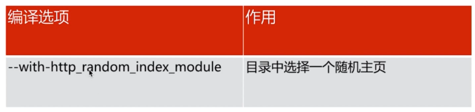

# 

#### Nginx 日志类型

- error_log			//记录Nginx 处理 HTTP 请求的错误状态，以及Nginx本身运行错误的状态

- access_log                    //记录每一次 Nginx 的 http 请求的访问状态

  

  这些日志格式依赖于 log_format。log_format 只能配置在 http 下。查看我们的配置文件配置语法：

error_log/access_log   日志路径   日志格式名称

```
[root@localhost vagrant]# cat /etc/nginx/nginx.conf

user  nginx;
worker_processes  1;

error_log  /var/log/nginx/error.log warn;		//这里配置了 error_log 的路径和日志级别
pid        /var/run/nginx.pid;


events {
    worker_connections  1024;
}


http {
    include       /etc/nginx/mime.types;
    default_type  application/octet-stream;
	
	//默认定义的日志格式 main 
    log_format  main  '$remote_addr - $remote_user [$time_local] "$request" '
                      '$status $body_bytes_sent "$http_referer" '
                      '"$http_user_agent" "$http_x_forwarded_for"';
	// access_log 的日志路径以及引用的日志格式为上面定义的 main
    access_log  /var/log/nginx/access.log  main;

    sendfile        on;
    #tcp_nopush     on;

    keepalive_timeout  65;

    #gzip  on;

    include /etc/nginx/conf.d/*.conf;
}
```


Log_format 日志格式

​	语法：

​		log_format	name(格式名称)	格式样式(自己想要什么样的日志内容,组合 *Nginx变量* ) 


Nginx 变量

- HTTP 请求变量---> arg_PARAMETER   http_HEADER   sent_http_HEADER

```
//看个例子，log_format main 的基础上，加入记录 user_agent 的 http 请求变量信息。 http_user_agent

// 这是原始 main 
log_format  main  '$remote_addr - $remote_user [$time_local] "$request" '
                      '$status $body_bytes_sent "$http_referer" '
                      '"$http_user_agent" "$http_x_forwarded_for"';
                      
//添加 $http_user_agent 在头部
log_format  main  '$http_user_agent - $remote_addr - $remote_user [$time_local] "$request" '
                      '$status $body_bytes_sent "$http_referer" '
                      '"$http_user_agent" "$http_x_forwarded_for"';

//记得保存退出 vim 
//检查下刚才的配置是否正确
[root@localhost vagrant]# nginx -t -c /etc/nginx/nginx.conf
nginx: the configuration file /etc/nginx/nginx.conf syntax is ok
nginx: configuration file /etc/nginx/nginx.conf test is successful

// reload 一下我们的 Nginx 让配置生效
[root@localhost vagrant]# nginx -s reload -c /etc/nginx/nginx.conf	
```

分别在虚拟机中curl访问和使用宿主机浏览器访问下，然后查看我们的 *access_log* 日志


注意观察红线的的内容就是加在头部的 user-agent 。第一个红线和蓝线的内容在对比我们 log_format 的内容就发现了所谓的日志格式对应输出内容。


- 内置变量 ---> Nginx 内置的

  可以查看官网[http://nginx.org/en/docs/http/ngx_http_core_module.html#var_status](<http://nginx.org/en/docs/http/ngx_http_core_module.html#var_status>) 页面下 *Embedded Variables*  下查看

  这里有网友整理的一部分 [nginx内置变量 大全](<https://blog.csdn.net/agonie201218/article/details/80510388>)

  

- 自定义变量 ---> 自己定义

  这里后面内容会详细讲解

  

#### Nginx 默认模块讲解

##### http_stub_status_module 

用于获取 http 的状态


配置语法

> Syntax: stub_status;
>
> Default: —						//默认没有配置
>
> Context：server,location			// 配置位置

```
// 编辑配置文件
[root@localhost conf.d]# vim default.conf

// 增加 stub_status 并保存退出
....
    #charset koi8-r;
    #access_log  /var/log/nginx/host.access.log  main;

	#这是增加的模块
    location /mysataus {		
		stub_status;
    }

    location / {
        root   /usr/share/nginx/html;
        index  index.html index.htm;
    }
...

// 校验并重启 
[root@localhost conf.d]# nginx -t -c /etc/nginx/nginx.conf
nginx: the configuration file /etc/nginx/nginx.conf syntax is ok
nginx: configuration file /etc/nginx/nginx.conf test is successful

[root@localhost conf.d]# nginx -s reload -c /etc/nginx/nginx.conf
```

​	使用宿主机访问下


##### http_random_index_module

用于在指定目录中随机返回一个页面



配置语法

> Syntax: random_index on | off;
>
> Default: random_index off;						
>
> Context：location			// 配置位置


```
//首先准备好三个静态页面
[root@localhost /]# ls /opt/app/code
1.html  2.html  3.html

//开启随机选择主页的配置，保存并退出
[root@localhost /]# vi /etc/nginx/conf.d/default.conf
...
location / {
        root   /opt/app/code;				//从新设置root路径，指向我们准备好的静态页面路径
        #index  index.html index.htm;		//将默认的注释
        random_index on;					//开启模块
    }
....

//同样的操作，检测配置，然后从新加载，
```

接下来去宿主机浏览器访问，刷新可以看到随机出现我们准备的页面


**值得注意的是**

```
//random_index 只能访问未被隐藏文件
[root@localhost /]# cd /opt/app/code
[root@localhost code]# ls
1.html  2.html  3.html

//将 3.html 文件隐藏
[root@localhost code]# mv 3.html .3.html
[root@localhost code]# ls
1.html  2.html

//查看全部文件包括隐藏的
[root@localhost code]# ls -a
.  ..  1.html  2.html  .3.html

//再次浏览器刷新就无法出现3.html的页面了
```


##### http_sub_module

用于对 http response 返回的内容进行替换


配置语法

> Syntax:sub_filter string replacement;			// sub_filter  原内容  替换后的内容
>
> Default: —;						
>
> Context：http,server,location			// 配置位置

------


> Syntax:sub_filter_last_modified  on | off;			// http  header 中 last_modified 是否更新
>
> Default: sub_filter_last_modified of;						
>
> Context：http,server,location			// 配置位置

------


> Syntax:sub_filter_once  on | off;			// 顾名思义只是匹配内容中的第一个
>
> Default: sub_filter_once on;						
>
> Context：http,server,location			// 配置位​		      

​		   

```
// 在我们的 /opt/app/code 目录下新增一个用于替换操作的 submodule.html文件。查看下
root@localhost conf.d]# ls -a /opt/app/code
.  ..  1.html  2.html  .3.html  submodule.html

//编辑我们的 default.conf 文件
[root@localhost conf.d]# vi /etc/nginx/conf.d/default.conf
....
    location / {
        root   /opt/app/code;					//指定访问目录
        index  index.html index.htm;
    }
....

//测试配置文件是否有误，并重新加载，然后访问看看是否能请求都对应 html
[root@localhost conf.d]# nginx -t -c /etc/nginx/nginx.conf
nginx: the configuration file /etc/nginx/nginx.conf syntax is ok
nginx: configuration file /etc/nginx/nginx.conf test is successful
[root@localhost conf.d]# nginx -s reload -c /etc/nginx/nginx.conf

//开启 sub_module 
[root@localhost conf.d]# vi /etc/nginx/conf.d/default.conf
....
    location / {
        root   /opt/app/code;					//指定访问目录
        index  index.html index.htm;
        sub_filter '<a>imooc'  '<a>Doublex';	// 替换字符串内容
		sub_filter_once off;					// 关闭只替换第一个，所有符合的都替换
    }
....

// 同上检测配置并重新加载访问
```

看下我们的访问对比效果


#### ab测试

ab是Apache自带的压力测试工具，非常小巧。mac 自带了这种工具

用法：

```
ab -c 并发数 -n 请求数 URL
```

例如：

```
//get 
ab -n 60 -c 60 http://192.168.52.9/1.html
//post			post.txt放post请求的 json 数据
ab -n 60 -c 60 -p post.txt http://192.168.52.9/1.html
```


#### Nginx 请求限制

##### 连接频率限制-  limit_conn_module

配置语法

> //定义限制空间   key:具体要限制的内容对应的内置变量  zone=name就是个这块空间取的名字方便
>
> //下面使用。  Size  申请的空间大小
>
> Syntax:=limit_conn_zone key zone=name:size;	
>
> Default: —;						
>
> Context：http

------


> // 调用上面定义的 zone 
>
> Syntax:=limit_conn  zone  number;			
>
> Default: —;						
>
> Context：http,server,location	​     


##### 请求频率限制-  limit_req_module

配置语法

> //对比上面，这里还多了一个 rate 表示速率  
>
> Syntax:=limit_req_zone key zone=name:size  rate=rate;	
>
> Default: —;	
>
> Context：http

------


> Syntax:=limit_req  zone=name  [burst=number] [nodelay];			
>
> Default: —;						
>
> Context：http,server,location

​		

```
//示例如下
[root@localhost conf.d]# vim /etc/nginx/conf.d/default.conf
	#定义连接和请求限制的区名称和基本参数。
	# *注意*：这里是在 default.conf 的 server 外。然后 nginx.conf 的 http 下会 include 这个文件
	# 正好符合了上面我们提到的语法，这个的定义只能作用于 http 配置文件位置下
    limit_conn_zone $binary_remote_addr zone=conn_zone:1m;		
    limit_req_zone $binary_remote_addr zone=req_zone:1m rate=1r/s;
server {
    listen       80;
    server_name  localhost;

    #charset koi8-r;
    #access_log  /var/log/nginx/host.access.log  main;

    location /mysataus {
	stub_status;
    }

    location / {
        root   /opt/app/code;
        
    # 使用上面 conn 和 req 定义的配置。
	#limit_conn conn_zone 1;
	# burst 表示要延迟请求的数量，在限流的时候可以用到
	#limit_req zone=req_zone burst=3 nodelay;
	#limit_req zone=req_zone burst=3;
	#limit_req zone=req_zone;
        index  index.html index.htm;
    }
....


// 尝试使用下 请求限制的功能 将下面 default.conf 中下面的这段注释 # 号去掉并保存退出
#limit_req zone=req_zone burst=3 nodelay;

// 校验文件语法配置是否正确并 reload
// *注意*：这里校验的是 /etc/nginx/nginx.conf 而不是直接校验我们刚才修改的
// 文件 /etc/nginx/conf.d/default.conf 。直接校验修改的文件会爆出语法错误无法识别 limit_conn_zone
// 不属于这个文件中，因为要被 nginx.conf include 后属于http下才符合。
[root@localhost conf.d]# nginx -t -c /etc/nginx/nginx.conf
nginx: the configuration file /etc/nginx/nginx.conf syntax is ok
nginx: configuration file /etc/nginx/nginx.conf test is successful
[root@localhost conf.d]# nginx -s reload -c /etc/nginx/nginx.conf


//一切就绪后，从宿主机通过 ab 测试我们的服务
coulson@CoulsondeMBP  ~  ab -n 60 -c 60 http://192.168.52.9/1.html
This is ApacheBench, Version 2.3 <$Revision: 1826891 $>
Copyright 1996 Adam Twiss, Zeus Technology Ltd, http://www.zeustech.net/
Licensed to The Apache Software Foundation, http://www.apache.org/

Benchmarking 192.168.52.9 (be patient).....done


Server Software:        nginx/1.16.1
Server Hostname:        192.168.52.9
Server Port:            80

Document Path:          /1.html
Document Length:        136 bytes

Concurrency Level:      60
Time taken for tests:   0.030 seconds
Complete requests:      60
Failed requests:        56				//成功的只有4个 默认的1个 加上我们延迟请求 的3个
   (Connect: 0, Receive: 0, Length: 56, Exceptions: 0)
Non-2xx responses:      56
Total transferred:      41232 bytes
HTML transferred:       29440 bytes
Requests per second:    2008.30 [#/sec] (mean)
Time per request:       29.876 [ms] (mean)
Time per request:       0.498 [ms] (mean, across all concurrent requests)
Transfer rate:          1347.76 [Kbytes/sec] received

Connection Times (ms)
              min  mean[+/-sd] median   max
Connect:        0    2   0.5      2       3
Processing:     4   16   6.5     17      25
Waiting:        1   16   6.7     17      25
Total:          4   18   6.1     19      26

Percentage of the requests served within a certain time (ms)
  50%     19
  66%     21
  75%     23
  80%     24
  90%     25
  95%     26
  98%     26
  99%     26
 100%     26 (longest request)
 
 
 
 // 在来看看我们的 error.log 已经有被限制请求后的错误日志信息 req_zone
 [root@localhost /]# tail -f /var/log/nginx/error.log
 ....
 2019/09/02 09:31:03 [error] 5691#5691: *382 limiting requests, excess: 3.973 by zone "req_zone", client: 192.168.52.223, server: localhost, request: "GET /1.html HTTP/1.0", host: "192.168.52.9"
2019/09/02 09:31:03 [error] 5691#5691: *383 limiting requests, excess: 3.973 by zone "req_zone", client: 192.168.52.223, server: localhost, request: "GET /1.html HTTP/1.0", host: "192.168.52.9"
2019/09/02 09:31:03 [error] 5691#5691: *384 limiting requests, excess: 3.973 by zone "req_zone", client: 192.168.52.223, server: localhost, request: "GET /1.html HTTP/1.0", host: "192.168.52.9"
2019/09/02 09:31:03 [error] 5691#5691: *385 limiting requests, excess: 3.973 by zone "req_zone", client: 192.168.52.223, server: localhost, request: "GET /1.html HTTP/1.0", host: "192.168.52.9"
2019/09/02 09:31:03 [error] 5691#5691: *386 limiting requests, excess: 3.972 by zone "req_zone", client: 192.168.52.223, server: localhost, request: "GET /1.html HTTP/1.0", host: "192.168.52.9"
2019/09/02 09:31:03 [error] 5691#5691: *387 limiting requests, excess: 3.972 by zone "req_zone", client: 192.168.52.223, server: localhost, request: "GET /1.html HTTP/1.0", host: "192.168.52.9"
 ....

```

#### Nginx  访问控制

##### 基于IP的访问控制 -  http_access_module

配置语法

> ​		Syntax:= allow address | CIDR | unix: | all;	//支持IP地址 | 网段 | socket | 允许所有
>
> ​		Default: —;						
>
> ​		Context：http,server,location,limit_except;

------


> ​		Syntax:= deny address | CIDR | unix: | all;	
>
> ​		Default: —;						
>
> ​		Context：http,server,location,limit_except;


​		

```
// 将我们之前备份的配置拷贝覆盖
[root@localhost conf.d]# cp /opt/backup/default.conf  /etc/nginx/conf.d/default.conf

// 进行重命名
[root@localhost conf.d]# mv default.conf access_mod.conf

//进行 http_access_module 模块的配置操作   ”模拟配置ip黑名单“
[root@localhost code]# vi  /etc/nginx/conf.d/access_mod.conf
....
    location / {
        root   /opt/app/code;
        index  index.html index.htm;
    }

	//增加对 admin.html 这个文件的访问限制，默认允许所有，禁止本机ip。
    location ~ ^/admin.html{
		root /opt/app/code;
		deny 192.168.52.223;	//这里使用的是宿主局域网的ip，正常应该是公网ip
		allow all;
    }
....

//保存退出 校验重启 
```

对比加了控制与加控制从宿主机浏览器访问的看是否达到了效果


```
//接下来尝试配置，某个文件只允许指定ip访问  “模拟配置ip白名单”
[root@localhost code]# vi  /etc/nginx/conf.d/access_mod.conf
....
    location ~ ^/submodule.html{
        root /opt/app/code;
        allow 192.168.52.223;	//允许宿主ip 反问，
        deny all;
    }
....

//保存退出并重启
```

分别从本机和让同事机器访问的结果


查看我们 error.log  日志信息

```
// 来自同事电脑ip 192.168.52.79 访问的日志信息  
....
2019/09/03 02:55:46 [error] 6699#6699: *7 access forbidden by rule, client: 192.168.52.79, server: localhost, request: "GET /submodule.html HTTP/1.1", host: "192.168.52.9"
....
```


<font color=red size=5 >值得注意的是：</font>

​	allow 和 deny  是有先后顺序的 。配置文件中，谁先写在前面谁先生效。那么这有什么问题呢？ 	

```
// 比如上面的  admin.html 的访问控制，我们是这样子配置的
  location ~ ^/admin.html{
		root /opt/app/code;
		deny 192.168.52.223;	// 先禁止某个ip生效，后允许所有
		allow all;
    }

// 如果我们调整了顺序，会发现禁止的效果不生效，因为已经允许所有通过反问了，后面的禁止就无效了
  location ~ ^/admin.html{
		root /opt/app/code;
		allow all;				//先允许所有生效，后禁止某个ip
		deny 192.168.52.223;	
    }
```

总结：
	如何排列先后顺序，我经过上面的实验后觉得应该遵循这样子的规则：**`谁的作用范围小谁写在前面`**


##### 	http_access_module 局限性：

​		

​	access_module 是基于 remote_addr 来识别客户端，如果有上图的情况，准确性就不高了，我本来是要对 IP1 进行访问控制的，结果IP3实际拿到的remote_addr却是 IP2 。

​	解决方案：

​		方法一、采用别的 HTTP 头信息控制访问，如 http_x_forward_for

​		

​		会记录所有进过的代理ip。单是这个只是个 http head 容易被修改也不是很保险

​		http_x_forwarded_for = ClientIP , Proxy(1) IP , Proxy(2) IP , ..


​		方法二、结合 geo 模块（后面会详细介绍）

​		方法三、通过 HTTP 自定义变量传递


##### 基于用户的信任登录 -  http_auth_basic_module

配置语法

> Syntax:= auth_basic string  |  off;	//默认 关闭，开启则填入一串字符串 信息提示用的 
>
> Default: auth_basic off;						
>
> Context：http,server,location,limit_except;

------


> Syntax:= auth_basic_user_file file;	//文件路径。文件是用来存储 用户名和密码信息的
>
> Default: —;						
>
> Context：http,server,location,limit_except;


​			

```
// 将配置文件重命名下
[root@localhost conf.d]# mv access_mod.conf autho_module.conf

// 利用 htpasswd 工具生成用户名密码文件
// “/etc/nginx/auth_conf” 创建文件路径  "double"  用户名   其次需要输入两次密码
[root@localhost nginx]# htpasswd -c /etc/nginx/auth_conf double
New password:
Re-type new password:
Adding password for user double

// 查看下我们刚才创建的用户密码信息
[root@localhost nginx]# more /etc/nginx/auth_conf
double:$apr1$5jy3Cdk0$3lQtN8Tw2bwRMppUlVp9P.

// 用户信息文件创建好，接下来就加入配置模块 修改 admin.html location 的配置
[root@localhost nginx]# vi /etc/nginx/conf.d/autho_module.conf
....
   location ~ ^/admin.html{
        root /opt/app/code;
        auth_basic "登录验证，请输入用户名密码！";		//开启验证
        auth_basic_user_file /etc/nginx/auth_conf;	 // 指定用户信息文件路径
    }
....

//保存退出，校验从新加载
```

// 浏览器访问 admin.html 会提示我们需要登录


##### http_auth_basic_module 局限性：

​	一、用户信息依赖文件方式

​	二、操作管理机械，效率低下 	

​	解决方案：

​		一、[Nginx 结合  LUA  实现高效验证](3.4-nginx深度学习-与Lua开发.md)

​		二、Nginx 和 LDAP 打通，利用  nginx-auth-ldap 模块