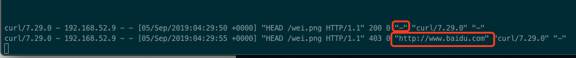

##  静态资源类型

​	非服务器动态运行生成的文件


## 静态资源服务场景---CDN

### 什么是CDN？	

​	[到底什么是CDN](<https://mp.weixin.qq.com/s/foOkh3w9i-_w5l6eKNzqWw>)	内容分发网络（**Content Delivery Network**），对于CDN这个概念一定要看一下。有个基本整体的认知。


### 配置语法：

##### 文件读取

> Syntax: sendfile on | off;		//前面提过零拷贝优化，对于静态文件读取优化
>
> Default: sendfile off;						
>
> Context：http,server,location,if in location	
>

引读：—with-file-aio 异步文件读取（[Nginx 使用 Linux-native aio 需要 Linux 内核支持](https://www.vpsee.com/2010/12/nginx-with-file-aio-need-linux-kernel-support/)）

​		

##### tcp_nopush

> Syntax: tcp_nopush on | off;		
>
> Default: tcp_nopush off;						
>
> Context：http,server,location	
>

​	仅当 **sendfile** 开启时， tcp_nopush 才起作用，它和指令 tcp_nodelay 是互斥的。一般情况下 tcp  交互过程中，应用程序收到数据包就马上发送出去，不等待，而 tcp_nopush 的作用就是不立马传送，而是等到数据包最大时，在一次性传输，有助于解决网络堵塞，提高网络包的传输效率(通俗理解就是蓄力，憋大招)，这样子做有损即时性，但是减少了来回过勤的网络传输，减少了网络堵塞，最大化利用网络资源。对于大文件很有帮助。


##### tcp_nodelay

> Syntax: tcp_nodelay on | off;		
>
> Default: tcp_nodelay on;						
>
> Context：http,server,location
>

仅当 **keepalive**  长连接下，提高网络包的传输实时性


**疑问：①tcp_nodelay的功能是什么？为什么只有在长连接的时候才启用？Only included in keep-alive connections. ②tcp_nopush为什么只在sendfile中才启用？This option is only available when using sendfile.**

​	这里解释很清楚想深入了解一定要看:   **[TCP_NODELAY 和 TCP_NOPUSH](<https://blog.51cto.com/xiaomaimai/1557773>)** 


##### 压缩

> Syntax: gzip on | off;		
>
> Default: gzip off;						
>
> Context：http,server,location,if in location
>

作用 ： 压缩传输


##### 设置压缩比，

压缩比越大，文件压缩的越小但是会消耗服务器的cpu性能，需要对应做取舍。1-9个数量级。

> Syntax: gzip_comp_level level;		
>
> Default: gzip_comp_level 1;						
>
> Context：http,server,location


##### 设置gzip版本号

> Syntax: gzip_http_version 1.0 | 1.1;		
>
> Default: gzip_http_version 1.1;						
>
> Context：http,server,location
>


##### 扩展 Nginx 压缩模块

​	http_gzip_static_module    预读 gzip 功能，例如请求文件 a 时候，首先会去读取预先压缩好的 a.gzp 文件，减少cpu现场压缩，但是需要多余的磁盘空间提前生成压缩文件

 	http_gunzip_module	解决部分浏览器不支持 gzip 。要使用 gunzip 的压缩方式

​	[nginx的gzip压缩相关设置优化1–ngx_http_gzip_module模块](<http://www.architecy.com/archives/213>)

```
//对配置文件进行重命名，实践上面的配置项
[root@localhost code]# cd /etc/nginx/conf.d/
[root@localhost conf.d]# ls
autho_module.conf
[root@localhost conf.d]# mv autho_module.conf static_server.conf
[root@localhost conf.d]# ls
static_server.conf


//	编辑配置文件 配置下 gzip 对 图片访问的效果
[root@localhost conf.d]# vi static_server.conf
....
    location ~ .*\.(jpg|gif|png)$ {
        gzip on;
        gzip_http_version 1.1;
        gzip_comp_level 2;
        gzip_types text/plain application/javascript application/x-javascript text/css application/xml text/javascript application/x-httpd-php image/jpeg image/gif image/png;
        root  /opt/app/code/images;
    }
....
```

​	使用浏览器对比对于图片访问的 gzip 的效果，有大小差别，但是并不大，


```
//再次编辑 配置对文本数据  gzip 的效果
[root@localhost conf.d]# vi static_server.conf
....
	location ~ .*\.(txt|xml)$ {
        gzip on;
        gzip_http_version 1.1;
        gzip_comp_level 1;
        gzip_types text/plain application/javascript application/x-javascript text/css application/xml text/javascript application/x-httpd-php image/jpeg image/gif image/png;
        root  /opt/app/code/doc;
    }
....
```

​	可以看到对于文本的压缩效果很明显了，缩小了7倍多


```
//再次编辑，  实现 gzip 预读功能的配置
[root@localhost conf.d]# ls /opt/app/code/download/
test.img

// 使用 gzip 压缩文件后得到一个 .gz 格式文件
[root@localhost conf.d]# gzip /opt/app/code/download/test.img
[root@localhost conf.d]# ls /opt/app/code/download/
test.img.gz

//配置 dowload 访问路径，
[root@localhost conf.d]# vi static_server.conf
....
	location ~ ^/download {
        gzip_static on;	
        tcp_nopush on;
        root /opt/app/code;
    }
....
```

//看下未开启 gzip_static 无法直接下载，需要访问带.gz的全文件名，开启后 Nginx 会支持访问原文件名


## 静态资源服务场景---浏览器缓存

### 	浏览器缓存原理


​	校验过期机制：


### 配置语法：

> Syntax: expires [modified] time;
>
> ​	      expires epoch | max | off;		
>
> Default: expires off;						
>
> Context：http,server,location,if in location		
>

```
//当浏览器访问会设置超时时间 Cache-Control: max-age=86400  单位是s
[root@localhost download]# vi /etc/nginx/conf.d/static_server.conf
....
		location ~ .*\.(htm|html)$ {
                expires 24h;
                root /opt/app/code;
        }
....
```


### 静态资源服务场景—跨域访问

#### 	为什么浏览器要禁止跨域访问以及什么是跨域访问

​		[浅谈CSRF攻击方式](https://www.cnblogs.com/hyddd/archive/2009/04/09/1432744.html)


从上面的图分析以及连接的详细介绍可以知道，浏览器不禁止跨域访问的haunt，很容易出现 CSRF 攻击非常不安全。


#### 为什么Nginx 还要可以设置打开跨域访问?

​	出于企业的一些实际业务情况，或者是历史迁移原因，再或者网站结构、架构原因。往往会需要对一些资源支持跨域的访问。

#### Nginx 是如何做的？

​	Access-Control-Allow-Origin 浏览器会校验服务器返回的请求头中是否有这个字段内容，并且你的跨域访问的源是这个服务器允许的。就可以同意这次请求。详细内容可以看阮一峰老师的这个篇文章[跨域资源共享 CORS 详解](<http://www.ruanyifeng.com/blog/2016/04/cors.html>) 

​	落地到实际的 Nginx 配置中也就是添加返回这个请求头如下：

##### 配置语法：

> Syntax: add_header name value [always];		
>
> Default: —;						
>
> Context：http,server,location,if in location

name = Access-Control-Allow-Origin

```
// 编辑配置文件
[root@localhost code]# vi /etc/nginx/conf.d/static_server.conf
....
	location ~ .*\.(htm|html)$ {
	// * 表示支持任意域名的请求  也可以单独制定比如  http://www.double.com
		add_header Access-Control-Allow-Origin *;
		add_header Access-Control-Allow-Methods GET,POST,PUT,DELETE,OPTIONS;
		expires 24h;
		root /opt/app/code;
	}
....

```


### 静态资源服务场景—防盗链

#### 	目的：

​		防止资源被盗用，竞争对手的爬取你的资源信息放到他们的网站上，无关非法用户的频繁请求等等。

#### 	设置思路：

​		首要方式： 区别哪些请求是非正常的用户请求

​		nginx 基于 http_refer。这个是 header 的一部分，当浏览器向 web 服务器发送请求的时候一般会带上这请求头，告诉服务器我是从哪个页面链接过来的。服务器可以拿到这个参数值判断是否是来自信任或者正常用户的网站。拒绝那些非正常用户直接在他们的网站嵌入我们自己的 网站链接。

####  	配置语法：

> Syntax:valid_referers none | blocked | server_names | string ...;		
>
> Default: —;						
>
> Context：server,location
>

```
//准备了一个页面，访问的时候会去加载该服务下的一个图片
[root@localhost code]# cat test_refer.html
<html>
<head>
    <meta charset="utf-8">
    <title>imooc1</title>
</head>
<body style="background-color:red;">
    
</body>
</html>

// 配置
[root@localhost code]# vi /etc/nginx/conf.d/static_server.conf
....
    location ~ .*\.(jpg|gif|png)$ {
       # gzip on;
       # gzip_http_version 1.1;
       # gzip_comp_level 2;
       # gzip_types text/plain application/javascript application/x-javascript text/css application/xml text/javascript application/x-httpd-php image/jpeg image/gif image/png;
		
		// 在图片访问下加入对 http_refer 的判断。valid_referers 验证允许后面配置的类型
		// none 表示允许没有经过上级页面，直接访问的
		// blocked 表示允许非标准http://  之类的
		// 192.168.52.9 表示只允许该ip上级页面过来的
        valid_referers none blocked 192.168.52.9;
        // 验证设置的条件有一个不符合的就返回403
        if ($invalid_referer) {
              return 403;
        }
        root  /opt/app/code/images;
    }
....

// 保存退出，校验重新加载

// 然后使用 curl 工具来校验下
// 正常访问 200 是OK的
[root@localhost code]# curl -I 192.168.52.9/wei.png
HTTP/1.1 200 OK
Server: nginx/1.16.1
Date: Thu, 05 Sep 2019 04:26:45 GMT
Content-Type: image/png
Content-Length: 244044
Last-Modified: Wed, 04 Sep 2019 07:20:41 GMT
Connection: keep-alive
ETag: "5d6f65c9-3b94c"
Accept-Ranges: bytes

//模拟从上一级页面上百度访问就返回 403
[root@localhost code]# curl -e "http://www.baidu.com" -I 192.168.52.9/wei.png
HTTP/1.1 403 Forbidden
Server: nginx/1.16.1
Date: Thu, 05 Sep 2019 04:26:53 GMT
Content-Type: text/html
Content-Length: 153
Connection: keep-alive
```

// 可以查看下我们的访问日志，是否也有 "$http_referer" 对应的两次请求的值

```
log_format  main  '$http_user_agent - $remote_addr - $remote_user [$time_local] "$request" '
                      '$status $body_bytes_sent "$http_referer" '
                      '"$http_user_agent" "$http_x_forwarded_for"';
```



