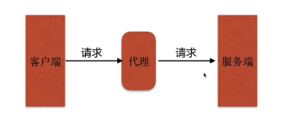
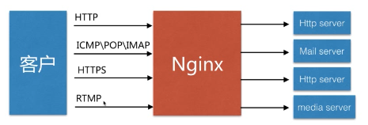
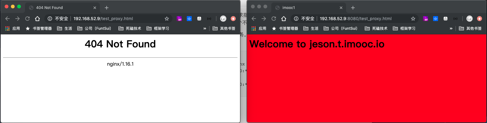
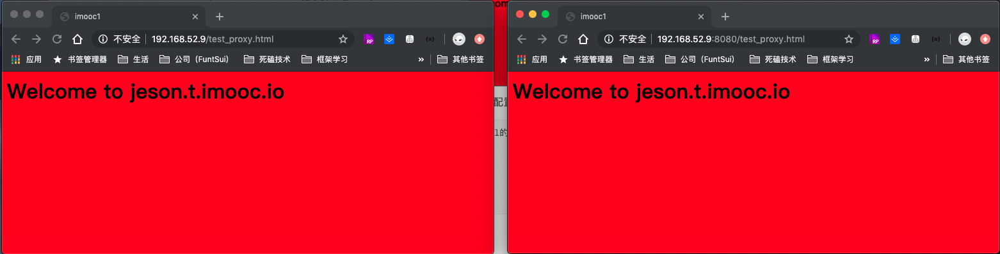
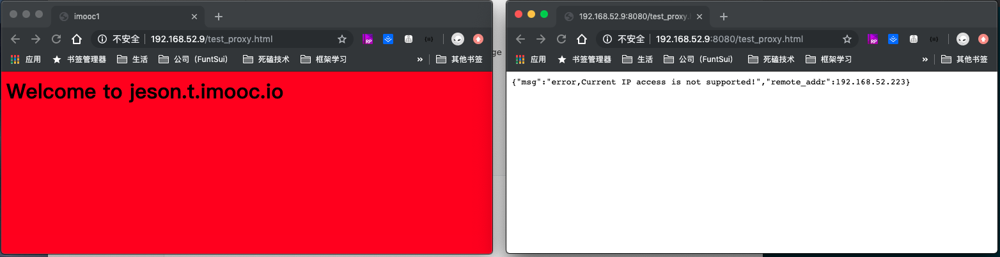
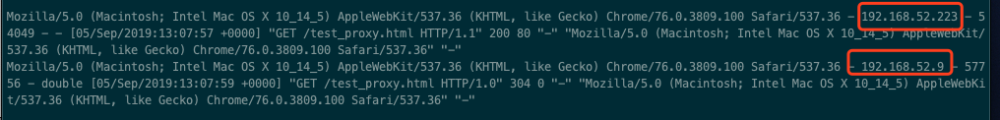
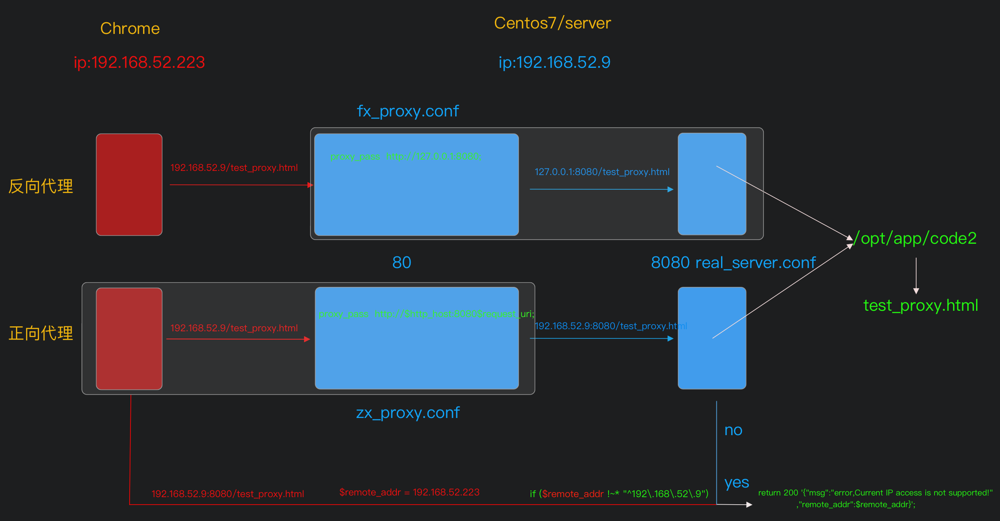

## 代理



## Nginx 代理



### 正向代理


### 反向代理


### 两种代理的区别

&emsp;区别在于代理的 **<u>对象</u>** 不一样，注意看上面两个图架构是一样的不同在于虚线的位置

> 正向代理代理的对象是-----客户端
>
> 反向代理代理的对象是-----服务端
>


### 配置语法

> Syntax: proxy_pass URL;		
>
> Default: —;						
>
> Context：location,if in location	
>


&emsp;支持的URL类型：HTTP、HTTPS、socket

> http://localhost:8000/uri/
>
> https://192.168.1.1:8000/uri/
>
> http://unix:/tmp/backend.socket:/uri/;
>


### 反向代理配置

准备好我们的两个配置文件：

&emsp;real_server.conf

```
server {
    listen       8080;
    server_name  localhost;

    #charset koi8-r;
    access_log  /var/log/nginx/server.access.log  main;

    location / {
        root   /opt/app/code2;
        index  index.html index.htm;
    }

    #error_page  404              /404.html;

    # redirect server error pages to the static page /50x.html
    #
    error_page   500 502 503 504  /50x.html;
    location = /50x.html {
        root   /usr/share/nginx/html;
    }
}

```


&emsp;fx_proxy.conf

```
server {
    listen       80;
    server_name  localhost;

    #charset koi8-r;
    access_log  /var/log/nginx/test_proxy.access.log  main;

    location / {
        root   /usr/share/nginx/html;
        index  index.html index.htm;
    }
    
    //这里先注释。代理到本地服务 8080 端口
    #location ~ /test_proxy.html$ {
    #    proxy_pass http://127.0.0.1:8080;
    #}

    #error_page  404              /404.html;

    # redirect server error pages to the static page /50x.html
    #
    error_page   500 502 503 504  /50x.html;
    location = /50x.html {
        root   /usr/share/nginx/html;
    }
}
```

&emsp;&emsp;介绍下， fx_proxy.conf 监听我们默认的 80 端口。除了访问 test_proxy.html 以为其他请求指向 /usr/share/nginx/html 目录。

&emsp;&emsp;然后，real_server.conf 就是上面代理指向的 8080 端口服务。请求指向 /opt/app/code2 目录，该目录下有一个准备好的 test-proxy.html.

```
//校验，从新加载配置文件，并查看是否端口监听生效
[root@localhost conf.d]# netstat -luntp | grep nginx
tcp        0      0 0.0.0.0:8080            0.0.0.0:*               LISTEN      5104/nginx: master
tcp        0      0 0.0.0.0:80              0.0.0.0:*               LISTEN      5104/nginx: master
```

&emsp;&emsp;浏览器访问看下效果，果然默认80端口404。因为 /usr/share/nginx/htm 目录下并没有 test_proxy.html 这个文件，



&emsp;&emsp;记下来再次编辑 fx_proxy.conf 文件。加入我们的方向代理配置，

```
 //将这段的注释放开。就是 80 端口下访问的 test_proxy.html的时候会代理到 8080 端口服务访问的路径访问
    location ~ /test_proxy.html$ {
        proxy_pass http://127.0.0.1:8080;
    }

//保存退出，校验，重载
```

&emsp;&emsp;浏览器再次访问，可以发现80端口访问到了 8080 端口下的文件。这里




### 正向代理配置

&emsp;&emsp;同样准备好我们的两个配置文件，由于暂时没有多台服务器的环境。这里我取 $remote_addr 来作为是否是代理机器过来的请求作为验证条件。

real_server.conf

```
server {
    listen       8080;
    server_name  localhost www.double.com;

    #charset koi8-r;
    access_log  /var/log/nginx/server.access.log  main;

	//这里判断来访问的机器不是 本机ip 就返回一串错误提示的 Json
    location / {
        if ($remote_addr !~* "^192\.168\.52\.9") {
			#return 403;
			return 200 '{"msg":"error,Current IP access is not 				            						supported!","remote_addr":$remote_addr}';
		}
		root   /opt/app/code2;
        index  index.html index.htm;
    }

    #error_page  404              /404.html;

    # redirect server error pages to the static page /50x.html
    #
    error_page   500 502 503 504  /50x.html;
    location = /50x.html {
        root   /usr/share/nginx/html;
    }
}
```

​	

zx_proxy.conf

```
server {
    listen       80;
    server_name  localhost www.doublex.com;

    #charset koi8-r;
    access_log  /var/log/nginx/test_proxy.access.log  main;

	//这里代理请求转发到 real_server.conf 监听的8080端口去
    location / {
        proxy_pass http://$http_host:8080$request_uri;
		#root   /usr/share/nginx/html;
        #index  index.html index.htm;
    }

    #error_page  404              /404.html;

    # redirect server error pages to the static page /50x.html
    #
    error_page   500 502 503 504  /50x.html;
    location = /50x.html {
        root   /usr/share/nginx/html;
    }
}

//保存退出，校验重载
```

&emsp;&emsp;//浏览器访问下我们的两个端口的页面看下看下是否生效。8080直接访问返回 json ,访问 80 然后由80代理反问8080下的文件反而成功了。正向代理有效



&emsp;&emsp;// 在去看下 访问日志中的 $remote_addr。直接走 8080 访问的 ip  是宿主ip 。走 80 访问后由80端口代理在虚拟机访问 8080 后的 ip 是虚拟机中服务器的ip 能过校验所以访问成功。




可能上面切换访问有点懵，来张图片梳理下流程，




###   配置语法补充	

#### 	缓冲区

> Syntax: proxy_buffering  on | off;		
>
> Default:  proxy_buffering  on ;						
>
> Context：http,server,location
>

&emsp;&emsp;扩展：proxy_buffer_size、proxy_buffers、proxy_busy_buffers_size

&emsp;&emsp;解读：缓冲区嘛就是尽可能的多读取内容，然后一次性送达，减少传输频繁的IO损耗。这个默认是使用内存来做缓冲的，当内存不够的时候就要使用硬盘来缓冲了。扩展的那几个配置就是控制这之间的大小协调。 

###### 	

#### 	跳转重定向

> Syntax: proxy_redirect  default;	proxy_redirect off;  proxy_redirect redirect replacement;	
>
> Default:  proxy_redirect  default ;						
>
> Context：http,server,location		
>

###### 	

#### 	头信息

> Syntax: proxy_set_header filed value;	
>
> Default:  proxy_set_header  Host   &proxy_host ;
>
> ​		proxy_set_header Connection close;						
>
> Context：http,server,location	
>

&emsp;&emsp;扩展：proxy_hide_header、proxy_set_body

&emsp;&emsp;解读：当 Nginx  作为代理服务的时候，后端需要收集某些真实 client发起访问的头信息用于业务需求时候，由于经过代理服务转发会不准确，就可以使用这种方式按照自己的要求增加扩展


#### 	超时

> Syntax: proxy_connect_timeout time;	
>
> Default:  proxy_connect_timeout  60s;​					
>
> Context：http,server,location 		
>

&emsp;&emsp;扩展：proxy_read_timeout、proxy_send_timeout 


#### 	实际规范操作

&emsp;&emsp;通常的这些额外配合语法，大多都是通用，所以一般是统一放到一个文件中配置好，然后多处需要代理的地方直接 include。

```
//新增统一代理参数配置文件
[root@localhost conf.d]# touch proxy_params

//编辑
[root@localhost conf.d]# vi proxy_params
proxy_redirect default;

# 收集 host 和 正式client ip
proxy_set_header Host $http_host;
proxy_set_header X-Real-IP $remote_addr;

proxy_connect_timeout 30;
proxy_send_timeout 60;
proxy_send_timeout 60;

proxy_buffer_size 32k;
proxy_buffering on;
proxy_buffers 4 128k;
proxy_busy_buffers_size 256k;
proxy_max_temp_file_size 256k;

//保存退出

// 在代理配置中引用
[root@localhost conf.d]# vi zx_proxy.conf
....
	location / {
        proxy_pass http://$http_host:8080$request_uri;
        include proxy_params;
    }
....

// 保存退出并校验重载
```

#### 特别提醒：

&emsp;&emsp;1、创建的 proxy_params 文件必须放在和 nginx.conf 同级目录中，然后 include 才可以成功。否则会校验的时候回报出这样的错误提示：

> nginx: [emerg] open() "/etc/nginx/proxy_params" failed (2: No such file or directory) in /etc/nginx/conf.d/zx_proxy.conf:10

&emsp;&emsp;2、如果 proxy_pass 中使用了 nginx 变量 比如我上面的  $http_host 则不能设置使用  "proxy_redirect default" 。校验的时候回有这样的错误提示：

> nginx: [emerg] "proxy_redirect default" cannot be used with "proxy_pass" directive with variables in /etc/nginx/proxy_params:1

&emsp;&emsp;改成类似不使用 nginx 变量的方式     proxy_pass http://www.baidu.com      测试校验就能通过，关于这个问题，官方有说明，可以查看：http://nginx.org/en/docs/http/ngx_http_proxy_module.html#proxy_redirect