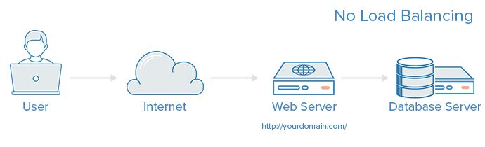
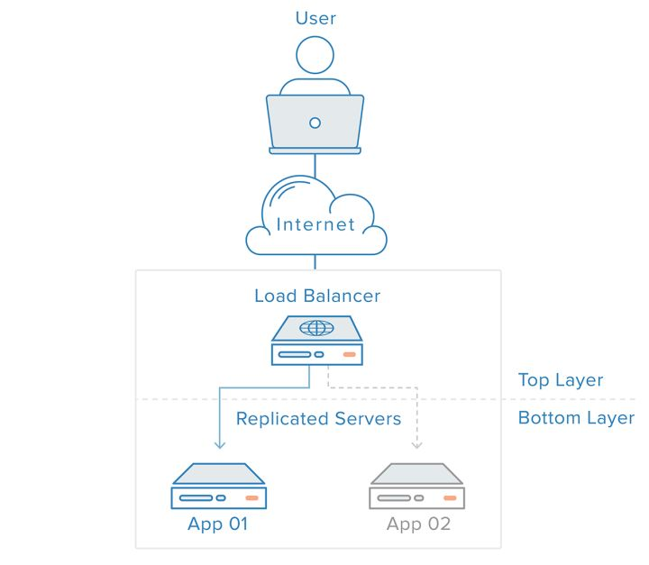
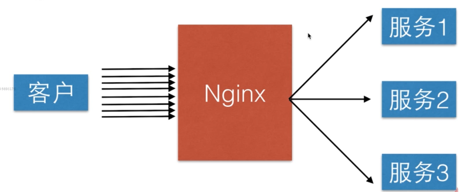
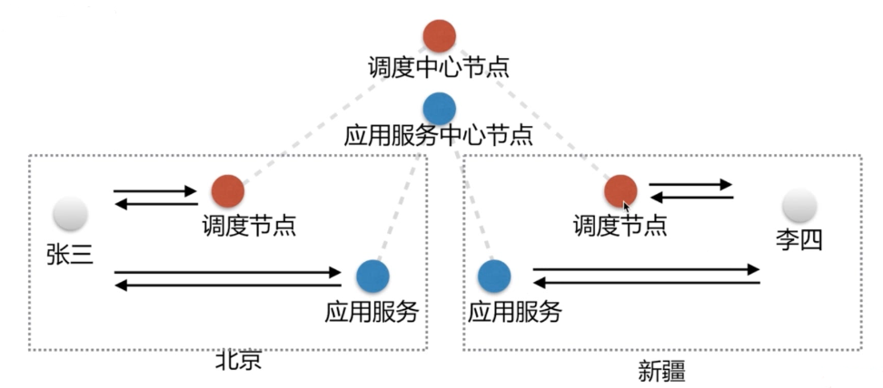
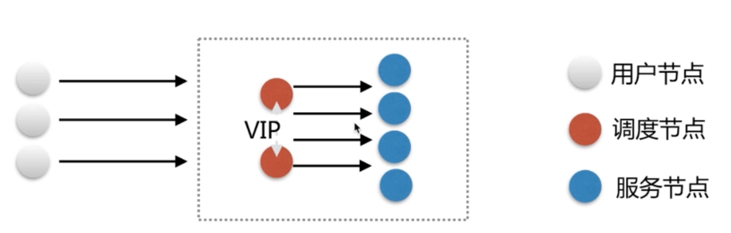
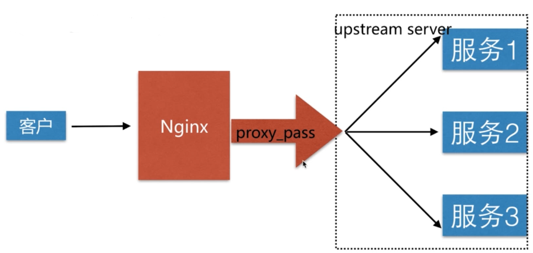
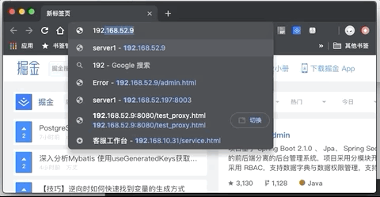
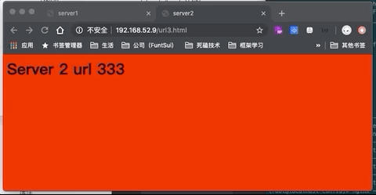

## 什么是负载均衡？

&emsp;&emsp;负载均衡是高可用网络基础架构的关键组件，通常用于将工作负载分布到多个服务器来提高网站、应用、数据库或其他服务的性能和可靠性。

&emsp;&emsp;一个没有负载均衡的web架构



&emsp;&emsp;一个负载均衡器和至少一个额外的 web 服务器



更多详细内容可以看这篇文章 (<https://zhuanlan.zhihu.com/p/32841479>)


## Nginx 负载均衡



### 负载均衡按照影响范围可以分为两类

#### 	GSLB

&emsp;全局负载均衡,一般企业中也不会自己去部署GSLB  ，都会使用一些云服务，或者第三方服务



#### 	SLB

&emsp;负载均衡。nglinx 就是一个典型的slb



### 	网络协议划分负载均衡

#### 四层负载均衡：直接操作转发 TCP/IP，优势是性能好，


#### 七层负载均衡： 在应用层，可以实现 HTTP 信息的改写，安全应用控制，转发控制等等，nginx 就属于这类


### nginx 如何实现负载均衡？	



主要依赖  `proxy_pass` 代理转发以及  `upstream server` ;

&emsp;Upstream 配置语法：

> syntax: upstream name { ... }	//这里有很多东西详细配置，后面慢慢讲解
>
> Default: —
>
> context: http


### 实验操作准备

###### 两台服务器

&emsp;&emsp;为了能更好的体现实验，我们需要两台服务器（其实在验证 nginx 代理服务的时候就应该准备了，当时却是在一台机器上开了两个不同端口的服务来模拟转发代理，其实主要就是懒）。我们当前操作的服务器命名为  nginx-server-1 用来做负载均衡模拟，然后还需要创建一个服务器 命名为 nginx-server-2 用来提供真正的服务访问。

&emsp;&emsp;关于这里服务的创建就省略，第一章有完整的创建以及 Nginx 的安装。可以自行查看


###### nginx-server-2

```
// 首先创建提供访问的目录和文件
[root@localhost app]# cd /opt/app
[root@localhost app]# mkdir code1 code2 code3

// 分别进入三个文件夹中创建一个 index.html 文件 
// 文件内容大同小异，只是改下背景，以及文字提示
[root@localhost code1]# cat index.html
<html>
<head>
    <meta charset="utf-8">
    <title>server1</title>
</head>
<body style="background-color:yellow;">
    <h1>Server 1<h1>
</body>
</html>

//接下是访问服务配置，
[root@localhost code1]# cd /etc/nginx/conf.d/

[root@localhost conf.d]# ls
server1.conf  server2.conf  server3.conf

// 同样创建了三个访问配置文件，只是每个配置文件中 server 监听了不同的端口 8001、8002、8003
// 分别访问路径指向上面创建的三个文件路径，以及设置了不同名称的访问日志文件
[root@localhost conf.d]# cat server1.conf
server {
    listen       8001;
    server_name  localhost;

    #charset koi8-r;
    access_log  /var/log/nginx/server1.access.log  main;

    location / {
        root   /opt/app/code1;
        index  index.html index.htm;
    }
....     
}

// 保存退出并校验
// 启动 nginx
// 查看ip 并使用浏览器访问  
[root@localhost conf.d]# ip a
....
3: eth1: <BROADCAST,MULTICAST,UP,LOWER_UP> mtu 1500 qdisc pfifo_fast state UP group default qlen 1000
    link/ether 08:00:27:e3:79:d1 brd ff:ff:ff:ff:ff:ff
    inet 192.168.52.197/24 brd 192.168.52.255 scope global noprefixroute dynamic eth1
....
```


###### tips

&emsp;&emsp;这里推荐一个Mac 下制作GIF 的十分简单便捷的软件 [GIPHY CAPTURE](<https://blog.csdn.net/qq_27093465/article/details/85052554>) 。

###### Nginx-server-1

```
//接下来就是配置 我们的 Nginx 负载均衡了
[root@localhost conf.d]# cd /etc/nginx/conf.d/
[root@localhost conf.d]# ls
upstream_test.conf

// 上游服务配置信息
[root@localhost conf.d]# cat upstream_test.conf
# 定义了一组名为  test-balancing 的上有服务，里面存放的着我们 nginx-server-2 中的三个服务ip端口地址
	upstream test-balancing{
		server 192.168.52.197:8001;
		server 192.168.52.197:8002;
		server 192.168.52.197:8003;
	}

server {
    listen       80;		
    server_name  localhost;

    #charset koi8-r;
    access_log  /var/log/nginx/test_proxy.access.log  main;

    location / {
    	# 对所有来的请求代理转发到我们上面定义的上游服务中去
        proxy_pass http://test-balancing;
		include proxy_params;
    }
....
}

// 最基本的 nginx 负载均衡配置完成，只不过这里的请求分配到的不是多态服务器，而是一台服务器的多个服务中去了
// 保存退出，校验重载
// 查看 ip 并使用浏览器访问这台机器
[root@localhost conf.d]# ip a
....
3: eth1: <BROADCAST,MULTICAST,UP,LOWER_UP> mtu 1500 qdisc pfifo_fast state UP group default qlen 1000
    link/ether 08:00:27:6d:79:cf brd ff:ff:ff:ff:ff:ff
    inet 192.168.52.9/24 brd 192.168.52.255 scope global noprefixroute dynamic eth1
....
```



&emsp;&emsp;从GIF 中的结果可以看出，我们不断刷新，访问我们的 nginx-server-1 每次都会 **轮训** 的出现 nginx-server-2中提供的三个界面。


###### 模拟单点故障下的情况 

```
// 回到我们  nginx-server-2 服务器中
// 使用 iptables 屏蔽全部IP链接  8002 端口
[root@localhost conf.d]# iptables -I INPUT -p tcp --dport 8002 -j DROP

// 再次切回到  nginx-server-1 服务器中
//为了快速看到访问结果。我这里调整一下 proxy_params 中的链接超时时间 
[root@localhost nginx]# vi /etc/nginx/proxy_params
....
proxy_connect_timeout 5;
....

//保存退出，校验重载，然后浏览器访问下看下效果
```


&emsp;&emsp;从结果可以看出已经无法访问到 server2 红色背景这个html 页面了。链接超过设定的 5s 之后就直接跳转访问下一个页面去了。

#### upstream_server 详细配置项

|     参数     | 用途                                                         |
| :----------: | ------------------------------------------------------------ |
|     down     | 当前的server暂时不参与负载均衡                               |
|    backup    | 预留的备份服务器（当正常的服务器故障的时候才会启用）         |
|  Max_fails   | 允许请求失败的次数                                           |
| fail_timeout | 经过 max_fails 失败后，服务暂停的时间(这段时间按过后，又会去检查改服务是否可用) |
|  max_conns   | 限制最大的接受的连接数                                       |

###### ​down、backup状态演示	

&emsp;通过测验来验证上面的参数效果

```
// 修改  nginx-server-1 的负载均衡配置
// 8001 不使用   8002 当备份	8003 设置最大失败次数为1 失败后超时10s 
[root@localhost conf.d]# vi /etc/nginx/conf.d/upstream_test.conf
        upstream test-balancing{
                server 192.168.52.197:8001 down;		
                server 192.168.52.197:8002 backup;
                server 192.168.52.197:8003 max_fails=1 fail_timeout=5s;
        }
....
// 保存退出，校验重载

//切换到 nginx-server-2 删除之前设置的一些 ip和端口限制
// 删除
[root@localhost conf.d]# iptables -F
// 查看
[root@localhost conf.d]# iptables -L
Chain INPUT (policy ACCEPT)
target     prot opt source               destination

Chain FORWARD (policy ACCEPT)
target     prot opt source               destination

Chain OUTPUT (policy ACCEPT)
target     prot opt source               destination

```

// 这时候通过浏览器访问，就只能访问到 8003 端口提供的网页了

```
// 切换到 nginx-server-2  限制 8003 端口的访问，看下我们的 8002 备份服务器能否被启用访问
[root@localhost conf.d]# iptables -I INPUT -p tcp --dport 8003 -j DROP
```

// 从浏览器刷新加载可以看出符合我们设置的 配置参数策略效果。第一次访问会走8003，由于服务器限制了访问，请求失败，则 启用备份8002，5s 之后 会再次先访问8003确认是否恢复


###### 

#### Nginx 调度算法

| 策略        | 备注                                                         |
| ----------- | ------------------------------------------------------------ |
| 轮询        | 按时间顺序分配到不通的后端服务器                             |
| 加权轮询    | weight值越大，分配到的访问几率越高                           |
| ip_hash     | 按每个请求访问 IP  的 hash 结果分配，这样来自同一个 IP 的固定访问一个后端服务器 |
| url_hash    | 按照访问的 URL 的 hash 结果分配，让每个URL定向到同一个后端服务器 |
| least_conn  | 最少链接数，那个机器链接数少就分发                           |
| hash 关键值 | hash 自定义的 key                                            |

###### 加权轮询

在我们默认轮询的基础上使用  weight 来分配权重

```
[root@localhost conf.d]# cat upstream_test.conf
	upstream test-balancing{
		server 192.168.52.197:8001;
		server 192.168.52.197:8002 weight=5;
		server 192.168.52.197:8003;
	}
....
```

不断刷新可以看到，出现 8002 提供的页面的频率大大提升


###### ip_hash

```
[root@localhost conf.d]# cat upstream_test.conf
	upstream test-balancing{
		ip_hash;
		server 192.168.52.197:8001;
		server 192.168.52.197:8002;
		server 192.168.52.197:8003;
	}
....
```

再次访问会发现，同一ip访问的始终都是一个界面


###### url_hash/hash关键key

```
[root@localhost conf.d]# cat upstream_test.conf
	upstream test-balancing{
		// 这里使用 url 做hash key
		hash $request_uri;
		server 192.168.52.197:8001;
		server 192.168.52.197:8002;
		server 192.168.52.197:8003;
	}
....

//切换到 nginx-server-2 。分别在 code1,code2,code3 中都增加 url1.html  url2.html url3.html
[root@localhost app]# ls
code  code1  code2  code3  conf
[root@localhost app]# cd code1
[root@localhost code1]# ls
index.html  url1.html  url2.html  url3.html

//网页内容差不多，唯一不通也是对应不同的背景色已经文字提示
```

// 先测试直接访问，保证通过  url 的方式三个端口的服务能正常访问，看下 url1.html的访问情况



// 接下来通过负载均衡服务器访问，看统一 url 访问的都是统一页面。达到了 url_hash 效果


