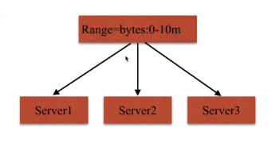

## Nginx 作为代理缓存模型


## Proxy_cache 配置语法

### proxy_cache_path  

&emsp;用于定义好缓存路径，空间大小以及名字等等

> Syntax: proxy_cache_path  path [levels=levels]	[use_temp_path= on | off ]
>
> &emsp;&emsp;&emsp;&emsp;keys_zone=name:size		[inactive=time]	[max_size=size]	[manager_files=number]
>
> &emsp;&emsp;&emsp;&emsp;[manager_sleep=time]	[manager_threshold=time]	[loader_files=number]
>
> &emsp;&emsp;&emsp;&emsp;[loader_sleep=time]	[loader_threshold=time]	[purger= on | off ]	[purger_files=number]
>
> &emsp;&emsp;&emsp;&emsp;[purger_sleep=time]	[purger_threshold=time];
>
> Default —
>
> Context:http	
>


### proxy_cache

> Syntax: proxy_cache    zone | off;     // zone 就是 上面配置项中定义的缓存空间名字
>
> Default: proxy_cache off;
>
> Context:http,server,location
>


### proxy_cache_valid 

&emsp;用于定义缓存过期周期

> Syntax: proxy_cache_valid  [code ...] time;   
>
> Default: —;
>
> Context:http,server,location
>


### proxy_cache_key

&emsp;用于配置缓存的维度

> Syntax: proxy_cache_key  string;   
>
> Default: proxy_cache_key  \$scheme\$proxy_host​$request_uri;
>
> Context:http,server,location
>


## 配置演示

```
// 切换到 nginx-server-1 服务器配置缓存项
[root@localhost cache]# vi /etc/nginx/conf.d/upstream_test.conf
        upstream test-balancing{
                server 192.168.52.197:8001;
                server 192.168.52.197:8002;
                server 192.168.52.197:8003;
        }
		//缓存文件存放路径： /opt/app/cache
		//缓存文件夹 分级：levels
		//缓存空间名字，下面开启缓存的配置需要用到：keys_zone   设置开辟空间key的这个大小：10m
		//缓存文件目录最大大小：max_size   如果超过，会触发nginx淘汰规则淘汰不常用的
		//缓存中不活跃的文件清理时间：inactive   在规定时间内不活跃的文件没有被访问过就会别清理掉
		//临时缓存：use_tem_path    一般建议关闭。
        proxy_cache_path /opt/app/cache levels=1:2 keys_zone=double_cache:10m  max_size=10g inactive=60m use_temp_path=off;

server {
    listen       80;
    server_name  localhost;

    #charset koi8-r;
    access_log  /var/log/nginx/test_proxy.access.log  main;

    location / {
        proxy_pass http://test-balancing;
		
		// proxy_cache  默认是 off  如果需要开启就使用定义好的 keys_zone
        proxy_cache double_cache;
        
        // proxy_cache_valid 缓存有效时间 200 302 缓存12个小时  其他10分钟
        proxy_cache_valid 200 304 12h;
        proxy_cache_valid any 10m;
        
        // 自定义缓存维度
        proxy_cache_key $host$uri$is_args$args;
        //添加请求头，用于告诉客户端缓存是否命中
        add_header Nginx-Cache "$upstream_cache_status";

		//配置当某台服务器访问出现配置的错误时候，去访问下一台
        proxy_next_upstream error timeout invalid_header http_500 http_502 http_503 http_504;

        include proxy_params;
    }
....

//保存退出，校验重载
```

&emsp;通过浏览器访问


&emsp;可以发现当第一次访问成功后，刷新访问后就不会轮询服务器了，始终返回的是缓存页面的信息，

&emsp;我们看下缓存路径下已经有缓存文件生成。

```
[root@localhost cache]# cd /opt/app/cache/
[root@localhost cache]# ls
0  b  d
```

&emsp;我们再次吧代理缓存关闭看下轮询是否正常，与上面一对比就知道缓存的效果生效了

```
[root@localhost cache]# vi /etc/nginx/conf.d/upstream_test.conf
....
		proxy_cache off;
....
```

&emsp;浏览器再次访问，会发现没有关闭缓存后，轮询模式又正常运行了


#### 如何清理指定缓存？

&emsp;方式一、切到指定缓存目录，rm -rf

&emsp;方式二、第三方扩展模块  ngx_cache_purge


#### 如何让部分页面不缓存？

> Syntax:  proxy_no_cache string ...;
>
> Default: —
>
> Context: http, server, location
>

```
//修改配置文件
[root@localhost cache]# vi /etc/nginx/conf.d/upstream_test.conf
....	
	// 正则判断请求的 url 是不是以url3开头的
    if ($request_uri ~ ^/url3) {
    		// 如果是则设置变量值为1
           set $cookie_nocache 1;
    }

    location / {
        proxy_pass http://test-balancing;

        proxy_cache double_cache;
        proxy_cache_valid 200 304 12h;
        proxy_cache_valid any 10m;
        proxy_cache_key $host$uri$is_args$args;
        
        //当 $cookie_nbocache 不等于0 则 Proxy_no_cache这里的条件命中，此条请求不参与缓存
        proxy_no_cache $cookie_nocache $arg_nocache $arg_comment;
        proxy_no_cache $http_pragma $http_authorization;
        
        
        add_header Nginx-Cache "$upstream_cache_status";

        proxy_next_upstream error timeout invalid_header http_500 http_502 http_503 http_504;

        include proxy_params;
....
```

&emsp;查看浏览器访问效果,可以发现 url3 的不会缓存，刷新一直在轮询


 

## 大文件分片请求

### http_slice_module

> Syntax:  slice size;
>
> Default: slice 0;
>
> Context: http, server, location
>



&emsp;&emsp;基本原理：请求过来先从服务器访问取得文件总大小，然后根据我们定义的 slice size 大小，将文件切片然后去不通的服务器请求

​	优点： 每个子请求收到的数据都会形成一个独立文件，一个请求断了，其他请求不受影响。

​	缺点：当文件很大或者slice很小的时候，可能会导致切分太多，文件描述符耗尽等情况