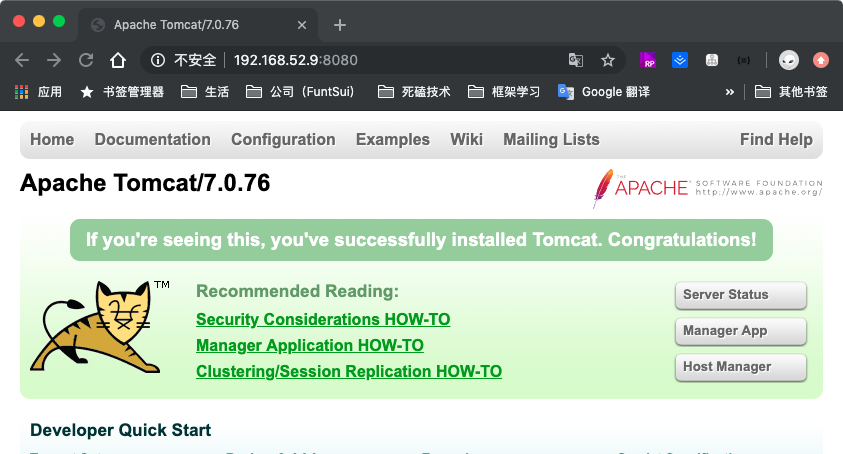
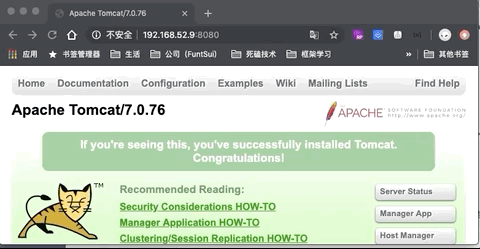
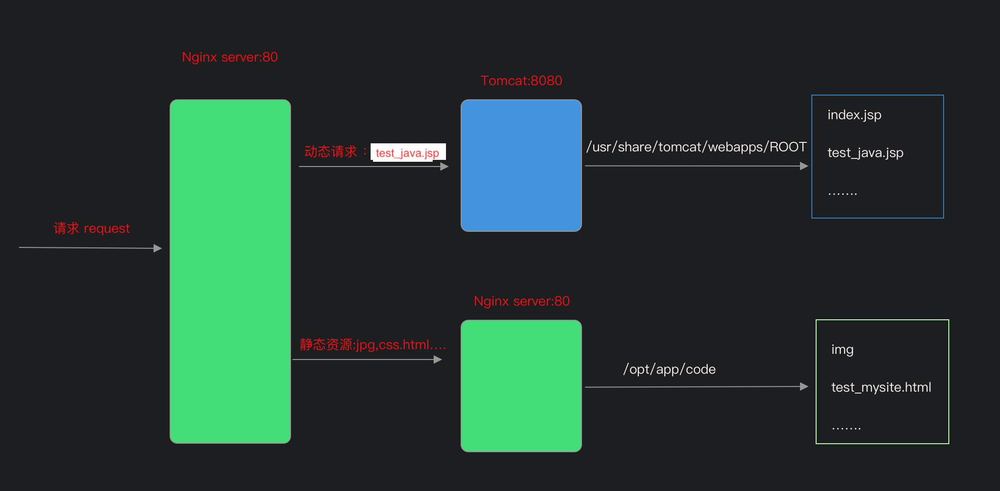

## 动静分离

&emsp;通过 Nginx 中间件来将动态请求和静态请求分离。

## 动静分离的意义

&emsp;分离资源，减少不必要的请求消耗，减少请求延时，可以让动态资源和静态资源互不影响。


## nginx+tomcat 动静分离场景演示

&emsp;&emsp;nignx 处理静态页面的效率远高于 tomcat  ，因此使用 Nginx 配置静态资源直接访问 Nginx 指定的目录去，动态请求则代理转发到 tomcat 服务进行处理返回。

### 安装Tomcat并启动

&emsp;ps: tomcat我也不懂，这些都是一边google一边尝试的，如果遇到问题，可以自己查询搜索下

```
// 使用 yum 来安装 tomcat。  -y 是表示其中遇到需要让输入选择 Y/N 的时候自动选择 y
[root@localhost /]# yum install -y tomcat
[root@localhost /]# yum install -y tomcat-webapps

// 查看tomcat 是否安装成功
[root@localhost /]# tomcat version
Server version: Apache Tomcat/7.0.76
Server built:   Mar 12 2019 10:11:36 UTC
Server number:  7.0.76.0
OS Name:        Linux
OS Version:     3.10.0-957.12.2.el7.x86_64
Architecture:   amd64
JVM Version:    1.8.0_222-b10
JVM Vendor:     Oracle Corporation

//systemctl 启动并查看tomcat
[root@localhost ROOT]# systemctl start tomcat
[root@localhost ROOT]# systemctl status tomcat
● tomcat.service - Apache Tomcat Web Application Container
   Loaded: loaded (/usr/lib/systemd/system/tomcat.service; disabled; vendor preset: disabled)
   Active: active (running) since 二 2019-09-10 10:12:30 UTC; 2s ago
 Main PID: 26194 (java)
   CGroup: /system.slice/tomcat.service
           └─26194 /usr/lib/jvm/jre/bin/java -classpath /usr/share/tomcat/bin/bootstrap.jar:/usr/share/tomcat/bin/tomcat-juli.jar:/usr/share/java/common...
....

// Tomcat 默认是监听8080端口，使用浏览器访问，看下是否启用成功并能正确访问了
```



```
// 查看我们的 tomcat 目录
[root@localhost /]# find / -name tomcat
/etc/selinux/targeted/active/modules/100/tomcat
/etc/sysconfig/tomcat
/etc/logrotate.d/tomcat
/etc/tomcat
/var/lib/tomcat
/var/log/tomcat
/var/cache/tomcat
/usr/sbin/tomcat
/usr/share/java/tomcat
/usr/share/maven-fragments/tomcat
/usr/share/tomcat		//我们上面访问的页面就存放在这个路径
/usr/libexec/tomcat

//在 /usr/share/tomcat/ROOT/index.jsp 就是我们刚才8080端口访问的页面，以及 webapps 路径
[root@localhost /]# cd /usr/share/tomcat/
[root@localhost tomcat]# ls
bin  conf  lib  logs  temp  webapps  work
[root@localhost tomcat]# cd webapps/
[root@localhost webapps]# ls
examples  index.jsp  ROOT  sample
[root@localhost webapps]# cd ROOT/
[root@localhost ROOT]# ls
asf-logo-wide.svg  bg-middle.png    bg-nav.png    favicon.ico  RELEASE-NOTES.txt  tomcat.gif  tomcat-power.gif  WEB-INF
bg-button.png      bg-nav-item.png  bg-upper.png  index.jsp    tomcat.css         tomcat.png  tomcat.svg


// 在此目录下，创建并编辑我们的测试文件
[root@localhost ROOT]# touch test_java.jsp
[root@localhost ROOT]# vi test_java.jsp

<%@ page language="java" import="java.util.*" pageEncoding="utf-8"%>  
<HTML>
    <HEAD>
        <TITLE>JSP Test Page</TITLE>
    </HEAD>
    <BODY>
        <%
            Random rand = new Random();
            out.println("<h1>Random number:</h1>");
            out.println(rand.nextInt(99)+100);
        %>
    </BODY>
</HTML>

// 文件保存退出。文件很简单，每次刷新都随机生成一个数字显示在页面
// 通过浏览器 8080 端口访问我们的文件看看效果
```




​	到这里 tomcat 的安装配置以及准备的动态请求测试文件就准备好了。

### 创建静态文件

```
// 切换到 配置文件目录
[root@localhost /]# cd /opt/app/code

// 创建 img  文件夹用于存放图片资源
[root@localhost code]# mkdir img
[root@localhost code]# cd img
[root@localhost img]# ls
test-nginx.png

// 回到上级目录，创建静态访问 html
[root@localhost img]# cd ..
[root@localhost code]# touch test_mysite.html

// 页面很简单，一串文字，访问一张图片以及通过 ajax 发起一个请求获取的数据
[root@localhost code]# vi test_mysite.html
<html lang="en">
<head>
<meta charset="UTF-8" />
<title>测试ajax和跨域访问</title>
<script src="http://libs.baidu.com/jquery/2.1.4/jquery.min.js"></script>
</head>
<script type="text/javascript">
$(document).ready(function(){
    $.ajax({
        type: "GET",
        url: "http://192.168.52.9/java_test.jsp",
        success: function(data) {
            $("#get_data").html(data)
        },
        error: function() {
            alert("fail!!!,请刷新再试!");
        }
    });
});
</script>
<body>
    <h1>测试动静分离</h1>
    
    <div id="get_data"><div>
</body>
</html>
```


### 修改配置文件

```
[root@localhost app]# cd /etc/nginx/conf.d/
[root@localhost conf.d]# ls
upstream_test.conf
[root@localhost conf.d]# mv upstream_test.conf test_dynamic_static.conf
[root@localhost conf.d]# ls
test_dynamic_static.conf
[root@localhost conf.d]# vi test_dynamic_static.conf
	// 提供一个服务器指向本机上面安装的 tomcat 监听的 8080 端口
	upstream test-tomcat-api{
		server 192.168.52.9:8080;
	}

server {
    listen       80;
    server_name  localhost;

    #charset koi8-r;
    access_log  /var/log/nginx/test_dynamic_static.access.log  main;
    
    // 下面的后两个 location 都指向同一个路径，所以提出来放到上层以便三个都可以使用
    root /opt/app/code;

	// 如果访问 .jsp 动态请求转发到 tomcat 服务器访问
    location ~ \.jsp$ {
        proxy_pass http://test-tomcat-api;
    }
	
	// 图片访问开启缓存 路径直接指向 root 的路径
    location ~ \.(jpg|png|gif)$ {
		expires 1h;
		gzip on;
    }

    location / {
	index index.html index.htm;
    }
.....
}

//保存退出，校验重载
```

 &emsp;至此，整体动静分离的简单结构搭建完成。




&emsp;下面通过浏览器来访问我们的静态页面。可以看到无论是图片还是8080端口下的提供的动态请求都访问成功


&emsp;动静分离的好处就是 当动态请求服务挂机的时候完全不影响静态资源的请求，现在模拟下效果

```
// 直接停用 tomcat 服务，
[root@localhost conf.d]# systemctl stop tomcat.service
[root@localhost conf.d]# systemctl status tomcat.service
● tomcat.service - Apache Tomcat Web Application Container
   Loaded: loaded (/usr/lib/systemd/system/tomcat.service; disabled; vendor preset: disabled)
   Active: inactive (dead)
....
```

&emsp;从图片演示结果可以看出来，虽然tomcat 的服务挂了，但是完全没有影响到 nginx 提供的静态资源请求。

