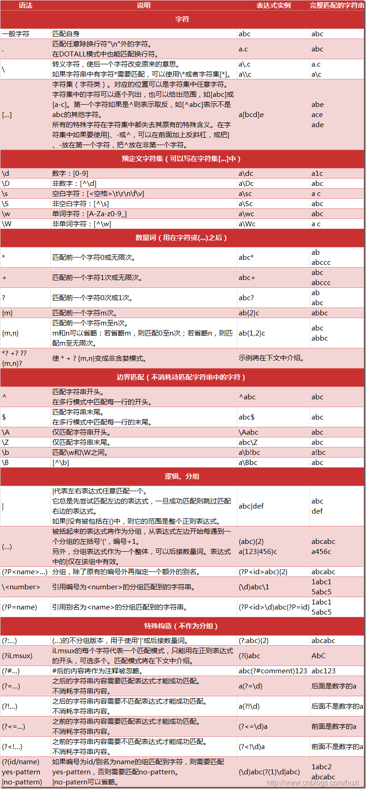

# 

## rewrite 规则作用

​	实现 url 重写以及重定向


## 场景

- URL 访问跳转，支持开发设计

  ​	页面跳转、兼容性支持、展示效果等等

- SEO 优化

- 维护

  后台维护、流量转发等

- 安全


### 配置语法

> Syntax:	rewrite regex replacement [flag];
>
> Default: —
>
> Context: server, location, if			//这里的  if   表示可以在  if 语句中使用。
>

&emsp;例如：rewrite  ^(.*)$  /pages/maintain.html break; 


### 正则表达式

&emsp;rewrite  匹配字符使用的都是正则表达式，对此需要有一定的了解。




### pcretest

&emsp;&emsp;Linux下的 正则是依赖  pcre 进行的。而 pcre 安装包里也提供相应工具用于测试 **正则** 是否正确，该工具就是 **pcretest**  。

```
[root@localhost /]# pcretest
bash: pcretest: command not found

// 出现上面的情况说明没有安装 pcre 工具包。查看 pcre 安装包
[root@localhost /]# rpm -qa | grep pcre
pcre-devel-8.32-17.el7.x86_64
pcre-8.32-17.el7.x86_64

//使用 Yum 进行工具包安装
[root@localhost /]# yum install -y pcre-tools
....
[root@localhost /]# rpm -qa | grep pcre
pcre-devel-8.32-17.el7.x86_64
pcre-tools-8.32-17.el7.x86_64		//tools 工具包安装成功
pcre-8.32-17.el7.x86_64

// pcretest 的使用 
//  re> /输入正则表达式/ 			“注意表达式需要在两个斜杠之间” 
// data> 输入需要匹配校验的内容
[root@localhost /]# pcretest
PCRE version 8.32 2012-11-30

  re> /(\d+).(\d+).(\d+).(\d+)/				
data> 192.168.52.9
 0: 192.168.52.9
 1: 192
 2: 168
 3: 52
 4: 9
data> test.232.44.2
 0: 232.44.2
 1: 2
 2: 2
 3: 44
 4: 2
data> 32454235.53.45.34..34
 0: 32454235.53.45.34
 1: 32454235
 2: 53
 3: 45
 4: 34
data> dasfad
No match
```


### flag

&emsp;在配置语法中，最后有一个 flat 字段。具体有哪些参数可填写呢？

| 参数      | 用途                                          |
| --------- | --------------------------------------------- |
| last      | 停止 rewrite 检测                             |
| break     | 停止 rewrite 检测                             |
| redirect  | 返回 302 临时重定向，地址栏会显示跳转后的地址 |
| permanent | 返回 301 永久重定向，地址栏会显示跳转后的地址 |

&emsp;可以看到 last 和 break 的用途都是停止 rewrite 检测？那有什么区别么？


#### Last 和 break 的区别

```
// 编辑配置文件
[root@localhost /]# cd /etc/nginx/conf.d/
[root@localhost conf.d]# ls
test_dynamic_static.conf
[root@localhost conf.d]# mv test_dynamic_static.conf test_rewrite1.conf
[root@localhost conf.d]# vi test_rewrite1.conf
server {
    listen       80;
    server_name  localhost;

    #charset koi8-r;
    access_log  /var/log/nginx/test_rewrite1.access.log  main;
    root /opt/app/code;

    location ~ ^/break {
        rewrite ^/break /test/ break;
    }

    location ~ ^/last {
		rewrite ^/last /test/ last;
    }

    location /test/ {
		default_type application/json;
		return 200 '{"status":"success","msg":"ok!"}';
    }
....
}

//保存退出，校验重载
```

&emsp;&emsp;解释说明下。同样监听了80端口来提供服务，设置统一路径 root 。提供了三个 location 访问，分别是 /break   /last   /test/ 。 前面 /break 和 /last  请求都改写去访问 /test/ 不同的是后面跟着的  flat 不同。区别很明显了。/test/ 就直接返回一串 json 内容。

&emsp;&emsp;我们浏览器来分别访问下看下效果是什么样的。


&emsp;&emsp;可以看到 访问  /last 都能成功改写返回 /test/ 中 json 数据，而 /break 的时候却 404 。这是因为虽然都是改写指向了 /test/ 停止了后面的 rewrite 检测 。但是实际的情况却是这样的：

> 192.168.52.9/last—>nginx location /latst—>nginx location /test/—>200 json
>
> 192.168.52.9/break—>nginx location /break—>/opt/app/code/test/—>404


&emsp;&emsp;last 会将请求后面的路径替换成改写的路径，然后再次访问服务器的 location。而且break 直接去 root 路径下找对应改写后的内容，而我们 root 并没有 /test/ 对应信息。这就是两者的区别

```
[root@localhost conf.d]# ls /opt/app/code
img  test_mysite.html
```


#### redirect 和 permanent 的区别

```
//编辑配置文件
[root@localhost conf.d]# vi test_rewrite1.conf
....
 	location ~ ^/last {
        rewrite ^/last /test/ last;
        #rewrite ^/last /test/ redirect;
    }

    location ~ ^/golang {
         rewrite ^/golang https://studygolang.com/ redirect;
         #rewrite ^/golang https://www.bilibili.com/ permanent;
    }
....
```

首先看下 /last 下分别使用	last 和 redirect 的区别

flag：last

```
[root@localhost conf.d]# curl -vL 192.168.52.9/last
* About to connect() to 192.168.52.9 port 80 (#0)
*   Trying 192.168.52.9...
* Connected to 192.168.52.9 (192.168.52.9) port 80 (#0)
> GET /last HTTP/1.1
> User-Agent: curl/7.29.0
> Host: 192.168.52.9
> Accept: */*
>
< HTTP/1.1 200 OK
< Server: nginx/1.16.1
< Date: Thu, 12 Sep 2019 02:50:17 GMT
< Content-Type: application/json
< Content-Length: 32
< Connection: keep-alive
<
* Connection #0 to host 192.168.52.9 left intact
{"status":"success","msg":"ok!"}[root@localhost conf.d]#
```

​	flag：redirect

```
[root@localhost conf.d]# curl -vL 192.168.52.9/last
* About to connect() to 192.168.52.9 port 80 (#0)
*   Trying 192.168.52.9...
* Connected to 192.168.52.9 (192.168.52.9) port 80 (#0)
> GET /last HTTP/1.1
> User-Agent: curl/7.29.0
> Host: 192.168.52.9
> Accept: */*
>
< HTTP/1.1 302 Moved Temporarily
< Server: nginx/1.16.1
< Date: Thu, 12 Sep 2019 02:52:02 GMT
< Content-Type: text/html
< Content-Length: 145
< Location: http://192.168.52.9/test/
< Connection: keep-alive
<
* Ignoring the response-body
* Connection #0 to host 192.168.52.9 left intact
* Issue another request to this URL: 'http://192.168.52.9/test/'
* Found bundle for host 192.168.52.9: 0x690e80
* Re-using existing connection! (#0) with host 192.168.52.9
* Connected to 192.168.52.9 (192.168.52.9) port 80 (#0)
> GET /test/ HTTP/1.1
> User-Agent: curl/7.29.0
> Host: 192.168.52.9
> Accept: */*
>
< HTTP/1.1 200 OK
< Server: nginx/1.16.1
< Date: Thu, 12 Sep 2019 02:52:02 GMT
< Content-Type: application/json
< Content-Length: 32
< Connection: keep-alive
<
* Connection #0 to host 192.168.52.9 left intact
{"status":"success","msg":"ok!"}
```

&emsp;&emsp;从两者的访问全过程可以看出。last 的方式是直接改写返回了 /test/ 的内容。而 redirect 的方式是先返回 302 状态码以及 loacation 重定向的路径，然后在访问 location 路径才返回 /test/的内容。redirect 相当于发起了两次请求。 

&emsp;接下来看看  redirect 和 permanent 的区别。

&emsp;&emsp;redirect：分别尝试在  nginx 服务开启和关闭的情况下访问 /golang 的效果。临时重定向，就是每次访问都需要获取重定向的内容，如果 nginx 服务器关闭就访问不成功了。


&emsp;permanent：同样的操作一遍。会发现无论 nginx 服务是否关闭，重定向都成功了。这就是两者的区别。

  

#### Rewrite  场景

&emsp;&emsp;路径访问优化。一般我们的资源、文件会很多。还可能根据业务场景的复杂度，需要进行分级，命令区分。这样子访问的时候就需要写一堆复杂的路径。不便利，也不利于搜索引擎的抓取，就需要对访问路径，进行优化改写。

```
// 切到我们的  root  目录下
[root@localhost conf.d]# cd /opt/app/code
[root@localhost code]# mkdir -p test-rewrite/11/22
[root@localhost 22]# touch info_33.html
[root@localhost 22]# vi info_33.html
<html>
<head>
    <meta charset="utf-8">
    <title>Nginx rewrite test</title>
</head>
<body >
    <h1>Nginx rewrite test<h1>
</body>
</html>

// 保存退出。


// 修改配置文件，
[root@localhost 22]# vi /etc/nginx/conf.d/test_rewrite1.conf
server {
    listen       80;
    server_name  localhost;

    #charset koi8-r;
    access_log  /var/log/nginx/test_rewrite1.access.log  main;
    root /opt/app/code;

    location / {
        rewrite ^/info-(\d+)-(\d+)-(\d+)\.html$  /test-rewrite/$1/$2/info_$3.html break;
    }
....
}

//保存退出，校验重载。
```

&emsp;&emsp;一顿操作后，分析下。利用 rewrite 加 flag break的操作。将我们需要访问的html 由复杂的 <http://192.168.52.9/test-rewrite/11/22/info_33.html>  改写优化成了精简的 <http://192.168.52.9/info-11-22-33.html>。  减少了URL 中的层级，以及不重要的字符。可以依据自己的实际业务场景做更多的规则匹配优化，浏览器访问看下效果。两种方式都可以访问到，说明我们的改写规则场景成功，不论对于开发还是客户使用者来说，都会喜欢简洁的地址访问。


&emsp;&emsp;在举例两个场景。比如指定浏览器跳转指定页面，或者根据输入文件名称如果不存在则跳转搜索页面，并携带搜索内容等等，都是 rewrite 规则的适用场景

```
	if ($http_user_agent ~* Chrome){
		rewrite ^/nginx https://www.imooc.com/search/?words=nginx redirect;
	}
	
	if (!-f $request_filename){
		rewrite ^/(.*)$ https://www.baidu.com/$1 redirect;
	}
```


#### rewrite 规则优先级

​	server > location > location 中的rewrite 。外层优先级大于内存优先级。