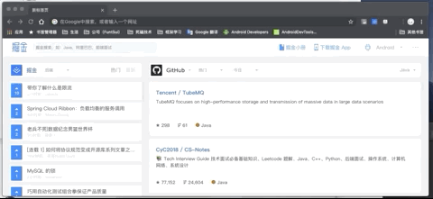

## 生成密钥和CA证书

​	需要两个东西，在我们的服务器查看是否安装好

```
// 1. openssl 
[root@localhost nginx]# openssl version
OpenSSL 1.0.2k-fips  26 Jan 2017

// nginx 是否编译了  http_ssl_module 
[root@localhost nginx]# nginx -V
nginx version: nginx/1.16.1
built by gcc 4.8.5 20150623 (Red Hat 4.8.5-36) (GCC)
built with OpenSSL 1.0.2k-fips  26 Jan 2017
TLS SNI support enabled
configure arguments: .... --with-mail_ssl_module ....
```


### 1、生成 key 密钥

```
// 创建用于生成 ssl 的文件
[root@localhost nginx]# cd /etc/nginx/
[root@localhost nginx]# mkdir ssl_key
[root@localhost nginx]# cd ssl_key/

//使用 openssl 生成 名称.key 文件 需要设置密码。我这里是：a123456
[root@localhost ssl_key]# openssl genrsa -idea -out double.key 1024
Generating RSA private key, 1024 bit long modulus
...............++++++
...........................++++++
e is 65537 (0x10001)
Enter pass phrase for double.key:
Verifying - Enter pass phrase for double.key:

[root@localhost ssl_key]# ls
double.key
```

​	 

### 2、生成证书签名请求文件（csr文件）

```
// 根据上一步生成的 key 文件生成 csr 文件
[root@localhost ssl_key]#  openssl req -new -key double.key -out double.csr
Enter pass phrase for double.key:						//输入生成 key 文件时候设置的密码
You are about to be asked to enter information that will be incorporated
into your certificate request.
What you are about to enter is what is called a Distinguished Name or a DN.
There are quite a few fields but you can leave some blank
For some fields there will be a default value,
If you enter '.', the field will be left blank.
-----
Country Name (2 letter code) [XX]:CN					//下面基本都是填写一些公司相关信息
State or Province Name (full name) []:shenzhen
Locality Name (eg, city) [Default City]:shenzhen
Organization Name (eg, company) [Default Company Ltd]:CN
Organizational Unit Name (eg, section) []:double
Common Name (eg, your name or your server's hostname) []:doubleX
Email Address []:cxxceo@163.com

Please enter the following 'extra' attributes
to be sent with your certificate request
A challenge password []:		//这里输入密码，用于更改CA文件用的，一般没有特殊要求，直接为空跳过
An optional company name []:doubleX

[root@localhost ssl_key]# ls
double.csr  double.key
```


### 3、生成正式签名文件（CA文件）

&emsp;正常公司流程是，将上两步的资料打包和自己网站域名、公司信息等等发送到签名机构申请签名。

&emsp;这里目前学习实践，就自己生成签名文件

```
[root@localhost ssl_key]# openssl x509 -req -days 3650 -in double.csr -signkey double.key -out double.crt
Signature ok
subject=/C=CN/ST=shenzhen/L=shenzhen/O=CN/OU=double/CN=doubleX/emailAddress=cxxceo@163.com
Getting Private key
Enter pass phrase for double.key:					//这里也需要输入之前设置生成 key 文件的密码
[root@localhost ssl_key]# ls
double.crt  double.csr  double.key
```


### Nginx 的 HTTPS  语法配置

是否开启 ssl 

&emsp;① nginx 1.15  之前的版本

> Syntax : ssl on | off;
>
> Default:	ssl off;
>
> Context:	http,  server
>

&emsp;② nginx 1.15 之后的版本

如果还按照上面的方式，Nginx -t 校验的时候会有如下提示

```
nginx: [warn] the "ssl" directive is deprecated, use the "listen ... ssl" directive instead in /etc/nginx/conf.d/test_https.conf:5
```

&emsp;意思很明确了，开启方式换成在监听的端口号后面加上 ssl  。

```
listen 443; ----->   listen 443 ssl;
```


ssl 的证书文件

> Syntax : ssl_certificate file;
>
> Default:	—;
>
> Context:	http,  server
>


ssl 证书的密码文件

> Syntax : ssl_certificate_key file;
>
> Default:	—;
>
> Context:	http,  server   
>

```
// 修改配置文件 
[root@localhost conf.d]# cd /etc/nginx/conf.d/
[root@localhost conf.d]# vi  test_https.conf
server
 {
   listen       443 ssl;
   server_name  192.168.52.9;

   ssl_certificate /etc/nginx/ssl_key/double.crt;
   ssl_certificate_key /etc/nginx/ssl_key/double.key;

   index index.html index.htm;
   location / {
       root  /opt/app/code;
   }
}

//  保存退出，校验并重载
//  这时候会需要你输入密码，同样是生成 key 文件的时候，设置的密码

//	关闭并重启 nginx
[root@localhost conf.d]# systemctl stop nginx
//	发现启动失败
[root@localhost conf.d]# systemctl start nginx
Job for nginx.service failed because the control process exited with error code. See "systemctl status nginx.service" and "journalctl -xe" for details.

//	查看下日志 
[root@localhost conf.d]# tailf /var/log/nginx/error.log
....
2019/09/16 12:58:49 [emerg] 5389#5389: cannot load certificate key "/etc/nginx/ssl_key/double.key": PEM_read_bio_PrivateKey() failed (SSL: error:0906406D:PEM routines:PEM_def_callback:problems getting password error:0906A068:PEM routines:PEM_do_header:bad password read)


//	回顾流程以及看了下后面视频，在搜索了下
//	视频中使用的  openssl 版本是1.0.1 的 ，我的版本直接就是 1.0.2的。
//	所以改用 1.0.2 版本的方式生成证书， 参考后面的流程
```

## 配置苹果要求的证书

​	1、服务器所有的链接使用  TLS1.2 以上版本 （openssl  1.0.2)

​	2、HTTPS  证书必须使用  SHA256 以上哈希算法签名

​	3、HTTPS 证书必须使用  RSA 2048 位或 ECC 256 位以上公钥算法

​	4、使用前向加密技术

```
[root@localhost conf.d]# cd /etc/nginx/ssl_key/
[root@localhost ssl_key]# openssl req -days 36500 -x509 -sha256 -nodes -newkey rsa:2048 -keyout double.key -out double_apple.crt

[root@localhost ssl_key]# ls
double_apple.crt  double.crt  double.csr  double.key

// 修改配置文件
[root@localhost ssl_key]# vi /etc/nginx/conf.d/test_https.conf
server
 {
   listen       443 ssl;
   server_name  192.168.52.9;

   ssl_certificate /etc/nginx/ssl_key/double_apple.crt;		//这里替换成 1.0.2 版本生成的
   ssl_certificate_key /etc/nginx/ssl_key/double.key;

   index index.html index.htm;
   location / {
       root  /opt/app/code;
   }
}

// 保存退出，校验重载
```

​	浏览器访问下,满足苹果要求的HTTPS 生效了 。并且页面中的静态图片资源不是HTTPS 也访问不成功




## HTTPS  服务优化

​	方式一、激活 keepalive 长连接

​	方式二、设置 ssl session 缓存

```
[root@localhost ssl_key]# vi /etc/nginx/conf.d/test_https.conf
server
 {
   listen       443 ssl;
   server_name  192.168.52.9;
   
   keepalive_timeout 100;
   ssl_session_cache	shared:SSL:10m;
   ssl_session_timeout	10m;

   ssl_certificate /etc/nginx/ssl_key/double_apple.crt;		//这里替换成 1.0.2 版本生成的
   ssl_certificate_key /etc/nginx/ssl_key/double.key;

   index index.html index.htm;
   location / {
       root  /opt/app/code;
   }
}
```

