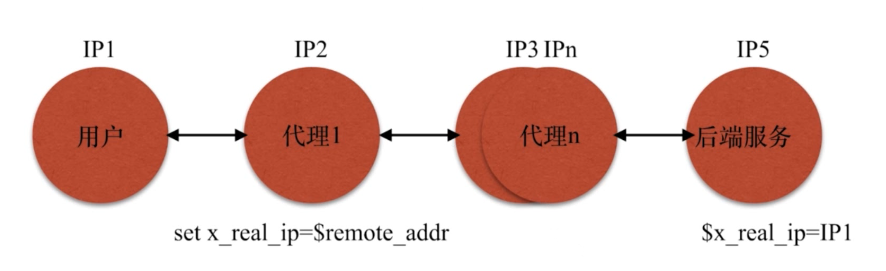

## 相同 server_name 多个虚拟主机优先级规范

&emsp;例如有三个配置文件

&emsp;&emsp;test1.conf&emsp;&emsp;test2.conf&emsp;&emsp;test3.conf

```
//test1.conf
server{
    listen 80;
    server_name testserver1 www.double.com;
    location{
        root /opt/app/code1;
        ...
    }
}

//test2.conf
server{
    listen 80;
    server_name testserver2 www.double.com;
    location{
        root /opt/app/code2;
        ...
    }
}

//test3.conf
server{
    listen 80;
    server_name testserver3 www.double.com;
    location{
        root /opt/app/code4;
        ...
    }
}
```

​	运行的时候会发现，在有多个相同的server_name加载的时候，不断刷新访问到的只有一个，**是 nginx 最优先读取到的配置文件的内容**


## location 匹配优先级

&emsp;当一个 server 下有多个 Location的时候匹配优先级问题	

| 正则      | 说明                                             | 优先级                                                       |
| --------- | ------------------------------------------------ | ------------------------------------------------------------ |
| =         | 进行普通字符精确匹配，也就是完全匹配             | 优先级高，一旦匹配就不会再走后面的匹配内容                   |
| ^~        | 表示普通字符匹配，使用前缀匹配                   | 优先级高，一旦匹配就不会再走后面的匹配内容                   |
| ~<br />~* | 表示执行一个正则匹配<br /> ~ 不区分大小写     ~* | 匹配到后会继续往后匹配看有没有比它自身优先级更高且符合要求的匹配 |

```
[root@localhost code3]# cd /etc/nginx/conf.d/
[root@localhost conf.d]# ls
Accept:  dep.conf  GET  Host:  User-Agent:
[root@localhost conf.d]# mv dep.conf test_location.conf
[root@localhost conf.d]# vi test_location.conf
server
 {
   listen       80;
   server_name  localhost;

   access_log   /var/log/nginx/test_lua.access.log      main;
   root /opt/app;

   location = /code1 {
        rewrite ^(.*)$ /code1/index.html break;
   }

   location ~ /code.* {
        rewrite ^(.*)$ /code3/index.html break;
   }

   location ^~ /code {
        rewrite ^(.*)$ /code2/index.html break;
   }
}

//保存退出，校验重载
```

&emsp;浏览器访问到的是第一个locating指向的文件


&emsp;修改配置，注释掉第一个 location

```
[root@localhost conf.d]# vi test_location.conf
server
 {
   listen	80;
   server_name	localhost;

   access_log 	/var/log/nginx/test_lua.access.log	main;
   root	/opt/app;

#   location = /code1 {
#	rewrite ^(.*)$ /code1/index.html break;
#   }

   location ~ /code.* {
	rewrite ^(.*)$ /code3/index.html break;
   }

   location ^~ /code {
	rewrite ^(.*)$ /code2/index.html break;
   }
}

//保存退出，校验重载
```

&emsp;&emsp;在访问的同样的地址，匹配到的是第三个location的页面了。即使第二个location也符合匹配到了，但是由于优先级问题，还是会往下匹配到第三个location带前缀的这个更高优先级。


&emsp;当我们把第三个location也注释掉，才能访问到第二个location指向的页面。

```
server
 {
   listen       80;
   server_name  localhost;

   access_log   /var/log/nginx/test_lua.access.log      main;
   root /opt/app;

#   location = /code1 {
#       rewrite ^(.*)$ /code1/index.html break;
#   }

   location ~ /code.* {
        rewrite ^(.*)$ /code3/index.html break;
   }

#   location ^~ /code {
#       rewrite ^(.*)$ /code2/index.html break;
#   }
}
```

​	同样地址的访问效果


## try_files 使用

&emsp;&emsp;按顺序检查文件是否存在，返回第一个找到的文件或文件夹(结尾加斜线表示为文件夹)，如果所有的文件或文件夹都找不到，会进行一个内部重定向到最后一个参数。

[Nginx 的 try_files 指令使用实例](<https://www.hi-linux.com/posts/53878.html>)

```
location / {
    	try_files $uri $uri/ /index.php;
}
```

​	 编辑配置文件，测试验证下

```
[root@localhost conf.d]# vi test_location.conf
server
 {
   listen	80;
   server_name	localhost;

   access_log 	/var/log/nginx/test_lua.access.log	main;
   root	/opt/app;

#   location = /code1 {
#	rewrite ^(.*)$ /code1/index.html break;
#   }

#   location ~ /code.* {
#	rewrite ^(.*)$ /code3/index.html break;
#   }

#   location ^~ /code {
#	rewrite ^(.*)$ /code2/index.html break;
#   }

   location / {
	root /opt/app/code1;
	try_files $uri @baidu_page;
   }

   location @baidu_page {
	root /opt/app;
	rewrite ^(.*)$   /code/test_mysite.html  break;
   }

}

// 保存退出，校验退出
```

&emsp;&emsp;浏览器访问，访问存在的index.html 文件没有问题，当访问不存在的文件就转向 @baidu_page 的改写页面


&emsp;&emsp;在做缓存，动静分离的时候，可以使用这种方式这种方式，先访问缓存目录，如果没有在去找后端获取文件并写加入缓存目录中。


## Nginx 的 alias 和 root 区别

&emsp;root:

```
location /request_path/image/ {
    root /local_path/image;
}
// 当访问图片URL是这样的时候
http://www.xxx.com/request_path/image/cat.png

// 在服务端去找图片的路径是： root+uri
/local_path/image/request_path/image/cat.png
```

​	

&emsp;alias:

```
location /request_path/image/ {
    alias /local_path/image;
}
// 当访问图片URL是这样的时候
http://www.xxx.com/request_path/image/cat.png

// 在服务端去找图片的路径是： root
/local_path/image/cat.png
```


## 用什么方法传递用户的真实 IP



&emsp;&emsp;比较简洁常用的方式，和第一级代理约定一个请求头字段，在Nginx中使用这个字段存储用户 ip1 的真实ip。然后最后也曾业务层Nginx 取找个字段。


#### Nginx中常见错误码

| 错误                               | 原因                                                  |
| ---------------------------------- | ----------------------------------------------------- |
| Nginx:413 Request Entity Too Large | 用户上传文件限制，需要修改  client_max_body_size 大小 |
| 502 bad gateway                    | 后端服务无响应                                        |
| 504 Gateway Time-out               | 后端服务执行超时                                      |

