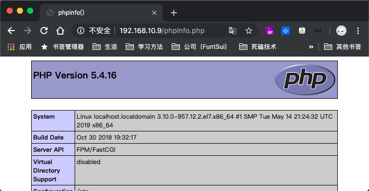
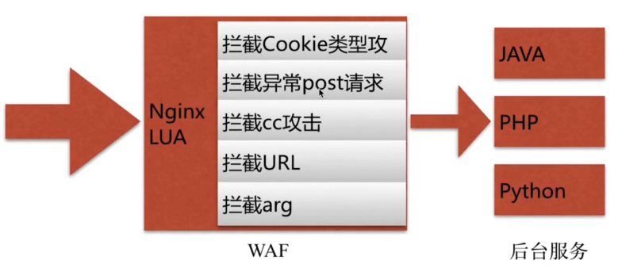
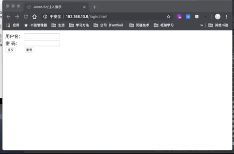
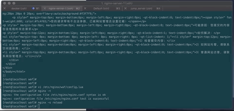

## 常见的恶意行为

- 爬虫行为和恶意抓取、资源盗用

解决方案：

&emsp;&emsp;基础防盗链功能，不让恶意用户能够轻易的爬取网站对外数据

&emsp;&emsp;secure_link_module，对数据安全性 提高 加密验证和失效性能，适合核心重要数据，下载服务器

&emsp;&emsp;access_module，对来访用户，后台控制部分用户服务的数据提供 ip 黑白名单防控


## 常见的应用层攻击手段

### 后台密码撞库

&emsp;&emsp;通过猜测密码字段不断对后台系统登录性尝试，获取后台登录密码

解决手段：

&emsp;&emsp;提高后台登录密码复杂度

&emsp;&emsp;access_module，对后台提供 IP 白名单，只允许自己允许的ip进行访问

&emsp;&emsp;预警机制。监控恶意频繁访问通知管理人员

### 文件上传漏洞

&emsp;&emsp;利用可以上传的接口将恶意代码提交到服务器中，再通过 url 去访问以执行代码。

举个例子：

有一个上传文件接口  http://www.test.com/upload

```
location ^~ /upload {
    root /opt/app/images;
}
```

&emsp;现在上传一长图片1.jpg。图片内容其实是 php 代码然后保存为图片格式

&emsp;调用接口上传 http://www.test.com/upload/1.jpg

&emsp;在之前的 nginx 版本中我们通过这样子的url 去访问  http://www.test.com/upload/1.jpg/1.php

&emsp;Nginx 机会将 1.jpg 作为php 代码执行。

&emsp;为了防止这种情况，我们需要对上传请求的 文件做区别判断，例如 ：

```
location ^~ /upload {
    root /opt/app/images;
    # 判断是以 .php 结尾的，视为违法格式文件，返回403
    if($request_filename  ~*(.*)\.php) {
        return 403;
    }
}
```


### SQL注入

&emsp;&emsp;利用未过滤、未审核用户输入的攻击方法，让应用运行本不应该运行的SQL代码

#### 模拟场景


#### 1、准备 mariadb 和 lump 环境

```
// 安装数据库
[root@localhost conf.d]# yum -y install mariadb-server mariadb
....

// 安装PHP环境 以及PHP和操作数据库扩展模块
[root@localhost conf.d]# yum -y install php php-fpm php-mysql
....

// 启动数据库
[root@localhost conf.d]# systemctl start mariadb
[root@localhost conf.d]# systemctl status mariadb
● mariadb.service - MariaDB database server
   Loaded: loaded (/usr/lib/systemd/system/mariadb.service; disabled; vendor preset: disabled)
   Active: active (running) since 六 2019-09-21 03:26:22 UTC; 1s ago
....

// 进入数据库进行建表，并插入数据
[root@localhost conf.d]# mysql -uroot -p
Enter password:					// 没有密码直接回车
Welcome to the MariaDB monitor.  Commands end with ; or \g.
Your MariaDB connection id is 2
Server version: 5.5.64-MariaDB MariaDB Server

Copyright (c) 2000, 2018, Oracle, MariaDB Corporation Ab and others.

Type 'help;' or '\h' for help. Type '\c' to clear the current input statement.

// 查看数据库
MariaDB [(none)]> show databases;
+--------------------+
| Database           |
+--------------------+
| information_schema |
| mysql              |
| performance_schema |
| test               |
+--------------------+

// 创建一个 info 数据库 ,
MariaDB [(none)]> create database info;
Query OK, 1 row affected (0.00 sec)

MariaDB [(none)]> use info;
Database changed
MariaDB [info]> show tables;
Empty set (0.00 sec)


// 创建 user 表，
MariaDB [info]> create table users(id int(11),username varchar(64), password varchar(64), email varchar(64));
Query OK, 0 rows affected (0.00 sec)

MariaDB [info]> show tables;
+----------------+
| Tables_in_info |
+----------------+
| users          |
+----------------+
1 row in set (0.00 sec)

MariaDB [info]> desc users;
+----------+-------------+------+-----+---------+-------+
| Field    | Type        | Null | Key | Default | Extra |
+----------+-------------+------+-----+---------+-------+
| id       | int(11)     | YES  |     | NULL    |       |
| username | varchar(64) | YES  |     | NULL    |       |
| password | varchar(64) | YES  |     | NULL    |       |
| email    | varchar(64) | YES  |     | NULL    |       |
+----------+-------------+------+-----+---------+-------+
4 rows in set (0.00 sec)


// 插入数据
MariaDB [info]> insert into users (id,username,password,email) values(1,'jeson',md5('123'),'jeson@imoocc.com');
Query OK, 1 row affected (0.01 sec)

MariaDB [info]> insert into users (id,username,password,email) values(1,'double',md5('123'),'double@tg10010.com');
Query OK, 1 row affected (0.00 sec)

MariaDB [info]> select * from users;
+------+----------+----------+--------------------+
| id   | username | password | email              |
+------+----------+----------+--------------------+
|    1 | double   | 123      | double@tg10010.com |
+------+----------+----------+--------------------+

//退出
MariaDB [info]> exit
Bye
```

#### 2、准备 PHP 文件和修改 配置文件开启 php fastcgi_pass

```
[root@localhost conf.d]# cd /opt/app/code
// 创建是三个文件  login.html  	phpinfo.php		validate.php

// 登录表单提交页面，将信息提交到  validate.php
[root@localhost code]# vi  login.html
<html>
<head>
<title>Jeson Sql注入演示</title>
<meta http-equiv="content-type"content="text/html;charset=utf-8">
</head>
<body>
<form action="validate.php" method="post">
    <table>
      <tr>
        <td>用户名：</td>
        <td><input type="text" name="username"></td>
      </tr>
      <tr>
        <td>密  码：</td>
        <td><input type="text" name="password"></td>
      </tr>
      <tr>
        <td><input type="submit" value="提交"></td>
        <td><input type="reset" value="重置"></td>
      </tr>
    </table>
</form>
</body>
</html>

// 显示 PHP 信息页面
[root@localhost code]# vi phpinfo.php
<?php
    phpinfo();
?>

// 根据提交参数，去数据库查询验证
[root@localhost code]# vi validate.php
<?php
      $conn = mysql_connect("localhost",'root','') or die("数据库连接失败！");
      mysql_select_db("info",$conn) or die("您要选择的数据库不存在");
      $name=$_POST['username'];
      $pwd=$_POST['password'];
      $sql="select * from users where username='$name' and password='$pwd'";
      echo $sql."<br /><br />";
      $query=mysql_query($sql);
      $arr=mysql_fetch_array($query);
      if($arr){
          echo "login success!\n";
          echo $arr[1];
          echo $arr[3]."<br /><br />";
      }else{
          echo "login failed!";
      }
    
      #if(is_array($arr)){
      #       header("Location:manager.php");
      #}else{
      #       echo "您的用户名或密码输入有误，<a href="Login.php">请重新登录！</a>";
      #}
?>

```

#### 3、修改配置文件

```
[root@localhost code]# cd /etc/nginx/conf.d/
// 拷贝之前备份的文件
[root@localhost conf.d]# cp /opt/backup/default.conf ./phpserver.conf
[root@localhost conf.d]# mv default.conf phpserver.conf
[root@localhost conf.d]# vi phpserver.conf
server {
    listen       80;
    server_name  localhost;
    root	/opt/app/code;

    #charset koi8-r;
    access_log  /var/log/nginx/host.access.log  main;

    location / {
        root   /usr/share/nginx/html;
        index  index.html index.htm;
    }

    #error_page  404              /404.html;

    # redirect server error pages to the static page /50x.html
    #
    error_page   500 502 503 504 404 /50x.html;
    location = /50x.html {
        root   /usr/share/nginx/html;
    }

	# 主要就是打开这个 location 的注释，并将 fastcgi_param 路径指向我们存放PHP文件的目录
    # pass the PHP scripts to FastCGI server listening on 127.0.0.1:9000
    #
    location ~ \.php$ {
        root           html;
        fastcgi_pass   127.0.0.1:9000;
        fastcgi_index  index.php;
        #fastcgi_param  SCRIPT_FILENAME  /scripts$fastcgi_script_name;
		fastcgi_param	SCRIPT_FILENAME	/opt/app/code/$fastcgi_script_name;
        include        fastcgi_params;
    }
}

// 保存退出、校验重载


// 启动 php-fpm
[root@localhost conf.d]# php-fpm -D
[root@localhost conf.d]# ps -aux | grep php
root      7645  0.0  0.9 330016  4768 ?        Ss   04:07   0:00 php-fpm: master process (/etc/php-fpm.conf)
apache    7646  0.0  0.9 330016  4560 ?        S    04:07   0:00 php-fpm: pool www
apache    7647  0.0  0.9 330016  4560 ?        S    04:07   0:00 php-fpm: pool www
apache    7648  0.0  0.9 330016  4560 ?        S    04:07   0:00 php-fpm: pool www
apache    7649  0.0  0.9 330016  4560 ?        S    04:07   0:00 php-fpm: pool www
apache    7650  0.0  0.9 330016  4560 ?        S    04:07   0:00 php-fpm: pool www
root      7652  0.0  0.1 112708   992 pts/0    R+   04:07   0:00 grep --color=auto php

```

#### 4、浏览器访问下 phpinfo.php 文件看下 fastcgi 是否生效了 



#### 5、所有环境搭建准备，完毕现在就可以来尝试访问页面，模拟 SQL 注入


从动图效果中可以看出 SQL 注入成功，将输入的用户名密码以及最终在 vliedate.php 中执行的sql 列出对比一下就知道原因了。常见的 SQL 注入实现。输入一段  ' or 1=1 # 在最终拼接SQL的时候执行 永远符合查询条件也能登陆成功呢

| Username  password | select * from users where username=\'\$name' and  password='$pwd' |
| ------------------ | ------------------------------------------------------------ |
| admin  admin       | select * from users where username=\'admin' and  password='admin' |
| double 123         | select * from users where username=\'admin' and  password='123' |
| ' or 1=1 #   123   | select * from users where username=\'' or 1=1 # and  password='123' |


## 场景：Nginx+LUA 的安全 waf 防火墙



&emsp;&emsp;[ngx_lua_waf](<https://github.com/loveshell/ngx_lua_waf>) 一个之前我们前面使用过的 lua-nginx-module 模块的 web应用防火墙。这个 github 上的readme 中有详细的介绍使用


```
// 首先下载 ngx_lua_waf
[root@localhost code]# cd /opt/download/
[root@localhost download]# git clone https://github.com/loveshell/ngx_lua_waf.git
....

[root@localhost download]# ls
file  geoip2  ngx_lua_waf

// 将下载文件拷贝到 nginx 的 waf 目录下
[root@localhost download]# cd /etc/nginx/
[root@localhost nginx]# mv /opt/download/ngx_lua_waf/ ./waf
[root@localhost nginx]# cd waf/
[root@localhost waf]# ls
config.lua  init.lua  install.sh  README.md  wafconf  waf.lua

//	编辑 config.lua  文件，将 RulePath 文件路径指向我们自己的路径
//	config.lua 配置文件的详细说明在 ngx_lua_waf 的Github 上 readme 中有
[root@localhost waf]# vi config.lua
RulePath = "/etc/nginx/waf/wafconf/"
attacklog = "on"
logdir = "/var/log/nginx/log/hack/"
UrlDeny="on"
Redirect="on"
CookieMatch="on"
postMatch="on"
whiteModule="on"
black_fileExt={"php","jsp"}
ipWhitelist={"127.0.0.1"}
ipBlocklist={"1.0.0.1"}
CCDeny="off"
CCrate="100/60"
html=[[
<html xmlns="http://www.w3.org/1999/xhtml"><head>
<meta http-equiv="Content-Type" content="text/html; charset=utf-8">
<title>网站防火墙</title>
<style>
p {
	line-height:20px;
}
ul{ list-style-type:none;}
li{ list-style-type:none;}
</style>
</head>

<body style=" padding:0; margin:0; font:14px/1.5 Microsoft Yahei, 宋体,sans-serif; color:#555;">

 <div style="margin: 0 auto; width:1000px; padding-top:70px; overflow:hidden;">


  <div style="width:600px; float:left;">
    <div style=" height:40px; line-height:40px; color:#fff; font-size:16px; overflow:hidden; background:#6bb3f6; padding-left:20px;">网站防火墙 </div>
    <div style="border:1px dashed #cdcece; border-top:none; font-size:14px; background:#fff; color:#555; line-height:24px; height:220px; padding:20px 20px 0 20px; overflow-y:auto;background:#f3f7f9;">
      <p style=" margin-top:0px; margin-bottom:0px; margin-left:0px; margin-right:0px; -qt-block-indent:0; text-indent:0px;"><span style=" font-weight:600; color:#fc4f03;">您的请求带有不合法参数，已被网站管理员设置拦截！</span></p>
<p style=" margin-top:0px; margin-bottom:0px; margin-left:0px; margin-right:0px; -qt-block-indent:0; text-indent:0px;">可能原因：您提交的内容包含危险的攻击请求</p>
<p style=" margin-top:12px; margin-bottom:12px; margin-left:0px; margin-right:0px; -qt-block-indent:1; text-indent:0px;">如何解决：</p>
<ul style="margin-top: 0px; margin-bottom: 0px; margin-left: 0px; margin-right: 0px; -qt-list-indent: 1;"><li style=" margin-top:12px; margin-bottom:0px; margin-left:0px; margin-right:0px; -qt-block-indent:0; text-indent:0px;">1）检查提交内容；</li>
<li style=" margin-top:0px; margin-bottom:0px; margin-left:0px; margin-right:0px; -qt-block-indent:0; text-indent:0px;">2）如网站托管，请联系空间提供商；</li>
<li style=" margin-top:0px; margin-bottom:0px; margin-left:0px; margin-right:0px; -qt-block-indent:0; text-indent:0px;">3）普通网站访客，请联系网站管理员；</li></ul>
    </div>
  </div>
</div>
</body></html>
]]

// 修改 Nginx 配置文件，集成ngx_lua_waf 
[root@localhost waf]# vi /etc/nginx/nginx.conf
....
http {
    include       /etc/nginx/mime.types;
    default_type  application/octet-stream;
	
	# 加入如下配置
	lua_package_path "/etc/nginx/waf/?.lua";
	lua_shared_dict limit 10m;
	init_by_lua_file /etc/nginx/waf/init.lua;
	access_by_lua_file /etc/nginx/waf/waf.lua;
	
	
	....
}

//保存退出，校验重载
```

&emsp;&emsp;接下来我们访问下浏览器发现，防火墙的确生效了，当参数不合法如 ： ?id=../etc/test  这种带有 .. 攻击性质的不合法参数，防火墙拦截成功出现了拦截页面。但是当我们使用 sql 注入方式依然访问成功了？


&emsp;&emsp;这是因为防 sql 注入的规则我们并没有加入到 /etc/nginx/waf/wafconf  中去。而  ?id=../etc/passwd 生效是因为在此目录的 args 。也就是 get 请求取的参数的时候取匹配规则的文件中的第一行就有这个正则匹配

```
[root@localhost wafconf]# ls
args  cookie  post  url  user-agent  whiteurl
[root@localhost wafconf]# cat -n args
     1	\.\./		# 正则匹配参数是 ../  这样子的模式则命中
     2	\:\$
 ....
```

&emsp;&emsp;回到我们使用 sql 注入，其实是用的 POST 提交，那就去修改 /wafconf/ 目录下 的 POST 文件 加入 匹配 sql 注入的 正则就能达到我们想要的效果了

```
// 编辑文件在文件开始位置加入匹配正则  \sor\s+
[root@localhost wafconf]# vi  /etc/nginx/waf/wafconf/post
\sor\s+
....

// 保存退出，校验重载
```

&emsp;&emsp;再次浏览器访问，使用 SQL 注入方式登录，发现防火墙生效拦截了




### 复杂访问攻击中 cc 攻击方式控制

[**什么是CC攻击**](<https://www.jianshu.com/p/dff5a0d537d8>)

&emsp;&emsp;防止单个 ip 对我们服务进行频繁的访问，占用服务器资源，严重导致服务器崩溃，就需要进行频繁访问控制。 

```
// 编辑 config.lu  开启  CCDeny 控制在 60秒限制最大1000次访问
[root@localhost waf]# vi /etc/nginx/waf/config.lua
....
CCDeny="on"
CCrate="1000/60"
....

// 保存退出、校验重载
```

&emsp;&emsp;接下来，我们使用宿主机 mac  的 ab 工具来模拟频繁访问。第一次 curl 访问正常200，ab 2000 次后再次 curl 访问失败503。



​	等过了一分钟后，再次 curl  或者浏览器访问 又恢复正常了。