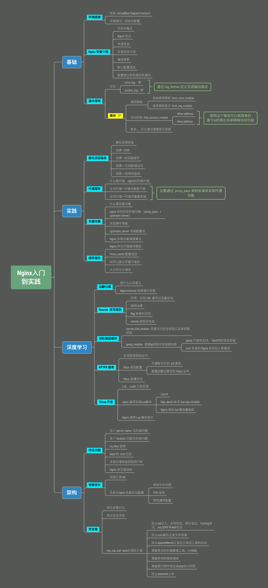

&emsp;&emsp;慕课网 [Nginx入门到实践－Nginx中间件](<https://coding.imooc.com/class/121.html>) 的完整学习踩坑笔记。

​	笔记在线阅读：[https://cxxceo.gitbook.io/nginx/](https://cxxceo.gitbook.io/nginx/)

​	笔记github: [https://github.com/GibsonCool/Nginx-note](<https://github.com/GibsonCool/Nginx-note>)  相关代码文件在 project.zip中

&emsp;&emsp;看完整个视频对于什么是 Nginx？ Nginx 大概能做什么？会有一个基本的认知概念，基础的Nginx操作配置也能上手完成。但是对于Nginx的原理，以及结合 Lua 的功能自定义开发，还需要深入学习。

​	