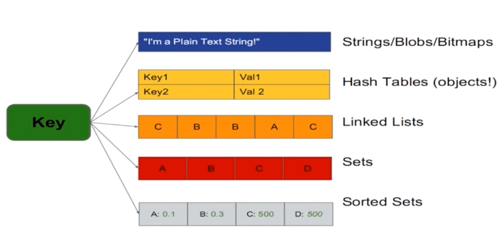

## Redis 是什么

- 开源
- 基于键值的存储服务系统
- 支持多种数据结构
- 高性能，功能丰富
- 非关系型数据库 NoSQL


#### Redis与其他数据库服务和缓存服务器的对比

| 名称       | 类型                                     | 数据存储选项                                                 | 查询类型                                                     | 附加功能                                                     |
| ---------- | ---------------------------------------- | ------------------------------------------------------------ | ------------------------------------------------------------ | ------------------------------------------------------------ |
| Redis      | 使用内存存储（in-memory） 的非关系数据库 | 字符串、列表、集合、散列表、有序集合                         | 每种数据类型都有自己的专属命令， 另外还有批量操作（bulk operation）和不完全（partial）的事务支持 | 发布与订阅， 主从复制（master/slave replication）， 持久化， 脚本（存储过程，stored procedure） |
| memcached  | 使用内存存储的键值缓存                   | 键值之间的映射                                               | 创建命令、读取命令、更新命令、删除命令以及其他几个命令       | 为提升性能而设的多线程服务器                                 |
| MySQL      | 关系数据库                               | 每个数据库可以包含多个表， 每个表可以包含多个行； 可以处理多个表的视图（view）； 支持空间（spatial）和第三方扩展 | `SELECT` 、 `INSERT` 、 `UPDATE` 、 `DELETE` 、函数、存储过程 | 支持ACID性质（需要使用InnoDB）， 主从复制和主主复制 （master/master replication） |
| PostgreSQL | 关系数据库                               | 每个数据库可以包含多个表， 每个表可以包含多个行； 可以处理多个表的视图； 支持空间和第三方扩展；支持可定制类型 | `SELECT` 、 `INSERT` 、 `UPDATE` 、 `DELETE` 、内置函数、自定义的存储过程 | 支持ACID性质，主从复制， 由第三方支持的多主复制 （multi-master replication） |
| MongoDB    | 使用硬盘存储（on-disk）的非关系文档存储  | 每个数据库可以包含多个表， 每个表可以包含多个无schema （schema-less）的BSON文档 | 创建命令、读取命令、更新命令、删除命令、条件查询命令，等等   | 支持map-reduce操作，主从复制，分片， 空间索引（spatial index） |


## Redis的特性

#### **速度快**

> 数据存在—————》内存
>
> 编写语言—————》C语言
>
> 线程模型—————》单线程


#### **持久化**（断电不丢数据）

> 所有数据保持在内存中，对数据的更新将异步地保存在磁盘上。


#### **多种数据结构**




| 结构类型            | 结构存储的值                                                 | 结构的读写能力                                               |
| ------------------- | ------------------------------------------------------------ | ------------------------------------------------------------ |
| `STRING`            | 可以是字符串、整数或者浮点数                                 | 对整个字符串或者字符串的其中一部分执行操作； 对整数和浮点数执行自增（increment）或者自减（decrement）操作 |
| `LIST`              | 一个链表，链表上的每个节点都包含了一个字符串                 | 从链表的两端推入或者弹出元素；根据偏移量对链表进行修剪（trim）； 读取单个或者多个元素；根据值查找或者移除元素 |
| `SET`               | 包含字符串的无序收集器（unordered collection），并且被包含的每个字符串都是独一无二、各不相同的 | 添加、获取、移除单个元素；检查一个元素是否存在于集合中； 计算交集、并集、差集；从集合里面随机获取元素 |
| `HASH`              | 包含键值对的无序散列表                                       | 添加、获取、移除单个键值对；获取所有键值对                   |
| `ZSET` （有序集合） | 字符串成员（member）与浮点数分值（score）之间的有序映射，元素的排列顺序由分值的大小决定 | 添加、获取、删除单个元素；根据分值范围（range）或者成员来获取元素 |

**新版本中还提供了新的数据结构**

> BitMaps：位图
>
> HyperLogLog：超小内存唯一值计数
>
> GEO： 地理信息定位


#### 多语言客户端支持

java/php/python/...


#### 功能丰富

> 支持发布订阅
>
> Lua脚本
>
> 简单的事务操作
>
> pipeline


#### 简单

> 不依赖外部库
>
> 单线程模型


#### 主从复制


> 主从复制为高可用，分布式的支持提供很好的基础


#### 高可用、分布式


## Redis单机安装

#### 推荐使用操作环境使用  VirtualBox+Vagrant+centos7  

```shell
#进入centos7 系统

# 使用yum 安装 wget 
 yum install wget

# wget 下载 Redis 安装包
 wget https://github.com/antirez/redis/archive/5.0.2.tar.gz

# 进行解压
tar -xzvf 5.0.2.tar.gz
 
# 为了方便管理和升级，创建一个redis 软连接(相当于Windows的快捷方式)
ln -s redis-5.0.2 redis
[root@localhost soft]# ll
total 1932
-rw-r--r--. 1 root root 1971919 11月 26 04:19 5.0.2.tar.gz
lrwxrwxrwx. 1 root root      11 11月 26 04:20 redis -> redis-5.0.2
drwxrwxr-x. 6 root root    4096 11月 22  2018 redis-5.0.2

# 进入目录并编译
[root@localhost soft]# cd redis
[root@localhost deps]# cd deps
[root@localhost deps]# make jemalloc
[root@localhost deps]# make hiredis
[root@localhost deps]# make linenoise
[root@localhost deps]# make lua
# 回到上级目录 
[root@localhost deps]# cd ..
[root@localhost redis]# make
[root@localhost redis]# make install

# 可以查看 src 目录下各种 redies 可执行文件已经存在了
[root@localhost redis]# ll src/ | grep redis
-rw-rw-r--. 1 root root    2418 11月 22  2018 redisassert.h
-rwxr-xr-x. 1 root root 4366608 11月 26 04:24 redis-benchmark
-rw-rw-r--. 1 root root   29605 11月 22  2018 redis-benchmark.c
-rw-r--r--. 1 root root  109120 11月 26 04:24 redis-benchmark.o
-rwxr-xr-x. 1 root root 8086016 11月 26 04:24 redis-check-aof
-rw-rw-r--. 1 root root    7143 11月 22  2018 redis-check-aof.c
-rw-r--r--. 1 root root   28776 11月 26 04:24 redis-check-aof.o
-rwxr-xr-x. 1 root root 8086016 11月 26 04:24 redis-check-rdb
-rw-rw-r--. 1 root root   13541 11月 22  2018 redis-check-rdb.c
-rw-r--r--. 1 root root   65896 11月 26 04:24 redis-check-rdb.o
-rwxr-xr-x. 1 root root 4787736 11月 26 04:24 redis-cli
-rw-rw-r--. 1 root root  255026 11月 22  2018 redis-cli.c
-rw-r--r--. 1 root root  885368 11月 26 04:24 redis-cli.o
-rw-rw-r--. 1 root root   29044 11月 22  2018 redismodule.h
-rwxr-xr-x. 1 root root 8086016 11月 26 04:24 redis-sentinel
-rwxr-xr-x. 1 root root 8086016 11月 26 04:24 redis-server
-rwxrwxr-x. 1 root root    3600 11月 22  2018 redis-trib.rb

# 将可执行文件目录加入环境变量方便实用
[root@localhost src]# vi /etc/profile
...
#在文件末尾加入如下路径指定
PATH=$PATH:/opt/soft/redis/src
export PATH
# 保存并退出

# 最后执行使修改的文件生效
[root@localhost src]# source /etc/profile

```


#### 可执行文件说明

| 文件名           | 用途                      |
| ---------------- | ------------------------- |
| redis-server     | Redis服务器               |
| redis-cli        | Redis命令行客户端         |
| redis-benchmark  | Redis性能测试工具         |
| redis-check-aof  | AOF文件修复工具           |
| redis-check-dump | RDB文件检查工具           |
| redis-sentinel   | Sentinel服务器（2.8以后） |


#### 三种启动方法

##### 最简启动

```shell
[root@localhost ~]# redis-server
31812:C 26 Nov 2019 05:03:56.379 # oO0OoO0OoO0Oo Redis is starting oO0OoO0OoO0Oo
31812:C 26 Nov 2019 05:03:56.379 # Redis version=5.0.2, bits=64, commit=00000000, modified=0, pid=31812, just started
31812:C 26 Nov 2019 05:03:56.379 # Warning: no config file specified, using the default config. In order to specify a config file use redis-server /path/to/redis.conf
31812:M 26 Nov 2019 05:03:56.379 * Increased maximum number of open files to 10032 (it was originally set to 1024).
                _._
           _.-``__ ''-._
      _.-``    `.  `_.  ''-._           Redis 5.0.2 (00000000/0) 64 bit
  .-`` .-```.  ```\/    _.,_ ''-._
 (    '      ,       .-`  | `,    )     Running in standalone mode
 |`-._`-...-` __...-.``-._|'` _.-'|     Port: 6379
 |    `-._   `._    /     _.-'    |     PID: 31812
  `-._    `-._  `-./  _.-'    _.-'
 |`-._`-._    `-.__.-'    _.-'_.-'|
 |    `-._`-._        _.-'_.-'    |           http://redis.io
  `-._    `-._`-.__.-'_.-'    _.-'
 |`-._`-._    `-.__.-'    _.-'_.-'|
 |    `-._`-._        _.-'_.-'    |
  `-._    `-._`-.__.-'_.-'    _.-'
      `-._    `-.__.-'    _.-'
          `-._        _.-'
              `-.__.-'

31812:M 26 Nov 2019 05:03:56.380 # WARNING: The TCP backlog setting of 511 cannot be enforced because /proc/sys/net/core/somaxconn is set to the lower value of 128.
31812:M 26 Nov 2019 05:03:56.380 # Server initialized
31812:M 26 Nov 2019 05:03:56.380 # WARNING overcommit_memory is set to 0! Background save may fail under low memory condition. To fix this issue add 'vm.overcommit_memory = 1' to /etc/sysctl.conf and then reboot or run the command 'sysctl vm.overcommit_memory=1' for this to take effect.
31812:M 26 Nov 2019 05:03:56.380 * Ready to accept connections
#验证
ps -ef | grep redis
netstat -antpl | grep redis
redis-cli -h ip -p port ping
```

##### 动态参数启动

```shell 
# redis 默认端口是6379
# 指定端口启动
# 新开一个终端，指定 6380 端口开启一个 redis-server
[vagrant@localhost ~]$ redis-server --port 6380
32125:C 26 Nov 2019 07:34:15.317 # oO0OoO0OoO0Oo Redis is starting oO0OoO0OoO0Oo
32125:C 26 Nov 2019 07:34:15.317 # Redis version=5.0.2, bits=64, commit=00000000, modified=0, pid=32125, just started
32125:C 26 Nov 2019 07:34:15.317 # Configuration loaded
32125:M 26 Nov 2019 07:34:15.318 # You requested maxclients of 10000 requiring at least 10032 max file descriptors.
32125:M 26 Nov 2019 07:34:15.318 # Server can't set maximum open files to 10032 because of OS error: Operation not permitted.
32125:M 26 Nov 2019 07:34:15.318 # Current maximum open files is 4096. maxclients has been reduced to 4064 to compensate for low ulimit. If you need higher maxclients increase 'ulimit -n'.
                _._
           _.-``__ ''-._
      _.-``    `.  `_.  ''-._           Redis 5.0.2 (00000000/0) 64 bit
  .-`` .-```.  ```\/    _.,_ ''-._
 (    '      ,       .-`  | `,    )     Running in standalone mode
 |`-._`-...-` __...-.``-._|'` _.-'|     Port: 6380
 |    `-._   `._    /     _.-'    |     PID: 32125
  `-._    `-._  `-./  _.-'    _.-'
 |`-._`-._    `-.__.-'    _.-'_.-'|
 |    `-._`-._        _.-'_.-'    |           http://redis.io
  `-._    `-._`-.__.-'_.-'    _.-'
 |`-._`-._    `-.__.-'    _.-'_.-'|
 |    `-._`-._        _.-'_.-'    |
  `-._    `-._`-.__.-'_.-'    _.-'
      `-._    `-.__.-'    _.-'
          `-._        _.-'
              `-.__.-'

32125:M 26 Nov 2019 07:34:15.319 # WARNING: The TCP backlog setting of 511 cannot be enforced because /proc/sys/net/core/somaxconn is set to the lower value of 128.
32125:M 26 Nov 2019 07:34:15.319 # Server initialized
32125:M 26 Nov 2019 07:34:15.319 # WARNING overcommit_memory is set to 0! Background save may fail under low memory condition. To fix this issue add 'vm.overcommit_memory = 1' to /etc/sysctl.conf and then reboot or run the command 'sysctl vm.overcommit_memory=1' for this to take effect.
32125:M 26 Nov 2019 07:34:15.319 * Ready to accept connections
```

##### 配置文件启动

```shell
# 将需要的参数设置，写到配置文件中，通过指定配置文件路径启动
redis-server configpath

# 切换到指定 redis 目录下，创建 config 目录用于存放配置文件,创建 data 目录用于存放运行日志文件 
[vagrant@localhost ~]$ cd /opt/soft/redis
[vagrant@localhost redis]$ sudo su
[root@localhost redis-5.0.2]# mkdir config data

# 拷贝一个 Redis 的默认配置到上面创建的目录，进行修改
[root@localhost redis-5.0.2]# cp redis.conf config/
[root@localhost redis-5.0.2]# cd config/

# 我们通常的服务一般都是多核的，然而 redis 又是单线程的。所以通常一台服务器会开启多个 redis-server 
# 生产中为了便于管理，使用配置文件来启动，并且使用端口命名配置文件，便于区分管理
# 读取 redis.conf 中的内容过滤注释和空格 写入到 redis-6381.conf 文件中
[root@localhost config]# cat redis.conf | grep -v "#" | grep -v "^$" > redis-6381.conf
[root@localhost config]# ls
redis-6381.conf  redis.conf

# 编辑配置文件 只设置如下参数
[root@localhost config]# vi redis-6381.conf
daemonize yes							#开启守护进程
port 6381								#指定端口号
dir "/opt/soft/redis/data"				#指定工作目录
logfile "6381.log"						#指定输出日志文

# 指定文件路径启动
[root@localhost redis-5.0.2]# redis-server /opt/soft/redis/config/redis-6381.conf
# 切到配置文件指定的工作目录中，可以查看启动日志
[root@localhost redis-5.0.2]# cd data/
[root@localhost data]# ls
6381.log
```


##### Redis-cli 客户端命令行使用

```shell
# 新开一个终端，链接上面开启的 redis-server 不指定默认连接的是6379端口的  Redis-server
[root@localhost ~]# redis-cli
127.0.0.1:6379> set hello world
OK
127.0.0.1:6379> get hello
"world"
127.0.0.1:6379> ping
PONG
127.0.0.1:6379>exit

# 指定端口去链接 6380的 redis-server
[vagrant@localhost ~]$ redis-cli -p 6380
127.0.0.1:6380> set hello world
OK
127.0.0.1:6380> get hello
"world"
127.0.0.1:6380> exit

# 查看 redis-server 的进程，三个端口都在使用
[vagrant@localhost ~]$ ps -ef | grep redis-server
root     31812 31611  0 05:03 pts/0    00:00:12 redis-server *:6379
vagrant  32125 32085  0 07:34 pts/2    00:00:00 redis-server *:6380
root     32411     1  0 08:02 ?        00:00:00 redis-server *:6381
vagrant  32135 31856  0 07:38 pts/1    00:00:00 grep --color=auto redis-server
```


三种启动方式比较

> 生产环境选择配置文件启动
>
> 单机多实例配置文件可以用端口区分开


## Redis典型使用场景

#### 缓存系统

 

#### 计数器

网站视频访问量，博客访问量，围脖转发数等等


#### 消息队列系统

消息队列比较成熟的产品：kafaka/rabbitMQ 等等

Redis 也提供发布/订阅，阻塞消息队列的功能，对于消息队列要求不是很高的简单功能可以使用Redis来完成


#### 排行榜/社交网络/实时系统	