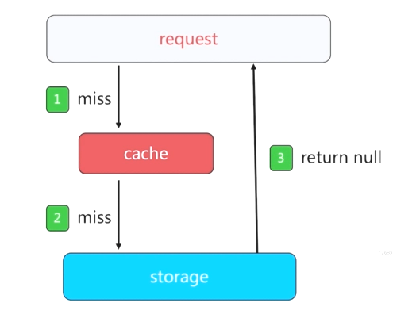

## 缓存的收益与成本

### 收益：

1. 加速读写
   - 通过缓存加速读写速度: CPU  L1/L2/L3 Cache、Linux  page  Cache 加速硬盘读写、浏览器缓存、Ehcache 缓存数据库结果
2. 降低后端负载
   - 后端服务器通过前端缓存减低负载：业务端使用 redis  降低后端 MySQL 负载等。


### 成本：

1. 数据不一致：缓存层和数据层有时间窗口不一致，和更新策略有关。
2. 代码维护成本：多了一层缓存逻辑。
3. 运维成本：例如 Redis Cluster


### 使用场景

1. 降低后端负载： 
   - 对高消耗的SQL：join 结果集/分组统计结果缓存。
2. 加速请求响应：
   - 利用 Redis/memcache 优化 IO响应时间
3. 大量写合并为批量写：
   - 如计数器先 redis 累加在批量写 DB


## 缓存更新策略 

1. LRU/LFU/FIFO 算法剔除：例如 maxmemory-policy。达到最大缓存值触发剔除算法
2. 超时剔除：例如设置过期时间 expire。
3. 主动更新：开发控制生命周期


### 对比

| 策略              | 一致性 | 维护成本 |
| ----------------- | ------ | -------- |
| LRU/LIRS 算法剔除 | 最差   | 底       |
| 超时剔除          | 较差   | 底       |
| 主动更新          | 强     | 高       |


### 建议

1. 低一致性要求的情况下，选择算法剔除，最大内存淘汰策略。
2. 高一致性的情况下：使用超时剔除和业务主动更新结合，算法剔除，最大内存淘汰策略兜底。


## 缓存粒度控制

举例一个获取用户信息缓存的实例


通常我们需要从三个角度去考虑缓存的粒度：

1. 通用性：全量属性更好
2. 占用内存空间：部分属性更好。
3. 代码维护：表面上全量属性更好，需要编写的业务逻辑相对较少


**[吊打面试官系列之缓存击穿、雪崩、穿透](<https://github.com/AobingJava/JavaFamily/blob/master/docs/redis/%E7%BC%93%E5%AD%98%E5%87%BB%E7%A9%BF%E3%80%81%E9%9B%AA%E5%B4%A9%E3%80%81%E7%A9%BF%E9%80%8F.md>)**

## 缓存穿透优化

​				

#### 是什么

缓存穿透是指查询一个一定不存在的数据，由于缓存是不命中时被动写的，并且出于容错考虑，如果从存储层查不到数据则不写入缓存，这将导致这个不存在的数据每次请求都要到存储层去查询，失去了缓存的意义。在流量大时，可能DB就挂掉了，要是有人利用不存在的key频繁攻击我们的应用，这就是漏洞。



#### 产生的原因

1. 自己业务代码逻辑问题 
2. 恶意攻击、爬虫。例如数据库的自增id都是1开始的，查询的时候使用-1就导致永远查询不到


#### 解决方案

1. 缓存空对象

   之所以会发生穿透，就是因为缓存中没有存储这些空数据的key。从而导致每次查询都到数据库去了。

   那么我们就可以为这些key对应的值设置为null 丢到缓存里面去。后面再出现查询这个key 的请求的时候，直接返回null 。这样就不用去访问DB层了。注意一定要设置过期时间，建议不超过 5分钟。

   

   可能导致两个问题：

   - 缓存空对象，导致了一些需要无用的更多的键，所以提到的过期时间很有必要

   - 缓存层和存储层数据 “短期” 不一致。

     

2. 布隆过滤器 BloomFilter

   [**详解布隆过滤器的原理，使用场景和注意事项**](<https://zhuanlan.zhihu.com/p/43263751>)

   利用高效的数据结构和算法快速判断出你这个Key是否在数据库中存在，不存在你return就好了，存在你就去查了DB刷新KV再return。

   

   


## 缓存雪崩优化

#### 是什么

由于缓存服务承载大量请求，当缓存服务异常/脱机，或者同时失效。大量的请求直接打到后端组件（例如DB），造成级联故障。


#### 产生原因

- 大量热点数据设置了相同的过期时间
- 缓存服务器宕机


#### 解决方案

- 在批量往 redis 存数据的时候，把每个 key  的失效时间加上一个随机值就可避免同一时间触发的问题
- 保证  redis 的高可用，高性能，使用  redis-sentinel 和 redis-cluster。
- 任然要考虑到缓存服务完全不可用的情况下。后端使用一些组件，进行降级、限流控制。


## 缓存击穿优化

#### 是什么

高并发的系统中，大量的请求同时查询一个 key 时，此时这个key正好失效了，就会导致大量的请求都打到数据库上面去。这种现象我们称为**缓存击穿**。

注意和 **缓存雪崩** 的区别在于雪崩是大量 key，击穿是针对某一个 key 缓存

缓存击穿可以理解为 ：热点 key 的不断重建 


#### 解决目标

- 减少重建缓存的次数，也就是减少了访问后端，加载DB的次数 
- 数据尽可能一致
- 减少潜在的危险，比如线程死锁等


#### 解决方案

- 使用互斥锁 

  

  Redis是单线程模型，命令都是一个一个执行的，因此可以利用 `setnx`（set if  not  exists） 只有不存在的时候才设置的方式，自己进行“上锁” 和 “解锁” 来实现锁的效果。

  ```java
  public String get(key) {
        String value = redis.get(key);
        if (value == null) { //代表缓存值过期
            String key_mutex = "mutex:key"+key;
            
            //设置个过期时间，防止del操作失败的时候，下次缓存过期一直不停循环逻辑导致 “死锁”
  		  if (redis.setnx(key_mutex, 1, 3 * 60) == 1) {  
            		// 进入这里，代表key对应的值不存在，key_mutex设置成功，”上锁“
                 		  value = db.get(key);
                        redis.set(key, value, expire_secs);
           		// 当 key 设置值以后，进行 ”解锁“
                        redis.del(key_mutex);
            } else {
             //这个时候代表同时候的其他线程已经load db并回设到缓存了，这时候重试获取缓存值即可
                        sleep(50);
                        get(key);  //重试
            }
        } else {
            return value;      
        }
  }
  ```

- 热点 key，设置 ”永不过期 “

  - 缓存层面：不设置过期时间（没有用 expire）
  - 功能层面：为每个 value 添加逻辑过期时间，一旦发现超过逻辑过期时间后，会使用单独 的线程去构建缓存。

  

  ```java
  public String get(key){
      V v = redis.get(key);
      String value = v.getValue();
      long logicTimeout = v.getLogicTimeout();
      
      // 如果超过逻辑过期时间
      if (logicTimeout >= System.currentTimeMillis()){
          String key_mutex = "mutex:key"+key;
          
          // 尝试设置值，进行“上锁”
          if (redis.setnx(key_mutex, 1, 3 * 60) == 1){
              // ”上锁“ 成功，说明异步线程进行重建缓存
              threadPool.execute(new Runnable(){
                  public voic run(){
                      String dbValue = db.get(key);
                      redis.set(key,(dbValue,newLogicTimeout));
                      // "解锁”
                      redis.delete(key_mutex);
                  } 
              });
          }
      }
      
      // 不论什么情况都返回值
      return value;
  }
  ```

  

#### 两种方案对比

| 方案     | 优点                      | 缺点                                                 |
| -------- | ------------------------- | ---------------------------------------------------- |
| 互斥锁   | 思路简单<br />保证 一致性 | 代码复杂度增加<br />存在死锁风险                     |
| 永不过期 | 基本杜绝热点 key 重建问题 | 不保证一致性<br />逻辑过期时间增加维护成本和内存成本 |


## 无底洞问题优化

"加" 机器性能没能提升，反而下降


#### 问题关键点：

- 更多的机器 ！= 更高的性能
- 批量接口需求（mget，mset等）
- 由于数据增长与水平扩展需求，又需要增加机器


#### 优化

- 命令本身优化：减少慢查询，keys、hgetall、bigkey
- 减少网络通信次数
- 降低接入成本：例如客户端长连接、连接池、NIO等


#### 方案

请查看 [**9.1-深入Redis-Cluster**]()  中的  **`批量操作优化`**


## 事物

<https://redisbook.readthedocs.io/en/latest/feature/transaction.html>

[Redis之坑：理解Redis事务](<https://juejin.im/post/5da960f6518825647c5143ca>)

利用Redis 这一事物机制，一次性吧多条命令传递给 redis 执行。这就避免了其他客户端中插队，可用于秒杀场景下防止超售的现象出现。