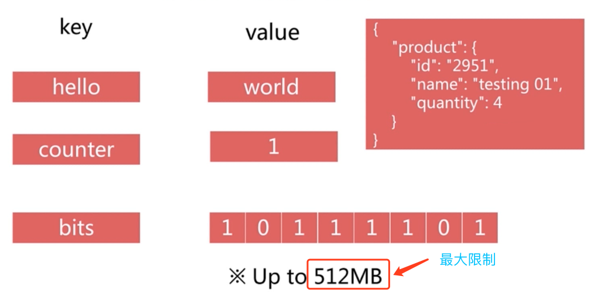
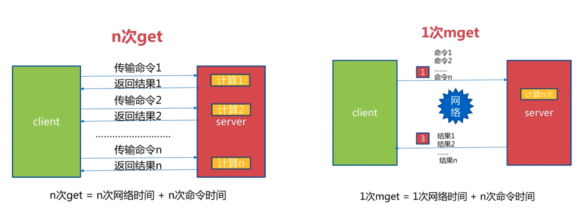

## Redis命令参考

[Redis命令参考](<http://redisdoc.com/index.html>)


## 通用命令

#### keys

> Keys * 
>
> 遍历所有key

```shell
127.0.0.1:6379> set hello world
OK
127.0.0.1:6379> set java good
OK
127.0.0.1:6379> set golang best
OK
127.0.0.1:6379> keys *
1) "golang"
2) "java"
3) "hello"
127.0.0.1:6379> dbsize
(integer) 3
```


> keys [pattern]
>
> 遍历所有符合匹配条件的key

```shell
127.0.0.1:6379> mset hello world hehe haha php good phe his
OK
127.0.0.1:6379> keys *
1) "java"
2) "phe"
3) "hello"
4) "hehe"
5) "golang"
6) "php"
127.0.0.1:6379> keys he*
1) "hello"
2) "hehe"
127.0.0.1:6379> keys he[h-l]*
1) "hello"
2) "hehe"
127.0.0.1:6379> keys ph?
1) "phe"
2) "php"
```


​	keys 命令一般不在生产环境中使用，keys 命令是一个 O(n) 复杂度的操作，当数据量比较大的时候就会比较慢，并且 redis 之前提到过是单线程的，就容易阻塞其他命令。


#### dbsize

>  dbsize
>
> 计算key的总数

```shell
127.0.0.1:6379> keys *
1) "java"
2) "phe"
3) "hello"
4) "hehe"
5) "golang"
6) "php"
127.0.0.1:6379> dbsize
(integer) 6
```


#### exists key

>  exists key 
>
> 检查key是否存在

```sh
127.0.0.1:6379> exists golang
(integer) 1
127.0.0.1:6379> get golang
"best"
127.0.0.1:6379> del golang
(integer) 1
127.0.0.1:6379> exists golang
(integer) 0
127.0.0.1:6379> get golang
(nil)
127.0.0.1:6379> del golang
(integer) 0
```


#### del key [key...]

>  del key
>
> 删除指定 key-value

```sh
127.0.0.1:6379> keys *
1) "java"
2) "phe"
3) "hello"
4) "hehe"
5) "php"
127.0.0.1:6379> del java
(integer) 1
127.0.0.1:6379> get java
(nil)
127.0.0.1:6379> del phe php
(integer) 2
127.0.0.1:6379> keys *
1) "hello"
2) "hehe"
```


#### expire、ttl、persist

>  expire key seconds
>
> Key 在 seconds 秒后过期
>
> 
>
>  ttl key
>
> 查看 key 剩余的过期时间
>
> 
>
>
>  persist key
>
> 去掉 key 的过期时间

```sh
127.0.0.1:6379> keys *
1) "hello"
2) "hehe"
127.0.0.1:6379> expire hehe 20					# 设置过期时间为 20s
(integer) 1
127.0.0.1:6379> ttl hehe						
(integer) 16									# 剩余过期时间为 16s
127.0.0.1:6379> ttl hello
(integer) -1									# -1 代表 key 存在，并且没有过期时间
127.0.0.1:6379> ttl hehe
(integer) 9
127.0.0.1:6379> get hehe
"haha"
127.0.0.1:6379> ttl hehe
(integer) -2									# -2 代表 key 已经不存在了 
127.0.0.1:6379> get hehe
(nil)
127.0.0.1:6379> keys *
1) "hello"
127.0.0.1:6379> expire hello 20
(integer) 1
127.0.0.1:6379> ttl hello
(integer) 17
127.0.0.1:6379> persist hello					# 去掉过期时间
(integer) 1
127.0.0.1:6379> ttl hello
(integer) -1
```


#### type key

>  type key 
>
> 返回 key 的类型: string  hash  list  set  zset  none

```sh
127.0.0.1:6379> set a b
OK
127.0.0.1:6379> type a
string
127.0.0.1:6379> type hello
string
127.0.0.1:6379> sadd myset 1 2 3
(integer) 3
127.0.0.1:6379> type myset
set
127.0.0.1:6379> type test
none
```


#### 时间复杂度对比

| 命令   | 时间复杂度 |
| ------ | ---------- |
| keys   | O(n)       |
| dbsize | O(1)       |
| del    | O(1)       |
| exists | O(1)       |
| expire | O(1)       |
| type   | O(1)       |


## 数据结构和内部编码


**Redis 内部结构**


## 单线程

​	Redis 的单线程命令执行模型，也反应了上面提到的生产环境为什么不能使用耗时较长的命令，容易阻塞后面的命令的原因


#### 单线程为什么快？

​	其实本来单线程就快，并不是只是在Redis中使用就快。我们平时的各种编程语言中，为什么要使用多线程？是因为有了 网络IO，磁盘IO，复杂计算这些操作让线程变慢所以不得不开启多线程的方式，将这些复杂操作放到子线程去执行，从而保证主线程的顺畅。Redis​ 本身就是一个纯内存的存储服务，完全避免了上面的复杂操作问题，仅仅只有高效的内存读取，所以单线程的时候快的特点就凸显出来了。

> 纯内存
>
> 非阻塞IO
>
> 表面线程切换和竞态消耗


#### Redis使用注意事项

> 一次只运行一条命令
>
> 拒绝长（慢）命令
>
> ​		`keys`	`flushall`	`flushdb`		`show lua script`			`mutil/exec`			`operate big value(collection)`
>
> 其实有些操作不是单线程
>
> ​	`fysnc file descriptor`
>
> ​	`close file descriptor`


## 字符串类型

#### 键值结构




#### 应用场景：

​	`缓存`	`计数器` `分布式锁`    ...


#### get、set、del

```sh
127.0.0.1:6379> set hello world
OK
127.0.0.1:6379> get hello
"world"
127.0.0.1:6379> del hello
(integer) 1
```


#### incr、decr、incrby、decrby

| 命令         | 用途                                     | 时间复杂度 |
| :----------- | :--------------------------------------- | ---------- |
| incr key     | key自增1，如果key不存在自增后get(key)=1  | O(1)       |
| decr key     | key自减1，如果key不存在自减后get(key)=1  | O(1)       |
| incrby key k | key自增k，如果key不存在自增后get(key)=k  | O(1)       |
| decrby key k | key自减k，如果key不存在自减后get(key)=-k | O(1)       |

​	**演示**：

```sh
127.0.0.1:6379> get number
(nil)
127.0.0.1:6379> incr number
(integer) 1
127.0.0.1:6379> get number
"1"
127.0.0.1:6379> incr number
(integer) 2
127.0.0.1:6379> get number
"2"
127.0.0.1:6379> incrby number 88
(integer) 90
127.0.0.1:6379> get number
"90"
127.0.0.1:6379> decr number
(integer) 89
127.0.0.1:6379> decrby number 22
(integer) 67
```

​	**实战场景**：

- 网站访问计数器————》incr userid：pageview（单线程:无竞争）


- 缓存视频的基本信息————》实际内容存在mysql中

  伪代码：

  ```Java
  public VideoInfo get(long id){
      String redisKey = redisPrefix+id;
      VideoInfo videoInfo = redis.get(redisKey);
      if (videoInfo == null){
          videoInfo = mysql.get(id);
          if (videoInfo != null){
              // 序列化
              redis.set(redisKey,searlize(videoInfo));
          }
      }
  }
  ```

- 分布式 id 生成器

  

#### set、setnx、setxx

| 命令             | 用途                    | 时间复杂度 |
| ---------------- | ----------------------- | :--------- |
| set key value    | 不管key是否存在，都设置 | O(1)       |
| setnx key value  | key不存在，才设置       | O(1)       |
| set key value xx | key存在才设置           | O(1)       |

​	**演示**：

```sh
127.0.0.1:6379> exists php
(integer) 0
127.0.0.1:6379> set php good
OK
127.0.0.1:6379> setnx php bad
(integer) 0								# 已经存在 setnx 设置失败，返回0
127.0.0.1:6379> set php best xx
OK										# 已经存在 set xx 成功
127.0.0.1:6379> get php
"best"
127.0.0.1:6379> exists java
(integer) 0
127.0.0.1:6379> set java easy xx
(nil)									# 不存在 set xx 失败
127.0.0.1:6379> get java
(nil)
127.0.0.1:6379> exists lua
(integer) 0
127.0.0.1:6379> setnx lua test
(integer) 1								# 不存在 setnx 成功
127.0.0.1:6379> get lua
"test"
```


#### mget、mset

| 命令                            | 用途                 | 时间复杂度 |
| ------------------------------- | -------------------- | :--------- |
| mget key1 key2 key3...          | 批量获取key,原子操作 | O(n)       |
| mset key1 value2 key2 value2... | 批量设置key-value    | O(n)       |

​	**演示**：

```sh
127.0.0.1:6379> mset hello world java good golang best
OK
127.0.0.1:6379> mget hello java golang
1) "world"
2) "good"
3) "best"
127.0.0.1:6379> keys *
1) "golang"
2) "java"
3) "hello"
```

​	**`n次get`   vs  `1次mget`**



#### getset、append、strlen

| 命令                | 用途                              | 时间复杂度 |
| ------------------- | --------------------------------- | :--------- |
| getset key newValue | set key newValue 并返回旧的 value | O(1)       |
| append key value    | 将 value 追加到旧的 value         | O(1)       |
| strlen key          | 返回字符串的长度（注意中文）      | O(1)       |

​	**演示**：

```sh
127.0.0.1:6379> set hello world
OK
127.0.0.1:6379> getset hello golang
"world"
127.0.0.1:6379> get hello
"golang"
127.0.0.1:6379> append hello ,java
(integer) 11
127.0.0.1:6379> get hello
"golang,java"
127.0.0.1:6379> strlen hello
(integer) 11
127.0.0.1:6379>  set hello 篮球
OK
127.0.0.1:6379> get hello
"\xe7\xaf\xae\xe7\x90\x83"
127.0.0.1:6379> strlen hello
(integer) 6
```


#### incrbyfloat、getrange、setrange

| 命令                     | 用途                       | 时间复杂度 |
| ------------------------ | -------------------------- | :--------- |
| Incrbyfloat key 3.5      | 增加对应的值3.5            | O(1)       |
| getrange key start end   | 获取字符串指定下标所有的值 | O(1)       |
| setrange key index value | 设置指定下标所有对应的值   | O(1)       |

​	**实战**：

```sh
127.0.0.1:6379> incr number
(integer) 1
127.0.0.1:6379> incrbyfloat number 1.1
"2.1"
127.0.0.1:6379> get number
"2.1"
127.0.0.1:6379> set hello javagood
OK
127.0.0.1:6379> getrange hello 2 4
"vag"
127.0.0.1:6379> setrange hello 4 pd
(integer) 8
127.0.0.1:6379> get hello
"javapdod"
127.0.0.1:6379> setrange hello 5 o
(integer) 8
127.0.0.1:6379> get hello
"javapood"
```


## 哈希类型

#### 键值结构


#### 特点

- 可以看做是一个 Mapmap结构


- filed不能相同，value可以相同
- 所有的命令都是以 "h" 开头


#### hget、hset、hdel

| 命令                 | 用途                             | 时间复杂度 |
| -------------------- | -------------------------------- | :--------- |
| hget key field       | 获取 hash key 对应的field的value | O(1)       |
| hset key filed value | 设置 hash key 对应field的value   | O(1)       |
| hdel key filed       | 删除 hash key 对应field的value   | O(1)       |

​	**演示**：

```sh
127.0.0.1:6379> hset user age 23
(integer) 1
127.0.0.1:6379> hget user age
"23"
127.0.0.1:6379> hset user name kobe
(integer) 1
127.0.0.1:6379> hgetall user
1) "age"
2) "23"
3) "name"
4) "kobe"
127.0.0.1:6379> hdel user age
(integer) 1
127.0.0.1:6379> hgetall user
1) "name"
2) "kobe"
```


#### hexists、hlen

| 命令              | 用途                       | 时间复杂度 |
| ----------------- | -------------------------- | :--------- |
| hexists key field | 判断 hash key 是否有field  | O(1)       |
| hlen key          | 获取 hash key field 的数量 | O(1)       |

​	**演示**：

```sh
127.0.0.1:6379> hgetall user
1) "name"
2) "kobe"
127.0.0.1:6379> hexists user name
(integer) 1
127.0.0.1:6379> hexists user age
(integer) 0
127.0.0.1:6379> hlen user
(integer) 1
```


#### hmget、hmset

| 命令                                                    | 用途                                        | 时间复杂度 |
| ------------------------------------------------------- | ------------------------------------------- | :--------- |
| hmget key field1 field2 ..fieldN                        | 批量获取 hash key 的一批 field 对应的 value | O(n)       |
| hmset key filed1 value1 filed2 value2 ....fieldN valueN | 批量设置 hash key 的一批 field value        | O(n)       |

​	**演示**：

```sh
127.0.0.1:6379> hgetall user
1) "name"
2) "kobe"
127.0.0.1:6379> hmset user age 23 weight 170
OK
127.0.0.1:6379> hmget user name age weight
1) "kobe"
2) "23"
3) "170"
127.0.0.1:6379> hgetall user
1) "name"
2) "kobe"
3) "age"
4) "23"
5) "weight"
6) "170"
```


#### hgetall、hvals、hkeys

| 命令        | 用途                                 | 时间复杂度 |
| ----------- | ------------------------------------ | :--------- |
| hgetall key | 返回 hash key 对应所有的field和value | O(n)       |
| hvals key   | 返回 hash key 对应所有field 的value  | O(n)       |
| hkeys key   | 返回  hash key 对应所有的 field      | O(n)       |

​	**演示**：

```sh
127.0.0.1:6379> hgetall user
1) "name"
2) "kobe"
3) "age"
4) "23"
5) "weight"
6) "170"
127.0.0.1:6379> hvals user
1) "kobe"
2) "23"
3) "170"
127.0.0.1:6379> hkeys user
1) "name"
2) "age"
3) "weight"
```

​	**注意：我们Redis是单线程，所以当字段太多的时候，`hgetall` 这样的命令竟可能避免使用，导致命令的阻塞**


#### hsetnx、hincrby、hincryfloat

| 命令                               | 用途                                                         | 时间复杂度 |
| ---------------------------------- | ------------------------------------------------------------ | :--------- |
| hsetnx key field value             | 设置 hash key 对应 field 的value(如果 field 已经存在，则失败) | O(1)       |
| hincrby key field intCounter       | hash key 对应所有field 的value 自增 intCounter               | O(1)       |
| hincryfloat key field floatCounter | hincrby 浮点数版本                                           | O(1)       |

​	**演示：**

```sh
127.0.0.1:6379> hgetall user
1) "name"
2) "kobe"
3) "age"
4) "23"
5) "weight"
6) "170"
127.0.0.1:6379> hsetnx user name james
(integer) 0
127.0.0.1:6379> hsetnx user number 10
(integer) 1
127.0.0.1:6379> hgetall user
1) "name"
2) "kobe"
3) "age"
4) "23"
5) "weight"
6) "170"
7) "number"
8) "10"
127.0.0.1:6379> hincrby user number 5
(integer) 15
127.0.0.1:6379> hget user number
"15"
127.0.0.1:6379> hincrbyfloat user number 1.1
"16.1"
```


#### string vs hash


​	hash 类型可以看做是个 简单、小型的 redis。 


## 列表类型

#### 键值结构


#### 特点

- 有序
- elements 可以重复
- 左右两边可以插入、弹出元素
- 所有的命令都是以 "L" 开头


#### 增：rpush、lpush、linsert

| 命令                                     | 用途                               | 时间复杂度 |
| ---------------------------------------- | ---------------------------------- | :--------- |
| rpush key value1 value2 ... valueN       | 从列表右边插入值（1-N个）          | O(1~n)     |
| lpush key value1 value2 ... valueN       | 从列表左边插入值（1-N个）          | O(1~n)     |
| linsert key before\|after value newValue | 在列表指定的值 前\|后 插入newValue | O(n)       |

​	**演示：**

```sh
127.0.0.1:6379> rpush testList 1 2 3
(integer) 3
127.0.0.1:6379> LPUSH testList 4 5 6
(integer) 6
127.0.0.1:6379> lrange testList 0 -1			# 获取整个 list 的值
1) "6"
2) "5"
3) "4"
4) "1"
5) "2"
6) "3"
127.0.0.1:6379> lpush testList 7 8 9
(integer) 9
127.0.0.1:6379> lrange testList 0 -1
1) "9"
2) "8"
3) "7"
4) "6"
5) "5"
6) "4"
7) "1"
8) "2"
9) "3"
127.0.0.1:6379> linsert testList before 6 6.5
(integer) 10
127.0.0.1:6379> linsert testList after 6 5.5
(integer) 11
127.0.0.1:6379> lrange testList 0 -1
 1) "9"
 2) "8"
 3) "7"
 4) "6.5"
 5) "6"
 6) "5.5"
 7) "5"
 8) "4"
 9) "1"
10) "2"
11) "3"
```


#### 删：lpop、rpop、lrem、ltrim

| 命令                 | 用途                                                         | 时间复杂度 |
| -------------------- | ------------------------------------------------------------ | :--------- |
| lpop key             | 从列表左侧(队列头)弹出一个 item                              | O(1)       |
| rpop key             | 从列表右侧(队列尾)弹出一个 item                              | O(1)       |
| lrem key count value | List 类型的一个特点，就是可以存在多个重复的元素的<br />所以根据 count 值，从列表中删除所有value相等的项目<br />1、count>0，从左往右，删除最多count个value相等的项<br />2、count<0，从右往左，删除最多Math.abs(count)个value相等的项<br />3、count=0，删除所有value相等的项 | O(n)       |
| ltrim key start end  | 按照索引范围修剪列表                                         | O(n)       |

​	**演示：**

```sh
127.0.0.1:6379> lrange testList 0 -1
 1) "9"
 2) "8"
 3) "7"
 4) "6.5"
 5) "6"
 6) "5.5"
 7) "5"
 8) "4"
 9) "1"
10) "2"
11) "3"
127.0.0.1:6379> lpop testList
"9"
127.0.0.1:6379> rpop testList
"3"
127.0.0.1:6379> lpush testList 1 2 5
(integer) 12
127.0.0.1:6379> lrange testList 0 -1
 1) "5"
 2) "2"
 3) "1"
 4) "8"
 5) "7"
 6) "6.5"
 7) "6"
 8) "5.5"
 9) "5"
10) "4"
11) "1"
12) "2"
127.0.0.1:6379> lrem testList 5 1
(integer) 2
127.0.0.1:6379> lrange testList 0 -1
 1) "5"
 2) "2"
 3) "8"
 4) "7"
 5) "6.5"
 6) "6"
 7) "5.5"
 8) "5"
 9) "4"
10) "2"
127.0.0.1:6379> lrem testList 1 2
(integer) 1
127.0.0.1:6379> lrange testList 0 -1
1) "5"
2) "8"
3) "7"
4) "6.5"
5) "6"
6) "5.5"
7) "5"
8) "4"
9) "2"
127.0.0.1:6379> lrem testList 0 5
(integer) 2
127.0.0.1:6379> lrange testList 0 -1
1) "8"
2) "7"
3) "6.5"
4) "6"
5) "5.5"
6) "4"
7) "2"
127.0.0.1:6379> ltrim testList 1 -2
OK
127.0.0.1:6379> lrange testList 0 -1
1) "7"
2) "6.5"
3) "6"
4) "5.5"
5) "4"
```


#### 查：lrange、lindex

| 命令                         | 用途                                                         | 时间复杂度 |
| ---------------------------- | ------------------------------------------------------------ | :--------- |
| lrange key star end(包含end) | 获取列表指定你所营范围所有的<br />索引从左：0~n<br />索引从右：-1~-n | O(n)       |
| lindex key index             | 获取列表指定索引的item                                       | O(n)       |
| llen key                     | 获取列表的长度                                               | O(1)​       |

​	**演示：**

```sh
127.0.0.1:6379> lrange testList 0 -1
1) "7"
2) "6.5"
3) "6"
4) "5.5"
5) "4"
127.0.0.1:6379> lrange testList 0 2
1) "7"
2) "6.5"
3) "6"
127.0.0.1:6379> lrange testList 1 -2
1) "6.5"
2) "6"
3) "5.5"
127.0.0.1:6379>  lindex testList 3
"5.5"
127.0.0.1:6379>  lindex testList 2
"6"
127.0.0.1:6379> llen testList
(integer) 5
```


#### 改：lset

| 命令                    | 用途                         | 时间复杂度 |
| ----------------------- | ---------------------------- | :--------- |
| lset key index newValue | 设置列表指定索引值为newValue | O(n)       |

​	**演示：**

```sh
127.0.0.1:6379> lrange testList 0 -1
1) "7"
2) "6.5"
3) "6"
4) "5.5"
5) "4"
127.0.0.1:6379> lset testList 3 golang
OK
127.0.0.1:6379> lrange testList 0 -1
1) "7"
2) "6.5"
3) "6"
4) "golang"
5) "4"
```


#### 阻塞：blpop、brpop

| 命令              | 用途                                                         | 时间复杂度 |
| ----------------- | ------------------------------------------------------------ | :--------- |
| blpop key timeout | lpop 阻塞版本<br />列表不为空：立刻返回列表名和值，<br />列表为空：则等待timeout 秒，在此期间有值push进入则返回列表名和值，没有值进入timeout 时间到则返回 nil和等待时长，timeout=0：一直等待直到有值进入再返回 | O(1)       |
| brpop key timeout | rpop 阻塞版本<br />与上面相同，只不过从队尾弹出              | O(1)       |

​	**演示（队列不为空）：**

```sh
127.0.0.1:6379> lrange testlist 0 -1
(empty list or set)
127.0.0.1:6379> lpush testlist 1 2 4
(integer) 3
127.0.0.1:6379> blpop testlist 0
1) "testlist"
2) "4"
127.0.0.1:6379> brpop testlist 5
1) "testlist"
2) "1"
127.0.0.1:6379> lrange testlist 0 -1
1) "2"
127.0.0.1:6379> blpop testlist 5
1) "testlist"
2) "2"
```

​	**队列为空**：


#### tips

- LPUSH  +  LPOP  = Stack   				先进后出
- LPUSH  +  RPOP  = Queue                          先进先出
- LPUSH  +  LTRIM =  Capped Collection     固定数量的列表
- LPUSH  +  BRPOP =  Message Queue       消息队列


## 集合类型

#### 键值结构


#### 特点

- 无序
- 元素不可重复
- 支持集合与集合间的操作
- 所有命令都是以 "S" 开头


#### sadd、srem

| 命令             | 用途                                                    | 时间复杂度 |
| ---------------- | ------------------------------------------------------- | :--------- |
| sadd key element | 向集合key 添加 element(如果 element 已经存在，添加失败) | O(1)       |
| srem key element | 将集合 key 中的 element 移除掉                          | O(1)       |

​	**演示：**

```sh
127.0.0.1:6379> sadd testset 12
(integer) 1
127.0.0.1:6379> sadd testset 34 25 golang
(integer) 3
127.0.0.1:6379> sadd testset 12
(integer) 0
127.0.0.1:6379> srem testset 12
(integer) 1
127.0.0.1:6379> srem testset 12
(integer) 0
```


#### scard、sismember、srandmember、smembers、spop

| 命令                  | 用途                          | 时间复杂度 |
| --------------------- | ----------------------------- | :--------- |
| scard  key            | 计算集合的大小                | O(1)       |
| sismember key element | 判断element是否在集合中       | O(1)       |
| srandmember key count | 从集合中随机挑选 count 个元素 | O(1)       |
| smembers key          | 获取集合所有元素              | O(n)       |
| spop key count        | 从集合中随机弹出 count 个元素 | O(n)       |

​	**演示：**

```sh
127.0.0.1:6379> smembers testset
1) "34"
2) "25"
3) "golang"
127.0.0.1:6379> scard testset
(integer) 3
127.0.0.1:6379> sismember testset 99
(integer) 0
127.0.0.1:6379> sismember testset 25
(integer) 1
127.0.0.1:6379> srandmember testset 2
1) "34"
2) "25"
127.0.0.1:6379> srandmember testset 2
1) "34"
2) "25"
127.0.0.1:6379> srandmember testset 2
1) "34"
2) "golang"
127.0.0.1:6379> smembers testset
1) "34"
2) "25"
3) "golang"
127.0.0.1:6379> spop testset 2
1) "25"
2) "golang"
127.0.0.1:6379> smembers testset
1) "34"
```

​		**tips:**

> smembers 返回的集合是无序的，且时间复杂度是O(n)，需要谨慎使用
>
> spop相对于srandmember都是随机从集合中拿一个元素，不通的是 spop 取出后会从集合中移除这个元素


#### 集合间：sdiff、sinter、sunion

| 命令                       | 用途                                 | 时间复杂度                                                   |
| -------------------------- | ------------------------------------ | :----------------------------------------------------------- |
| sdiff  key1  key2 ... keyN | 返回key1集合与后面n-1个集合间的 差集 | O(n) <br />n是所有给定集合的成员数量之和                     |
| sinter key1 key2 ... keyN  | 返回给定集合间的 交集                | O(n*m)<br />n为给定集合当中基数最小的集合<br/>m为给定集合的个数 |
| sunion key1 key2 ...keyN   | 返回给定集合间的 并集                | O(n)<br />n是所有给定集合的成员数量之和                      |

​	**演示:**

```sh
127.0.0.1:6379> sadd test1 11 22 33 44
(integer) 4
127.0.0.1:6379> sadd test2 22 44 55 66
(integer) 4
127.0.0.1:6379> sadd test3 33 80 90
(integer) 3
127.0.0.1:6379> sdiff  test1 test2
1) "11"
2) "33"
127.0.0.1:6379> sdiff  test1 test3
1) "11"
2) "22"
3) "44"
127.0.0.1:6379> sdiff  test1 test2 test3
1) "11"
127.0.0.1:6379> sinter test1 test2
1) "22"
2) "44"
127.0.0.1:6379> sinter test1 test3
1) "33"
127.0.0.1:6379> sinter test1 test2 test3
(empty list or set)
127.0.0.1:6379> sunion test1 test2
1) "11"
2) "22"
3) "33"
4) "44"
5) "55"
6) "66"
127.0.0.1:6379> sunion test1 test3
1) "11"
2) "22"
3) "33"
4) "44"
5) "80"
6) "90"
127.0.0.1:6379> sunion test1 test2 test3
1) "11"
2) "22"
3) "33"
4) "44"
5) "55"
6) "66"
7) "80"
8) "90"

```


#### tips

- sadd	—————> 实战中标签（Tagging）的应用
- spop/srandmember	—————> 实战中取随机数 （Random item）
- sadd + sinter 	—————> 实战中共同社交朋友圈之类的应用


## 有序集合类型

####  键值结构


#### 特点：

|   类型   | 是否有序 | 元素是否可重复 |     元素      | 命令首字母 |
| :------: | :------: | :------------: | :-----------: | :--------: |
|   列表   |   yes    |      yes       |    element    |     L      |
|   集合   |    no    |       no       |    element    |     S      |
| 有序集合 |   yes    |       no       | element+score |     Z      |


#### 基本操作：zadd、zrem、zcard、zincrby、zscore、zrank

| 命令                           | 用途                  | 时间复杂度 |
| ------------------------------ | --------------------- | :--------- |
| zadd key score element         | 添加 score 和 element | O(logN)    |
| zrem key element               | 删除元素              | O(1)       |
| zscore                         | 返回元素的分数 score  | O(1)       |
| zincrby key increScore element | 增加或减少元素的分数  | O(1)       |
| zcard key                      | 返回元素的总个数      | O(1)       |
| zrank key element              | 返回元素在有序中排名  | O(log(N))  |

​	**演示：**

```sh
127.0.0.1:6379> del test1 test2 test3
(integer) 3
127.0.0.1:6379> zadd testz1 11 kobe 22 joardan
(integer) 2
127.0.0.1:6379> zrange testz1 0 -1
1) "kobe"
2) "joardan"
127.0.0.1:6379> zadd testz1 15 james
(integer) 1
127.0.0.1:6379> zrange testz1 0 -1 withscores
1) "kobe"
2) "11"
3) "james"
4) "15"
5) "joardan"
6) "22"
127.0.0.1:6379> zrem testz1 james
(integer) 1
127.0.0.1:6379> zrange testz1 0 -1 withscores
1) "kobe"
2) "11"
3) "joardan"
4) "22"
127.0.0.1:6379> zscore testz1 kobe
"11"
127.0.0.1:6379> zincrby testz1 4 kobe
"15"
127.0.0.1:6379> zrange testz1 0 -1 withscores
1) "kobe"
2) "15"
3) "joardan"
4) "22"
127.0.0.1:6379> zincrby testz1 -2 kobe
"13"
127.0.0.1:6379> zcard testz1
(integer) 2
127.0.0.1:6379> zrank testz1 joardan
(integer) 1
127.0.0.1:6379> zrank testz1 kobe
(integer) 0
```


#### 范围操作：zrange、zrangebyscore、zcount、zremrangebyrank、zremrangebyscore

| 命令                                             | 用途                                       | 时间复杂度  |
| ------------------------------------------------ | ------------------------------------------ | :---------- |
| zrange key start end [WITHSCORES]                | 返回指定缩影范围内的升序元素[是否展示分值] | O(log(n)-m) |
| zrangebyscore key minScore maxScore [WITHSCORES] | 返回指定分数范围内的升序元素[是否展示分值] | O(log(n)-m) |
| zcount key minScore maxScore                     | 返回有序集合符合指定分数范围内的个数       | O(log(n)-m) |
| zremrangebyrank key star end                     | 删除指定排名内的升序元素                   | O(log(n)-m) |
| zremrangebyscore key minScore maxScore           | 删除指定分数内的升序元素                   | O(log(n)-m) |

​	**演示：**

```sh
127.0.0.1:6379> zadd testz1 45 tom 77 mike 230 tt 148 3bangz
(integer) 4
127.0.0.1:6379> zrange testz1 0 -1 withscores
 1) "kobe"
 2) "13"
 3) "joardan"
 4) "22"
 5) "tom"
 6) "45"
 7) "mike"
 8) "77"
 9) "3bangz"
10) "148"
11) "tt"
12) "230"
127.0.0.1:6379> zrangebyscore testz1 15 80 withscores
1) "joardan"
2) "22"
3) "tom"
4) "45"
5) "mike"
6) "77"
127.0.0.1:6379> zcount testz1 15 80
(integer) 3
127.0.0.1:6379> zrange testz1 0 -1 withscores
 1) "kobe"
 2) "13"
 3) "joardan"
 4) "22"
 5) "tom"
 6) "45"
 7) "mike"
 8) "77"
 9) "3bangz"
10) "148"
11) "tt"
12) "230"
127.0.0.1:6379> zremrangebyrank testz1 2 4
(integer) 3
127.0.0.1:6379> zrange testz1 0 -1 withscores
1) "kobe"
2) "13"
3) "joardan"
4) "22"
5) "tt"
6) "230"
127.0.0.1:6379> zremrangebyscore testz1 15 25
(integer) 1
127.0.0.1:6379> zrange testz1 0 -1 withscores
1) "kobe"
2) "13"
3) "tt"
4) "230"
```


#### 集合间操作：zunionstore、zinterstore

​	略...


## Redis Go 客户端使用

- 导入第三方包"github.com/garyburd/redigo/redis"

```go
// Redis 链接池
var RedisConn *redis.Pool

func Setup() error {
	RedisConn = &redis.Pool{
		MaxIdle:     setting.RedisSetting.MaxIdle,     //最大空闲连接数
		MaxActive:   setting.RedisSetting.MaxActive,   //在给定时间内，允许分配的最大连接数（当为零时，没有限制）
		IdleTimeout: setting.RedisSetting.IdleTimeout, //在给定时间内将会保持空闲状态，若到达时间限制则关闭连接（当为零时，没有限制）
		//提供创建和配置应用程序连接的一个函数
		Dial: func() (conn redis.Conn, e error) {
			//1.创建连接
			c, e := redis.Dial("tcp", setting.RedisSetting.Host)
			if e != nil {
				return nil, e
			}

			//2.访问认证
			if setting.RedisSetting.Password != "" {
				// 如果没有设置密码不用执行这句话
				if _, e = c.Do("AUTH", setting.RedisSetting.Password); e != nil {
					c.Close()
					return nil, e
				}
			}
			return c, e
		},
		// 每分钟去检测一下 redis 链接状况.如果出错了 redis 会自动关闭 shutdown
		TestOnBorrow: func(c redis.Conn, t time.Time) error {
			if time.Since(t) < time.Minute {
				return nil
			}
			_, err := c.Do("PING")
			return err
		},
	}

	return nil
}

func Set(key string, data interface{}, time int) error {
	conn := RedisConn.Get()
	defer conn.Close()

	value, e := json.Marshal(data)

	if e != nil {
		return e
	}

	_, e = conn.Do("SET", key, value)
	if e != nil {
		return e
	}

	_, e = conn.Do("EXPIRE", key, time)
	if e != nil {
		return e
	}
	return nil
}

func Exists(key string) bool {
	conn := RedisConn.Get()
	defer conn.Close()

	exists, e := redis.Bool(conn.Do("EXISTS", key))
	if e != nil {
		return false
	}
	return exists
}

func Get(key string) ([]byte, error) {
	conn := RedisConn.Get()
	defer conn.Close()

	reply, e := redis.Bytes(conn.Do("GET", key))
	if e != nil {
		return nil, e
	}
	return reply, nil
}
```

