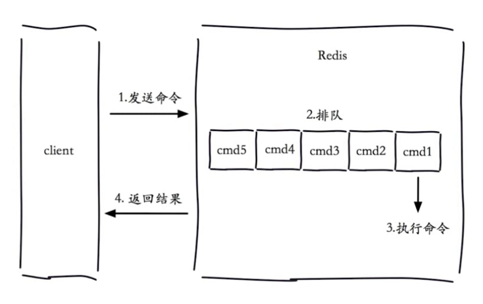
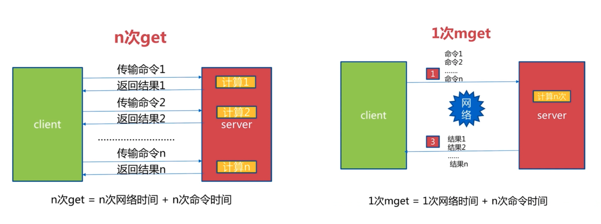
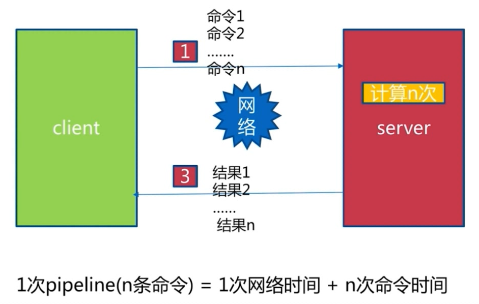
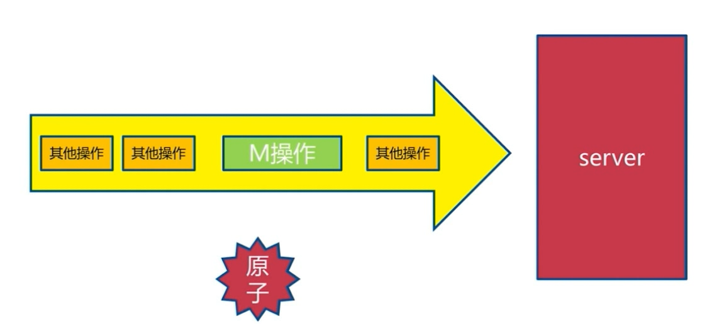
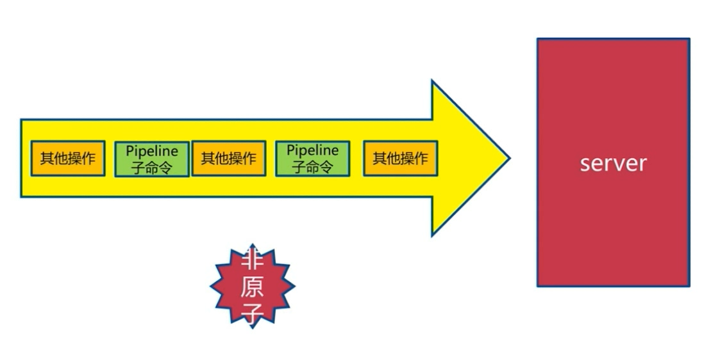
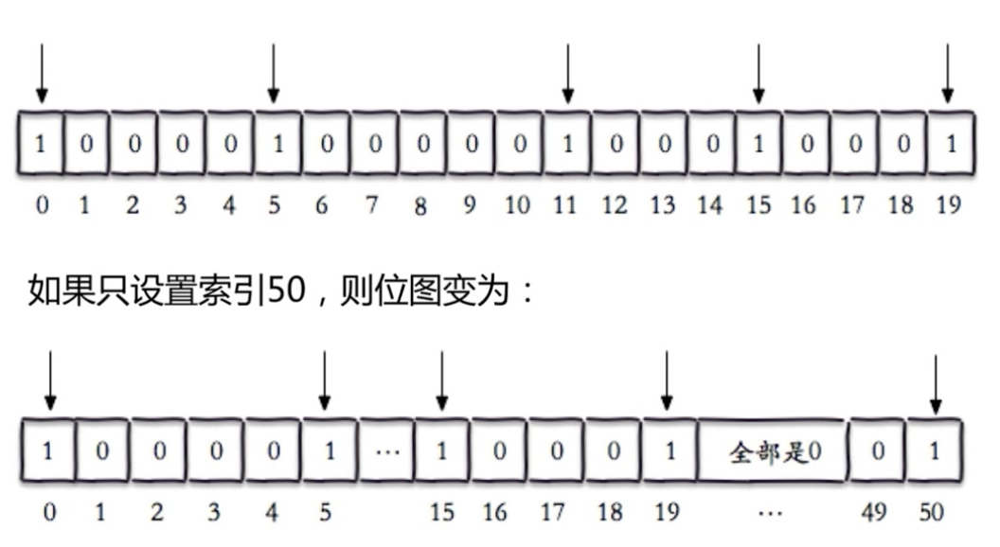
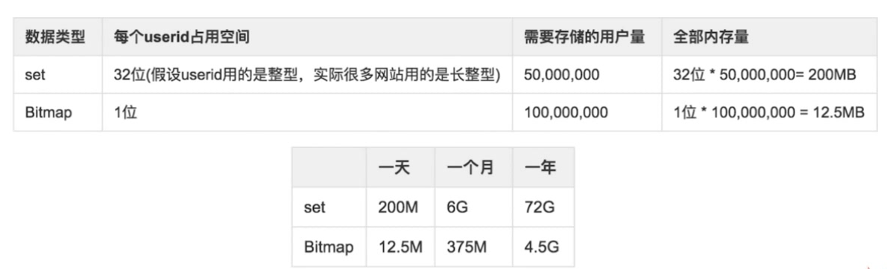
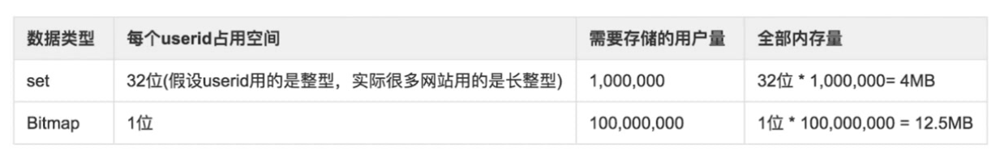
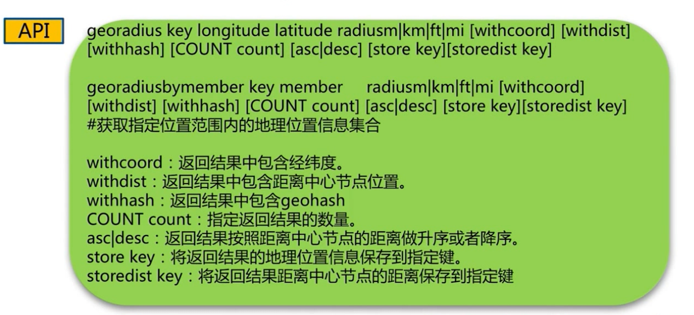

## 慢查询

###   命令执行的生命周期



**tips：**

> 慢查询发生在第三阶段，主要是指执行命令消耗的时间，不包括网络传输，排队等消耗的时间。
>
> 客户端超时不一定慢查询，但慢查询是客户端超时的一个可能因素。


### 慢查询记录两个配置 

### slowlog-max-len

> 先进先出
>
> 固定长度，如果超出先删除旧的再添加新的
>
> 保存在内存内
>
> 指定服务器最多保存多少条慢查询日志。


### slowlog-log-slower-than

> 慢查询阈值（单位：微秒)
>
> slowlog-log-slower-than=0，记录所有命令
>
> slowlog-log-slower-than<0，不记录任何命令
>
> 指定执行时间超过阈值的执行命令会被记录在日志上。


### 配置方法

#### 1.默认值 

> config get slowlog-max-len
>
> config get slowlog-log-slower-than

```sh
127.0.0.1:6379> config get slowlog-max-len
1) "slowlog-max-len"
2) "128"
127.0.0.1:6379> config get slowlog-log-slower-than
1) "slowlog-log-slower-than"
2) "10000"
```


#### 2.更改配置值

方式一：修改配置文件重启（不建议使用，毕竟线上环境的话重启不是那么方便）

方式二：动态配置

> config set slowlog-max-len
>
> config set slowlog-log-slower-than

```sh
127.0.0.1:6379> config set slowlog-max-len 1000 
OK
127.0.0.1:6379> config set slowlog-log-slower-than 1111
OK
127.0.0.1:6379> config get slowlog-max-len
1) "slowlog-max-len"
2) "1000"
127.0.0.1:6379> config get slowlog-log-slower-than
1) "slowlog-log-slower-than"
2) "1111"
```


### 慢查询命令

| 命令            | 用途               |
| --------------- | ------------------ |
| slowlog get [n] | 获取慢查询队列     |
| slowlog len     | 获取慢查询队列长度 |
| slowlog reset   | 清空慢查询队列     |

```sh
127.0.0.1:6379> slowlog get
(empty list or set)
127.0.0.1:6379> slowlog len
(integer) 0
# 配置记录所有命令
127.0.0.1:6379> config set slowlog-log-slower-than 0
OK
127.0.0.1:6379> keys *
1) "testz1"
127.0.0.1:6379> ZCARD testz1
(integer) 2
127.0.0.1:6379> zrange testz1 0 -1
1) "kobe"
2) "tt"
127.0.0.1:6379> slowlog get
1) 1) (integer) 3							# 日志的唯一标识符(uid)
   2) (integer) 1575657815					# 命令执行的 UNIX 时间戳
   3) (integer) 7							# 命令执行的时长，以微秒计算
   4) 1) "zrange"							# 命令以及命令参数
      2) "testz1"
      3) "0"
      4) "-1"
   5) "127.0.0.1:43080"
   6) ""
2) 1) (integer) 2
   2) (integer) 1575657802
   3) (integer) 5
   4) 1) "ZCARD"
      2) "testz1"
   5) "127.0.0.1:43080"
   6) ""
3) 1) (integer) 1
   2) (integer) 1575657777
   3) (integer) 10
   4) 1) "keys"
      2) "*"
   5) "127.0.0.1:43080"
   6) ""
4) 1) (integer) 0
   2) (integer) 1575657769
   3) (integer) 5
   4) 1) "config"
      2) "set"
      3) "slowlog-log-slower-than"
      4) "0"
   5) "127.0.0.1:43080"
   6) ""
127.0.0.1:6379> slowlog len
(integer) 5									# 这里之所以是 5。是因为 showlog get 也算在内
```


### 运维经验

> slowlog-max-len 不要设置过小，通常设置1000左右
>
> slowlog-log-slower-than 不要设置过大，默认 10 ms，通常设置 1ms
>
> 理解生命周期
>
> 定期持久化慢查询，保存旧数据便于分析。


## pipeline

### 什么是流水线

​	借用之前 `n次get`   vs  `1次mget` 的一张图，



​	pipeline就是mget的加强版。加强的在于这里是批量打包一堆可以是不同的命令，然后计算结果批量返回。但是只使用一次网络的时间




| 命令                 | 时间               | 数据量       |
| -------------------- | ------------------ | ------------ |
| n个命令操作          | n次网络 +  n次命令 | 每次一条命令 |
| 1次pipeline(n个命令) | 1次网络 +  n次命令 | 每次n条命令  |

### 与原生M操作的区别

​	m操作是原子操作



​	pipeline 是非原子操作



### 使用建议

> 注意控制好每次 pipeline 携带命令数据量
>
> pipeline每次只能作用在一个redis节点上（相对于集群来说的）
>
> 原生M操作与pipeline的区别 


## 发布订阅

#### 发布命令 publish

> publish channel message
>
> (integer) n  # 返回订阅个数
>
> 负责向一个频道发送一条消息


#### 订阅命令 subscribe

> subscribe [channel]  # 一个或多个
>
> 1) "subscribe"
>
> 2) "t1"			# 频道名称
>
> 3) (integer) 1		
>
> 1) "subscribe"
>
> 2) "t2"
>
> 3) (integer) 2

#### 

#### 其他API

| 命令                        | 用途                       |
| --------------------------- | -------------------------- |
| psubscribe [pattern...]     | 订阅所有符合匹配条件的频道 |
| punsubscribe [pattern...]   | 退订所有符合匹配条件的频道 |
| pubsub  channels            | 列出至少有一个订阅者的频道 |
| pubsub  numsub [channel...] | 列出给定频道的订阅者数量   |
| pubsub  numpat              | 列出被订阅模式的数量       |


#### 演示


##### 发布者

```sh
127.0.0.1:6379> pubsub channels				
1) "t3"
2) "t1"
3) "t2"
127.0.0.1:6379> pubsub numsub t1 t2 t3
1) "t1"
2) (integer) 2
3) "t2"
4) (integer) 3
5) "t3"
6) (integer) 2
127.0.0.1:6379> pubsub numpat
(integer) 2
127.0.0.1:6379> publish t1 11
(integer) 3
127.0.0.1:6379> publish t2 22
(integer) 5
127.0.0.1:6379> publish t3 3333
(integer) 3
```


##### 订阅者

###### 订阅模式匹配规则： t* *2

```sh
127.0.0.1:6379> PSUBSCRIBE t* *2
Reading messages... (press Ctrl-C to quit)
1) "psubscribe"
2) "t*"
3) (integer) 1
1) "psubscribe"
2) "*2"
3) (integer) 2
1) "pmessage"
2) "t*"
3) "t1"
4) "11"
1) "pmessage"						# t2 满足 t* *2 所以这里一条消息能收到两次
2) "t*"
3) "t2"
4) "22"
1) "pmessage"
2) "*2"
3) "t2"
4) "22"
1) "pmessage"
2) "t*"
3) "t3"
4) "3333"
```

###### 订阅频道：t1 t2 t3

```sh
127.0.0.1:6379> SUBSCRIBE t1 t2 t3
Reading messages... (press Ctrl-C to quit)
1) "subscribe"
2) "t1"
3) (integer) 1
1) "subscribe"
2) "t2"
3) (integer) 2
1) "subscribe"
2) "t3"
3) (integer) 3
1) "message"
2) "t1"
3) "11"
1) "message"
2) "t2"
3) "22"
1) "message"
2) "t3"
3) "3333"
```

###### 订阅频道：t1 t2 

```sh
127.0.0.1:6379> SUBSCRIBE t1 t2
Reading messages... (press Ctrl-C to quit)
1) "subscribe"
2) "t1"
3) (integer) 1
1) "subscribe"
2) "t2"
3) (integer) 2
1) "message"
2) "t1"
3) "11"
1) "message"
2) "t2"
3) "22"
```

###### 订阅频道：t2 t3

```sh
127.0.0.1:6379> SUBSCRIBE t2 t3
Reading messages... (press Ctrl-C to quit)
1) "subscribe"
2) "t2"
3) (integer) 1
1) "subscribe"
2) "t3"
3) (integer) 2
1) "message"
2) "t2"
3) "22"
1) "message"
2) "t3"
3) "3333"
```


## bitmap 

### BitMap是什么

> ​	通过一个bit位来表示某个元素对应的值或者状态,其中的key就是对应元素本身。**Bitmaps 本身不是一种数据结构，实际上它就是字符串，但是它可以对字符串的位进行操作**。 Bitmaps 单独提供了一套命令，所以在 Redis 中使用 Bitmaps 和使用字符串的方法不太相同。可以把 Bitmaps 想象成一个以 位 为单位的数组，数组的每个单元只能存储 0 和 1，数组的下标在Bitmaps中叫做偏移量


### setbit、getbit

| 命令                    | 用途                  |
| ----------------------- | --------------------- |
| setbit key offset value | 给位图指定索引 设置值 |
| getbit key offset       | 获取位图指定索引的值  |


​	首先来看一个例子，字符串big，

```
字母b的ASCII码为98，转换成二进制为 01100010
字母i的ASCII码为105，转换成二进制为 01101001
字母g的ASCII码为103，转换成二进制为 01100111
```

​	如果在Redis中，设置一个key，其值为big，此时`可以get到big这个值`，也可以`获取到 big的ASCII码每一个位对应的值，也就是0或1`

```sh
127.0.0.1:6379> set hello big
OK
127.0.0.1:6379> keys *
1) "hello"
127.0.0.1:6379> type hello			
string
127.0.0.1:6379> getbit hello 9
(integer) 1
127.0.0.1:6379> getbit hello 1
(integer) 1
127.0.0.1:6379> getbit hello 0
(integer) 0
127.0.0.1:6379> setbit hello 7 1
(integer) 0
127.0.0.1:6379> get hello
"cig"
127.0.0.1:6379> setbit hello 7 0
(integer) 1
127.0.0.1:6379> get hello
"big"
127.0.0.1:6379> setbit hello 50 1		# 设置索引超过长度，中间的都是用0补位  
(integer) 0
127.0.0.1:6379> getbit hello
(error) ERR wrong number of arguments for 'getbit' command
127.0.0.1:6379> get hello
"big\x00\x00\x00 "
127.0.0.1:6379> setbit hellobig 0 1
(integer) 0
127.0.0.1:6379> setbit hellobig 5 1
(integer) 0
127.0.0.1:6379> getbit hellobig 0
(integer) 1
127.0.0.1:6379> getbit hellobig 1
(integer) 0
127.0.0.1:6379> getbit hellobig 5
(integer) 1
127.0.0.1:6379> getbit hellobig 4
(integer) 0
```




### bitcount

| 命令                     | 用途                                                         |
| ------------------------ | ------------------------------------------------------------ |
| bitcount key [start end] | 获取位图指定范围(start到end，单位为 `字节`，<br />如果不指定就是获取全部)位值为1的数 |

```sh
# bbb 对应的二进制 01100010|01100010|01100010
127.0.0.1:6379> set test bbb
OK
127.0.0.1:6379> get test
"bbb"
127.0.0.1:6379> bitcount test
(integer) 9
127.0.0.1:6379> bitcount test 0 1     # 获取的是前两个字节 b 中二进制里面值为 1 的个数
(integer) 6
127.0.0.1:6379> bitcount test 1 1
(integer) 3
127.0.0.1:6379> bitcount test 0 3
(integer) 9
127.0.0.1:6379> bitcount test -1 2
(integer) 3
```


### bitop、bitpos

| 命令                              | 用途                                                         |
| --------------------------------- | ------------------------------------------------------------ |
| bitop op destkey key [key...]     | 做多个bitmap的 and(交集)、or(并集)、not(非)、xor(异或)<br />并将结果保存在 destkey 中 |
| bitpos key targeBit [start] [end] | 计算位图指定范围(start到end，单位为 `字节`，如果不指定就<br />是获取全部)第一个偏移量对应的值等于 targetBit的位置 |

```sh
127.0.0.1:6379> bitop or test:result test test1
(integer) 3
127.0.0.1:6379> bitop and test:and test test1
(integer) 3
127.0.0.1:6379> keys *
1) "test:and"
2) "test:result"
3) "test1"
4) "test"
127.0.0.1:6379> get test:result
"bkg"
127.0.0.1:6379> get test:and
"b`b"
127.0.0.1:6379> get test
"bbb"
127.0.0.1:6379> get test1
"big"
127.0.0.1:6379> bitpos test:result 1
(integer) 1
127.0.0.1:6379> bitpos test:result 1 0 1
(integer) 1
127.0.0.1:6379> bitpos test:result 1 1 2
(integer) 9
127.0.0.1:6379> bitpos test:result 1 1 3
(integer) 9
127.0.0.1:6379> bitpos test:result 1 0 3
(integer) 1
```


### Set  vs  Bitmap

[**Redis-位图为何能存亿级数据**](<https://juejin.im/entry/5ba4971c5188255c5c45ed6b>)

​	当数据是5千万



​	当数据是10万




### 使用经验

> type=string，最大512MB
>
> 注意 setbit 时的偏移量，可能又较大耗时（不够的时候全部会自动补0）
>
> 位图不是绝对好，通过set vs bitmap 可以看出还是要看数据量大小来定


## HyperLogLog

​	[HyperLogLog 算法的原理讲解以及 Redis 是如何应用它的](<https://juejin.im/post/5c7900bf518825407c7eafd0>)

​	[走近源码：神奇的HyperLogLog](<https://zhuanlan.zhihu.com/p/58519480>)

> 基于 HyperLogLog算法：极小空间完成独立数量统计
>
> 本质还是字符串。


### pfadd、pfcount、pfmerge

| 命令                                     | 用途                        |
| ---------------------------------------- | --------------------------- |
| pfadd key element [element...]           | 向 hyperloglog 添加元素     |
| pfcount key [key...]                     | 计算 hyperloglog 的独立总数 |
| pfmerge destkey sourcekey [sourcekey...] | 合并多个 hyperloglog        |

```sh
127.0.0.1:6379> pfadd testlog 1 2 3
(integer) 1
127.0.0.1:6379> keys *
1) "testlog"
127.0.0.1:6379> type testlog
string
127.0.0.1:6379> get testlog
"HYLL\x01\x00\x00\x00\x00\x00\x00\x00\x00\x00\x00\x80]f\x80Mt\x80Q,\x8cC\xf3"
127.0.0.1:6379> pfadd testlog 3 4 5
(integer) 1
127.0.0.1:6379> pfcount testcount
(integer) 0
127.0.0.1:6379> pfcount testlog
(integer) 5
127.0.0.1:6379> pfadd testlog2 4 5 6
(integer) 1
127.0.0.1:6379> pfcount testlog2
(integer) 3
127.0.0.1:6379> pfmerge test:result testlog testlog2
OK
127.0.0.1:6379> pfcount test:result
(integer) 6
```

### 使用经验

> 是否能容忍错误？（错误率：0.81%）误差可以被设置 `辅助计算因子` 进行降低。
>
> 是否需要单条数据？


## GEO

 	GEO(地理信息定位)：存储经纬度，计算两地距离，范围计算等


### geoadd、geopos

| 命令                                                         | 用途                                                       |
| ------------------------------------------------------------ | ---------------------------------------------------------- |
| geoadd key logitude latitude member [logitude latitude member] | 增加地址位置信息 logitude:经度 latitude:纬度   member:标识 |
| geopos key member [member ...]                               | 获取地理位置信息                                           |

```sh
127.0.0.1:6379> geoadd cities 116.28 39.55 beijing
(integer) 1
127.0.0.1:6379> geoadd cities 116.28 39.55 beijing
(integer) 0
127.0.0.1:6379> geopos cities beijing
1) 1) "116.28000229597091675"
   2) "39.5500007245470826"
127.0.0.1:6379> geopos cities tianjing
1) (nil)
127.0.0.1:6379> keys *
1) "cities"
127.0.0.1:6379> type cities
zset
```


### geodist、georadius

| 命令                                | 用途                                                         |
| ----------------------------------- | ------------------------------------------------------------ |
| geodist key member1 member2 [unnit] | 获取两个地址位置的距离<br />unit：m(米)、km(千米)、mi(英里)、ft(尺) |
| georadius     # 看下图              |                                                              |



```sh
127.0.0.1:6379> geoadd cities 115.3 23.4 tianjin
(integer) 1
127.0.0.1:6379> zcard cities
(integer) 2
127.0.0.1:6379> zrange cities 0 -1
1) "tianjin"
2) "beijing"
127.0.0.1:6379> zrange cities 0 -1 withscores
1) "tianjin"
2) "4046730995297378"
3) "beijing"
4) "4069140618056030"
127.0.0.1:6379> geodist cities tianjin beijing km
"1798.6749"
```


### 相关说明

> 3.2+版本后才有
>
> type geokey = zset   数据类型
>
> 没有删除api，单以为是 zset 数据类型真需要删除可以使用  zrem key member 命令