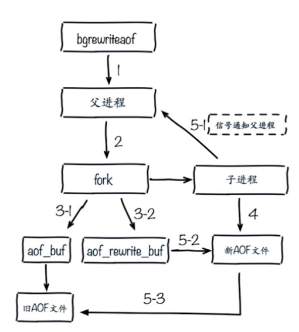

##  什么是持久化

​	redis 所有数据都是保存在内存中，对数据的更新将异步地保存到本地硬盘上。


## 持久化的方式


## RDB

### 什么是RDB

​	RDB 将Redis 内存的快照（snapshot）以二进制的方式保存在磁盘中


### 触发机制-主要三种方式 

#### save(同步)


| 文件策略                      | 复杂度 |
| ----------------------------- | ------ |
| 如果存在老的RDB文件，新替换老 | O(N)   |


#### bgsave(异步)


| 文件策略                      | 复杂度 |
| ----------------------------- | ------ |
| 如果存在老的RDB文件，新替换老 | O(N)   |


#### save   vs  bgsave

| 命令   | IO类型 | 阻塞？                   | 复杂度 | 优点             | 缺点               |
| ------ | ------ | ------------------------ | ------ | ---------------- | ------------------ |
| sava   | 同步   | 是                       | O(n)   | 不会消耗额外内存 | 阻塞客户端命令     |
| bgsave | 异步   | 是(阻塞发生在fork进程时) | O(n)   | 不阻塞客户端命令 | 需要fork，消耗内存 |


#### 自动-配置文件

​	根据配置文件所配置的触发条件，自动的通过创建 bgsave 命令去持久化


​	redis-6379.conf

```sh
# ....
daemonize yes
pidfile /var/run/redis-6379.pid
port 6379
tcp-backlog 511
timeout 0
tcp-keepalive 0
loglevel notice
logfile "6379.log"
databases 16

# 通常是不使用默认的条件
# save 900 1
# save 300 10
# save 60 10000

stop-writes-on-bgsave-error yes
rdbcompression yes
rdbchecksum yes
# 修改持久化文件 rdb 文件名
dbfilename dump-6379.rdb	
# 指定文件路径
dir /opt/soft/redis/data
# .....
```


#### 触发机制-不容忽略方式

> 全量复制（并没有执行任何命令，但是在主从复制的时候，也会产生相应的 rdb 文件
>
> debug -reload
>
> shutdown


### RDB总结

> RDB 是 Redis 内存到硬盘的快照，用于持久化。
>
> save 通常会阻塞 Redis。
>
> bgsave 不会阻塞 Redis。但是会 fork 新进程。
>
> save 自动配置满足任一条件就会被执行。但是通常我们不使用默认配置
>
> 有些触发机制不容忽视


## AOF

###  RDB现存问题

> 耗时、耗性能
>
> 
>
> 
>
> 不可控、丢失数据
>
> 


### 什么是AOF

​	[AOF-Redis 设计与实现](<https://redisbook.readthedocs.io/en/latest/internal/aof.html>)，详细准确知识还是看这个链接的比较好 

​	AOF 以协议文本的方式，将所有对Redis内存数据进行写入的命令（及参数）记录到AOF文件，以此达到记录数据库状态的目的， 为了方便起见， 我们称呼这种记录过程为同步。


​	

​	数据恢复


### AOF三种策略

#### always


#### everysec


#### no


#### 三种策略比较

| 模式                 | WRITE 是否阻塞？ | SAVE 是否阻塞？ | 停机时丢失的数据量                                    |
| :------------------- | :--------------: | :-------------: | ----------------------------------------------------- |
| `AOF_FSYNC_NO`       |       阻塞       |      阻塞       | 操作系统最后一次对 AOF 文件触发 SAVE 操作之后的数据。 |
| `AOF_FSYNC_EVERYSEC` |       阻塞       |     不阻塞      | 一般情况下不超过 2 秒钟的数据。                       |
| `AOF_FSYNC_ALWAYS`   |       阻塞       |      阻塞       | 最多只丢失一个命令的数据。                            |


### AOF重写

​	AOF 文件通过同步 Redis 服务器所执行的命令， 从而实现了数据库状态的记录， 但是， 这种同步方式会造成一个问题： 随着运行时间的流逝， AOF 文件会变得越来越大。另一方面， 有些被频繁操作的键， 对它们所调用的命令可能有成百上千、甚至上万条， 如果这样被频繁操作的键有很多的话， AOF 文件的体积就会急速膨胀， 对 Redis 、甚至整个系统的造成影响。

​	为了解决以上的问题， Redis 需要对 AOF 文件进行重写（rewrite）： 创建一个新的 AOF 文件来代替原有的 AOF 文件， 新 AOF 文件和原有 AOF 文件保存的数据库状态完全一样， 但新 AOF 文件的体积小于等于原有 AOF 文件的体积。


#### 作用

> 减少磁盘占用，(看上图的示例这里我理解为对执行命令的优化，合并减少不必要的命令记录)
>
> 加速恢复速度


#### 两种方式

##### bgrewriteaof 命令


##### AOF重写配置

` 配置`

| 配置名                      | 含义                                                         |
| --------------------------- | ------------------------------------------------------------ |
| auto-aof-rewrite-min-size   | AOF文件重写需要的尺寸，达到多大开始出发重写                  |
| auto-aof-rewrite-percentage | AOF文件增长率，(已经触发重写，下一次重写需要增长达到什么程度) |

`统计`

| 统计名           | 含义                                  |
| ---------------- | ------------------------------------- |
| aof_current_size | 实时记录AOF当前尺寸（单位：字节）     |
| aof_base_size    | AOF上次启动和重写的尺寸（单位：字节） |

自动触发时机，需要同时满足如下条件

- `aof_current_size` > `auto-aof-rewrite-min-size`
- `aof_current_size` -`aof_base_size` > `auto-aof-rewrite-percentage`


##### AOF重写流程



##### 配置文件

```sh
appendonly yes
appendfilename 	"appendonly-${port}.aof"		# 类似RDB配置对应的文件名
appendfsync	everysec							# 设置三种策略中选择哪种
dir /bigdiskpath								# 设置aof的文件路径
no-appendfsync-no-rewrute yes
auto-aof-rewrite-percentage	100					# 增长率
auto-aof-rewrite-min-size 64mb					# 触发重写的最大值
.....
```


## 两者比较

| 命令 | 启动优先级 | 体积 | 恢复速度 | 数据安全性   | 轻重 |
| ---- | ---------- | ---- | -------- | ------------ | ---- |
| RDB  | 低         | 小   | 快       | 丢数据       | 重   |
| AOF  | 高         | 大   | 慢       | 根据策略决定 | 轻   |

