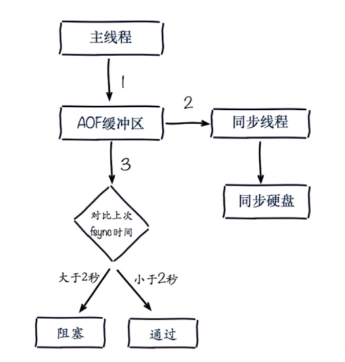

## fork操作


> 它是一个同步操作
>
> 与内存量息息相关：内存越大，耗时越长（与机器类型有关）
>
> info：lates_fork_usec			#上一次执行 fork 操作所消耗的时间（单位：微秒）

### 改善fork

> 优先使用物理机或者高效支持 fork 操作的虚拟化技术
>
> 控制 Redis 实例最大可用内存：maxmemory
>
> 合理配置 Linux 内存分配策略：vm.overcommit_memory=1
>
> 降低 fork 频率：例如放宽 AOF 重写自动触发时机，不必要的全量复制


## 子进程开销和优化

-  CPU

> 开销：RDB 和 AOF 文件生成，属于 CPU 密集型
>
> 优化：不做 CPU 绑定，不和 CPU 密集型应用一起部署

- 内存

> 开销：fork 内存开销，copy-on-write
>
> 优化：echo never  > /sys/kernel/mm/transparent_hugepage/enabled

- 硬盘

> 开销：AOF 和 RDB 文件写入，可以结合 iostat, iotop 分析
>
> 优化：不要喝高硬盘负载服务部署在一起：存储服务、消息队列等
>
> ​	    no-appendfsync-on-rewrite = yes
>
> ​	    根据写入量决定磁盘类型：例如 ssd
>
> ​	    单机多实例持久化文件目录可以考虑分盘 


## AOF追加阻塞



### 阻塞定位

​	查看Redis日志：


​	info persistence 命令

```
127.0.0.1:6379> INFO persistence
# Persistence
loading:0
...
...
aof_delayed_fsync:100			# 记录发生阻塞的
...
...
```


## 单机多实例部署