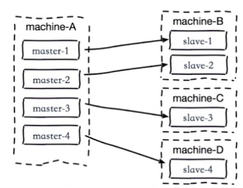

## 什么是主从复制

### 单机存在的问题

只在一台机器上部署一个 Redis  节点

> 机器故障					# 当唯一节点故障后，就无法使用了
>
> 容量瓶颈					# 当内存容量超过了单台机器的最大值如何处理，买更大内存的机器？
>
> QPS 瓶颈 				# 每秒查询率QPS，如果超出10万，如何处理


### 主从复制的作用

> 提供了数据副本			# 这是成为高可用分布式的基础
>
> 扩展读性能				# 可以将读操作分到多个节点操作，读写分离
>
> 总结：
>
> ​	一个 master 可以有多个 slave
>
> ​	一个 slave 只能有一个 master
>
> ​	数据流向是单向的，master 到 slave


​	**一主多从**


## 复制的配置

​	**两种方式**

> slaveof 命令
>
> 配置文件


### slaveof 命令

​	tips: 这里只是演示命令效果，才在一台机器上的两个Redis节点进行主从复制，正常开发是不这样操作的，如果是两个节点都部署在一台机器上，没有太大意义。


##### 取消复制


### 修改配置

xxx.conf 文件配置

```sh
slaveof ip port					# 要复制的主节点ip 端口
slave-read-only yes				# 从节点只能进行读
```


### 比较

| 方式           | 优点     | 缺点       |
| -------------- | -------- | ---------- |
| slaveof 命令   | 无需重启 | 不便于管理 |
| .conf 文件配置 | 统一配置 | 需要重启   |


### 实验

redis-6379.conf

```sh
daemonize yes
pidfile /var/run/redis-6379.pid
port 6379
logfile "6379.log"

dbfilename dump-6379.rdb
dir /opt/soft/redis/data
```

redis-6381.conf

```sh
daemonize yes
pidfile /var/run/redis-6381.pid
port 6381
logfile "6381.log"

dbfilename dump-6381.rdb
dir /opt/soft/redis/data

slaveof 127.0.0.1 6379
slave-read-only yes
```


1、首先启动 6379 端口的主节点

```sh
[root@localhost config]# redis-server redis-6379.conf
[root@localhost config]# redis-cli
127.0.0.1:6379> DBSIZE
(integer) 0
# info 可以查看这个节点的信息，  info replication 查看这个节点的 replication 信息
127.0.0.1:6379> info replication
# Replication
role:master					# 目前节点是 master
connected_slaves:0			# 从节点个数为 0 
master_replid:bd24cd88c6d13297c65fc0d80f15873d505e2de4
master_replid2:0000000000000000000000000000000000000000
master_repl_offset:0
second_repl_offset:-1
repl_backlog_active:0
repl_backlog_size:1048576
repl_backlog_first_byte_offset:0
repl_backlog_histlen:0

# ....
# 从节点也启动后再次查看 
# ....

127.0.0.1:6379> info replication
# Replication
role:master
connected_slaves:1				# 从节点个数显示为  1
slave0:ip=127.0.0.1,port=6381,state=online,offset=294,lag=1
master_replid:d5f6143bf3a5b162bc594938d05d7e3b9afa8eec
master_replid2:0000000000000000000000000000000000000000
master_repl_offset:294
second_repl_offset:-1
repl_backlog_active:1
repl_backlog_size:1048576
repl_backlog_first_byte_offset:1
repl_backlog_histlen:294
```


2、然后启动 6381 端口的从节点

```sh
[root@localhost config]# redis-server redis-6381.conf
[root@localhost config]# redis-cli -p 6381
127.0.0.1:6381> DBSIZE
(integer) 0
127.0.0.1:6381> info replication
# Replication
role:slave					# 目前是从节点
master_host:127.0.0.1		# 链接的主节点 ip
master_port:6379			# 主节点端口
master_link_status:up
master_last_io_seconds_ago:5
master_sync_in_progress:0
slave_repl_offset:28
slave_priority:100
slave_read_only:1
connected_slaves:0
master_replid:d5f6143bf3a5b162bc594938d05d7e3b9afa8eec
master_replid2:0000000000000000000000000000000000000000
master_repl_offset:28
second_repl_offset:-1
repl_backlog_active:1
repl_backlog_size:1048576
repl_backlog_first_byte_offset:1
repl_backlog_histlen:28
```


3、主从数据同步效果

> 通过配置方式启动主从后
>
> 主节点的数据，从节点完全复制可以直接读取
>
> 由于从节点配置文件设置了 `slave-only-read yes`  ，所以 从节点无法写入只能读取


> 关闭从节点 6381 ，并修改配置文件，取消配置方式，改用命令方式配置从节点

```sh
[root@localhost config]# more redis-6381.conf
daemonize yes
pidfile /var/run/redis-6381.pid
port 6381
logfile "6381.log"

dbfilename dump-6381.rdb
dir /opt/soft/redis/data

#slaveof 127.0.0.1 6379
#slave-read-only yes

[root@localhost config]# redis-server redis-6381.conf
127.0.0.1:6381> info replication
# Replication
role:master							# 目前还是主节点
connected_slaves:0
master_replid:6366b3fcc1cabd47a6f5779428397e0bf382e2c7
master_replid2:0000000000000000000000000000000000000000
master_repl_offset:0
second_repl_offset:-1
repl_backlog_active:0
repl_backlog_size:1048576
repl_backlog_first_byte_offset:0
repl_backlog_histlen:0
127.0.0.1:6381> keys *
(empty list or set)
127.0.0.1:6381> set test info
OK
127.0.0.1:6381> mset nba kobe
OK
127.0.0.1:6381> keys *
1) "test"
2) "nba"
# 设置连接 6379 成为其主节点，本身为从节点
127.0.0.1:6381> slaveof 127.0.0.1 6379
OK
127.0.0.1:6381> info replication
# Replication
role:slave
master_host:127.0.0.1
master_port:6379
master_link_status:up
master_last_io_seconds_ago:1
master_sync_in_progress:0
slave_repl_offset:2293
slave_priority:100
slave_read_only:1
connected_slaves:0
master_replid:d5f6143bf3a5b162bc594938d05d7e3b9afa8eec
master_replid2:0000000000000000000000000000000000000000
master_repl_offset:2293
second_repl_offset:-1
repl_backlog_active:1
repl_backlog_size:1048576
repl_backlog_first_byte_offset:2210
repl_backlog_histlen:84

# 成为从节点后，之前的数据会被清除
127.0.0.1:6381> keys *
1) "aa"
2) "bb"
3) "hello"
4) "cc"
127.0.0.1:6381> get test
(nil)
127.0.0.1:6381> get hello
"world"
```


## 全量复制和部分复制

### ​全量复制

 

### 全量复制的开销

> bgsave 时间
>
> RDB 文件网络传输时间
>
> 从节点清空数据时间
>
> 从节点加载 RDB 的时间
>
> 可能的 AOF重写时间


### 部分复制


## 故障处理

### 主从结构-故障转移

#### slave 宕机


#### master 宕机


## 开发运维常见问题

### 读写分离

​	读流量分摊到从节点


#### 可能遇到的问题：

> 复制数据延迟
>
> 读到过期数据
>
> 从节点故障


### 主从配置不一致

> 例如 maxmemory 不一致： 导致丢失数据
>
> 例如数据结构优化参数（hasx-max-ziplist-entries)：导致内存不一致


### 规避全量复制

​	全量复制的开销是比较大的，要竟可能避免。 下面可能触发全量复制的情况。

1、第一次全量复制

- 第一次不可避免

- 可以选择小主节点、低峰时间段


2、节点运行 ID 不匹配

-  主节点重启（运行id ：run_id）变化了，使用 info server 可查看
- 使用故障转移，例如哨兵或集群（后面会提到）


3、复制挤压缓冲区不足

- 网络中断，部分复制无法满足
- 修改配置增大复制缓冲区 rel_backlog_size。


### 规避复制风暴

##### 主节点复制风暴

- 问题：主节点重启，由于 run_id 变换，多从节点复制
- 解决：更换复制拓扑图


##### 单机器复制风暴

- 如右图：机器宕机后，大量全量复制
- 主机应该分散多机器中，不要部署在同一台机器上