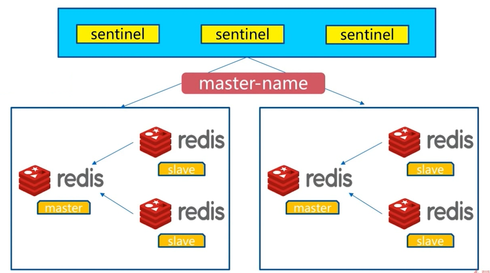

## 架构说明

Redis 的 Sentinel 系统用于管理多个 Redis 服务器（instance）， 该系统执行以下三个任务：

- **监控（Monitoring）**： Sentinel 会不断地检查你的主服务器和从服务器是否运作正常。
- **提醒（Notification）**： 当被监控的某个 Redis 服务器出现问题时， Sentinel 可以通过 API 向管理员或者其他应用程序发送通知。
- **自动故障迁移（Automatic failover）**： 当一个主服务器不能正常工作时， Sentinel 会开始一次自动故障迁移操作， 它会将失效主服务器的其中一个从服务器升级为新的主服务器， 并让失效主服务器的其他从服务器改为复制新的主服务器； 当客户端试图连接失效的主服务器时， 集群也会向客户端返回新主服务器的地址， 使得集群可以使用新主服务器代替失效服务器。

​	Redis Sentinel 是一个分布式系统， 你可以在一个架构中运行多个 Sentinel 进程（progress）， 这些进程使用流言协议（gossip protocols)来接收关于主服务器是否下线的信息， 并使用投票协议（agreement protocols）来决定是否执行自动故障迁移， 以及选择哪个从服务器作为新的主服务器。


### Redis sentinel 故障转移

> 1、多个 sentinel 发现并确认 master 有问题
>
> 2、选举出一个 sentinel 作为领导
>
> 3、选出一个 slave 作为 master
>
> 4、通知其余 slave 成为新的 master 的 slave
>
> 5、通知客户端主从节点变化
>
> 6、等待老的 master 复活成为新 master 的 slave


### 可监控多套 master-slave

 	每套 master-slave 使用一个 master-name 作为这套的标识




## 安装配置

 	我们来配置如下结构


> 配置开启主从节点
>
> 配置开启 sentinel 监控主节点。（sentinel 是特殊的 Redis）
>
> 由于条件有限，实际应该是在多机器中部署，目前演示只在一台机器中操作
>
> 详细的配置节点。下面介绍

### 主从节点配置

```sh
[root@localhost config]# ll
total 4
-rw-r--r--. 1 root root 126 12月 11 09:20 redis-7000.conf

# 查看配置文件内容
[root@localhost config]# cat redis-7000.conf
daemonize yes
pidfile /var/run/redis-7000.pid
port 7000
logfile "7000.log"

dbfilename dump-7000.rdb
dir /opt/soft/redis/data


# 将 redis-7000.conf 文件中的 '7000' 替换为 '7001' 并生成  redis-7001 文件
[root@localhost config]# sed "s/7000/7001/g" redis-7000.conf > redis-7001.conf
[root@localhost config]# sed "s/7000/7002/g" redis-7000.conf > redis-7002.conf

# 向文件 redis-7001.conf 末尾增加 slaveof 127.0.0.1 700
[root@localhost config]# echo "slaveof 127.0.0.1 7000" >> redis-7001.conf
[root@localhost config]# echo "slaveof 127.0.0.1 7000" >> redis-7002.conf

# 至此三个配置文件准备好了
[root@localhost config]# ll
total 12
-rw-r--r--. 1 root root 126 12月 11 09:20 redis-7000.conf
-rw-r--r--. 1 root root 149 12月 11 09:22 redis-7001.conf
-rw-r--r--. 1 root root 149 12月 11 09:22 redis-7002.conf
[root@localhost config]# cat redis-7000.conf
daemonize yes
pidfile /var/run/redis-7000.pid
port 7000
logfile "7000.log"

dbfilename dump-7000.rdb
dir /opt/soft/redis/data
[root@localhost config]# cat redis-7001.conf
daemonize yes
pidfile /var/run/redis-7001.pid
port 7001
logfile "7001.log"

dbfilename dump-7001.rdb
dir /opt/soft/redis/data
slaveof 127.0.0.1 7000

# 根据配置文件启动 Redis 主从节点
[root@localhost config]# redis-server redis-7000.conf
[root@localhost config]# redis-server redis-7001.conf
[root@localhost config]# redis-server redis-7002.conf
[root@localhost config]# ps -ef | grep redis-server
root      8717     1  0 09:35 ?        00:00:00 redis-server *:7000
root      8723     1  0 09:35 ?        00:00:00 redis-server *:7001
root      8729     1  0 09:35 ?        00:00:00 redis-server *:7002
root      8735  8159  0 09:35 pts/4    00:00:00 grep --color=auto redis-server
[root@localhost config]# redis-cli -p  7000 ping
PONG

# 通过主节点 info 信息查看从节点链接情况
[root@localhost config]# redis-cli -p  7000 info replication
# Replication
role:master
connected_slaves:2
slave0:ip=127.0.0.1,port=7001,state=online,offset=112,lag=1
slave1:ip=127.0.0.1,port=7002,state=online,offset=98,lag=1
master_replid:28a167815fbff10b83f73f1eca647a869ea6fbb0
master_replid2:0000000000000000000000000000000000000000
master_repl_offset:112
second_repl_offset:-1
repl_backlog_active:1
repl_backlog_size:1048576
repl_backlog_first_byte_offset:1
repl_backlog_histlen:112
```

### sentinel 配置

```sh
[root@localhost config]# cd ..
[root@localhost redis-5.0.2]# ls
00-RELEASENOTES  COPYING  Makefile    runtest           src
BUGS             data     MANIFESTO   runtest-cluster   tests
config           deps     README.md   runtest-sentinel  utils
CONTRIBUTING     INSTALL  redis.conf  sentinel.conf
[root@localhost redis-5.0.2]# cp sentinel.conf config/
[root@localhost redis-5.0.2]# cd config

# 过滤注释和空行后的内容，写入到 redis-sentinel-26379.conf 文件中
[root@localhost config]# cat sentinel.conf | grep -v "#" | grep -v "^$" > redis-sentinel-26379.conf
[root@localhost config]# ls
7000.log  7002.log         redis-7001.conf  redis-sentinel-26379.conf
7001.log  redis-7000.conf  redis-7002.conf  sentinel.conf
[root@localhost config]# cat redis-sentinel-26379
port 26379
daemonize no
pidfile /var/run/redis-sentinel.pid
logfile ""
dir /tmp
sentinel monitor mymaster 127.0.0.1 6379 2
sentinel down-after-milliseconds mymaster 30000
sentinel parallel-syncs mymaster 1
sentinel failover-timeout mymaster 180000
sentinel deny-scripts-reconfig yes

# 编辑修改这个配置文件
[root@localhost config]# vi redis-sentinel-26379.conf

port 26379
daemonize yes										# 开启守护进程的方式
pidfile /var/run/redis-sentinel-26379.pid
logfile "26379.log"									# 修改日志文件名
dir /opt/soft/redis/data						# 修改文件路径
sentinel monitor mymaster 127.0.0.1 7000 2			# 修改链接的主机点为，对应ip和端口号
sentinel down-after-milliseconds mymaster 30000
sentinel parallel-syncs mymaster 1
sentinel failover-timeout mymaster 180000
sentinel deny-scripts-reconfig yes

# 同样的使用 sed 命令替换创建两个 sentinel-26380  sentinel-26381 两个文件
[root@localhost config]# sed "s/26379/26380/g" redis-sentinel-26379.conf > redis-sentinel-26380.conf
[root@localhost config]# sed "s/26379/26381/g" redis-sentinel-26379.conf > redis-sentinel-26381.conf


# 启动 redis-sentinel
[root@localhost config]# redis-sentinel  redis-sentinel-26379.conf
# 查看是否启动成功
[root@localhost config]# ps -ef | grep redis-sentinel
root      8915     1  0 10:58 ?        00:00:00 redis-sentinel *:26379 [sentinel]
root      8930  8159  0 10:59 pts/4    00:00:00 grep --color=auto redis-

# 使用 redis-cli 链接 redis-sentinel 
[root@localhost config]# redis-cli -p 26379
127.0.0.1:26379> ping
PONG
127.0.0.1:26379> info sentinel					# 过滤查看 sentinel 相关信息  			
# Sentinel
sentinel_masters:1
sentinel_tilt:0
sentinel_running_scripts:0
sentinel_scripts_queue_length:0
sentinel_simulate_failure_flags:0
# 可以看到检测到了主节点的对应的又两个从节点数量，并且目前 sentinels 进程只有当前一个
master0:name=mymaster,status=ok,address=127.0.0.1:7000,slaves=2,sentinels=1
127.0.0.1:26379> exit				# 退出当前链接

# 从新查看我们的 sentinel-26379配置，可以发现内容更我们启动前发生了变化 
[root@localhost config]# cat redis-sentinel-26379.conf
port 26379
daemonize yes
pidfile "/var/run/redis-sentinel-26379.pid"
logfile "26379.log"
dir "/opt/soft/redis-5.0.2/data"
sentinel myid 0981956c5ddcfec5eba9c1c962b51aa3467738d0
sentinel deny-scripts-reconfig yes
sentinel monitor mymaster 127.0.0.1 7000 2
sentinel config-epoch mymaster 0
sentinel leader-epoch mymaster 0
# Generated by CONFIG REWRITE						#配置重写产生的内容
protected-mode no
sentinel known-replica mymaster 127.0.0.1 7001
sentinel known-replica mymaster 127.0.0.1 7002
sentinel current-epoch 0

# 启动这两个 sentinel 
[root@localhost config]# redis-sentinel redis-sentinel-26380.conf
[root@localhost config]# redis-sentinel redis-sentinel-26381.conf
[root@localhost config]# ps -ef | grep redis-sentinel
root      8915     1  0 10:58 ?        00:00:01 redis-sentinel *:26379 [sentinel]
root      8993     1  0 11:10 ?        00:00:00 redis-sentinel *:26380 [sentinel]
root      8998     1  0 11:10 ?        00:00:00 redis-sentinel *:26381 [sentinel]
root      9003  8159  0 11:10 pts/4    00:00:00 grep --color=auto redis-sentinel

# 再次使用 redis-cli 链接查看 sentinel 信息发现 sentinels数量检测变换为3了
[root@localhost config]# redis-cli -p 26379 info sentinel
# Sentinel
sentinel_masters:1
sentinel_tilt:0
sentinel_running_scripts:0
sentinel_scripts_queue_length:0
sentinel_simulate_failure_flags:0
master0:name=mymaster,status=ok,address=127.0.0.1:7000,slaves=2,sentinels=3
[root@localhost config]# redis-cli -p 26381 info sentinel
# Sentinel
sentinel_masters:1
sentinel_tilt:0
sentinel_running_scripts:0
sentinel_scripts_queue_length:0
sentinel_simulate_failure_flags:0
master0:name=mymaster,status=ok,address=127.0.0.1:7000,slaves=2,sentinels=3

# 查看我们对应的 sentinel 配置文件，发现都发生了变化，并且每个对应有自己不同的 sentinel myid
[root@localhost config]# cat redis-sentinel-26381.conf
port 26381
daemonize yes
pidfile "/var/run/redis-sentinel-26381.pid"
logfile "26381.log"
dir "/opt/soft/redis-5.0.2/data"
sentinel myid 0cac3014bd39b4ab7aa98e91dbd5e7e28429b4e5
sentinel deny-scripts-reconfig yes
sentinel monitor mymaster 127.0.0.1 7000 2
sentinel config-epoch mymaster 0
sentinel leader-epoch mymaster 0
# Generated by CONFIG REWRITE
protected-mode no
sentinel known-replica mymaster 127.0.0.1 7002
sentinel known-replica mymaster 127.0.0.1 7001
sentinel known-sentinel mymaster 127.0.0.1 26380 8d04faef39fbbb0003ac8f65f4459edde1e33bde
sentinel known-sentinel mymaster 127.0.0.1 26379 f21d1c82854b9247bd64bee7e43a4d4cc722b58d
sentinel current-epoch 0


[root@localhost config]# cat redis-sentinel-26379.conf
port 26379
daemonize yes
pidfile "/var/run/redis-sentinel-26379.pid"
logfile "26379.log"
dir "/opt/soft/redis-5.0.2/data"
sentinel myid f21d1c82854b9247bd64bee7e43a4d4cc722b58d
sentinel deny-scripts-reconfig yes
sentinel monitor mymaster 127.0.0.1 7000 2
sentinel config-epoch mymaster 0
sentinel leader-epoch mymaster 0
# Generated by CONFIG REWRITE
protected-mode no
sentinel known-replica mymaster 127.0.0.1 7002
sentinel known-replica mymaster 127.0.0.1 7001
sentinel known-sentinel mymaster 127.0.0.1 26381 0cac3014bd39b4ab7aa98e91dbd5e7e28429b4e5
sentinel known-sentinel mymaster 127.0.0.1 26380 8d04faef39fbbb0003ac8f65f4459edde1e33bde
sentinel current-epoch 0
```


## 客户端连接

​		在默认情况下， Sentinel 使用 TCP 端口 `26379` （普通 Redis 服务器使用的是 `6379` ）。Sentinel 接受 Redis 协议格式

### Sentinel 命令

以下列出的是 Sentinel 接受的命令：

- [PING](http://redisdoc.com/debug/ping.html#ping) ：返回 `PONG` 。
- `SENTINEL masters` ：列出所有被监视的主服务器，以及这些主服务器的当前状态。
- `SENTINEL slaves <master name>` ：列出给定主服务器的所有从服务器，以及这些从服务器的当前状态。
- `SENTINEL get-master-addr-by-name <master name>` ： 返回给定名字的主服务器的 IP 地址和端口号。 如果这个主服务器正在执行故障转移操作， 或者针对这个主服务器的故障转移操作已经完成， 那么这个命令返回新的主服务器的 IP 地址和端口号。
- `SENTINEL reset <pattern>` ： 重置所有名字和给定模式 `pattern` 相匹配的主服务器。 `pattern` 参数是一个 Glob 风格的模式。 重置操作清除主服务器目前的所有状态， 包括正在执行中的故障转移， 并移除目前已经发现和关联的， 主服务器的所有从服务器和 Sentinel 。
- `SENTINEL failover <master name>` ： 当主服务器失效时， 在不询问其他 Sentinel 意见的情况下， 强制开始一次自动故障迁移 （不过发起故障转移的 Sentinel 会向其他 Sentinel 发送一个新的配置，其他 Sentinel 会根据这个配置进行相应的更新）。


### 客户端实现基本原理

​	结合上述命令信息

#### Step1


#### Step 2


#### Step 3


#### Step 4


### GO 客户端

```
github.com/gomodule/redigo/redis	
github.com/FZambia/sentinel
```

<https://github.com/FZambia/sentinel/blob/master/sentinel.go>

```go
func newSentinelPool() *redis.Pool {
	 	sntnl := &sentinel.Sentinel{
	 		Addrs:      []string{":26379", ":26380", ":26381"},
	 		MasterName: "mymaster",
	 		Dial: func(addr string) (redis.Conn, error) {
	 			timeout := 500 * time.Millisecond
	 			c, err := redis.DialTimeout("tcp", addr, timeout, timeout, timeout)
	 			if err != nil {
	 				return nil, err
	 			}
	 			return c, nil
	 		},
	 	}
	 	return &redis.Pool{
	 		MaxIdle:     3,
	 		MaxActive:   64,
	 		Wait:        true,
	 		IdleTimeout: 240 * time.Second,
	 		Dial: func() (redis.Conn, error) {
	 			masterAddr, err := sntnl.MasterAddr()
	 			if err != nil {
	 				return nil, err
	 			}
	 			c, err := redis.Dial("tcp", masterAddr)
	 			if err != nil {
	 				return nil, err
	 			}
	 			return c, nil
	 		},
	 		TestOnBorrow: func(c redis.Conn, t time.Time) error {
	 			if !sentinel.TestRole(c, "master") {
	 				return errors.New("Role check failed")
	 			} else {
	 				return nil
	 			}
	 		},
	 	}
	 }
```


## 三个定时任务

**1、每 10 秒每个 sentinel 对 master 和 slave 执行 info 命名**

- 发现 slave 节点
- 确认主从关系


**2、每 2 秒每个 sentinel 通过 master 节点的 channel 交换信息（pub/sub)  发布订阅**

- 通过  \__sentinnel__:hello 频道交互
- 交互对节点的 "看法" 和自身信息


**3、每 1 秒每个 sentinel 对其他 sentinel 和 Redis 执行ping**

- 心跳检测，失败判定依据


## 主观下线和客观下线

[主观下线和客观下线](<http://redisdoc.com/topic/sentinel.html#id5>)

```sh
sentinel monitor <masterName> <ip> <port> <quorum>
qurorm:法定人数，通常设置为 sentinel 总节点的一半加一个。适用于sentinel判断服务器是客观下线需要的达到的至少总个数

sentinel down-after-milliseconds <masterName> <timeout>
sentinel 判断服务器主观下线的超时时间
```


- 主观下线（Subjectively Down， 简称 SDOWN）指的是单个 Sentinel 实例对服务器做出的下线判断。
- 客观下线（Objectively Down， 简称 ODOWN）指的是多个 Sentinel 实例在对同一个服务器做出 SDOWN 判断， 并且通过 `SENTINEL is-master-down-by-addr` 命令互相交流之后， 得出的服务器下线判断。 （一个 Sentinel 可以通过向另一个 Sentinel 发送 `SENTINEL is-master-down-by-addr` 命令来询问对方是否 认为给定的服务器已下线。）

​	如果一个服务器没有在 `master-down-after-milliseconds` 选项所指定的时间内， 对向它发送 [PING](http://redisdoc.com/debug/ping.html#ping) 命令的 Sentinel 返回一个有效回复（valid reply）， 那么 Sentinel 就会将这个服务器标记为主观下线。

​	注意， 一个服务器必须在 `master-down-after-milliseconds` 毫秒内， 一直返回无效回复才会被 Sentinel 标记为主观下线。举个例子， 如果 `master-down-after-milliseconds` 选项的值为 `30000` 毫秒（`30` 秒）， 那么只要服务器能在每 `29` 秒之内返回至少一次有效回复， 这个服务器就仍然会被认为是处于正常状态的。


## 领导者选举

- 原因：只需要有一个 sentinel 节点来完成自动故障转移
- 选举：通过 `sentinel is-master-down-by-add` 命令都有可能成为领导者
  - 每个做主观下线的 sentinel 节点向其他 sentinel 节点发送命令，要求将它设置为领导者
  - 收到命令的 sentinel 节点如果没有同意通过其他 sentinel 节点发送的命令，那么将同意该请求，否者拒绝
  - 如果该 sentinel 节点发现自己的票数已经超过 sentinel 集合半数且超过 quorum，那么它将成为领导者
  - 如果此过程有多个 sentinel 节点成为了领导者，难么将等待一段时间重新进行选举。所以一般 sentinel 节点数通常应该大于等于3个且最好为奇数


## 故障转移(sentinel 领导者节点完成)

- 从 slave 节点中选出一个 `“合适的“` 节点作为新的 master 节点
- 对上面的 slave 节点执行 `slaveof no one`  命令让其成为 master 节点
- 向剩余的 slave 节点发送命令，让他们成为新 master 节点的 slave 节点，复制规则和 `parallel-syncs` 参数有关
- 更新对原来 master 节点配置为 slave ，并保持对其 ”关注“ ，当其恢复后命令它去复制新的 master 节点。成为新 master 的 slave。

#### 选择”合适的“ slave 节点

-  选择 `slave-priority` (slave 节点优先级，比如在某些性能比较高的服务器机器可以把这个设置高一点，优先希望高配置到机器配置到  Redis 成为下一个 master 节点)最高的 slave 节点，如果存在则返回，不存在则继续
- 选择复制偏移量最大的 slave 节点（相对复制的最完整），如果存在则返回，不存在则继续
- 选择 runId 最小的slave 节点（越小说明启动最早，相对数据比较全）


## 开发运维常见问题

### 节点运维

#### **节点上线和下线，主要关注三个：**

- 主节点
- 从节点
- sentinel 节点


#### **节点下线原因，通常因为**：

- 机器下线：机器过了保质期，需要丢弃等情况
- 机器性能不足：随着用户量等等的增加导致CPU、内存、硬盘、网络等等不满足现状
- 节点自身故障：例如服务不稳定等


#### 主节点下线

> sentinel failover <masterName>
>
> 这会直接忽略主观下线和客观下线，以及领导者选举。直接是当前链接的 sentinel 视为用于故障转移的领导者，执行将 masterName 进行一个故障转移设置。


#### 从节点、sentinel 节点下线

​	要考虑是临时下线还是永久下线，例如是否做一些清理工作，但是要考虑读写分离的情况


#### 节点上线

- 主节点： sentinel  failover 进行替换
- 从节点：slaveof  即可，sentinel 节点可以感知
- sentinel节点：参考其他 sentinel 节点启动即可


### 本章总结

- Redis sentinel 是 Redis 的高可用实现方案：
  故障发现、故障自动转移、配置中心、客户端通知
- Redis sentinel 从 Redis 2.8 版本开始才正式生产可用，之前版本生产不可用。
- 尽可能在不通的物理机上部署 Redis sentinel 所有节点
- Redis sentinel 中的 sentinel 节点个数应该大于等于3且最好为奇数
- Redis sentinel 中的数据节点与普通数据节点没有区别
- 客户端初始化是链接的是 sentinel 节点集合，不在是具体的 Redis 节点，但 sentinel 只是配置中心不是代理
- Redis sentinel 通过三个定时任务实现了 sentinel 节点对于主节点、从节点、其余 sentinel 节点的监控
- Redis sentinel 在对节点做失败判定时区分为主观下线和客观下线
- 看懂 Redis sentinel 故障转移日志对于 Redis sentinel 以及问题拍查非常有帮助
- Redis sentinel 实现读写分离高可用可以依赖 sentinel 节点的消息通知，获取 Redis 数据节点的状态变化。