## 呼唤集群

### 什么是集群？

​	

​	

​	

集群，英文名称为 **Cluster**，通俗地说，集群是这样一种技术：它将多个系统连接到一起，每台服务器都实现相同的业务，做相同的事情。但是每台服务器并不是缺一不可，使多台服务器能够像一台机器那样工作或者看起来好像一台机器，存在的作用主要是缓解并发压力和单点故障转移问题。可以利用一些廉价的符合工业标准的硬件构造高性能的系统。实现：高扩展、高性能、低成本、高可用！


### 为什么需要集群：

1. 单个并发量有限

   举例说，虽然 Redis 已经达到很高的性能支持 10万/每秒 的指令访问，但是如果业务需要 100万/每秒呢？

2. 数据量有限，计算能力有限

   还是举例 Redis 单机的内存有 250G，如果业务量达到 100G 甚至更高的情况下如何处理？

3. 容错 ，故障转移

   单机的时候当机器故障整个业务就无法使用了，这通常是我们非常不喜欢的，在集群下可以将故障机的服务停止转而去访问其他可用的机器，保障我们的服务应用不间断运作

​	


### Redis cluster is released in 3.0 


## 数据分布

当一份全量的数据无法在单机上存储的时候就需要进行分布存储，如何设计一个好的 `分区规则`  在合理的场景下使用是非常重要的。

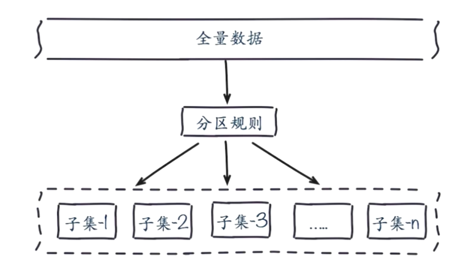


### 顺序分区和哈希分区

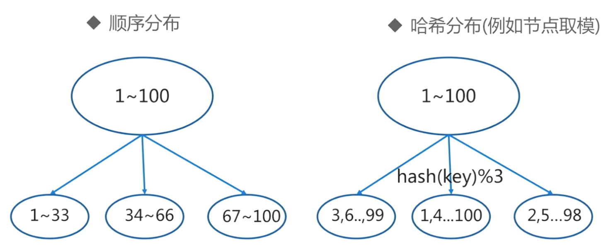


#### 两者之间的对比

| 分布式方式 | 特点                                                         | 典型产品                                                 |
| ---------- | ------------------------------------------------------------ | -------------------------------------------------------- |
| 哈希分布   | 数据分散度高<br />键值分布与业务无关<br />无法顺序访问<br />支持批量操作 | 一致性哈希Memcache<br />Redis  Cluster<br />其他缓存产品 |
| 顺序分布   | 数据分散度易倾斜<br />键值与业务相关<br />可顺序访问<br />支持批量操作 | Big Table<br />HBASE                                     |


### 哈希分布 

1. 节点取余分区

   - 客户端分片：哈希+取余

     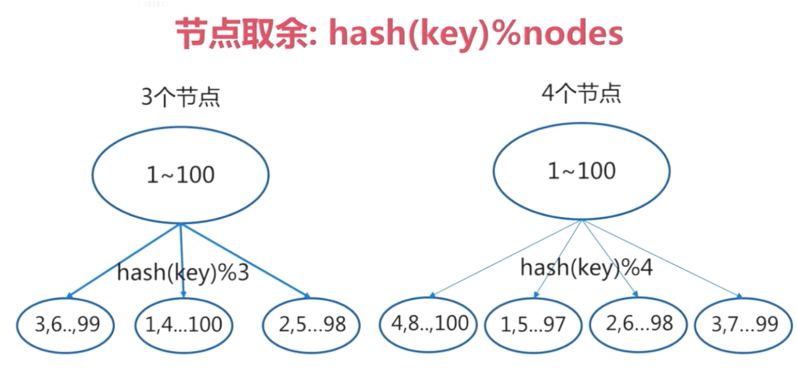

   - 节点伸缩：数据节点关系变化，导致数据迁移

     

   - 迁移数量和添加 节点数量有关：建议翻倍扩容

     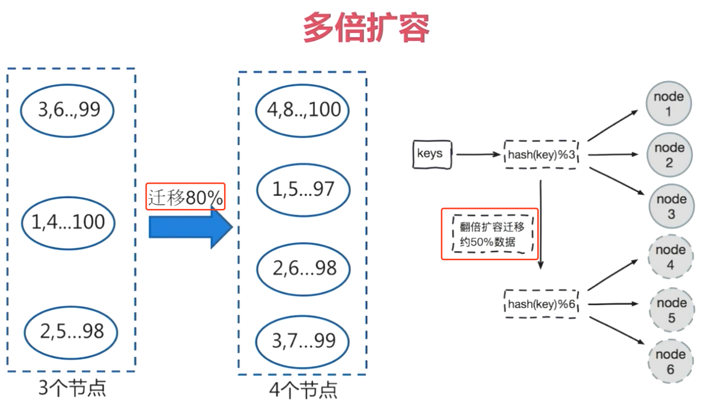

   

   

2. 一致性哈希分区

   - 客户端分片：哈希+顺时针（优化取余）

     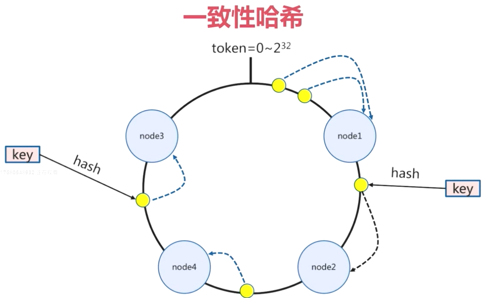

   - 节点伸缩：只影响邻近节点，但是还是有数据迁移

     当增加 `n5`  节点的时候，按照顺时针方向，前两个数据就会去新增 `n5` 寻找，不在去 `n2`  寻找，并且后两个依然去 `n2` 寻找。最重要的是，这次扩容并不影响 `n3`  `n4`  `n1`  节点的数据

     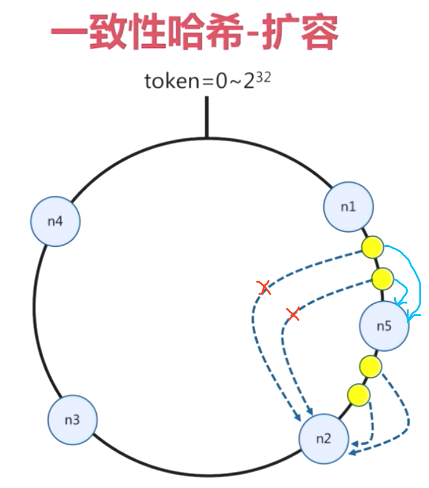

   - 翻倍伸缩：保证最小迁移数据和 负载均衡

     从上面的单个扩容可以发现的一个问题就是，均衡被打破了，虽然 `n3`  `n4`  `n1`  节点的数据并没有发生迁移，但是当 `n5` 的出现后，他们 之间相对的数据平衡就不通了，所以通过翻倍扩容的方式，能在较小迁移数据的同时，保证负载节点之间的负载均衡。

   

   

3.  虚拟槽分区

   - 预设虚拟槽：每个槽映射一个数据子集，一般比节点数大

   - 良好的哈希函数：例如 CRC16

   - 服务端管理节点、槽、数据：例如 **`Redis cluster`** 

     


## 搭建集群-基本架构

### 单机架构

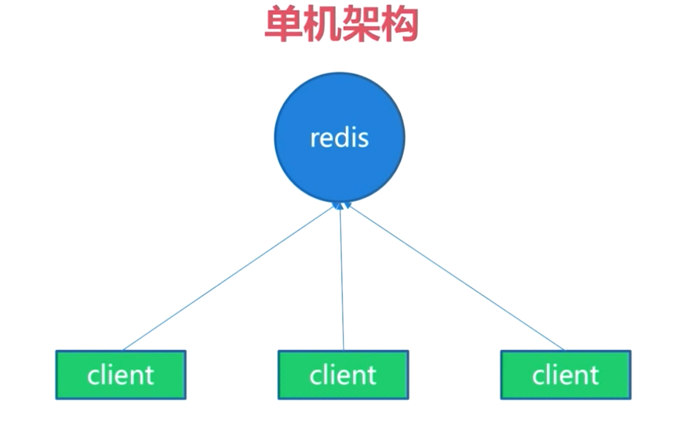

### 分布式架构

- 服务端是有很多个 Redis 节点，每个节点都负责读写
- 每个节点负责对应分配的预设虚拟槽
- 每个节点之间是彼此通信的，可以感知到彼此的负责的虚拟槽范围
- 客户端去访问节点的时候，如果在负责的槽范围内节点会接受处理，如果不在会返回告诉去对应的节点  


### Redis cluster架构

#### [【扩展阅读】redis 系列 Redis Cluster，这篇文章甚至介绍了meet 操作相关的Gossip协议](<https://www.jianshu.com/p/c26697412d72>)

#### 节点

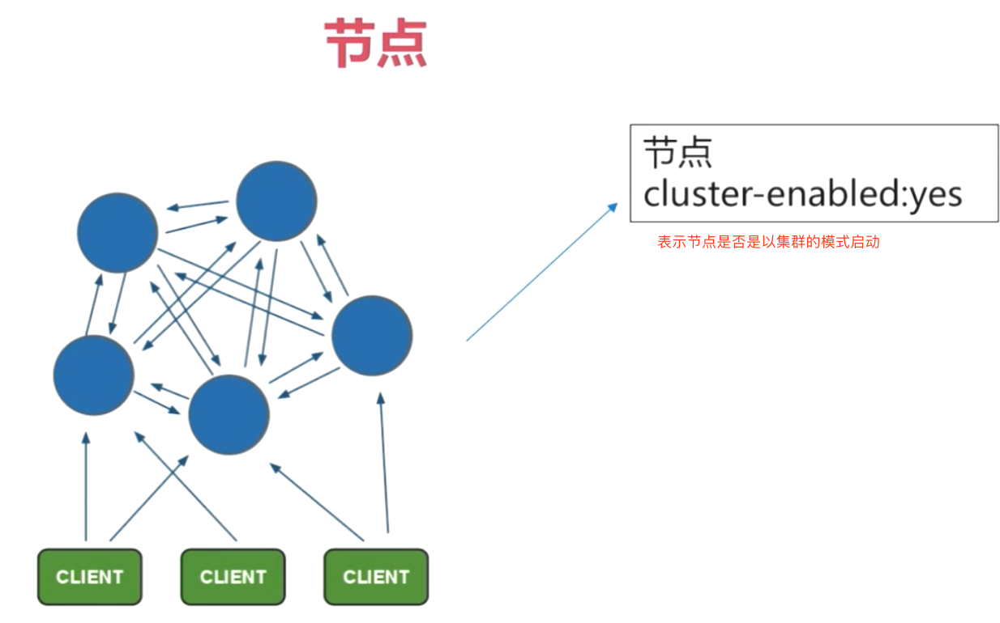


#### meet

​	

节点之间按照一定的协议和规则进行通信感知


同样的更多节点的时候也是使用这样的方式进行通信感知


#### 指派槽

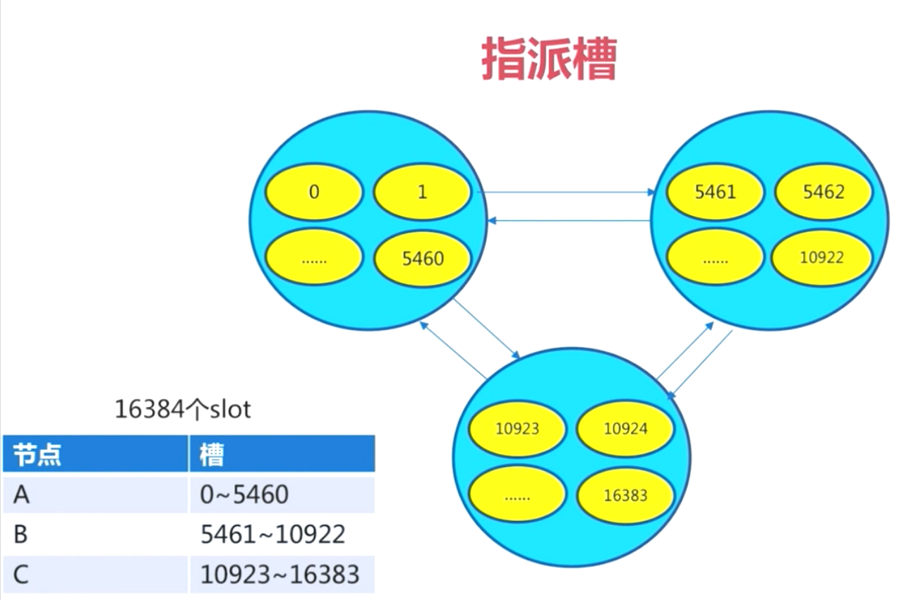


对于客户端来说，只需要对 key 进行哈希取值并取余，就可以计算出该 key 所对应的具体槽值

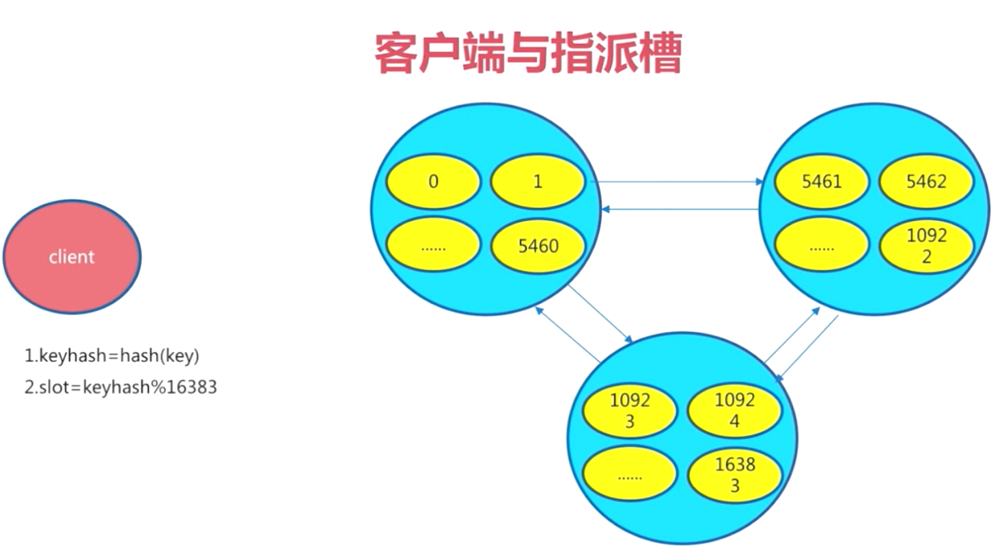


#### 特性

- 支持主从复制，每个主节点都有一个从节点
- 由于支持主从，所以高可用，从节点在主节点挂了的时候可以替换成为新主节点
- 支持分片，可以在多个主节点进行读写


## Redis Cluster 安装

### 原生命令安装-理解架构

- 配置开启节点

  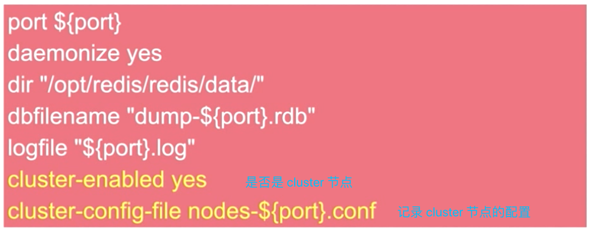

  ```sh
  # 节点额外主要配置
  # 可以理解为故障转移或者超时时间
  cluster-node-timeout 1500
  
  # 是否需要集群中所有节点都正常才能提供服务，实际生产中应该是 no ,这才符合我们高可用的性质
  cluster-require-full-coverage yes
  ```

  

- meet

  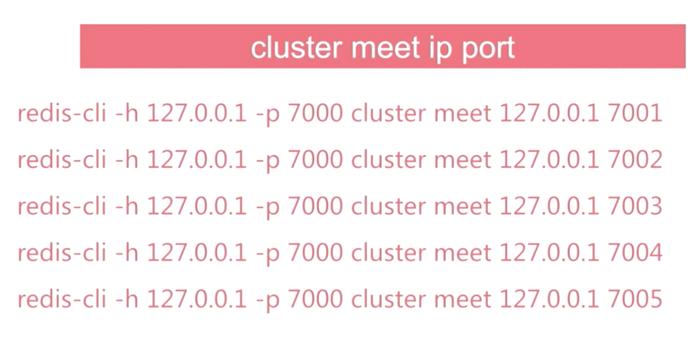

  

- 指派槽

  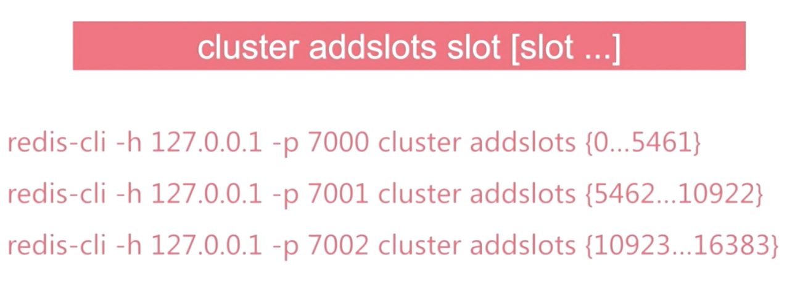

  

- 主从

  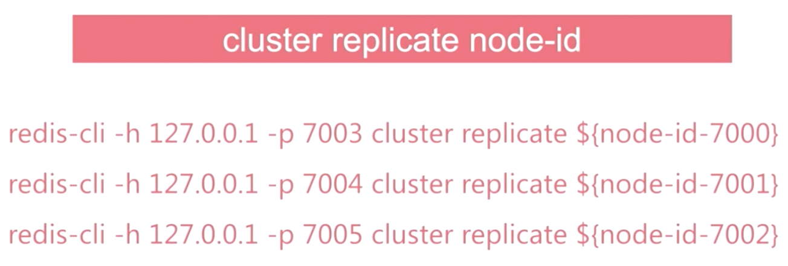

#### 实操演示

##### 节点的配置和启动

```sh
# 切换到对应目录
[root@localhost redis]# pwd
/opt/soft/redis
[root@localhost redis]# cd config/
[root@localhost config]# ll
total 0

# 创建节点配置文件
[root@localhost config]# vi redis-7000.conf
port 7000
daemonize yes
dir "/opt/soft/redis/data"
logfile "7000.log"
dbfilename "dump-7000.rdb"
cluster-enabled yes
cluster-config-file nodes-7000.conf
cluster-require-full-coverage no

# 取巧生成其他对应端口配置文件
[root@localhost config]# sed 's/7000/7001/g' redis-7000.conf > redis-7001.conf
[root@localhost config]# sed 's/7000/7002/g' redis-7000.conf > redis-7002.conf
[root@localhost config]# sed 's/7000/7003/g' redis-7000.conf > redis-7003.conf
[root@localhost config]# sed 's/7000/7004/g' redis-7000.conf > redis-7004.conf
[root@localhost config]# sed 's/7000/7005/g' redis-7000.conf > redis-7005.conf
[root@localhost config]# ll
total 24
-rw-r--r--. 1 root root 186 2月  26 17:36 redis-7000.conf
-rw-r--r--. 1 root root 186 2月  26 17:39 redis-7001.conf
-rw-r--r--. 1 root root 186 2月  26 17:39 redis-7002.conf
-rw-r--r--. 1 root root 186 2月  26 17:39 redis-7003.conf
-rw-r--r--. 1 root root 186 2月  26 17:39 redis-7004.conf
-rw-r--r--. 1 root root 186 2月  26 17:40 redis-7005.conf

# 通过 redis-server 启动
[root@localhost config]# redis-server redis-7000.conf
[root@localhost config]# redis-server redis-7001.conf
[root@localhost config]# redis-server redis-7002.conf
[root@localhost config]# redis-server redis-7003.conf
[root@localhost config]# redis-server redis-7004.conf
[root@localhost config]# redis-server redis-7005.conf
[root@localhost config]# ps -ef | grep redis
root      5523     1  0 17:43 ?        00:00:00 redis-server *:7000 [cluster]
root      5528     1  0 17:43 ?        00:00:00 redis-server *:7001 [cluster]
root      5533     1  0 17:43 ?        00:00:00 redis-server *:7002 [cluster]
root      5538     1  0 17:43 ?        00:00:00 redis-server *:7003 [cluster]
root      5543     1  0 17:44 ?        00:00:00 redis-server *:7004 [cluster]
root      5548     1  0 17:44 ?        00:00:00 redis-server *:7005 [cluster]
root      5555  5433  0 17:44 pts/0    00:00:00 grep --color=auto redis

# 尝试随便进入一个节点进行操作，会发现提示集群节点不可用，因为我们还没有给其分配对应的槽
[root@localhost config]# redis-cli -p 7000
127.0.0.1:7000> set hello world
(error) CLUSTERDOWN Hash slot not served			
127.0.0.1:7000> exit

# 我们可以通过命令 cluster nodes 或者切换到对应文件查看当前 cluster 节点的id
[root@localhost config]# redis-cli -p 7000 cluster nodes 
4ca8ceef0918c40cfe081594d43865bbf94985ff :7000@17000 myself,master - 0 0 0 connected
[root@localhost config]# cd ..
[root@localhost redis]# cd data/
[root@localhost data]# cat nodes-7000.conf
4ca8ceef0918c40cfe081594d43865bbf94985ff :0@0 myself,master - 0 0 0 connected
vars currentEpoch 0 lastVoteEpoch 0

# 或者通过命令 cluster info 查看节点 cluster 的全部信息
[root@localhost config]# redis-cli -p 7000 cluster info
cluster_state:fail					# 集群当前状态是失败的
cluster_slots_assigned:0			# 集群分配的槽
cluster_slots_ok:0					# 集群分配成功的槽
cluster_slots_pfail:0
cluster_slots_fail:0
cluster_known_nodes:1
cluster_size:0
cluster_current_epoch:0
cluster_my_epoch:0
cluster_stats_messages_sent:0
cluster_stats_messages_received:0
```


##### meet-节点间的握手通信

```sh
# 7000 节点去 meet 7001
[root@localhost config]# redis-cli -p 7000 cluster meet 127.0.0.1 7001
OK

# 分别查看 7000 和 7001 节点的信息可以发现都有了对方的信息
[root@localhost config]# redis-cli -p 7000 cluster nodes
4ca8ceef0918c40cfe081594d43865bbf94985ff 127.0.0.1:7000@17000 myself,master - 0 0 1 connected
743109f961788c1c5b2bfe7ff0af254f1c1004f2 127.0.0.1:7001@17001 master - 0 1582743145380 0 connected
[root@localhost config]# redis-cli -p 7001 cluster nodes
4ca8ceef0918c40cfe081594d43865bbf94985ff 127.0.0.1:7000@17000 master - 0 1582743190592 1 connected
743109f961788c1c5b2bfe7ff0af254f1c1004f2 127.0.0.1:7001@17001 myself,master - 0 0 0 connected

# 同样的通过 7000 节点去 meet 剩下的节点，建立联系
[root@localhost config]# redis-cli -p 7000 cluster meet 127.0.0.1 7002
OK
[root@localhost config]# redis-cli -p 7000 cluster meet 127.0.0.1 7003
OK
[root@localhost config]# redis-cli -p 7000 cluster meet 127.0.0.1 7004
OK
[root@localhost config]# redis-cli -p 7000 cluster meet 127.0.0.1 7005
OK

# 再次查看任意节点信息，会发现正如之前节点 meet 相互感知结果一样，所有的节点信息都联系上了
[root@localhost config]# redis-cli -p 7004 cluster nodes
9b4b0696b7546f6c2cdccc4625700a5969eccde0 127.0.0.1:7005@17005 master - 0 1582743469000 5 connected
4ca8ceef0918c40cfe081594d43865bbf94985ff 127.0.0.1:7000@17000 master - 0 1582743466117 1 connected
5fb64365a90cc4c0f6d580b35a1ae474d86018e9 127.0.0.1:7002@17002 master - 0 1582743467164 2 connected
743109f961788c1c5b2bfe7ff0af254f1c1004f2 127.0.0.1:7001@17001 master - 0 1582743468187 4 connected
07e5d6924e3c0cddfe00d727ef74f66207b772d1 127.0.0.1:7003@17003 master - 0 1582743469240 3 connected
abf857bce7eb0715ab6eeb83b2441a0bc54b299f 127.0.0.1:7004@17004 myself,master - 0 1582743468000 0 connected
```


##### 分配槽

我们需要把这16383个槽分出去，集群才能正常工作。分配方案如下 7000{0-5461}、7001{5462-10922}、7002{10922-16383}。剩下的三个节点分别作为已分配槽的节点的从节点。如下表格所示：

| 主节点{分配槽范围} | 从节点 |
| :----------------- | :----- |
| 7000{0-5461}       | 70003  |
| 7001{5462-10922}   | 7004   |
| 7002{10922-16383}  | 7005   |

```sh
# 使用命令 cluster addslots {start..end}   
[root@localhost config]# redis-cli -p 7000 cluster addslots {0..5461}
OK
# 特别注意使用区间的方式添加，中间只有两个点，否则出错
[root@localhost config]# redis-cli -p 7000 cluster addslots {0..5461}
OK
[root@localhost config]# redis-cli -p 7001 cluster addslots {5462..10922}
OK
[root@localhost config]# redis-cli -p 7002 cluster addslots {10923..16383}
OK

# 使用命令 cluster nodes 来查看下我们刚才分配的槽是否到对应节点
[root@localhost config]# redis-cli -p 7000 cluster nodes
4ca8ceef0918c40cfe081594d43865bbf94985ff 127.0.0.1:7000@17000 myself,master - 0 1582747221000 1 connected 0-5461    # 槽范围 0-5461 
5fb64365a90cc4c0f6d580b35a1ae474d86018e9 127.0.0.1:7002@17002 master - 0 1582747224912 2 connected 10923-16383
9b4b0696b7546f6c2cdccc4625700a5969eccde0 127.0.0.1:7005@17005 master - 0 1582747222789 5 connected		# 未分配槽节点
abf857bce7eb0715ab6eeb83b2441a0bc54b299f 127.0.0.1:7004@17004 master - 0 1582747221000 0 connected
743109f961788c1c5b2bfe7ff0af254f1c1004f2 127.0.0.1:7001@17001 master - 0 1582747223000 4 connected 5462-10922
07e5d6924e3c0cddfe00d727ef74f66207b772d1 127.0.0.1:7003@17003 master - 0 1582747223852 3 connected

# cluster info 也能查看现在集群的状态信息
[root@localhost config]# redis-cli -p 7000 cluster info
cluster_state:ok					# 状态OK
cluster_slots_assigned:16384		# 分配的槽数量
cluster_slots_ok:16384				# 已分配成功的槽数量
cluster_slots_pfail:0
cluster_slots_fail:0
cluster_known_nodes:6				# 当前集群可感知的节点
cluster_size:3						# 分配了槽的几点数
cluster_current_epoch:5
cluster_my_epoch:1
cluster_stats_messages_ping_sent:3955
cluster_stats_messages_pong_sent:3893
cluster_stats_messages_meet_sent:5
cluster_stats_messages_sent:7853
cluster_stats_messages_ping_received:3893
cluster_stats_messages_pong_received:3960
cluster_stats_messages_received:7853

# 简单的操作一条插入命令，发现集群几点已经可以正常工作了
[root@localhost config]# redis-cli -p 7000 set hello world
OK
# 此时如果去没有分配槽的节点执行命令的话，可以看到返回提示你对应 key 进行哈希以后的槽点值是多少，并且
# 对应服务器的地址也会返回，提示你去找个节点服务器操作
[root@localhost config]# redis-cli -p 7003 set hello world
(error) MOVED 866 127.0.0.1:7000
[root@localhost config]# redis-cli -p 7003 set ht world
(error) MOVED 15504 127.0.0.1:7002

```


##### 主从分配 

```sh
# 查看下当前节点信息，都是 master
[root@localhost config]# redis-cli -p 7003 cluster nodes
07e5d6924e3c0cddfe00d727ef74f66207b772d1 127.0.0.1:7003@17003 myself,master - 0 1582762627000 3 connected
4ca8ceef0918c40cfe081594d43865bbf94985ff 127.0.0.1:7000@17000 master - 0 1582762628652 1 connected 0-5461
abf857bce7eb0715ab6eeb83b2441a0bc54b299f 127.0.0.1:7004@17004 master - 0 1582762626000 0 connected
9b4b0696b7546f6c2cdccc4625700a5969eccde0 127.0.0.1:7005@17005 master - 0 1582762628000 5 connected
743109f961788c1c5b2bfe7ff0af254f1c1004f2 127.0.0.1:7001@17001 master - 0 1582762627606 4 connected 5462-10922
5fb64365a90cc4c0f6d580b35a1ae474d86018e9 127.0.0.1:7002@17002 master - 0 1582762625000 2 connected 10923-16383

# 使用 cluster replicate  进行主从设定
[root@localhost config]# redis-cli -p 7003 cluster replicate 4ca8ceef0918c40cfe081594d43865bbf94985ff
OK
[root@localhost config]# redis-cli -p 7004 cluster replicate 743109f961788c1c5b2bfe7ff0af254f1c1004f2
OK
[root@localhost config]# redis-cli -p 7005 cluster replicate 5fb64365a90cc4c0f6d580b35a1ae474d86018e9
OK

# 再次查看所有节点主从信息
[root@localhost config]# redis-cli -p 7003 cluster nodes
07e5d6924e3c0cddfe00d727ef74f66207b772d1 127.0.0.1:7003@17003 myself,slave 4ca8ceef0918c40cfe081594d43865bbf94985ff 0 1582762752000 3 connected

4ca8ceef0918c40cfe081594d43865bbf94985ff 127.0.0.1:7000@17000 master - 0 1582762753089 1 connected 0-5461

abf857bce7eb0715ab6eeb83b2441a0bc54b299f 127.0.0.1:7004@17004 slave 743109f961788c1c5b2bfe7ff0af254f1c1004f2 0 1582762754136 4 connected

9b4b0696b7546f6c2cdccc4625700a5969eccde0 127.0.0.1:7005@17005 slave 5fb64365a90cc4c0f6d580b35a1ae474d86018e9 0 1582762750000 5 connected

743109f961788c1c5b2bfe7ff0af254f1c1004f2 127.0.0.1:7001@17001 master - 0 1582762752000 4 connected 5462-10922

5fb64365a90cc4c0f6d580b35a1ae474d86018e9 127.0.0.1:7002@17002 master - 0 1582762755185 2 connected 10923-16383

# 通过 cluster slots 查看对应槽信息下所属的节点主从信息
[root@localhost config]# redis-cli -p 7003 cluster slots
1) 1) (integer) 0
   2) (integer) 5461
   3) 1) "127.0.0.1"
      2) (integer) 7000
      3) "4ca8ceef0918c40cfe081594d43865bbf94985ff"
   4) 1) "127.0.0.1"
      2) (integer) 7003
      3) "07e5d6924e3c0cddfe00d727ef74f66207b772d1"
2) 1) (integer) 5462
   2) (integer) 10922
   3) 1) "127.0.0.1"
      2) (integer) 7001
      3) "743109f961788c1c5b2bfe7ff0af254f1c1004f2"
   4) 1) "127.0.0.1"
      2) (integer) 7004
      3) "abf857bce7eb0715ab6eeb83b2441a0bc54b299f"
3) 1) (integer) 10923
   2) (integer) 16383
   3) 1) "127.0.0.1"
      2) (integer) 7002
      3) "5fb64365a90cc4c0f6d580b35a1ae474d86018e9"
   4) 1) "127.0.0.1"
      2) (integer) 7005
      3) "9b4b0696b7546f6c2cdccc4625700a5969eccde0"
      
      
# 为了验证主从是否生效，我们那可以使用 redis-cli -c -p 的集群下client的命令去从节点获取主节点之前
# 我们添加的值
[root@localhost config]# redis-cli -p 7000 get hello
"world"

# 在集群下直接访问是不成功的
[root@localhost config]# redis-cli -p 7003 get hello
(error) MOVED 866 127.0.0.1:7000

# 带上 -c 模式，可以从 7003 从节点获取到 7000 节点添加的值
[root@localhost config]# redis-cli -c -p 7003 get hello
"world"

# 尝试主节点新增，在去从节点获取，都能成功，验证成功
[root@localhost config]# redis-cli -p 7000 set name hauwei
(error) MOVED 5798 127.0.0.1:7001		# 哈希计算出了 key 槽值对应的节点
[root@localhost config]# redis-cli -p 7001 set name hauwei
OK
[root@localhost config]# redis-cli -c -p 7004 get name
"hauwei"
```

##### 生产环境主从配置

我们做实验是在一台机器上开了6个节点，实际生产中应该是节点分散在多台机器上，假设还6个节点，为了节约成本同时达到高可用的效果，我们可以只需要3台机器，每台机器两个节点，然后进行彼此互作为主从。

| 主            | 从            |
| ------------- | ------------- |
| 10.0.0.1:7000 | 10.0.0.2:7003 |
| 10.0.0.2:7001 | 10.0.0.3:7004 |
| 10.0.0.3:7002 | 10.0.0.1:7005 |


### 官方工具安装

##### Ruby环境准备

- 下载、编译、安装Ruby

  

  ```shell
  # 下载
  wget https://cache.ruby-lang.org/pub/ruby/2.3/ruby-2.3.1.tar.gz
  # 解压缩
  tar xvf ruby-2.3.1.tar.gz
  # 切换到对应目录，进行安装
  cd ruby-2.3.1
  ./configure -prefix=/usr/local/ruby
  make && make install 
  
  # 执行下看是否安装成功
  [root@localhost ruby-2.3.1]# ./ruby -v
  ruby 2.3.1p112 (2016-04-26 revision 54768) [x86_64-linux]
  ```

  

- 安装 rubygem redis

  ```sh
  # 安装客户端
  [root@localhost ruby-2.3.1]# cd ..
  [root@localhost soft]# wget http://rubygems.org/downloads/redis-3.3.0.gem
  --2020-02-27 03:50:10--  http://rubygems.org/downloads/redis-3.3.0.gem
  正在解析主机 rubygems.org (rubygems.org)... 151.101.128.70, 151.101.0.70, 151.101.192.70, ...
  正在连接 rubygems.org (rubygems.org)|151.101.128.70|:80... 已连接。
  已发出 HTTP 请求，正在等待回应... 200 OK
  长度：92160 (90K) [application/octet-stream]
  正在保存至: “redis-3.3.0.gem”
  
  100%[==================================================================>] 92,160      --.-K/s 用时 0.1s
  
  2020-02-27 03:50:10 (721 KB/s) - 已保存 “redis-3.3.0.gem” [92160/92160])
  
  # 安装客户端
  [root@localhost soft]# sudo gem install -l redis-3.3.0.gem
  sudo: gem: command not found			# 没有安装 gem 
  # 先安装 gem
  [root@localhost soft]# yum install gem -y
  ...
  [root@localhost soft]# sudo gem install -l redis-3.3.0.gem
  Successfully installed redis-3.3.0
  Parsing documentation for redis-3.3.0
  Installing ri documentation for redis-3.3.0
  1 gem installed
  
  # 对客户端的依赖检测
  [root@localhost soft]# sudo gem list -- check redis gem
  
  *** LOCAL GEMS ***
  
  bigdecimal (1.2.0)
  io-console (0.4.2)
  json (1.7.7)
  psych (2.0.0)
  rdoc (4.0.0)
  redis (3.3.0)
  ```

  

- 安装 redis-trib.rb

  ```sh
  # 我这里安装使用 redis-trib.rb 的时候可以看到，它提示已经不再不可用了，所有功能都迁移到 redis-cli --cluster 中去了
  [root@localhost src]# ./redis-trib.rb
  WARNING: redis-trib.rb is not longer available!
  You should use redis-cli instead.
  
  All commands and features belonging to redis-trib.rb have been moved
  to redis-cli.
  In order to use them you should call redis-cli with the --cluster
  option followed by the subcommand name, arguments and options.
  
  Use the following syntax:
  redis-cli --cluster SUBCOMMAND [ARGUMENTS] [OPTIONS]
  
  Example:
  redis-cli --cluster help
  
  To get help about all subcommands, type:
  redis-cli --cluster help
  
  
  # 使用新的 redis-cli --cluster help 查看功能帮助命令
  [root@localhost src]# redis-cli --cluster help
  Cluster Manager Commands:
    create         host1:port1 ... hostN:portN   #创建集群
                   --cluster-replicas <arg>      #从节点个数
    check          host:port                     #检查集群
                   --cluster-search-multiple-owners #检查是否有槽同时被分配给了多个节点
    info           host:port                     #查看集群状态
    fix            host:port                     #修复集群
                   --cluster-search-multiple-owners #修复槽的重复分配问题
    reshard        host:port                     #指定集群的任意一节点进行迁移slot，重新分slots
                   --cluster-from <arg>          #需要从哪些源节点上迁移slot，可从多个源节点完成迁移，以逗号隔开，传递的是节点的node id，还可以直接传递--from all，这样源节点就是集群的所有节点，不传递该参数的话，则会在迁移过程中提示用户输入
                   --cluster-to <arg>            #slot需要迁移的目的节点的node id，目的节点只能填写一个，不传递该参数的话，则会在迁移过程中提示用户输入
                   --cluster-slots <arg>         #需要迁移的slot数量，不传递该参数的话，则会在迁移过程中提示用户输入。
                   --cluster-yes                 #指定迁移时的确认输入
                   --cluster-timeout <arg>       #设置migrate命令的超时时间
                   --cluster-pipeline <arg>      #定义cluster getkeysinslot命令一次取出的key数量，不传的话使用默认值为10
                   --cluster-replace             #是否直接replace到目标节点
    rebalance      host:port                                      #指定集群的任意一节点进行平衡集群节点slot数量 
                   --cluster-weight <node1=w1...nodeN=wN>         #指定集群节点的权重
                   --cluster-use-empty-masters                    #设置可以让没有分配slot的主节点参与，默认不允许
                   --cluster-timeout <arg>                        #设置migrate命令的超时时间
                   --cluster-simulate                             #模拟rebalance操作，不会真正执行迁移操作
                   --cluster-pipeline <arg>                       #定义cluster getkeysinslot命令一次取出的key数量，默认值为10
                   --cluster-threshold <arg>                      #迁移的slot阈值超过threshold，执行rebalance操作
                   --cluster-replace                              #是否直接replace到目标节点
    add-node       new_host:new_port existing_host:existing_port  #添加节点，把新节点加入到指定的集群，默认添加主节点
                   --cluster-slave                                #新节点作为从节点，默认随机一个主节点
                   --cluster-master-id <arg>                      #给新节点指定主节点
    del-node       host:port node_id                              #删除给定的一个节点，成功后关闭该节点服务
    call           host:port command arg arg .. arg               #在集群的所有节点执行相关命令
    set-timeout    host:port milliseconds                         #设置cluster-node-timeout
    import         host:port                                      #将外部redis数据导入集群
                   --cluster-from <arg>                           #将指定实例的数据导入到集群
                   --cluster-copy                                 #migrate时指定copy
                   --cluster-replace                              #migrate时指定replace
    help           
  
  For check, fix, reshard, del-node, set-timeout you can specify the host and port of any working node in the cluster.
  ```

##### Tips:

Redis Cluster 在5.0之后取消了ruby脚本 **redis-trib.rb**的支持（手动命令行添加集群的方式不变），集合到redis-cli里，避免了再安装ruby的相关环境。直接使用redis-clit的参数--cluster 来取代。为方便自己后面查询就说明下如何使用该命令进行Cluster的创建和管理，关于Cluster的相关说明可以查看[官网](https://redis.io/topics/cluster-tutorial)或则[Redis Cluster部署、管理和测试](https://www.cnblogs.com/zhoujinyi/p/6477133.html)。


### [Redis 5.0 redis-cli --cluster help说明](https://www.cnblogs.com/zhoujinyi/p/11606935.html)

##### 

### Redis-cli --cluster 命令实操构建集群

准备 8000-8005 的 conf 文件用于演示 

```sh
# 首先停止关闭，已经开启的7000-7005端口的节点
# 查询出对应进程号
[root@localhost config]# ps -ef | grep redis-server | grep 700 | awk '{print $2}'
5523
5528
5533
5538
5543
5548
# 杀死进程
[root@localhost config]# ps -ef | grep redis-server | grep 700 | awk '{print $2}' | xargs kill
# 再次查看，已无正在运行的相关 redis-server 进程
[root@localhost config]# ps -ef | grep redis-server | grep 700 | awk '{print $2}'

# 配置文件建立
[root@localhost config]# sed 's/7000/8000/g' redis-7000.conf > redis-8000.conf
[root@localhost config]# sed 's/7000/8001/g' redis-7000.conf > redis-8001.conf
[root@localhost config]# sed 's/7000/8002/g' redis-7000.conf > redis-8002.conf
[root@localhost config]# sed 's/7000/8003/g' redis-7000.conf > redis-8003.conf
[root@localhost config]# sed 's/7000/8004/g' redis-7000.conf > redis-8004.conf
[root@localhost config]# sed 's/7000/8005/g' redis-7000.conf > redis-8005.conf
[root@localhost config]# ll
total 48
-rw-r--r--. 1 root root 186 2月  26 17:36 redis-7000.conf
-rw-r--r--. 1 root root 186 2月  26 17:39 redis-7001.conf
-rw-r--r--. 1 root root 186 2月  26 17:39 redis-7002.conf
-rw-r--r--. 1 root root 186 2月  26 17:39 redis-7003.conf
-rw-r--r--. 1 root root 186 2月  26 17:39 redis-7004.conf
-rw-r--r--. 1 root root 186 2月  26 17:40 redis-7005.conf
-rw-r--r--. 1 root root 186 2月  27 08:30 redis-8000.conf
-rw-r--r--. 1 root root 186 2月  27 08:30 redis-8001.conf
-rw-r--r--. 1 root root 186 2月  27 08:30 redis-8002.conf
-rw-r--r--. 1 root root 186 2月  27 08:30 redis-8003.conf
-rw-r--r--. 1 root root 186 2月  27 08:30 redis-8004.conf
-rw-r--r--. 1 root root 186 2月  27 08:30 redis-8005.conf

# 启动 800* 端口的配置
[root@localhost config]# redis-server redis-8000.conf
[root@localhost config]# redis-server redis-8001.conf
[root@localhost config]# redis-server redis-8002.conf
[root@localhost config]# redis-server redis-8003.conf
[root@localhost config]# redis-server redis-8004.conf
[root@localhost config]# redis-server redis-8005.conf
[root@localhost config]# ps -ef | grep redis-server
root     26021     1  0 08:31 ?        00:00:00 redis-server *:8000 [cluster]
root     26026     1  0 08:31 ?        00:00:00 redis-server *:8001 [cluster]
root     26031     1  0 08:31 ?        00:00:00 redis-server *:8002 [cluster]
root     26036     1  0 08:31 ?        00:00:00 redis-server *:8003 [cluster]
root     26041     1  0 08:31 ?        00:00:00 redis-server *:8004 [cluster]
root     26046     1  0 08:32 ?        00:00:00 redis-server *:8005 [cluster]
root     26051  5433  0 08:32 pts/0    00:00:00 grep --color=auto redis-server
[root@localhost config]# redis-cli -p 8000 cluster nodes
0505848df4f10e103a882e3dcc22ae70bf4e673f :8000@18000 myself,master - 0 0 0 connected


# 使用 --cluster create 创建集群 ，添加 --cluster-replicas 指定从节点个数
[root@localhost config]# redis-cli --cluster create 127.0.0.1:8000 127.0.0.1:8001 127.0.0.1:8002 127.0.0.1:8003 127.0.0.1:8004  127.0.0.1:8005 --cluster-replicas 1
>>> Performing hash slots allocation on 6 nodes...				# 检测到6个节点
Master[0] -> Slots 0 - 5460										# 分配虚拟槽
Master[1] -> Slots 5461 - 10922
Master[2] -> Slots 10923 - 16383
Adding replica 127.0.0.1:8003 to 127.0.0.1:8000					# 开始设置主从
Adding replica 127.0.0.1:8004 to 127.0.0.1:8001
Adding replica 127.0.0.1:8005 to 127.0.0.1:8002
>>> Trying to optimize slaves allocation for anti-affinity		# 由于我们是在同一台机器上操作
[WARNING] Some slaves are in the same host as their master		# 所以检测到主机 ip 一样的提醒
M: 0505848df4f10e103a882e3dcc22ae70bf4e673f 127.0.0.1:8000
   slots:[0-5460] (5461 slots) master
M: eb9e7ab3c1ecb9ad790c067b6e7913758278ef29 127.0.0.1:8001
   slots:[5461-10922] (5462 slots) master
M: f09285488e41d2eaa7824c6bb18400abbec64c3d 127.0.0.1:8002
   slots:[10923-16383] (5461 slots) master
S: 29d55a809f1b61e006806550eb89212246314f44 127.0.0.1:8003
   replicates f09285488e41d2eaa7824c6bb18400abbec64c3d
S: 5bb09992da6780e49e16c4685f78a712285dfa04 127.0.0.1:8004
   replicates 0505848df4f10e103a882e3dcc22ae70bf4e673f
S: 00ef8024991c29114b9fb44a1814e6cefb8bbbe9 127.0.0.1:8005
   replicates eb9e7ab3c1ecb9ad790c067b6e7913758278ef29
Can I set the above configuration? (type 'yes' to accept): yes	# 是否同意同主机下以上的分配
>>> Nodes configuration updated
>>> Assign a different config epoch to each node
>>> Sending CLUSTER MEET messages to join the cluster
Waiting for the cluster to join
.....
>>> Performing Cluster Check (using node 127.0.0.1:8000)
M: 0505848df4f10e103a882e3dcc22ae70bf4e673f 127.0.0.1:8000
   slots:[0-5460] (5461 slots) master
   1 additional replica(s)
S: 5bb09992da6780e49e16c4685f78a712285dfa04 127.0.0.1:8004
   slots: (0 slots) slave
   replicates 0505848df4f10e103a882e3dcc22ae70bf4e673f
S: 00ef8024991c29114b9fb44a1814e6cefb8bbbe9 127.0.0.1:8005
   slots: (0 slots) slave
   replicates eb9e7ab3c1ecb9ad790c067b6e7913758278ef29
S: 29d55a809f1b61e006806550eb89212246314f44 127.0.0.1:8003
   slots: (0 slots) slave
   replicates f09285488e41d2eaa7824c6bb18400abbec64c3d
M: eb9e7ab3c1ecb9ad790c067b6e7913758278ef29 127.0.0.1:8001
   slots:[5461-10922] (5462 slots) master
   1 additional replica(s)
M: f09285488e41d2eaa7824c6bb18400abbec64c3d 127.0.0.1:8002
   slots:[10923-16383] (5461 slots) master
   1 additional replica(s)
[OK] All nodes agree about slots configuration.
>>> Check for open slots...
>>> Check slots coverage...
[OK] All 16384 slots covered.										# 分配槽，创建完毕 


# 此时再来检查下节点，发现已经互相感知，并且主从分配完整，集群创建完毕
[root@localhost config]# redis-cli -p 8000 cluster nodes
5bb09992da6780e49e16c4685f78a712285dfa04 127.0.0.1:8004@18004 slave 0505848df4f10e103a882e3dcc22ae70bf4e673f 0 1582793341033 5 connected
00ef8024991c29114b9fb44a1814e6cefb8bbbe9 127.0.0.1:8005@18005 slave eb9e7ab3c1ecb9ad790c067b6e7913758278ef29 0 1582793342085 6 connected
0505848df4f10e103a882e3dcc22ae70bf4e673f 127.0.0.1:8000@18000 myself,master - 0 1582793338000 1 connected 0-5460
29d55a809f1b61e006806550eb89212246314f44 127.0.0.1:8003@18003 slave f09285488e41d2eaa7824c6bb18400abbec64c3d 0 1582793339992 4 connected
eb9e7ab3c1ecb9ad790c067b6e7913758278ef29 127.0.0.1:8001@18001 master - 0 1582793338943 2 connected 5461-10922
f09285488e41d2eaa7824c6bb18400abbec64c3d 127.0.0.1:8002@18002 master - 0 1582793340000 3 connected 10923-16383


# 集群整体信息
[root@localhost config]# redis-cli -p 8000 cluster info
cluster_state:ok
cluster_slots_assigned:16384
cluster_slots_ok:16384
cluster_slots_pfail:0
cluster_slots_fail:0
cluster_known_nodes:6
cluster_size:3
cluster_current_epoch:6
cluster_my_epoch:1
cluster_stats_messages_ping_sent:434
cluster_stats_messages_pong_sent:468
cluster_stats_messages_sent:902
cluster_stats_messages_ping_received:463
cluster_stats_messages_pong_received:434
cluster_stats_messages_meet_received:5
cluster_stats_messages_received:902
```


### 原生命令与工具 --cluster 安装 对比

1. 原生名命令安装
   - 理解 Redis Cluster 架构
   - 生产环境不建议使用
2. 官方工具安装
   - 高效、准确
   - 生产环境可以投入使用
3. 其他
   - 可视化部署、例如搜狐的 **[cachecloud](<https://github.com/sohutv/cachecloud#cc1>)** 。


 

## 分布式和集群的区别趣图 

**分布式与集群的区别是什么？ - 大闲人柴毛毛的回答 - 知乎
https://www.zhihu.com/question/20004877/answer/282033178**

