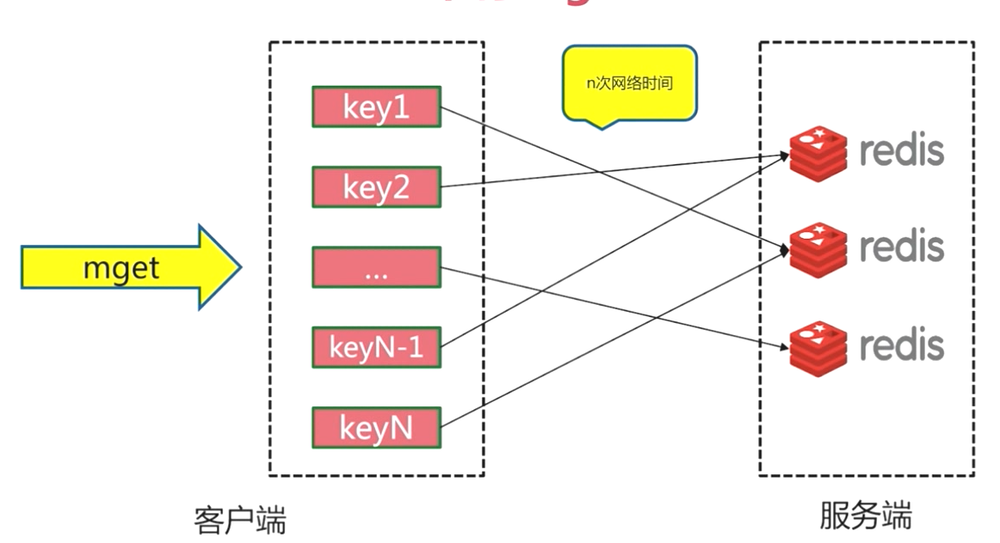

## 集群伸缩

### 伸缩原理


### 扩容集群

#### 准备新节点

> 新节点：
>
> - 集群模式
> - 配置和其他节点统一
> - 启动后是孤儿节点
>
> 


#### 加入集群


> 加入集群的作用：
>
> - 为它迁移槽和数据实现扩容
> - 作为从节点负责故障转移


```sh
# 添加节点，把新节点加入到指定的集群，默认添加主节点
add-node    new_host:new_port existing_host:existing_port  
                 --cluster-slave                          # 新节点作为从节点，默认随机一个主节点
                 --cluster-master-id <arg>                # 给新节点指定主节点
 
# 例如
redis-cli --cluster add-node 127.0.0.1:6385 127.0.0.1:6379

# 通常建议使用 redis-cli --cluster 进行节点加入集群。这样做的好处是，会提前检测要加入的节点是否是孤儿节点，还是已经在其他集群中的节点。避免出现两个不相关的集群，因为这个几点的加入导致 meet 之后完全混合，造成混乱或者故障
```


#### 迁移槽和数据

- 槽迁移计划

  > 步骤一：计算加入新节点后平均槽数量
  >
  >   
  >
  > 
  >
  > 步骤二：将旧节点多余的槽和数据迁移到新节点中
  >
  > 

- 迁移数据

  

  

  

#### 扩容集群操作演示

```sh
# 首先查看下目前已经存在的集群节点情况
[root@localhost config]# ps -ef | grep redis
root     26021     1  0 08:31 ?        00:00:10 redis-server *:8000 [cluster]
root     26026     1  0 08:31 ?        00:00:10 redis-server *:8001 [cluster]
root     26031     1  0 08:31 ?        00:00:10 redis-server *:8002 [cluster]
root     26036     1  0 08:31 ?        00:00:10 redis-server *:8003 [cluster]
root     26041     1  0 08:31 ?        00:00:10 redis-server *:8004 [cluster]
root     26046     1  0 08:32 ?        00:00:10 redis-server *:8005 [cluster]
root     26137  5433  0 12:15 pts/0    00:00:00 grep --color=auto redis


# 准备 9000 9001 新孤儿节点并启动
[root@localhost config]# sed 's/8000/9000/g' redis-8000.conf > redis-9000.conf
[root@localhost config]# sed 's/8000/9001/g' redis-8000.conf > redis-9001.conf
# 启动
[root@localhost config]# redis-server redis-9000.conf
[root@localhost config]# redis-server redis-9001.conf
# 查看节点处于孤立状态，并没有和 8000-8005 集群建立沟通
[root@localhost config]# redis-cli -p 9000 cluster nodes
c003a55510736491faf56c6903d97b01dd475a65 :9000@19000 myself,master - 0 0 0 connected


# 通过 meet 加入集群中
[root@localhost config]# redis-cli -p 8000 cluster meet 127.0.0.1 9000
OK
[root@localhost config]# redis-cli -p 8000 cluster meet 127.0.0.1 9001
OK
# 再次查看节点状态已经在集群中
[root@localhost config]# redis-cli -p 9000 cluster nodes
c003a55510736491faf56c6903d97b01dd475a65 127.0.0.1:9000@19000 myself,master - 0 1582806623000 0 connected
29d55a809f1b61e006806550eb89212246314f44 127.0.0.1:8003@18003 slave f09285488e41d2eaa7824c6bb18400abbec64c3d 0 1582806625000 3 connected
f09285488e41d2eaa7824c6bb18400abbec64c3d 127.0.0.1:8002@18002 master - 0 1582806623429 3 connected 10923-16383
eb9e7ab3c1ecb9ad790c067b6e7913758278ef29 127.0.0.1:8001@18001 master - 0 1582806623000 2 connected 5461-10922
0505848df4f10e103a882e3dcc22ae70bf4e673f 127.0.0.1:8000@18000 master - 0 1582806622000 1 connected 0-5460
b678351f601eadf4e75bead21e8f8f1e0553f62e 127.0.0.1:9001@19001 master - 0 1582806625514 7 connected
5bb09992da6780e49e16c4685f78a712285dfa04 127.0.0.1:8004@18004 slave 0505848df4f10e103a882e3dcc22ae70bf4e673f 0 1582806621000 1 connected
00ef8024991c29114b9fb44a1814e6cefb8bbbe9 127.0.0.1:8005@18005 slave eb9e7ab3c1ecb9ad790c067b6e7913758278ef29 0 1582806624461 2 connected


# 设置 9000 为 9001 从节点
[root@localhost config]# redis-cli -p 9000 cluster replicate b678351f601eadf4e75bead21e8f8f1e0553f62e
OK
[root@localhost config]# redis-cli -p 9000 cluster nodes
c003a55510736491faf56c6903d97b01dd475a65 127.0.0.1:9000@19000 myself,slave b678351f601eadf4e75bead21e8f8f1e0553f62e 0 1582806762000 0 connected # 已经变为从节点
29d55a809f1b61e006806550eb89212246314f44 127.0.0.1:8003@18003 slave f09285488e41d2eaa7824c6bb18400abbec64c3d 0 1582806761170 3 connected
f09285488e41d2eaa7824c6bb18400abbec64c3d 127.0.0.1:8002@18002 master - 0 1582806762000 3 connected 10923-16383
eb9e7ab3c1ecb9ad790c067b6e7913758278ef29 127.0.0.1:8001@18001 master - 0 1582806764298 2 connected 5461-10922
0505848df4f10e103a882e3dcc22ae70bf4e673f 127.0.0.1:8000@18000 master - 0 1582806760000 1 connected 0-5460
b678351f601eadf4e75bead21e8f8f1e0553f62e 127.0.0.1:9001@19001 master - 0 1582806761000 7 connected
5bb09992da6780e49e16c4685f78a712285dfa04 127.0.0.1:8004@18004 slave 0505848df4f10e103a882e3dcc22ae70bf4e673f 0 1582806762211 1 connected
00ef8024991c29114b9fb44a1814e6cefb8bbbe9 127.0.0.1:8005@18005 slave eb9e7ab3c1ecb9ad790c067b6e7913758278ef29 0 1582806763256 2 connected


# 虽然加入了集群，并且设置好了主从，但是由于没有分配槽，所以现在的 9001 还是不能投入使用的
# 接下来使用 --cluster reshard 进行槽数据迁移。有两种方式，一种是写全参数直接迁移，一种是不带参数根据
# 提示进行交互操作，这里使用后者演示
[root@localhost config]# redis-cli --cluster reshard 127.0.0.1:8000
>>> Performing Cluster Check (using node 127.0.0.1:8000)
M: 0505848df4f10e103a882e3dcc22ae70bf4e673f 127.0.0.1:8000
   slots:[0-5460] (5461 slots) master
   1 additional replica(s)
M: b678351f601eadf4e75bead21e8f8f1e0553f62e 127.0.0.1:9001
   slots: (0 slots) master
   1 additional replica(s)
S: 5bb09992da6780e49e16c4685f78a712285dfa04 127.0.0.1:8004
   slots: (0 slots) slave
   replicates 0505848df4f10e103a882e3dcc22ae70bf4e673f
S: c003a55510736491faf56c6903d97b01dd475a65 127.0.0.1:9000
   slots: (0 slots) slave
   replicates b678351f601eadf4e75bead21e8f8f1e0553f62e
S: 00ef8024991c29114b9fb44a1814e6cefb8bbbe9 127.0.0.1:8005
   slots: (0 slots) slave
   replicates eb9e7ab3c1ecb9ad790c067b6e7913758278ef29
S: 29d55a809f1b61e006806550eb89212246314f44 127.0.0.1:8003
   slots: (0 slots) slave
   replicates f09285488e41d2eaa7824c6bb18400abbec64c3d
M: eb9e7ab3c1ecb9ad790c067b6e7913758278ef29 127.0.0.1:8001
   slots:[5461-10922] (5462 slots) master
   1 additional replica(s)
M: f09285488e41d2eaa7824c6bb18400abbec64c3d 127.0.0.1:8002
   slots:[10923-16383] (5461 slots) master
   1 additional replica(s)
[OK] All nodes agree about slots configuration.
>>> Check for open slots...
>>> Check slots coverage...
[OK] All 16384 slots covered.
# 希望迁移多少个槽，在迁移计划中已经计算出了增加一个节点后的平均槽数值是 4096
How many slots do you want to move (from 1 to 16384)? 4096	
# 希望那个节点 ID 来接收这些迁移的槽，就是我们新增的 9001 
What is the receiving node ID?
# 选择提供您槽迁移的源节点，如果是全部就填入 all。如果要指定个别则输入节点 id 后 输入 done 完成
Please enter all the source node IDs.
  Type 'all' to use all the nodes as source nodes for the hash slots.
  Type 'done' once you entered all the source nodes IDs.
Source node #1: all
....
....
 	Moving slot 12285 from f09285488e41d2eaa7824c6bb18400abbec64c3d
    Moving slot 12286 from f09285488e41d2eaa7824c6bb18400abbec64c3d
    Moving slot 12287 from f09285488e41d2eaa7824c6bb18400abbec64c3d
# 是否想继续这个过程？
Do you want to proceed with the proposed reshard plan (yes/no)? yes
....
....
Moving slot 11297 from 127.0.0.1:8002 to 127.0.0.1:9001:
Moving slot 11298 from 127.0.0.1:8002 to 127.0.0.1:9001:
....
....


# 迁移完成，我们查看下现在槽的情况
[root@localhost config]# redis-cli -p 8000 cluster slots
1) 1) (integer) 0
   2) (integer) 1364
   3) 1) "127.0.0.1"
      2) (integer) 9001
      3) "b678351f601eadf4e75bead21e8f8f1e0553f62e"
   4) 1) "127.0.0.1"
      2) (integer) 9000
      3) "c003a55510736491faf56c6903d97b01dd475a65"
2) 1) (integer) 5461
   2) (integer) 6826
   3) 1) "127.0.0.1"
      2) (integer) 9001
      3) "b678351f601eadf4e75bead21e8f8f1e0553f62e"
   4) 1) "127.0.0.1"
      2) (integer) 9000
      3) "c003a55510736491faf56c6903d97b01dd475a65"
3) 1) (integer) 10923
   2) (integer) 12287
   3) 1) "127.0.0.1"
      2) (integer) 9001
      3) "b678351f601eadf4e75bead21e8f8f1e0553f62e"
   4) 1) "127.0.0.1"
      2) (integer) 9000
      3) "c003a55510736491faf56c6903d97b01dd475a65"
4) 1) (integer) 1365
   2) (integer) 5460
   3) 1) "127.0.0.1"
      2) (integer) 8000
      3) "0505848df4f10e103a882e3dcc22ae70bf4e673f"
   4) 1) "127.0.0.1"
      2) (integer) 8004
      3) "5bb09992da6780e49e16c4685f78a712285dfa04"
5) 1) (integer) 6827
   2) (integer) 10922
   3) 1) "127.0.0.1"
      2) (integer) 8001
      3) "eb9e7ab3c1ecb9ad790c067b6e7913758278ef29"
   4) 1) "127.0.0.1"
      2) (integer) 8005
      3) "00ef8024991c29114b9fb44a1814e6cefb8bbbe9"
6) 1) (integer) 12288
   2) (integer) 16383
   3) 1) "127.0.0.1"
      2) (integer) 8002
      3) "f09285488e41d2eaa7824c6bb18400abbec64c3d"
   4) 1) "127.0.0.1"
      2) (integer) 8003
      3) "29d55a809f1b61e006806550eb89212246314f44"
      
[root@localhost config]# redis-cli -p 8000 cluster nodes
b678351f601eadf4e75bead21e8f8f1e0553f62e 127.0.0.1:9001@19001 master - 0 1582824150000 7 connected 0-1364 5461-6826 10923-12287			# 这里有从另外三个节点迁移过来的三段槽数据
5bb09992da6780e49e16c4685f78a712285dfa04 127.0.0.1:8004@18004 slave 0505848df4f10e103a882e3dcc22ae70bf4e673f 0 1582824152695 5 connected
c003a55510736491faf56c6903d97b01dd475a65 127.0.0.1:9000@19000 slave b678351f601eadf4e75bead21e8f8f1e0553f62e 0 1582824151666 7 connected
00ef8024991c29114b9fb44a1814e6cefb8bbbe9 127.0.0.1:8005@18005 slave eb9e7ab3c1ecb9ad790c067b6e7913758278ef29 0 1582824150000 6 connected
0505848df4f10e103a882e3dcc22ae70bf4e673f 127.0.0.1:8000@18000 myself,master - 0 1582824149000 1 connected 1365-5460
29d55a809f1b61e006806550eb89212246314f44 127.0.0.1:8003@18003 slave f09285488e41d2eaa7824c6bb18400abbec64c3d 0 1582824149000 4 connected
eb9e7ab3c1ecb9ad790c067b6e7913758278ef29 127.0.0.1:8001@18001 master - 0 1582824149576 2 connected 6827-10922
f09285488e41d2eaa7824c6bb18400abbec64c3d 127.0.0.1:8002@18002 master - 0 1582824150618 3 connected 12288-16383

```


### 缩容集群


#### 下线迁移槽

和扩容迁移槽大致差不多，将要下线节点的槽均匀的迁移到其他节点中去


#### 忘记节点

这里有个 60s 有效的意思说，要忘记某个节点，要让集群中的所有节点都指向这个命令，否则只要有一个没有执行 60s  该节点任然未被忘记。


#### 关闭节点  


#### 缩容集群操作演示

```sh
# 查看下当前集群情况
[root@localhost config]# redis-cli -p 8000 cluster nodes
b678351f601eadf4e75bead21e8f8f1e0553f62e 127.0.0.1:9001@19001 master - 0 1582828634000 7 connected 0-1364 5461-6826 10923-12287
5bb09992da6780e49e16c4685f78a712285dfa04 127.0.0.1:8004@18004 slave 0505848df4f10e103a882e3dcc22ae70bf4e673f 0 1582828635267 5 connected
c003a55510736491faf56c6903d97b01dd475a65 127.0.0.1:9000@19000 slave b678351f601eadf4e75bead21e8f8f1e0553f62e 0 1582828637347 7 connected
00ef8024991c29114b9fb44a1814e6cefb8bbbe9 127.0.0.1:8005@18005 slave eb9e7ab3c1ecb9ad790c067b6e7913758278ef29 0 1582828636000 6 connected
0505848df4f10e103a882e3dcc22ae70bf4e673f 127.0.0.1:8000@18000 myself,master - 0 1582828635000 1 connected 1365-5460
29d55a809f1b61e006806550eb89212246314f44 127.0.0.1:8003@18003 slave f09285488e41d2eaa7824c6bb18400abbec64c3d 0 1582828639452 4 connected
eb9e7ab3c1ecb9ad790c067b6e7913758278ef29 127.0.0.1:8001@18001 master - 0 1582828637000 2 connected 6827-10922
f09285488e41d2eaa7824c6bb18400abbec64c3d 127.0.0.1:8002@18002 master - 0 1582828638393 3 connected 12288-16383


# 这里我们首先将 9001 的三段槽 分别迁移到 8000 8001 8002 中
# 使用 --cluster reshard 带参数命令进行迁移


# 0-1365 从 9001 迁移至 8000
[root@localhost config]# redis-cli --cluster reshard 127.0.0.1:8000 --cluster-from b678351f601eadf4e75bead21e8f8f1e0553f62e --cluster-to 0505848df4f10e103a882e3dcc22ae70bf4e673f --cluster-slots 1365 --cluster-yes yes
....
Moving slot 1363 from 127.0.0.1:9001 to 127.0.0.1:8000:
Moving slot 1364 from 127.0.0.1:9001 to 127.0.0.1:8000:


# 5461-6826 从 9001 迁移至 8001
[root@localhost config]# redis-cli --cluster reshard 127.0.0.1:8000 --cluster-from b678351f601eadf4e75bead21e8f8f1e0553f62e --cluster-to eb9e7ab3c1ecb9ad790c067b6e7913758278ef29 --cluster-slots 1365 --cluster-yes yes
....
Moving slot 6800 from 127.0.0.1:9001 to 127.0.0.1:8001:
Moving slot 6801 from 127.0.0.1:9001 to 127.0.0.1:8001:
....


# 10923-12287 从 9001 迁移至 8002
[root@localhost config]# redis-cli --cluster reshard 127.0.0.1:8000 --cluster-from b678351f601eadf4e75bead21e8f8f1e0553f62e --cluster-to f09285488e41d2eaa7824c6bb18400abbec64c3d --cluster-slots 1365 --cluster-yes yes
....
Moving slot 12266 from 127.0.0.1:9001 to 127.0.0.1:8002:
Moving slot 12267 from 127.0.0.1:9001 to 127.0.0.1:8002:
....


# 再次检查下集群的情况 
[root@localhost config]# redis-cli -p 8000 cluster nodes
b678351f601eadf4e75bead21e8f8f1e0553f62e 127.0.0.1:9001@19001 master - 0 1582839468641 7 connected		# 可以看到当前节点已经没有任何槽数据了
5bb09992da6780e49e16c4685f78a712285dfa04 127.0.0.1:8004@18004 slave 0505848df4f10e103a882e3dcc22ae70bf4e673f 0 1582839467000 8 connected
c003a55510736491faf56c6903d97b01dd475a65 127.0.0.1:9000@19000 slave f09285488e41d2eaa7824c6bb18400abbec64c3d 0 1582839465000 10 connected
00ef8024991c29114b9fb44a1814e6cefb8bbbe9 127.0.0.1:8005@18005 slave eb9e7ab3c1ecb9ad790c067b6e7913758278ef29 0 1582839469684 11 connected
0505848df4f10e103a882e3dcc22ae70bf4e673f 127.0.0.1:8000@18000 myself,master - 0 1582839466000 12 connected 0-5461
29d55a809f1b61e006806550eb89212246314f44 127.0.0.1:8003@18003 slave f09285488e41d2eaa7824c6bb18400abbec64c3d 0 1582839467595 10 connected
eb9e7ab3c1ecb9ad790c067b6e7913758278ef29 127.0.0.1:8001@18001 master - 0 1582839467000 11 connected 5462-10922
f09285488e41d2eaa7824c6bb18400abbec64c3d 127.0.0.1:8002@18002 master - 0 1582839466000 10 connected 10923-16383


# 槽迁移完成后，就要进行节点忘记和关闭。这个操作都集成在了 --cluster del-node 中
# 非常重要的一个顺序是，删除节点要先从后主，否则先主后从，会触发从节点的故障转移

# 我这里是 9000 是从节点，先删除
[root@localhost config]# redis-cli --cluster del-node 127.0.0.1:8000 c003a55510736491faf56c6903d97b01dd475a65
>>> Removing node c003a55510736491faf56c6903d97b01dd475a65 from cluster 127.0.0.1:8000
>>> Sending CLUSTER FORGET messages to the cluster...		# 忘记节点
>>> SHUTDOWN the node.										# 关闭节点
# 再删除主节点 9001
[root@localhost config]# redis-cli --cluster del-node 127.0.0.1:8000 b678351f601eadf4e75bead21e8f8f1e0553f62e
>>> Removing node b678351f601eadf4e75bead21e8f8f1e0553f62e from cluster 127.0.0.1:8000
>>> Sending CLUSTER FORGET messages to the cluster...
>>> SHUTDOWN the node.

# 再次查看集群信息，已经没有了 9000 9001 的节点信息了吧 
[root@localhost config]# redis-cli -p 8000 cluster nodes
5bb09992da6780e49e16c4685f78a712285dfa04 127.0.0.1:8004@18004 slave 0505848df4f10e103a882e3dcc22ae70bf4e673f 0 1582839897000 12 connected
00ef8024991c29114b9fb44a1814e6cefb8bbbe9 127.0.0.1:8005@18005 slave eb9e7ab3c1ecb9ad790c067b6e7913758278ef29 0 1582839898404 11 connected
0505848df4f10e103a882e3dcc22ae70bf4e673f 127.0.0.1:8000@18000 myself,master - 0 1582839899000 12 connected 0-5461
29d55a809f1b61e006806550eb89212246314f44 127.0.0.1:8003@18003 slave f09285488e41d2eaa7824c6bb18400abbec64c3d 0 1582839900501 10 connected
eb9e7ab3c1ecb9ad790c067b6e7913758278ef29 127.0.0.1:8001@18001 master - 0 1582839899444 11 connected 5462-10922
f09285488e41d2eaa7824c6bb18400abbec64c3d 127.0.0.1:8002@18002 master - 0 1582839897350 10 connected 10923-16383
```


## 客户端路由

### moved 重定向

#### 流程


#### cluster keyslot

> cluster keyslost  key
>
> 我们可以使用这个命令来查看 key 对应槽的值，例如：
>
> [root@localhost config]# redis-cli -p 8000 cluster keyslot hello
>
> (integer) 866


#### 槽命中流程


#### 槽不命中 ， moved 异常流程


#### 流程演示

```sh
# 链接 8000  节点
[root@localhost config]# redis-cli -p 8000
# 查看 8000 节点负责的槽数据范围
127.0.0.1:8000> cluster slots
1) 1) (integer) 0
   2) (integer) 5461
   3) 1) "127.0.0.1"
      2) (integer) 8000
      3) "0505848df4f10e103a882e3dcc22ae70bf4e673f"
   4) 1) "127.0.0.1"
      2) (integer) 8004
      3) "5bb09992da6780e49e16c4685f78a712285dfa04"
2) 1) (integer) 5462
   2) (integer) 10922
   3) 1) "127.0.0.1"
      2) (integer) 8001
      3) "eb9e7ab3c1ecb9ad790c067b6e7913758278ef29"
   4) 1) "127.0.0.1"
      2) (integer) 8005
      3) "00ef8024991c29114b9fb44a1814e6cefb8bbbe9"
3) 1) (integer) 10923
   2) (integer) 16383
   3) 1) "127.0.0.1"
      2) (integer) 8002
      3) "f09285488e41d2eaa7824c6bb18400abbec64c3d"
   4) 1) "127.0.0.1"
      2) (integer) 8003
      3) "29d55a809f1b61e006806550eb89212246314f44"
      
# 发生了moved 异常
127.0.0.1:8000> set php bestlanguage
(error) MOVED 9244 127.0.0.1:8001
# 这里需要退出去手动链接 8001 ，然后在执行命令
127.0.0.1:8000> exit

# 可以看到上面的方式比较麻烦，我们可以使用 -c （开启 cluster ）模式链接客户端
[root@localhost config]# redis-cli -c -p 8000
127.0.0.1:8000> set php bestlanuage
# 可以看到 -c 模式下产生 moved 异常，自动切换到对应节点去执行，并返回相应结果
-> Redirected to slot [9244] located at 127.0.0.1:8001
OK
# 现在已经能到了 8001 节点了
127.0.0.1:8001> get php
"bestlanuage"
```


### ask 重定向

生产环境中数据比较多，槽迁移可能导致客户端访问的时候触发 ask 重定向


#### 流程


moved 和 ask 区别

| 异常情况 | 触发流程     | 槽迁移状态     |
| -------- | ------------ | -------------- |
| moved    | 客户端重定向 | 已确定迁移完成 |
| ask      | 客户端重定向 | 槽还在迁移中   |


### 思考？

​	

​     在集群模式下，用客户端去随机访问几点，直接命中的可能性比较低，假设集群内有 100 个节点 ，命中率就是 1/100。并且不命中就会触发 moved 或者 ask 重定向流程，这会导致访问性能时间受损，如何在大集群，大量访问的情况下还能保持随机访问的命中率以及性能？ 


### smart 客户端

#### 原理：追求性能 

1. 从集群中选取一个可运行节点，使用 cluster slots 初始化槽和节点映射
2. 将  cluster slots 的结果映射到本地，为每个节点创建 redisPool 连接池。
3. 准备执行命令


#### 执行命令大致流程


## 批量操作优化

类似  `mget` ，`mset`  这样原子操作是需要必须在一个节点上执行的，在集群模式下 ，但是由于 key 的槽值可能导致这一批并不可能所有都在这一个节点的槽值范围内，那么 这种情况要怎么处理呢。有四种 批量优化的方法：

### 串行 mget

 通过  for  循环遍历每个  key  去对应节点执行




### 串行  IO

其实就是在本地做一次  key  的内聚 ，将相同槽范围的 key 归类出来，然后在分开去对应的节点执行 pipeline 操作 


###  并行 IO

在串行  IO 的基础上，使用多线程去执行


### Hash_tag 

**当一个key包含 {} 的时候，就不对整个key做hash，而仅对 {} 包括的字符串做hash。**假设hash算法为sha1。对user:{user1}:ids和user:{user1}:tweets，其hash值都等同于sha1(user1)。

**这样就达到了即要求key尽可能地分散到不同机器，又要求某些相关联的key分配到相同机器。**


### 四种方案的优缺点对比

| 方案     | 优点                                   | 缺点                                                 | 网络IO            |
| -------- | -------------------------------------- | ---------------------------------------------------- | ----------------- |
| 串行mget | 编程简单<br />满足少量 keys 的情况下   | 大量 keys 请求次数多网络延迟严重                     | O(keys)           |
| 串行IO   | 编程简单<br />瞒住节点不多的情况下     | 集群中有大量节点会导致网络请求次数多延迟严重         | O(nodes)          |
| 并行IO   | 利用并行特性<br />延迟取决于最慢的节点 | 编程复杂，多线程~<br />超时定位问题难                | O(max_slow(node)) |
| Hash_tag | 性能最高                               | 读写增加 tag 维护成本<br />tag分布易出现数据倾斜问题 | O(1)              |


## cluster 的故障转移

Redis-cluster 自身实现了高可用，和 Redis-sentinel 不通，并不是通过 sentinel 节点来实现监控、故障转移。 

### 故障发现

#### 通过 ping/pong 消息实现故障发现：不需要 sentinel

#### 主观下线和客观下线

- 主观下线

  定义：某个节点认为另一个节点不可用，“偏见”

  

  下线流程：

  

  

- 客观下线

  定义：当半数以上持有槽的主节点都标记某节点主观下线

  

  下线流程：

  

  

  尝试客观下线： 

  

  用途：

  - 通知集群内所有节点标记故障节点为客观下线
  - 通知故障节点的从节点触发故障转移流程

  ​	


### 故障恢复

#### 资格检查

- 每个从节点检查与故障主节点的断线时间
- 超过 cluster-node-timeout * cluster-slave-validity-factor 取消资格。
- Cluster-slave-validity-factor：默认是 10


#### 准备选举时间

通常偏移量最大，最接近主节点的从节点能相对更早完成选举准备时间，也就更容易成为主节点


#### 选举投票

早完成选举准备的节点，也会更早的又大几率获得更多的投票，所以成为主节点的概率更大


#### 替换主节点

- 当前从节点取消复制，变为主节点。（slaveof no one）
- 执行 cluster  delslot 撤销故障主节点负责的槽，并执行 cluster  addslot 把这些槽分配给自己。
- 向集群广播自己的 pong 消息，表明已经替换了故障节点


### 故障转移演练

执行 kill -9 节点进程号，模拟宕机


```sh
# 首先来查看下集群，情况以及进程号
[root@localhost config]# ps -ef | grep redis-server
root     27666     1  0 06:07 ?        00:00:03 redis-server *:8000 [cluster]
root     27698     1  0 06:08 ?        00:00:02 redis-server *:8001 [cluster]
root     27703     1  0 06:08 ?        00:00:02 redis-server *:8002 [cluster]
root     27708     1  0 06:09 ?        00:00:02 redis-server *:8003 [cluster]
root     27718     1  0 06:09 ?        00:00:02 redis-server *:8005 [cluster]
root     27789     1  0 06:28 ?        00:00:01 redis-server *:8004 [cluster]
root     27823  5433  0 07:04 pts/0    00:00:00 grep --color=auto redis-server


[root@localhost config]# redis-cli -c -p 8000 cluster nodes
5bb09992da6780e49e16c4685f78a712285dfa04 127.0.0.1:8004@18004 slave 6e82918c471622d72672a134f8e6281e669cd168 0 1582959902814 17 connected
7cbeb6da5c16d4b3400a6a5cfa923197a57cff60 127.0.0.1:8005@18005 slave a1cb54adfbf7483288dace615b54fe81bc4f7729 0 1582959903861 6 connected
a9e9e6f350c2ee0a5da4f1b940ceb5621b686822 127.0.0.1:8002@18002 master - 0 1582959903000 3 connected 10923-16383
a1cb54adfbf7483288dace615b54fe81bc4f7729 127.0.0.1:8001@18001 master - 0 1582959900000 2 connected 5462-10922
6e82918c471622d72672a134f8e6281e669cd168 127.0.0.1:8000@18000 myself,master - 0 1582959901000 17 connected 0-5461
51ecd769b578505bff579de582365e4b196c028b 127.0.0.1:8003@18003 slave a9e9e6f350c2ee0a5da4f1b940ceb5621b686822 0 1582959902000 4 connected


# 我们先去吧日志清理掉
[root@localhost config]# cd ..
[root@localhost redis]# cd data/
[root@localhost data]# ls
7000.log  7005.log  8004.log       dump-7001.rdb  dump-8000.rdb  dump-8005.rdb    nodes-7002.conf  nodes-8001.conf  nodes-9000.conf
7001.log  8000.log  8005.log       dump-7002.rdb  dump-8001.rdb  dump-9000.rdb    nodes-7003.conf  nodes-8002.conf  nodes-9001.conf
7002.log  8001.log  9000.log       dump-7003.rdb  dump-8002.rdb  dump-9001.rdb    nodes-7004.conf  nodes-8003.conf
7003.log  8002.log  9001.log       dump-7004.rdb  dump-8003.rdb  nodes-7000.conf  nodes-7005.conf  nodes-8004.conf
7004.log  8003.log  dump-7000.rdb  dump-7005.rdb  dump-8004.rdb  nodes-7001.conf  nodes-8000.conf  nodes-8005.conf
# 删除所有 log 文件
[root@localhost data]# rm -rf *
[root@localhost data]# ls


# 模拟宕机，kill 8000 端口对应进程
[root@localhost data]# kill -9 27666

# 再次查看集群槽信息
[root@localhost data]# redis-cli -p 8001 cluster slots
1) 1) (integer) 0
   2) (integer) 5461
   3) 1) "127.0.0.1"
      2) (integer) 8004
      3) "5bb09992da6780e49e16c4685f78a712285dfa04"
2) 1) (integer) 10923
   2) (integer) 16383
   3) 1) "127.0.0.1"
      2) (integer) 8002
      3) "a9e9e6f350c2ee0a5da4f1b940ceb5621b686822"
   4) 1) "127.0.0.1"
      2) (integer) 8003
      3) "51ecd769b578505bff579de582365e4b196c028b"
3) 1) (integer) 5462
   2) (integer) 10922
   3) 1) "127.0.0.1"
      2) (integer) 8001
      3) "a1cb54adfbf7483288dace615b54fe81bc4f7729"
   4) 1) "127.0.0.1"
      2) (integer) 8005
      3) "7cbeb6da5c16d4b3400a6a5cfa923197a57cff60"


# 查看集群节点信息，可以看出 8000 状态已经是客观下线装填 fail 。并且结合上面的集群槽信息得知
# 8000 的从节点  8004 已经代替 8000 新的主节点
[root@localhost data]# redis-cli -p 8001 cluster nodes
5bb09992da6780e49e16c4685f78a712285dfa04 127.0.0.1:8004@18004 master - 0 1582960051377 18 connected 0-5461		# 8004成为新主节点，并且获得了槽数据
a9e9e6f350c2ee0a5da4f1b940ceb5621b686822 127.0.0.1:8002@18002 master - 0 1582960050342 3 connected 10923-16383
a1cb54adfbf7483288dace615b54fe81bc4f7729 127.0.0.1:8001@18001 myself,master - 0 1582960050000 2 connected 5462-10922
6e82918c471622d72672a134f8e6281e669cd168 127.0.0.1:8000@18000 master,fail - 1582959991689 1582959991484 17 disconnected  # 8000 节点标记为已客观下线状态
51ecd769b578505bff579de582365e4b196c028b 127.0.0.1:8003@18003 slave a9e9e6f350c2ee0a5da4f1b940ceb5621b686822 0 1582960049319 4 connected
7cbeb6da5c16d4b3400a6a5cfa923197a57cff60 127.0.0.1:8005@18005 slave a1cb54adfbf7483288dace615b54fe81bc4f7729 0 1582960048289 6 connected

# 后续从起 8000 节点只要通过 meet 加入集群，并且 replicate 从新成为 8004 的从节点就可以接续使用了
```


## Redis cluster 开发运维常见问题

### 集群完整性

- Cluster-require-full-coverage 默认为 yes

  - 集群中 16384 个槽全部可用：保证集群完整性

  - 节点故障或正在故障转移：

    （error）CLUSTERDOWN  The cluster is down

- 大多数业务无法容忍，cluster-require-full-coverage 建议设置为 no 


###  带宽消耗

- 官方建议：最大 1000 个节点

- ping/pong 消息

- Gossip 协议在节点中交换信息的时候，不可忽视的会有带宽消耗

  

#### 消耗主要体现在三个方面

- 消息发送频率：节点发现与其他节点最后通信时间超过 cluster-node-timeout/2 时会直接发送 Ping 消息
- 消息数据量：slots 槽数组(2KB 空间) 和整个集群 1/10 的状态数据（10 个节点状态数据约 1KB）
- 节点部署的机器规模：集群分布的机器越多且每台机器划分的节点数越均匀，则集群内整体的可用带宽越高


#### 优化

- 避免 "大" 集群：避免你多个业务使用一个集群，大业务可以多集群。
- Cluster-node-timeout：带宽和故障转移速度的均衡。
- 尽量均匀分配到多个机器上：保证高可用和带宽


### Pub/Sub 广播

对集群中任意一个节点进行消息发布，会导致传播到其他所有节点。

- 导致的问题：publish 在集群每个节点广播，加重带宽

  

  演示：在集群中，向 8000 节点发送广播，其余节点也收到了扩散广播，例如在8001、8002，都能订阅信息

  

- 解决：需要 pub/sub 广播功能，单独 ”走“ 一套 Redis sentinel


### 集群倾斜

#### 数据倾斜

- 节点和槽分配不均

  - redis-cli --cluster  info ip:port   查看节点、槽 、键值分布

  - redis-cli --cluster  rebalance ip:port  进行均衡（谨慎使用，会导致数据迁移）

    ```sh
    # 向集群中添加一个值，并查看集群节点、槽、键值分布
    [root@localhost config]# redis-cli -c -p 8000 set hello world
    OK
    [root@localhost config]# redis-cli --cluster  info  127.0.0.1:8000
    127.0.0.1:8004 (5bb09992...) -> 1 keys | 5462 slots | 1 slaves.
    127.0.0.1:8002 (a9e9e6f3...) -> 0 keys | 5461 slots | 1 slaves.
    127.0.0.1:8001 (a1cb54ad...) -> 0 keys | 5461 slots | 1 slaves.
    [OK] 0 keys in 3 masters.
    0.00 keys per slot on average.
    
    # 现在集群槽分布均匀，不需要进行均衡。实际生产中最好自己去做计划迁移，不要直接使用   rebalance
    [root@localhost config]# redis-cli --cluster  rebalance  127.0.0.1:8000
    >>> Performing Cluster Check (using node 127.0.0.1:8000)
    [OK] All nodes agree about slots configuration.
    >>> Check for open slots...
    >>> Check slots coverage...
    [OK] All 16384 slots covered.
    *** No rebalancing needed! All nodes are within the 2.00% threshold.
    ```

    

  

- 不同槽对应键值数量差异较大

  - CRC16  正常情况下比较均匀 
  - 可能存在  hash_tag  业务需求
  - cluster countkeysinslot {slot} 获取槽对应键值个数 

  

- 包含bigkey

  - bigkey：例如大字符串、几百万 的元素的hash、set等 

  - 从节点：redis-cli  -i ip -p port --bigkeys

    ```sh
    # 查看 8004 节点的 bigkey
    [root@localhost config]# redis-cli -p 8004 --bigkeys
    
    # Scanning the entire keyspace to find biggest keys as well as
    # average sizes per key type.  You can use -i 0.1 to sleep 0.1 sec
    # per 100 SCAN commands (not usually needed).
    
    [00.00%] Biggest string found so far 'hello' with 5 bytes
    
    -------- summary -------
    
    Sampled 1 keys in the keyspace!
    Total key length in bytes is 5 (avg len 5.00)
    
    Biggest string found 'hello' has 5 bytes
    
    1 strings with 5 bytes (100.00% of keys, avg size 5.00)
    0 lists with 0 items (00.00% of keys, avg size 0.00)
    0 sets with 0 members (00.00% of keys, avg size 0.00)
    0 hashs with 0 fields (00.00% of keys, avg size 0.00)
    0 zsets with 0 members (00.00% of keys, avg size 0.00)
    0 streams with 0 entries (00.00% of keys, avg size 0.00)
    ```

    

  - 优化：优化数据结构

  

- 内存相关配置不一致

  - hash-max-ziplist-value、set-max-intset-entries等 
  - 优化：定期 ”检查“ 配置一致性


#### 请求倾斜

- 热点key：重要的 key 或者  bigkey
- 优化：
  - 避免 bigkey
  - 热键不要用  hash_tag
  - 当一致性不高时，可以用本地缓存   +  MQ


### 读写分离

- 只读链接：集群模式的从节点不接受任何读写请求

  - 会重定向到负责槽的主节点

  - readyony命令可以读：连接级别命令

    ```sh
    # 主节点是可以直接读写的
    [root@localhost config]# redis-cli -p 8004 set hello world
    ok
    [root@localhost config]# redis-cli -p 8004 get hello
    "world"
    
    # 从节点无法读写，提示重定向
    [root@localhost config]# redis-cli -p 8000 get hello
    (error) MOVED 866 127.0.0.1:8004
    
    # 但使用 readonly 命令可以读
    [root@localhost config]# redis-cli -p 8000
    127.0.0.1:8000> get hello
    (error) MOVED 866 127.0.0.1:8004
    127.0.0.1:8000> readonly
    OK
    127.0.0.1:8000> get hello
    "world"
    ```

    

- 读写分离：更加复杂，不建议在集群中使用

  - 与单机主从同样的问题：复制延迟、读取过期数据、从节点故障
  - 修改客户端：需要知道集群从节点的池子，编程难度提高。cluster slaves {nodeId}


### 数据迁移

- 官方迁移工具：redis-cli --cluster import
  - 只能从单机迁移到集群
  - 不支持在线迁移：source 需要停写
  - 不支持断点续传，迁移过程中如果出故障了，不会记录已迁移数据状态
  - 单线程迁移：如果数据量比较大，影响数据
- 在线迁移工具：
  - Redis-migrate-tool
  - Redis-port


### 集群 VS 单机

#### 集群的限制

- Key 批量操作支持有线：例如 mget、mset 必须在一个 slot 上
- key 事物和 Lua 支持有限：操作的 key 必须在一个节点
- key 是数据分区的最小力度：不支持 bigkey 分区
- 不支持多个数据库： 集群模式下只有一个 db 0
- 复制只支持一层：不支持树形复制结构


#### Redis-cluster 不一定好

1. Redis Cluster：满足容量和性能的扩展性，很多业务“不需要”。
   - 大多数客户端新能会“降低”。
   - 命令无法跨节点使用： mget   keys   scan   flush  sinter 等
   - Lua 和事物无法跨节点使用
   - 客户端维护更复杂： SDK 和应用本身消耗（例如更多的链接池）
2. 很多场景 Redis Sentinel 已经足够好了