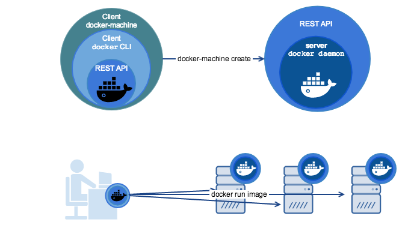
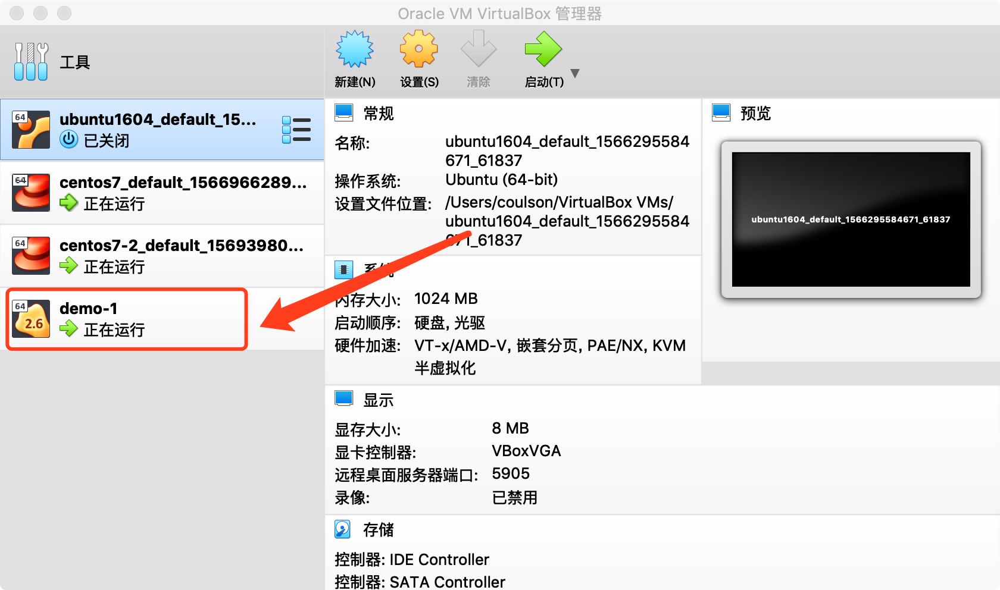

# 

#### 什么是Docker Engine

Docker Engine，也就是人们嘴里边常说的“docker”。Docker我们一般理解的，都是C/S模型，用户通过docker client向docker daemon发送REST 请求。

Docker Engine包括这么几个部分：

- Docker Daemon — docker 的守护进程，属于C/S中的server
- Docker REST API — docker daemon向外暴露的REST 接口
- Docker CLI — docker向外暴露的命令行接口（Command Line API）


​	客户端访问服务端的方式有两种，一种是使用命令行工具，比如docker run， docker ps…等等。另一种就是直接通过调用REST API，比如发送一个curl http请求。


#### 什么是Docker Machine

> Docker Machine是官方提供的一个工具，可以帮助我们在远程的机器上或者虚拟主机上安装Docker Engine，并使用 `docker-machine`命令来管理这些虚拟主机。

​	使用 docker-machine命令，你可以启动、查看、停止以及重启一个主机，升级Docker client和daemon，配置一个Docker client与你的主机进行通信。

​	简单说Docker Machine可以用来批量安装docker、配置管理docker远程主机，而主机可以是物理机、虚拟机，甚至是云主机。


#### Docker Machine 与 Docker Engine 的区别

- Docker Engine 主要用来接收和处理docker命令请求的。
- Docker Machine则主要用来管理 docker化的 host (安装了Docker Engine的主机)。




#### Docker Machine 的使用

​	在我的Mac 上使用，当安装好了docker以后就已经有了docker-machine

```
// 查看版本号
coulson@CoulsondeMBP  ~/Desktop  docker-machine version
docker-machine version 0.16.2, build bd45ab13


// 使用 docker-machine 命令在 VirtualBox 中创建一个安装好了docker的Linux 虚拟机coulson@CoulsondeMBP  ~/Desktop  docker-machine create demo-1
Running pre-create checks...
(demo-1) Default Boot2Docker ISO is out-of-date, downloading the latest release...
(demo-1) Latest release for github.com/boot2docker/boot2docker is v18.09.9
(demo-1) Downloading /Users/coulson/.docker/machine/cache/boot2docker.iso from https://github.com/boot2docker/boot2docker/releases/download/v18.09.9/boot2docker.iso...
...
Docker is up and running!
To see how to connect your Docker Client to the Docker Engine running on this virtual machine, run: docker-machine env demo-1

// 安装完毕，查看 VirtualBox 中可以看到我们创建好的这个虚拟机
```




```
// 还可以通过命令查看通过 docker-machine 查看我们场通过命令创建的虚拟机
 coulson@CoulsondeMBP  ~/Desktop  docker-machine ls
NAME     ACTIVE   DRIVER       STATE     URL                         SWARM   DOCKER     ERRORS
demo-1   -        virtualbox   Running   tcp://192.168.99.102:2376           v18.09.9

// 进入机器   docker-machine ssh demo-1
coulson@CoulsondeMBP  ~/Desktop  docker-machine ssh demo-1
   ( '>')
  /) TC (\   Core is distributed with ABSOLUTELY NO WARRANTY.
 (/-_--_-\)           www.tinycorelinux.net


// 查看虚拟中的docker 版本信息  client/server:18.09.9
docker@demo-1:~$ docker version
Client: Docker Engine - Community
 Version:           18.09.9
 API version:       1.39
 Go version:        go1.11.13
 Git commit:        039a7df9ba
 Built:             Wed Sep  4 16:50:02 2019
 OS/Arch:           linux/amd64
 Experimental:      false

Server: Docker Engine - Community
 Engine:
  Version:          18.09.9
  API version:      1.39 (minimum version 1.12)
  Go version:       go1.11.13
  Git commit:       039a7df9ba
  Built:            Wed Sep  4 16:55:50 2019
  OS/Arch:          linux/amd64
  Experimental:     false
  
// 退出
docker@demo-1:~$ exit
logout
```


###### DK Machine 的本地使用

​	查看本机 Mac 上的docker版本信息  `client/server:19.03.2`

```
coulson@CoulsondeMBP  ~/Desktop  docker version
Client: Docker Engine - Community
 Version:           19.03.2
 API version:       1.40
 Go version:        go1.12.8
 Git commit:        6a30dfc
 Built:             Thu Aug 29 05:26:49 2019
 OS/Arch:           darwin/amd64
 Experimental:      false

Server: Docker Engine - Community
 Engine:
  Version:          19.03.2
  API version:      1.40 (minimum version 1.12)
  Go version:       go1.12.8
  Git commit:       6a30dfc
  Built:            Thu Aug 29 05:32:21 2019
  OS/Arch:          linux/amd64
  Experimental:     false
 containerd:
  Version:          v1.2.6
  GitCommit:        894b81a4b802e4eb2a91d1ce216b8817763c29fb
 runc:
  Version:          1.0.0-rc8
  GitCommit:        425e105d5a03fabd737a126ad93d62a9eeede87f
 docker-init:
  Version:          0.18.0
  GitCommit:        fec3683
  
  
// 关闭本机Mac 上的 docker，再看下只有 client 了， server 已经没有了
coulson@CoulsondeMBP  ~/Desktop  docker version
Client: Docker Engine - Community
 Version:           19.03.2
 API version:       1.40
 Go version:        go1.12.8
 Git commit:        6a30dfc
 Built:             Thu Aug 29 05:26:49 2019
 OS/Arch:           darwin/amd64
 Experimental:      false
Error response from daemon: dial unix docker.raw.sock: connect: connection refused


// 使用 docker-machine env demo-1 命令将 demo-1 环境变量导出
coulson@CoulsondeMBP  ~/Desktop  docker-machine env demo-1
export DOCKER_TLS_VERIFY="1"
export DOCKER_HOST="tcp://192.168.99.102:2376"
export DOCKER_CERT_PATH="/Users/coulson/.docker/machine/machines/demo-1"
export DOCKER_MACHINE_NAME="demo-1"
# Run this command to configure your shell:
# eval $(docker-machine env demo-1)

// 将 demo-1 的环境变量设置到本地
coulson@CoulsondeMBP  ~/Desktop  eval $(docker-machine env demo-1)
 
// 再次查看本机 Mac 中的 docker 信息。client：19.03.2   server：18.09.9 (demo-1中的docker) 
coulson@CoulsondeMBP  ~/Desktop  docker version
Client: Docker Engine - Community
 Version:           19.03.2
 API version:       1.39 (downgraded from 1.40)
 Go version:        go1.12.8
 Git commit:        6a30dfc
 Built:             Thu Aug 29 05:26:49 2019
 OS/Arch:           darwin/amd64
 Experimental:      false

Server: Docker Engine - Community
 Engine:
  Version:          18.09.9
  API version:      1.39 (minimum version 1.12)
  Go version:       go1.11.13
  Git commit:       039a7df9ba
  Built:            Wed Sep  4 16:55:50 2019
  OS/Arch:          linux/amd64
  Experimental:     false
```

​	

​	
