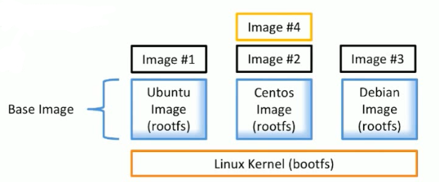

## Docker 的架构和底层技术简介

-  Docker 提供 一个开发，打包，运行APP的平台
- 把 APP 和底层 infrastructure 隔离开来


###  Docker Engine

- 后台进程（docker daemon）
- REST API Server
- CLI接口（docker）


```
// 通过命令行，可以查看我们的 docker client 和  docker server 的版本
[vagrant@localhost ~]$ docker version
Client: Docker Engine - Community
 Version:           19.03.2
 API version:       1.40
 Go version:        go1.12.8
 Git commit:        6a30dfc
 Built:             Thu Aug 29 05:28:55 2019
 OS/Arch:           linux/amd64
 Experimental:      false

Server: Docker Engine - Community
 Engine:
  Version:          19.03.2
  API version:      1.40 (minimum version 1.12)
  Go version:       go1.12.8
  Git commit:       6a30dfc
  Built:            Thu Aug 29 05:27:34 2019
  OS/Arch:          linux/amd64
  Experimental:     false
 containerd:
  Version:          1.2.6
  GitCommit:        894b81a4b802e4eb2a91d1ce216b8817763c29fb
 runc:
  Version:          1.0.0-rc8
  GitCommit:        425e105d5a03fabd737a126ad93d62a9eeede87f
 docker-init:
  Version:          0.18.0
  GitCommit:        fec3683
  
// 查看dockerd（docker daemon）的进程
[vagrant@localhost ~]$ ps -ef | grep docker
root       715     1  0 9月28 ?       00:01:43 /usr/bin/dockerd -H fd:// --containerd=/run/containerd/containerd.sock
vagrant   8693  8625  0 02:57 pts/0    00:00:00 grep --color=auto docker
```


### Docker的整体架构


&emsp;&emsp;通过docker client 提供的CLI 接口命令操作 docker host（可以是本地的docker server 也可以是云服务器其他的docker server通过 REST API 也可以操作）。从 docker 镜像仓库 Registry 中拉取需要的镜像 image 到 docker host 中然后将其运行在一个一个容器 container 中。


### 底层技术支持

&emsp;&emsp;docker 底层依赖于Linux 好多已经存在的技术

- Namespaces：做隔离 pid, net, ipc, mnt, uts 
- Contol groups：做资源限制
- Union file systems：Container 和 image 的分层


## Docker image概述

### 什么是 Image

- 文件和 meta data 的集合（root filesystem）
- 分层的，并且每一层都可以添加改变删除文件，成为一个新的image
- 不通的image 可以共享相同的layer (#4 和 #2 共享 base image)
- Image 本身是 read-only 的



&emsp;&emsp;linux 分为内核空间 Linux Kernel (bootfs) 和用户空间 (rootfs) 。上图中我们的 Base Image 就是只包含基于 bootfs（不包含 bootfs） 上的发行版本如 Ubuntu、Centos 的文件内容，就可以去共享 bootfs 内核空间，自己本身体积也就很小


### Image 的获取方式

#### Build from Dockerfile 

&emsp;&emsp;通过`Dockerfile`来构建一个 image，

#### Pull from Registry

&emsp;&emsp;通过 docker pull 命令向 [`dockerhub`](<https://hub.docker.com/search?q=&type=image>) (就类似我们的 github ,可以上传开源库到上面，也可以从上面下载别人或官方提供的开源库，这不过这里是 image) 拉取对应 image。

&emsp;&emsp;通常格式都 docker pull name:版本号   如果不加冒号和版本号，拉取的就是提供的最新版本 lastest

```
// 拉取一个官方提供，并且指定版本的 ubuntu
[vagrant@localhost ~]$ docker pull ubuntu:14.04
14.04: Pulling from library/ubuntu
a7344f52cb74: Pull complete
515c9bb51536: Pull complete
e1eabe0537eb: Pull complete
4701f1215c13: Pull complete
Digest: sha256:2f7c79927b346e436cc14c92bd4e5bd778c3bd7037f35bc639ac1589a7acfa90
Status: Downloaded newer image for ubuntu:14.04
docker.io/library/ubuntu:14.04

// 拉取一个他人上传非官方的 wordpress
[vagrant@localhost ~]$ docker pull bitnami/wordpress
Using default tag: latest
latest: Pulling from bitnami/wordpress
be50d4e619fe: Pull complete
959f54af749b: Pull complete
d4afa7b9ab9a: Pull complete
1ac9bbb86cf5: Pull complete
841a01665595: Pull complete
bcc9093b2a71: Pull complete
47e86bb9fbb7: Pull complete
cc50eb46b5c2: Pull complete
742f3b585a42: Pull complete
9cbf65b6d93b: Pull complete
c0d66aa51b18: Pull complete
57cd8b1470c6: Pull complete
58d04808520b: Pull complete
9b07413408c4: Pull complete
aa45e131ae55: Pull complete
Digest: sha256:1584c0d2927da28eaf077ebdeb2c3d9c137b290894dfbc94246e481c99a63975
Status: Downloaded newer image for bitnami/wordpress:latest
docker.io/bitnami/wordpress:latest


// docker images 查看已有的 image
[vagrant@localhost ~]$ docker images
REPOSITORY          TAG                 IMAGE ID            CREATED             SIZE
bitnami/wordpress   latest              5f642eaaeaa4        15 hours ago        432MB
ubuntu              14.04               2c5e00d77a67        4 months ago        188MB
hello-world         latest              fce289e99eb9        9 months ago        1.84kB
```

&emsp;&emsp;可以看到，虽然我们拉取了一个 ubuntu 但是也只有188MB，正如前面所说的，不包含内核空间 bootfs，所以文件精简缩小


### DIY一个Base Image

```
// 在我们创建的文件夹中编写一个 c 文件，就输出一句话
[vagrant@localhost ~]$ mkdir hello-docker
[vagrant@localhost ~]$ cd hello-docker/
[vagrant@localhost hello-docker]$ vim hello.c
     1	#include<stdio.h>
     2
     3	int main()
     4	{
     5		printf("hello docker from double\n");
     6	}
//  :wq


// 然后将其编译成可执行文件，并执行看下结果
[vagrant@localhost hello-docker]$ gcc -static hello.c -o hello
[vagrant@localhost hello-docker]$ ls
hello  hello.c
[vagrant@localhost hello-docker]$ ./hello
hello docker from double


// 在此目录下创建 Dockerfile 文件,内容很简单
// 分三步：制作base image/将 hello 添加到容器更目录/默认执行根目录下的 hello 文件
[vagrant@localhost hello-docker]$ vi Dockerfile 
FROM scratch
ADD hello /
CMD ["/hello"]
// :wq


// 构建image
[vagrant@localhost hello-docker]$ docker build -t double/hello-docker .
Sending build context to Docker daemon  864.8kB
Step 1/3 : FROM scratch
 --->
Step 2/3 : ADD hello /
 ---> cafb15b2c0d4
Step 3/3 : CMD ["/hello"]
 ---> Running in bbcb41680c46
Removing intermediate container bbcb41680c46
 ---> c4841825ff2a
Successfully built c4841825ff2a
Successfully tagged double/hello-docker:latest
[vagrant@localhost hello-docker]$ docker images
REPOSITORY            TAG                 IMAGE ID            CREATED             SIZE
double/hello-docker   latest              c4841825ff2a        7 seconds ago       861kB
bitnami/wordpress     latest              5f642eaaeaa4        33 hours ago        432MB
ubuntu                14.04               2c5e00d77a67        4 months ago        188MB
hello-world           latest              fce289e99eb9        9 months ago        1.84kB

// 运行下我们构建的 image,发现执行输出了我们编译的可执行文件
[vagrant@localhost hello-docker]$ docker run double/hello-docker
hello docker from double
```


## 什么是 Container

- 通过 Image 创建（copy）
- 在 Image layer 之上建立一个 container layer （可读写）。ps:Image 是 ready-only的
- 类比面向对象理解：image 和  container 就像 类和实例
- Image 负责 app 的存储和分发，Container 负责运行 app


## Docker  常用命令

[Docker 命令大全](<http://www.runoob.com/docker/docker-command-manual.html>)

### 操作容器

- 启动容器

```
docker run image_name

//启动容器以后台方式运行
docker run -d image_name

//启动容器以交互方式  bash
docker run -it image_name
```

- 查看容器

```
//列出当前所有正在运行的container
docker ps

//列出所有的container
docker ps -a

//列出最近一次启动的container
docker ps -l

//显示一个运行的容器里面的进程信息
docker top Name/ID  

//查看容器内部详情细节
docker inspect <id/container_name>

//
```

- 查看容器日志

```
docker logs <id/container_name>

//实时查看日志输出
docker logs -f <id/container_name> (类似 tail -f) (带上时间戳-t）
```

- 从容器里面拷贝文件/目录到本地一个路径

```
docker cp Name:/container_path to_path  
docker cp ID:/container_path to_path
```

- 删除容器

```
// 删除单个
docker rm Name/ID 

// 删除所有容器。这个有点类似数据库自查选一样，$() 用docker 命令下获取要删除 的内容
docker rm $(docker ps -aq)
// 删除所有状态是 exited 退出的容器
docker rm $(docker ps -f "status=exited" -q)
```

- 停止、启动、杀死、重启一个容器

```
docker stop Name/ID  
docker start Name/ID  
docker kill Name/ID  
docker restart name/ID
```

- **docker exec ：**在运行的容器中执行命令

```
# 语法

```


### 操作Image

- 从 docker hub 上搜索镜像 image

```
docker search image_name
```

- 拉取下载 image

```
docker pull image_name
```

- 删除镜像

```
docker rmi image_name
```

- 发布自己的镜像

```
docker push you_image_name
```

