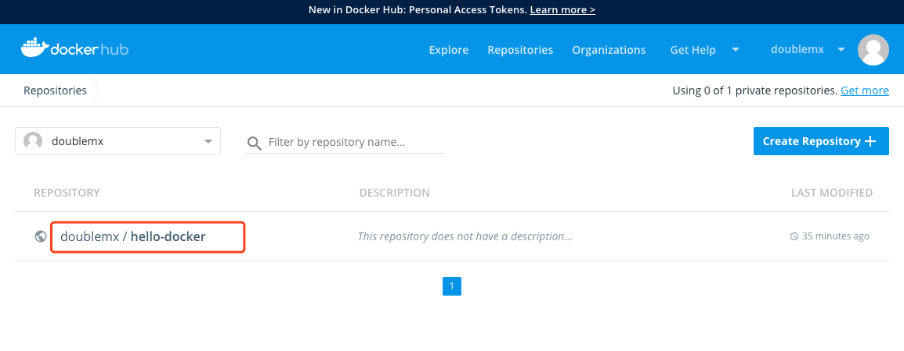

## [一篇不错的Dockerfile总结](<http://blog.zhuxyid.com/2018/11/26/Dockerfile/>)

## 语法关键字

- FROM

```
FROM scratch 	# 制作 base image。从头制作不依赖其他 base image

FROM centos 	# 使用 centos 作为 base image
FROM ubuntu:14.04	#可以使用某个 base image 的执行版本
```

&emsp;&emsp;尽量使用官方的 image  作为 base image。比较安全，他人的制作的难免又搞事情的会加入些骚东西。


- LABEL

```
LABEL maintainer="cxxceo@163.com"
LABEL version="1.0"
LABEL description="备注信息"
```

&emsp;&emsp;定义制作 这个镜像的元信息（Metadata）：作者、版本、备注等，


- RUN

```
RUN apt-get update && apt-get install -y --no-install-recommends \
		fontconfig-config \
		fonts-dejavu-core \
		geoip-database \		# 反斜线换行
```

&emsp;&emsp;执行我们的命令并创建新的 image Layer。为避免无用分层，竟可能合并多条命令到一个RUN中，如果为了美观，复杂的RUN可以使用反斜杠换行，来整理格式


- WORKDIR

```
WORKDIR /root			# 相当于 cd /root

WORKDIR /test			# 如果没有会自动创建 test 目录。相当于 mkdir test && cd test
WORKDIR demo			# 上一条命令已经进入到test 目录。这里在该目录下创建并切换到 demo 目录下
RUN pwd					# 这里输出应该  /test/demo
```

&emsp;&emsp;设定当前工作目录的，类似在 Linux 中进行 cd 切换到指定目录下 ，没有则会先创建文件目录在切换。这里遵循一个原则，能用WORKDIR 就绝对不要使用  RUN cd 执行命令来切换目录。虽然效果可以达到一致。

&emsp;&emsp;其次，尽可能的使用绝对路径


- ADD  and  COPY

```
ADD  a.txt /
ADD  a.tar.gz /				# 添加到根目录并解压

WORKDIR /root
ADD a.txt test/				# /root/test/a.txt

WORKDIR /root
COPY a.txt test/			# /root/test/a.txt
```

&emsp;&emsp;ADD 除了具备 COPY 的功能外，还支持自动解压（tar,gzip,bzip2,etc）！但是大部分情况， COPY 优于 ADD，[这里有讲解两者区别及原因](<https://blog.csdn.net/liukuan73/article/details/52936045>)！添加远程文件/目录请使用 curl 或者 wget


- ENV

```
ENV MYSQL_VERSION 5.6			# 设置常量
RUN apt-get install -y mysql-server = "${MYSQL_VERSION}" \
	&& rm -rf /var/lib/apt/lists/* 			# 引用 ENV 设置的常量
```

&emsp;&emsp;定义常量，有多处使用的相同值，尽可能使用，增加维护性。


- VOLUME and EXPOSE

```
TODO: 后面讲解，留坑待填
```

&emsp;&emsp;存储和网络


- CMD and ENTRYPOINT

&emsp;&emsp;[RUN vs CMD vs ENTRYPOINT](<https://www.ibm.com/developerworks/community/blogs/132cfa78-44b0-4376-85d0-d3096cd30d3f/entry/RUN_vs_CMD_vs_ENTRYPOINT_%E6%AF%8F%E5%A4%A95%E5%88%86%E9%92%9F%E7%8E%A9%E8%BD%AC_Docker_%E5%AE%B9%E5%99%A8%E6%8A%80%E6%9C%AF_17?lang=en>)

&emsp;&emsp;[CMD ENTRYPOINT 区别 终极解读](<https://blog.csdn.net/u010900754/article/details/78526443>)

```
CMD:设置容器启动后默认执行的命令和参数
# 容器启动时默认执行的命令，重点在 “默认”。
# 如果 docker run 指定了其他命令或者 dockerfile 里面也没有 ENTRYPOINT，那么 CMD 命令将在容器启动是默认执行(“默认”：如果你什么都不做，我才做)

# 如果定义了多个 CMD，只有最后一个会执行
```

&emsp;&emsp;

```
ENTRYPOINT:设置容器启动时运行的命令
# 让容器以一个应用程序或者服务的形式运行
# 不会被忽略，一定会执行 
```


[docker-library](<https://github.com/docker-library?utf8=%E2%9C%93&q=nginx&type=&language=>)  提供了许多官方 image 的构建文件 Dockerfile 不同版本详细构建配置，可以参考学习

[Dockerfile reference](<https://docs.docker.com/engine/reference/builder/>)  官方文档讲解 dockerfile 


##  Shell 和  Exec 格式 

[Dockerfile 中命令的两种书写方式的区别](<https://yanbin.blog/dockerfile-difference-between-shell-exec-forms/>)，该文章清晰的讲解了两者的使用，尤其在 Exec 格式下搭配 ENTRYPOINT 和 CMD 和 docker run 的混合使用 


## 镜像的发布

### 直接 push 镜像

1、去 [docker hub]([https://hub.docker.com](https://hub.docker.com/)) 注册一个自己的账号

2、在centos 中登录

```
[vagrant@localhost ~]$ docker login
Login with your Docker ID to push and pull images from Docker Hub. If you don't have a Docker ID, head over to https://hub.docker.com to create one.
Username: doublemx
Password:
WARNING! Your password will be stored unencrypted in /home/vagrant/.docker/config.json.
Configure a credential helper to remove this warning. See
https://docs.docker.com/engine/reference/commandline/login/#credentials-store

Login Succeeded
```

3、构建我们的镜像

```
[vagrant@localhost ~]$ cd hello-docker/

[vagrant@localhost hello-docker]$ more Dockerfile
FROM scratch
ADD hello /
CMD ["/hello"]

# 特别注意，image_name 前缀一定要和注册的 docker hub 账号名一样，例如我的： doublemx 
# 否则 push 的时候回提示 “denied: requested access to the resource is denied”
[vagrant@localhost hello-docker]$ docker build -t doublemx/hello-docker .
Sending build context to Docker daemon  864.8kB
Step 1/3 : FROM scratch
 --->
Step 2/3 : ADD hello /
 ---> 7cd2d385baac
Step 3/3 : CMD ["/hello"]
 ---> Running in d062e2ddce67
Removing intermediate container d062e2ddce67
 ---> 212955e38b8f
Successfully built 212955e38b8f
Successfully tagged doublemx/hello-docker:latest

[vagrant@localhost hello-docker]$ docker images
REPOSITORY              TAG                 IMAGE ID            CREATED             SIZE
doublemx/hello-docker   latest              212955e38b8f        3 seconds ago       861kB
double/centos-vim       latest              9ad61e9353e2        44 hours ago        281MB
centos                  latest              0f3e07c0138f        5 days ago          220MB
ubuntu                  14.04               2c5e00d77a67        4 months ago        188MB
hello-world             latest              fce289e99eb9        9 months ago        1.84kB
```

4、上传发布镜像到 docker hub

```
[vagrant@localhost hello-docker]$ docker push doublemx/hello-docker
The push refers to repository [docker.io/doublemx/hello-docker]
fe9c8a6ad791: Pushed
latest: digest: sha256:06cdb8a6eb4f42ae65e5f45c65d1c6812813a7f32347f3cff2aeb35a2530148b size: 527
```

5、查看 docker hub 已经有我上传的镜像了



6、删除本地，去拉取我们刚才上传的镜像

```
[vagrant@localhost hello-docker]$ docker images
REPOSITORY              TAG                 IMAGE ID            CREATED             SIZE
doublemx/hello-docker   latest              212955e38b8f        38 minutes ago      861kB
double/centos-vim       latest              9ad61e9353e2        44 hours ago        281MB
centos                  latest              0f3e07c0138f        5 days ago          220MB
ubuntu                  14.04               2c5e00d77a67        4 months ago        188MB
hello-world             latest              fce289e99eb9        9 months ago        1.84kB

# 本地删除
[vagrant@localhost hello-docker]$ docker rmi doublemx/hello-docker
Untagged: doublemx/hello-docker:latest
Untagged: doublemx/hello-docker@sha256:06cdb8a6eb4f42ae65e5f45c65d1c6812813a7f32347f3cff2aeb35a2530148b
Deleted: sha256:212955e38b8febfdc2d9ba7ed44d998cd90d973e37a83b6b7e848b6a06e6e15b
Deleted: sha256:7cd2d385baac83e1bab833efcd00eda73dd1ff3df654e7541f1564de56022529
Deleted: sha256:fe9c8a6ad79129a2873e5a187f5be20f4a05c3a722f9784fb7b9286b82549773


[vagrant@localhost hello-docker]$ docker images
REPOSITORY          TAG                 IMAGE ID            CREATED             SIZE
double/centos-vim   latest              9ad61e9353e2        44 hours ago        281MB
centos              latest              0f3e07c0138f        5 days ago          220MB
ubuntu              14.04               2c5e00d77a67        4 months ago        188MB
hello-world         latest              fce289e99eb9        9 months ago        1.84kB

# 远端拉取
[vagrant@localhost hello-docker]$ docker pull doublemx/hello-docker
Using default tag: latest
latest: Pulling from doublemx/hello-docker
5d02ca51703d: Pull complete
Digest: sha256:06cdb8a6eb4f42ae65e5f45c65d1c6812813a7f32347f3cff2aeb35a2530148b
Status: Downloaded newer image for doublemx/hello-docker:latest
docker.io/doublemx/hello-docker:latest

# 拉取成功
[vagrant@localhost hello-docker]$ docker images
REPOSITORY              TAG                 IMAGE ID            CREATED             SIZE
doublemx/hello-docker   latest              212955e38b8f        39 minutes ago      861kB
double/centos-vim       latest              9ad61e9353e2        44 hours ago        281MB
centos                  latest              0f3e07c0138f        5 days ago          220MB
ubuntu                  14.04               2c5e00d77a67        4 months ago        188MB
hello-world             latest              fce289e99eb9        9 months ago        1.84kB

# 运行
[vagrant@localhost hello-docker]$ docker run doublemx/hello-docker
hello docker from double
```

 

### 通过关联 GitHub 自动构建

&emsp;&emsp;[如何将dockerhub与github关联](<https://blog.csdn.net/tina_ttl/article/details/51326011>) 这位仁兄讲解的十分清楚。


## 搭建私有 Docker Registry

### 1、购买服务器

&emsp;&emsp;首先需要准备一个自己的服务器。我是购买的阿里云的 centos7 ，并安装好 docker。


&emsp;&emsp;并且我们的虚拟机中要能访问我们的服务器

```
ping 自己服务器的Ip
```


### 2、pull registry 并配置阿里云安全组

docker hub 不仅提供了丰富的第三方镜像。也提供了我们用于搭建自己[ `registry` 的官方镜像](<https://hub.docker.com/_/registry>)以及 [配套的api](<https://docs.docker.com/registry/spec/api/>) 使用。

&emsp;&emsp;在服务器上 docker 运行启动一个私有的 registry 容器

```
# 没有会首先去拉取
[root@double ~]# docker run -d -p 5000:5000 --restart always --name registry registry
Unable to find image 'registry:latest' locally
latest: Pulling from library/registry
Digest: sha256:8004747f1e8cd820a148fb7499d71a76d45ff66bac6a29129bfdbfdc0154d146
Status: Downloaded newer image for registry:latest
cb7913596931869f41209487ca5be49defa444058e5154f0e10c22581919a12a

# 查看 Image 和 container 都有
[root@double ~]# docker images
REPOSITORY          TAG                 IMAGE ID            CREATED             SIZE
registry            latest              f32a97de94e1        7 months ago        25.8MB
[root@double ~]# docker ps
CONTAINER ID        IMAGE               COMMAND                  CREATED             STATUS              PORTS                    NAMES
cb7913596931        registry            "/entrypoint.sh /etc…"   16 seconds ago      Up 16 seconds       0.0.0.0:5000->5000/tcp   registry
[root@double ~]#
```

&emsp;&emsp;在虚拟机上通过 telnet 尝试访问服务器上的这个容器运行的端口

```
[vagrant@localhost hello-docker]$ telnet 116.62.186.92 5000

# 如果你和我一样使用的是阿里云，可能会出现下面这种情况。链接超时
Trying 116.62.186.92...
telnet: connect to address 116.62.186.92: Operation timed out
telnet: Unable to connect to remote host
```

&emsp;&emsp;遇到上面的情况，源于阿里云服务器有安全组的概念，购买了的服务器默认创建的安全组中没有添加 5000 端口的访问支持。所以我们使用 telnet 访问超时，需要自己手动 [添加安全组规则](<https://help.aliyun.com/document_detail/25471.html?spm=a2c6h.13066369.0.0.5e95750038uPkt>) 。快捷操作：进入**控制台**---》左侧导航栏，选择**网络与安全 > 安全组>匹配规则** 


&emsp;&emsp;再次访问，如果出现这样的效果说明连接成功了

```
[vagrant@localhost hello-docker]$ telnet 116.62.186.92 5000
Trying 116.62.186.92...
Connected to 116.62.186.92.
Escape character is '^]'.
```

&emsp;&emsp;我们现在可以使用提供的 [列表api](<https://docs.docker.com/registry/spec/api/#listing-repositories>) 访问看下，目前自己服务器上 registry 的 image 列表信息，坑定是空的


### 3、构建、配置、push image

&emsp;&emsp;进入虚拟机构建，这次构建的 image 前缀需要更改为我们的服务器ip+port 的形式

```
# 切到对应目录从新构建
[vagrant@localhost ~]$ cd hello-docker/
[vagrant@localhost hello-docker]$ docker build -t  116.62.186.92:5000/hello-docker .
Sending build context to Docker daemon  864.8kB
Step 1/3 : FROM scratch
 --->
Step 2/3 : ADD hello /
 ---> 3b79f16fcf40
Step 3/3 : CMD ["/hello"]
 ---> Running in ce89738f5be3
Removing intermediate container ce89738f5be3
 ---> 2b0d923a44fa
Successfully built 2b0d923a44fa
Successfully tagged 116.62.186.92:5000/hello-docker:latest


[vagrant@localhost hello-docker]$ docker images
REPOSITORY                        TAG                 IMAGE ID            CREATED             SIZE
116.62.186.92:5000/hello-docker   latest              2b0d923a44fa        4 seconds ago       861kB
doublemx/hello-docker             latest              212955e38b8f        9 hours ago         861kB
double/centos-vim                 latest              9ad61e9353e2        2 days ago          281MB
centos                            latest              0f3e07c0138f        5 days ago          220MB
ubuntu                            14.04               2c5e00d77a67        4 months ago        188MB
hello-world                       latest              fce289e99eb9        9 months ago        1.84kB

# 此时如果直接 push 是不成功的
[vagrant@localhost hello-docker]$ docker push 116.62.186.92:5000/hello-docker
The push refers to repository [116.62.186.92:5000/hello-docker]
Get https://116.62.186.92:5000/v2/: http: server gave HTTP response to HTTPS client
```

&emsp;&emsp;配置

```
# 创建 daemon.json 文件。 
[vagrant@localhost hello-docker]$ sudo vi /etc/docker/daemon.json
[vagrant@localhost hello-docker]$ more /etc/docker/daemon.json
{"insecure-registries":["116.62.186.92:5000"]}

# 修改docker.service 文件 
# 在 [service] 下加入如下内容。将 EnvironmentFile 指向上面创建的 json 文件路径目录
[vagrant@localhost hello-docker]$ sudo vi /lib/systemd/system/docker.service
....
EnvironmentFile=-/etc/docker/daemon.json
....

# 重启下
[vagrant@localhost hello-docker]$ sudo service docker restart
Redirecting to /bin/systemctl restart docker.service
Warning: docker.service changed on disk. Run 'systemctl daemon-reload' to reload units.
# 这里提示使用 systemctl daemon-reload
[vagrant@localhost hello-docker]$ systemctl daemon-reload
==== AUTHENTICATING FOR org.freedesktop.systemd1.reload-daemon ===
Authentication is required to reload the systemd state.
Authenticating as: root
Password:					# 输入root用户密码就可以了
==== AUTHENTICATION COMPLETE ===

```

&emsp;&emsp;push 

```
[vagrant@localhost hello-docker]$ docker push 116.62.186.92:5000/hello-docker
The push refers to repository [116.62.186.92:5000/hello-docker]
fe9c8a6ad791: Pushed
latest: digest: sha256:5a498318388b475beb2a3f2872deb6fcf250ac5d0c3eba9833ed081326a243f8 size: 527
```

&emsp;&emsp;浏览器使用 api 再次访问就可以看到我们刚才push 的 镜像了。


&emsp;&emsp;我们现在来将本地的删除，试着从搭建的私有服务器上拉取看是否成功。

