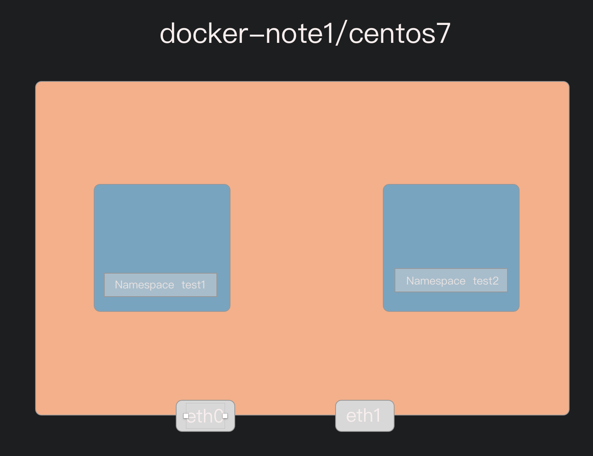
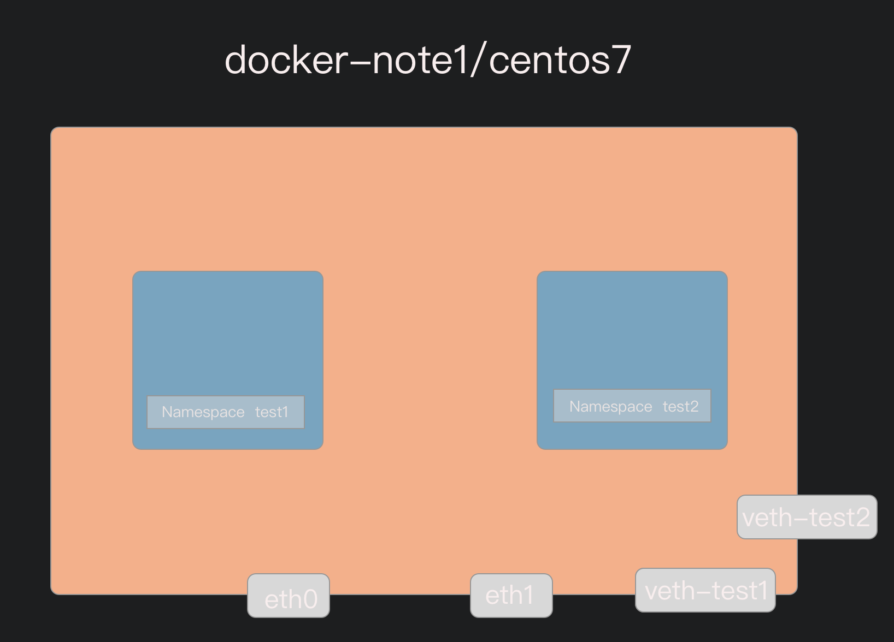
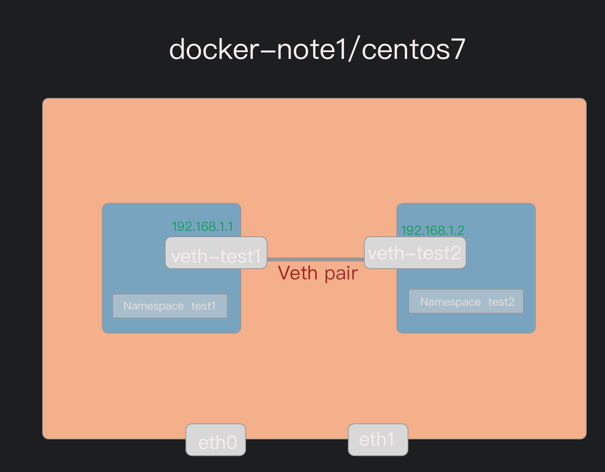
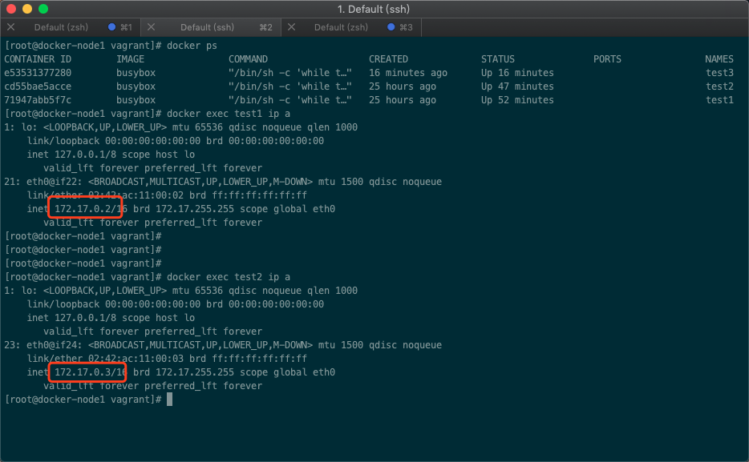
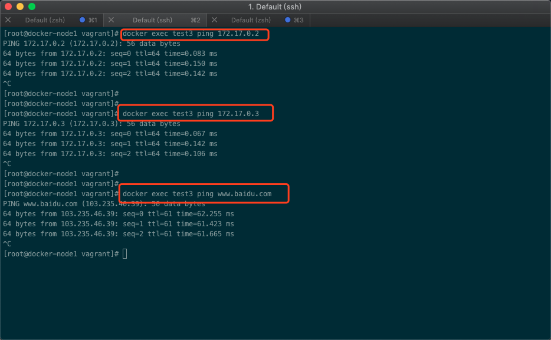
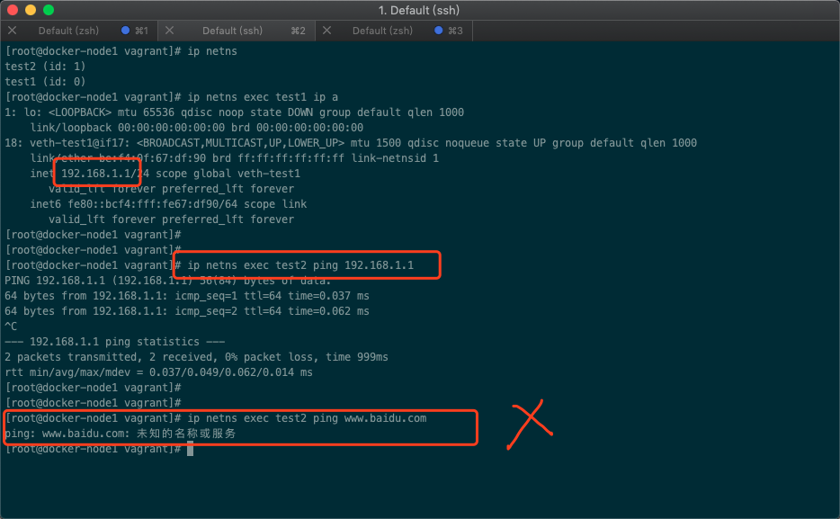
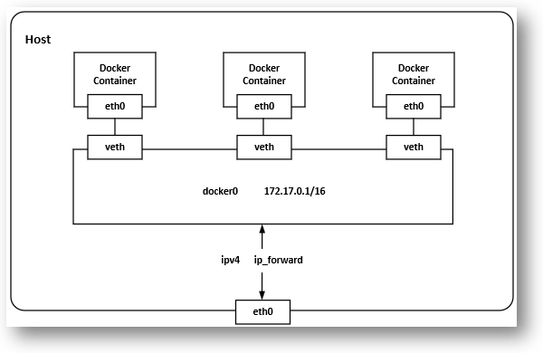
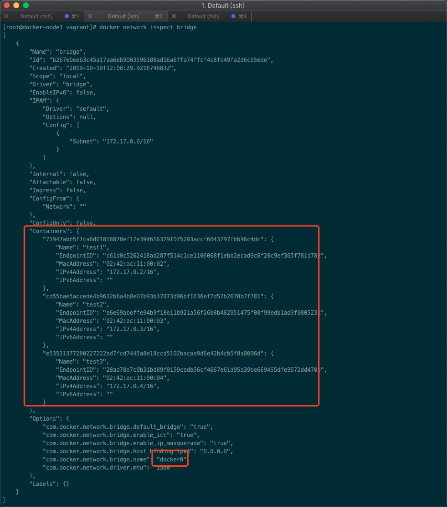
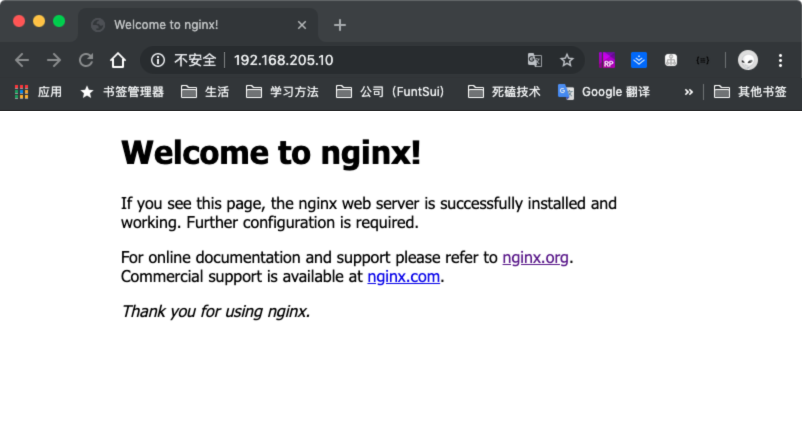
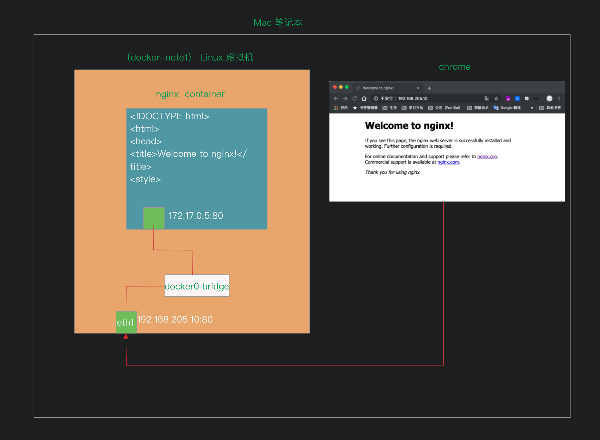

## 实验环境准备

依然是 vitrualBox + vagrant + docker

**目录列表**

```
Vagrantfile           labs             setup.sh
```

**Vagrantfile**

```
# -*- mode: ruby -*-
# vi: set ft=ruby :

Vagrant.require_version ">= 1.6.0"

boxes = [
    {
        :name => "docker-node1",
        :eth1 => "192.168.205.10",
        :mem => "1024",
        :cpu => "1"
    },
    {
        :name => "docker-node2",
        :eth1 => "192.168.205.11",
        :mem => "1024",
        :cpu => "1"
    }
]

Vagrant.configure(2) do |config|

  config.vm.box = "centos/7"

  boxes.each do |opts|
      config.vm.define opts[:name] do |config|
        config.vm.hostname = opts[:name]
        config.vm.provider "vmware_fusion" do |v|
          v.vmx["memsize"] = opts[:mem]
          v.vmx["numvcpus"] = opts[:cpu]
        end

        config.vm.provider "virtualbox" do |v|
          v.customize ["modifyvm", :id, "--memory", opts[:mem]]
          v.customize ["modifyvm", :id, "--cpus", opts[:cpu]]
        end

        config.vm.network :private_network, ip: opts[:eth1]
      end
  end

# 我的 virtualbox 6.0 版本的，不需要手动移动文件，并且这里移动会有问题。创建好虚拟机后与Vagrantfile
# 同目录的文件都会存放在 /vagrant 目录中
#  config.vm.synced_folder "./labs", "/home/vagrant/labs"
  config.vm.provision "shell", privileged: true, path: "./setup.sh"

end

```

**setup.sh**

```shell
#/bin/sh

# install some tools
sudo yum install -y git vim gcc glibc-static telnet bridge-utils

# install docker
curl -fsSL get.docker.com -o get-docker.sh
sh get-docker.sh

# start docker service
sudo groupadd docker
sudo usermod -aG docker vagrant
sudo systemctl start docker

rm -rf get-docker.sh

```

&emsp;&emsp;Vagrantfile 中定义了两台 centos7 的虚拟机，并给指定了ip、内存和CPU数。在创建的成功后会执行同目录准备 setup.sh 脚本。该脚本就是安装一些基础工具，并且在虚拟机centos7中安装好 docker 应用程序。并且将docker 命令加入 vagrant 用户组启动 docker 服务。


### 创建启动虚拟机

```shell
# 创建启动虚拟机
vagrant up 

# 查看状态
coulson@CoulsondeMacBook-Pro> vagrant status
Current machine states:

docker-node1              running (virtualbox)
docker-node2              running (virtualbox)

This environment represents multiple VMs. The VMs are all listed
above with their current state. For more information about a specific
VM, run `vagrant status NAME`.

# 进入虚拟机
vagrant ssh docker-node1
vagrant ssh docker-node2


# 查看文件源码是否存在
[vagrant@docker-node1 vagrant]$ cd /vagrant/
[vagrant@docker-node1 vagrant]$ ls
labs  multi-host-network.md  setup.sh  Vagrantfile
```


## Ping 和 telnet

&emsp;&emsp; ping 可以测试到目标机器的连通性。**Ping域名还可以得出解析IP。**评估网络质量。

&emsp;&emsp;telnet 用于远程管理连接主机。同时也是测试目标机器的TCP端口是否开放。如 telnet IP地址 3389 是用来测试目标机器的3389端口是否开放，**如果连接失败，可能是防火墙屏蔽，也可能是目标机器没有启用相关远程桌面服务(windows)，或者修改了默认占用3389端口。**


## Linux 网络命名空间

### docker 容器间的network namesapce

&emsp;&emsp;首先看下两个docker 容器之间的 network namespace 情况，以及其通信。

> BusyBox 是一个集成了一百多个最常用 Linux 命令和工具（如 cat、echo、grep、mount、telnet 、ping、ifconfig 等）的精简工具箱，它只需要几 MB 的大小，很方便进行各种快速验证，被誉为“Linux 系统的瑞士军刀”

```shell
# 切换到root 用户。
[vagrant@docker-node1 ~]$ sudo su
[root@docker-node1 vagrant]# docker ps

# 运行两个 busybox 容器，并执行一个睡眠死循环。让其一直后台运行。
[root@docker-node1 vagrant]# docker run -d --name test1 busybox /bin/sh -c "while true; do sleep 3600;done"
[root@docker-node1 vagrant]# docker run -d --name test2 busybox /bin/sh -c "while true; do sleep 3600;done"

# 查看运行中的两个容器
[root@docker-node1 vagrant]# docker ps
CONTAINER ID        IMAGE               COMMAND                  CREATED             STATUS              PORTS               NAMES
cd55bae5acce        busybox             "/bin/sh -c 'while t…"   6 seconds ago       Up 5 seconds                            test2
71947abb5f7c        busybox             "/bin/sh -c 'while t…"   15 seconds ago      Up 14 seconds                           test1

# docker exec 在运行的容器中执行命令来查看容器的 network namespace
[root@docker-node1 vagrant]# docker exec cd55bae5acce ip a
1: lo: <LOOPBACK,UP,LOWER_UP> mtu 65536 qdisc noqueue qlen 1000
    link/loopback 00:00:00:00:00:00 brd 00:00:00:00:00:00
    inet 127.0.0.1/8 scope host lo
       valid_lft forever preferred_lft forever
13: eth0@if14: <BROADCAST,MULTICAST,UP,LOWER_UP,M-DOWN> mtu 1500 qdisc noqueue
    link/ether 02:42:ac:11:00:03 brd ff:ff:ff:ff:ff:ff
    inet 172.17.0.3/16 brd 172.17.255.255 scope global eth0
       valid_lft forever preferred_lft forever
       
# 可以看到 test1 和 test2 都有独立的 network namespace       
[root@docker-node1 vagrant]# docker exec 71947abb5f7c ip a
1: lo: <LOOPBACK,UP,LOWER_UP> mtu 65536 qdisc noqueue qlen 1000
    link/loopback 00:00:00:00:00:00 brd 00:00:00:00:00:00
    inet 127.0.0.1/8 scope host lo
       valid_lft forever preferred_lft forever
11: eth0@if12: <BROADCAST,MULTICAST,UP,LOWER_UP,M-DOWN> mtu 1500 qdisc noqueue
    link/ether 02:42:ac:11:00:02 brd ff:ff:ff:ff:ff:ff
    inet 172.17.0.2/16 brd 172.17.255.255 scope global eth0
       valid_lft forever preferred_lft forever
       
# 在容器 test1 中去 ping 容器 test2 的ip,也是可以 ping 通的。反之一样
[root@docker-node1 vagrant]# docker exec 71947abb5f7c ping 172.17.0.3
PING 172.17.0.3 (172.17.0.3): 56 data bytes
64 bytes from 172.17.0.3: seq=0 ttl=64 time=0.082 ms
64 bytes from 172.17.0.3: seq=1 ttl=64 time=0.059 ms
....
```

&emsp;&emsp;上面演示了，docker 两个容器中拥有独立的 network namespace ,并且还可以通信的，这底层就是依赖Linux 内核提供的功能实现，我们就通过底层Linux的命令  ip netns 来模拟看一下 network namespace是怎么一回事，如何创建独立的，并且能相互通信的 network namespace

```shell
# 查看 docker 默认的网络模型
[root@docker-node1 vagrant]# docker network ls
NETWORK ID          NAME                DRIVER              SCOPE
b267e0eeb3c4        bridge              bridge              local
e8c9545cd42e        host                host                local
ced118696d9f        none                null                local
```


### ip netns

&emsp;&emsp;network namespace 是 linux 内核提供的功能，它能创建多个隔离的网络空间，它们有独自的网络栈信息。不管是虚拟机还是容器，运行的时候仿佛自己就在独立的网络中。

&emsp;&emsp;借助 `ip` 下的子命令  `ip netns` 来进行和 network namespace 有关的操作。对于每个 network namespace 来说，它会有自己独立的网卡、路由表、ARP 表、iptables 等和网络相关的资源。

```shell
# ip netns help 查看所有操作帮助
[vagrant@docker-node1 ~]$ ip netns help
Usage: ip netns list
       ip netns add NAME
       ip netns set NAME NETNSID
       ip [-all] netns delete [NAME]
       ip netns identify [PID]
       ip netns pids NAME
       ip [-all] netns exec [NAME] cmd ...
       ip netns monitor
       ip netns list-id
      
      
# 创建两个network namespace
[root@docker-node1 vagrant]# ip netns add test1
[root@docker-node1 vagrant]# ip netns add test2
[root@docker-node1 vagrant]# ip netns list
test2
test1

# ip netns 命令创建的 network namespace 会出现在 /var/run/netns/ 目录下
[root@docker-node1 vagrant]# ls /var/run/netns
test1  test2
```

&emsp;&emsp;`ip` 命令提供了 `ip netns exec` 子命令可以在对应的 network namespace 中执行命令，和我们 `docker exec` 十分相似

```shell
# ip netns exec 查看我们自己建立的两个 network namespace 中的网络状况
[root@docker-node1 vagrant]# ip netns exec test1 ip link
1: lo: <LOOPBACK> mtu 65536 qdisc noop state DOWN mode DEFAULT group default qlen 1000
    link/loopback 00:00:00:00:00:00 brd 00:00:00:00:00:00
    
[root@docker-node1 vagrant]# ip netns exec test2 ip link
1: lo: <LOOPBACK> mtu 65536 qdisc noop state DOWN mode DEFAULT group default qlen 1000
    link/loopback 00:00:00:00:00:00 brd 00:00:00:00:00:00
```



&emsp;&emsp;现在我们两个独立 network namespace 已经建立好。已经产生了很好的网络隔离，但是如果没有办法通信那就毫无意义。Linux 提供了 `veth pair`，可以看做我们现实中的网线，是一个双向的 pipe(管道)，一段发送的数据在另外一段可以接受。相当于用一个特殊的虚拟网卡将两个namespace链接起来通信了一样。

&emsp;&emsp;`veth pair`  是无法单独存在的，一个删除你给一个也会自动消失。他的作用就是链接双方。使用 `ip link add type veth` 来创建一对 `veth pair`

```shell
# 显示本机目前已有的网络接口信息
[root@docker-node1 vagrant]# ip link
1: lo: <LOOPBACK,UP,LOWER_UP> mtu 65536 qdisc noqueue state UNKNOWN mode DEFAULT group default qlen 1000
    link/loopback 00:00:00:00:00:00 brd 00:00:00:00:00:00
2: eth0: <BROADCAST,MULTICAST,UP,LOWER_UP> mtu 1500 qdisc pfifo_fast state UP mode DEFAULT group default qlen 1000
    link/ether 52:54:00:8a:fe:e6 brd ff:ff:ff:ff:ff:ff
3: eth1: <BROADCAST,MULTICAST,UP,LOWER_UP> mtu 1500 qdisc pfifo_fast state UP mode DEFAULT group default qlen 1000
    link/ether 08:00:27:97:a3:51 brd ff:ff:ff:ff:ff:ff
4: docker0: <NO-CARRIER,BROADCAST,MULTICAST,UP> mtu 1500 qdisc noqueue state DOWN mode DEFAULT group default
    link/ether 02:42:ea:f9:f4:57 brd ff:ff:ff:ff:ff:ff
    
# 添加一对 veth pair。 分别取名 veth-test1  veth-test2   
[root@docker-node1 vagrant]# ip link add veth-test1 type veth peer name veth-test2

# 在查看现在的网络接口信息已经多了刚才增加的两个 17、18
[root@docker-node1 vagrant]# ip link
1: lo: <LOOPBACK,UP,LOWER_UP> mtu 65536 qdisc noqueue state UNKNOWN mode DEFAULT group default qlen 1000
    link/loopback 00:00:00:00:00:00 brd 00:00:00:00:00:00
2: eth0: <BROADCAST,MULTICAST,UP,LOWER_UP> mtu 1500 qdisc pfifo_fast state UP mode DEFAULT group default qlen 1000
    link/ether 52:54:00:8a:fe:e6 brd ff:ff:ff:ff:ff:ff
3: eth1: <BROADCAST,MULTICAST,UP,LOWER_UP> mtu 1500 qdisc pfifo_fast state UP mode DEFAULT group default qlen 1000
    link/ether 08:00:27:97:a3:51 brd ff:ff:ff:ff:ff:ff
4: docker0: <NO-CARRIER,BROADCAST,MULTICAST,UP> mtu 1500 qdisc noqueue state DOWN mode DEFAULT group default
    link/ether 02:42:ea:f9:f4:57 brd ff:ff:ff:ff:ff:ff
17: veth-test2@veth-test1: <BROADCAST,MULTICAST,M-DOWN> mtu 1500 qdisc noop state DOWN mode DEFAULT group default qlen 1000
    link/ether 72:30:5c:98:01:8e brd ff:ff:ff:ff:ff:ff
18: veth-test1@veth-test2: <BROADCAST,MULTICAST,M-DOWN> mtu 1500 qdisc noop state DOWN mode DEFAULT group default qlen 1000
    link/ether be:f4:0f:67:df:90 brd ff:ff:ff:ff:ff:ff
```




&emsp;&emsp;目前 `veth pair`也创建好了，要做的就是分别放到两个 namespace，分别给起配上 ip 地址，并且启动他们

```shell
# 使用  ip linke set veth-name netns netns-name 的方式来分配
[root@docker-node1 vagrant]# ip link set veth-test1 netns test1
[root@docker-node1 vagrant]# ip link set veth-test2 netns test2


# 本机已经没有这两个了
[root@docker-node1 vagrant]# ip link
1: lo: <LOOPBACK,UP,LOWER_UP> mtu 65536 qdisc noqueue state UNKNOWN mode DEFAULT group default qlen 1000
    link/loopback 00:00:00:00:00:00 brd 00:00:00:00:00:00
2: eth0: <BROADCAST,MULTICAST,UP,LOWER_UP> mtu 1500 qdisc pfifo_fast state UP mode DEFAULT group default qlen 1000
    link/ether 52:54:00:8a:fe:e6 brd ff:ff:ff:ff:ff:ff
3: eth1: <BROADCAST,MULTICAST,UP,LOWER_UP> mtu 1500 qdisc pfifo_fast state UP mode DEFAULT group default qlen 1000
    link/ether 08:00:27:97:a3:51 brd ff:ff:ff:ff:ff:ff
4: docker0: <NO-CARRIER,BROADCAST,MULTICAST,UP> mtu 1500 qdisc noqueue state DOWN mode DEFAULT group default
    link/ether 02:42:ea:f9:f4:57 brd ff:ff:ff:ff:ff:ff
 
# 分别查看下 test1 test2 中的网络接口信息已经有了对应分配的了
[root@docker-node1 vagrant]# ip netns exec test1 ip link
1: lo: <LOOPBACK> mtu 65536 qdisc noop state DOWN mode DEFAULT group default qlen 1000
    link/loopback 00:00:00:00:00:00 brd 00:00:00:00:00:00
18: veth-test1@if17: <BROADCAST,MULTICAST> mtu 1500 qdisc noop state DOWN mode DEFAULT group default qlen 1000
    link/ether be:f4:0f:67:df:90 brd ff:ff:ff:ff:ff:ff link-netnsid 1
    
[root@docker-node1 vagrant]# ip netns exec test2 ip link
1: lo: <LOOPBACK> mtu 65536 qdisc noop state DOWN mode DEFAULT group default qlen 1000
    link/loopback 00:00:00:00:00:00 brd 00:00:00:00:00:00
17: veth-test2@if18: <BROADCAST,MULTICAST> mtu 1500 qdisc noop state DOWN mode DEFAULT group default qlen 1000
    link/ether 72:30:5c:98:01:8e brd ff:ff:ff:ff:ff:ff link-netnsid 0
    

# 给对应 namesapce 的 veth pair 分配对应ip
[root@docker-node1 vagrant]# ip netns exec test1 ip addr add 192.168.1.1/24 dev veth-test1
[root@docker-node1 vagrant]# ip netns exec test2 ip addr add 192.168.1.2/24 dev veth-test2

# 启动 veth paire
[root@docker-node1 vagrant]# ip netns exec test1 ip link set dev veth-test1 up
[root@docker-node1 vagrant]# ip netns exec test2 ip link set dev veth-test2 up


# 查看 veth paire 的ip地址信息
[root@docker-node1 vagrant]# ip netns exec test2 ip a
1: lo: <LOOPBACK> mtu 65536 qdisc noop state DOWN group default qlen 1000
    link/loopback 00:00:00:00:00:00 brd 00:00:00:00:00:00
17: veth-test2@if18: <BROADCAST,MULTICAST,UP,LOWER_UP> mtu 1500 qdisc noqueue state UP group default qlen 1000
    link/ether 72:30:5c:98:01:8e brd ff:ff:ff:ff:ff:ff link-netnsid 0
    inet 192.168.1.2/24 scope global veth-test2
       valid_lft forever preferred_lft forever
    inet6 fe80::7030:5cff:fe98:18e/64 scope link
       valid_lft forever preferred_lft forever
       
[root@docker-node1 vagrant]# ip netns exec test1 ip a
1: lo: <LOOPBACK> mtu 65536 qdisc noop state DOWN group default qlen 1000
    link/loopback 00:00:00:00:00:00 brd 00:00:00:00:00:00
18: veth-test1@if17: <BROADCAST,MULTICAST,UP,LOWER_UP> mtu 1500 qdisc noqueue state UP group default qlen 1000
    link/ether be:f4:0f:67:df:90 brd ff:ff:ff:ff:ff:ff link-netnsid 1
    inet 192.168.1.1/24 scope global veth-test1
       valid_lft forever preferred_lft forever
    inet6 fe80::bcf4:fff:fe67:df90/64 scope link
       valid_lft forever preferred_lft forever
       
# 我们从 test1 中去ping  test2 中 veth pair ip地址是能通的，反之亦然
[root@docker-node1 vagrant]# ip netns exec test1 ping 192.168.1.2
PING 192.168.1.2 (192.168.1.2) 56(84) bytes of data.
64 bytes from 192.168.1.2: icmp_seq=1 ttl=64 time=0.050 ms
64 bytes from 192.168.1.2: icmp_seq=2 ttl=64 time=0.049 ms
64 bytes from 192.168.1.2: icmp_seq=3 ttl=64 time=0.037 ms
64 bytes from 192.168.1.2: icmp_seq=4 ttl=64 time=0.036 ms
64 bytes from 192.168.1.2: icmp_seq=5 ttl=64 time=0.037 ms
^C
--- 192.168.1.2 ping statistics ---
5 packets transmitted, 5 received, 0% packet loss, time 4003ms
rtt min/avg/max/mdev = 0.036/0.041/0.050/0.010 ms

[root@docker-node1 vagrant]# ip netns exec test2 ping 192.168.1.1
PING 192.168.1.1 (192.168.1.1) 56(84) bytes of data.
64 bytes from 192.168.1.1: icmp_seq=1 ttl=64 time=0.034 ms
64 bytes from 192.168.1.1: icmp_seq=2 ttl=64 time=0.041 ms
64 bytes from 192.168.1.1: icmp_seq=3 ttl=64 time=0.050 ms
^C
--- 192.168.1.1 ping statistics ---
3 packets transmitted, 3 received, 0% packet loss, time 2002ms
rtt min/avg/max/mdev = 0.034/0.041/0.050/0.009 ms
```

&emsp;&emsp;最终我们创建的完整网络结构如下




## Docker网络之Bridge

&emsp;&emsp;虽然现在我们自己通过  ip  netns 创建 test1、test2 并分配 veth pair 确实实现了和docker 两个容器之间的通信同样的功能了，但是docker之前的通信远不止这么简单。docker 还可以多个容器间网络通信，甚至外网都可以。

&emsp;&emsp;我们在创建一个 busybox 的容器 test3 ,并查看下test1和test2的ip



在新建的 test3 容器中不论我们是去ping  test1 还是 test2 甚至是公网 baidu 都是可以 ping通的



反观我们之前通过 ip nets 设置的 test1 和 test2 只能两台之间相互通信，访问外网就不行了



这是因为在安装 docker 后，宿主机上默认的被创建另一个名为 docker0 的网卡，ip：172.17.0.1/16。这个 docker0不是一个简单的 网卡设备，而是一个 网桥。真实的docker网络结构是这样子的

image-20191012120321629](img/3.0-Docker的网络/image-20191012120321629.png)



&emsp;&emsp;《[Docker 网络之理解 bridge 驱动](https://www.cnblogs.com/sparkdev/p/9217310.html)》 这边文章很好的讲解了 docker0 网桥、iptable规则、容器的DNS和主机名（hostname）相关的内容，上图也是来自这文章，一定要阅读下。

&emsp;&emsp;我们通过 `docker network inspect bridge` 可以查看名为 bridge  驱动为  ‘bridge’ 的具体信息可以发现 。docker 默认使用的网桥就是这个，Containers 有我已经建立的三个 busybox 容器 test1/test2/test3 的信息以及ip地址。并且这个bridge 的 name 就是 我们 在宿主机上 `ip a` 看到的 docker0。



摘自 《[Docker 网络之理解 bridge 驱动](https://www.cnblogs.com/sparkdev/p/9217310.html)》 的一段话

> &emsp;&emsp;事实上，docker 创建了 docker0 网桥，并以 veth pair 连接各个容器的网络，容器中的数据通过 eth0 发送到 docker0 网桥上，并由 docker0 网桥完成转发。**这里网桥的概念等同于交换机，为连在其上的设备转发数据帧。网桥上的 veth 网卡设备相当于交换机上的端口，可以将多个容器连接在它们上面，这些端口工作在二层**，所以是不需要配置 IP 信息的。上图中的 docker0 网桥就为连在其上的容器转发数据帧，使得同一台宿主机上的 docker 容器之间可以相互通信。既然 docker0 是二层设备，那么它为什么还需要 IP 呢？其实，docker0 是一个普通的 linux 网桥，是可以为它配置 IP 的，我们可以认为它的内部有一个可以用于配置 IP 的网卡。**Docker0 的 IP 地址作为所连接的容器的默认网关地址**！
>
> &emsp;&emsp;docker0 网桥是在 docker daemon 启动时自动创建的，其默认 IP 为 172.17.0.1/16，之后通过 bridge 驱动创建的容器都会在 docker0 的子网范围内选取一个未占用的 IP 使用，并连接到 docker0 网桥上。


### Docker link

&emsp;&emsp;有这种需求场景，假如我们两个容器，一个是后台服务，一个是MySQL数据库。后台服务操作数据的时候需要去访问我们的数据库，那就需要知道mysql这个容器的ip地址和端口，才能连接操作。那句需要我们去查看 MySQL 容器中的ip地址，并且作为参数，在写代码的时候在后台服务容器中使用。大家知道 ip 是难记的不然也不会有DNS域名解析这种东西出现，并且去查看的操作也很麻烦。

&emsp;&emsp;docker  link 就给我们提供了便利，可以在创建 后台服务的时候，直接 link 到 mysql 容器上。可以看做将 mysql 容器的name  和 ip 在后台服务容器中建立了一个 dns 。后台服务直接使用 mysql 容器的name 就可以链接了，不需要在去查看并使用ip。

&emsp;&emsp;我们这里还是使用 busybox 建立的容器，通过 ping 命令来模拟

```shell
# 先删除 test3 容器
[root@docker-node1 vagrant]# docker ps
CONTAINER ID        IMAGE               COMMAND                  CREATED             STATUS              PORTS               NAMES
e53531377280        busybox             "/bin/sh -c 'while t…"   4 hours ago         Up 4 hours                              test3
cd55bae5acce        busybox             "/bin/sh -c 'while t…"   29 hours ago        Up 5 hours                              test2
71947abb5f7c        busybox             "/bin/sh -c 'while t…"   29 hours ago        Up 5 hours                              test1
[root@docker-node1 vagrant]# docker stop test3
test3
[root@docker-node1 vagrant]# docker rm test3
test3

# 重新创建 test3 容器，此时使用 --link 与 test1 建立连接
[root@docker-node1 vagrant]# docker run -d --name test3 --link test1 busybox /bin/sh -c "while true; do sleep 3600;done"
17fb3f33446f6daa32e136a41f3a6248368020fdebb24a400413c0c2729bfccb
[root@docker-node1 vagrant]# docker ps
CONTAINER ID        IMAGE               COMMAND                  CREATED             STATUS              PORTS               NAMES
17fb3f33446f        busybox             "/bin/sh -c 'while t…"   7 seconds ago       Up 7 seconds                            test3
cd55bae5acce        busybox             "/bin/sh -c 'while t…"   29 hours ago        Up 5 hours                              test2
71947abb5f7c        busybox             "/bin/sh -c 'while t…"   29 hours ago        Up 5 hours                              test1

# 在 test3 中去 ping test1和test2 的 ip 都是没问题的
[root@docker-node1 vagrant]# docker exec test3 ping 172.17.0.2
PING 172.17.0.2 (172.17.0.2): 56 data bytes
64 bytes from 172.17.0.2: seq=0 ttl=64 time=0.064 ms
....

[root@docker-node1 vagrant]# docker exec test3 ping 172.17.0.3
PING 172.17.0.3 (172.17.0.3): 56 data bytes
64 bytes from 172.17.0.3: seq=0 ttl=64 time=0.061 ms
....


# 由于与创建的时候 link 了 test1 可以直接 ping test1 容器名称也能ping通
[root@docker-node1 vagrant]# docker exec test3 ping test1
PING test1 (172.17.0.2): 56 data bytes
64 bytes from 172.17.0.2: seq=0 ttl=64 time=0.079 ms
....

# 但是 ping  test2 就不行并没有建立 link
[root@docker-node1 vagrant]# docker exec test3 ping test2
ping: bad address 'test2'

# link 是单向的，所以从 test1 中通过 ping test3 的容器名称是并不能通的
[root@docker-node1 vagrant]# docker exec test1 ping test3
ping: bad address 'test3'
```


### 创建 bridge

```shell
# 查看 docker 默认的网络模型
[root@docker-node1 vagrant]# docker network ls
NETWORK ID          NAME                DRIVER              SCOPE
b267e0eeb3c4        bridge              bridge              local
e8c9545cd42e        host                host                local
ced118696d9f        none                null                local
```

&emsp;&emsp;前面的内容大概了解到了一点，新建的容器是会默认连接到 `bridge` 这个 network 也就是docker0。实际上创建容器的时候可以指定连接那个 network 比如 `host` 或者 `none` 。甚至还可创建一个自己的network来连接，**并且与默认的 docker0 的bridge 不同。自己创建的 bridge network 直接使用容器名也可以 Ping 通。默认是已经link 好了，可以直接使用容器名 ping 通**

```shell
# 创建一个以 bridge 为 driver 的新 network
[root@docker-node1 vagrant]# docker network create -d bridge test-bridge
190e313cd2d02a8104d1daed613d89edbf7762d9474e0665914151e91c320e5c
[root@docker-node1 vagrant]# docker network ls
NETWORK ID          NAME                DRIVER              SCOPE
b267e0eeb3c4        bridge              bridge              local
e8c9545cd42e        host                host                local
ced118696d9f        none                null                local
190e313cd2d0        test-bridge         bridge              local

# brctl show 可以查看我们创建的 bridge。docker0上已经有三个 veth pair，我们创建的并没有
[root@docker-node1 vagrant]# brctl show
bridge name			bridge id			STP enabled		interfaces
br-190e313cd2d0		8000.024225f03c51	no
docker0				8000.0242eaf9f457	no				veth5a3a2ee
														veth9648b77
														vethaef0104
										
# 新创建一个 busybox 容器 test4 使用自己创建的 test-bridge network
[root@docker-node1 vagrant]# docker run -d --name test4 --network=test-bridge  busybox /bin/sh -c "while true; do sleep 3600;done"
863e4c56f3f2ec48c67323a2dfd487562367105bcd15035618353d4e9ff8eed3

# brctl show 查看我们自己创建 bridge上也有了一个 veth pair 网络接口
[root@docker-node1 vagrant]# brctl show
bridge name			bridge id			STP enabled		interfaces
br-190e313cd2d0		8000.024225f03c51	no				vethe3bd574
docker0				8000.0242eaf9f457	no				veth5a3a2ee
														veth9648b77
														vethaef0104
														
# 除此之外，还可以将 已经创建好的容器 连接到我们自己创建的 network 中
[root@docker-node1 vagrant]# docker network connect test-bridge test2

# brctl show 可以看到又多了一个接口，
[root@docker-node1 vagrant]# brctl show
bridge name			bridge id			STP enabled		interfaces
br-190e313cd2d0		8000.024225f03c51	no				veth46bfd28
														vethe3bd574
docker0				8000.0242eaf9f457	no				veth5a3a2ee
														veth9648b77
														vethaef0104
														
# 并且查看 test-bridge 详细信息 Contaiers 中有 test4和test2							
[root@docker-node1 vagrant]# docker network inspect  test-bridge
[
    {
        "Name": "test-bridge",
        "Id": "190e313cd2d02a8104d1daed613d89edbf7762d9474e0665914151e91c320e5c",
        "Created": "2019-10-12T09:06:02.182038326Z",
        "Scope": "local",
        "Driver": "bridge",
        "EnableIPv6": false,
        "IPAM": {
            "Driver": "default",
            "Options": {},
            "Config": [
                {
                    "Subnet": "172.18.0.0/16",
                    "Gateway": "172.18.0.1"
                }
            ]
        },
        "Internal": false,
        "Attachable": false,
        "Ingress": false,
        "ConfigFrom": {
            "Network": ""
        },
        "ConfigOnly": false,
        "Containers": {
            "863e4c56f3f2ec48c67323a2dfd487562367105bcd15035618353d4e9ff8eed3": {
                "Name": "test4",
                "EndpointID": "197c145677c1571da56e3d3dbbb8157fcea9ea67a5349320f66e4f2c53ff2d46",
                "MacAddress": "02:42:ac:12:00:02",
                "IPv4Address": "172.18.0.2/16",
                "IPv6Address": ""
            },
            "cd55bae5accede4b9632b8a4b8e07b93b37073d96bf1636ef7d57b2670b7f781": {
                "Name": "test2",
                "EndpointID": "824fdfb62566fdd9dc3baa0540823d30026e92a9b962bd7fb1de3c86d3ec66aa",
                "MacAddress": "02:42:ac:12:00:03",
                "IPv4Address": "172.18.0.3/16",
                "IPv6Address": ""
            }
        },
        "Options": {},
        "Labels": {}
    }
]														

# 既然 test4和test2 在同一个 network 中可以通过 ip 互相 Ping 通
[root@docker-node1 vagrant]# docker exec test2 ping 172.18.0.2
PING 172.18.0.2 (172.18.0.2): 56 data bytes
64 bytes from 172.18.0.2: seq=0 ttl=64 time=0.089 ms
64 bytes from 172.18.0.2: seq=1 ttl=64 time=0.140 ms
....

[root@docker-node1 vagrant]# docker exec test4 ping 172.18.0.3
PING 172.18.0.3 (172.18.0.3): 56 data bytes
64 bytes from 172.18.0.3: seq=0 ttl=64 time=0.066 ms
64 bytes from 172.18.0.3: seq=1 ttl=64 time=0.073 ms
.... 

# 与默认的 docker0 的bridge 不同。自己创建的 bridge network 直接使用容器名也可以 Ping 通。默认是已经# link 好了
[root@docker-node1 vagrant]# docker exec test2 ping test4
PING test4 (172.18.0.2): 56 data bytes
64 bytes from 172.18.0.2: seq=0 ttl=64 time=0.054 ms
64 bytes from 172.18.0.2: seq=1 ttl=64 time=0.222 ms
....

[root@docker-node1 vagrant]# docker exec test4 ping test2
PING test2 (172.18.0.3): 56 data bytes
64 bytes from 172.18.0.3: seq=0 ttl=64 time=0.052 ms
64 bytes from 172.18.0.3: seq=1 ttl=64 time=0.083 ms
....

# 查看下 test2 的ip 会发现有两个网段ip 一个是来自 bridge 一个是来自 test-bridge的
[root@docker-node1 vagrant]# docker exec test2 ip a
1: lo: <LOOPBACK,UP,LOWER_UP> mtu 65536 qdisc noqueue qlen 1000
    link/loopback 00:00:00:00:00:00 brd 00:00:00:00:00:00
    inet 127.0.0.1/8 scope host lo
       valid_lft forever preferred_lft forever
23: eth0@if24: <BROADCAST,MULTICAST,UP,LOWER_UP,M-DOWN> mtu 1500 qdisc noqueue
    link/ether 02:42:ac:11:00:03 brd ff:ff:ff:ff:ff:ff
    inet 172.17.0.3/16 brd 172.17.255.255 scope global eth0
       valid_lft forever preferred_lft forever
38: eth1@if39: <BROADCAST,MULTICAST,UP,LOWER_UP,M-DOWN> mtu 1500 qdisc noqueue
    link/ether 02:42:ac:12:00:03 brd ff:ff:ff:ff:ff:ff
    inet 172.18.0.3/16 brd 172.18.255.255 scope global eth1
       valid_lft forever preferred_lft forever

# 目前 test2 容器既可以通过 ip ping 通同在 bridge 这个network中 172.17.xx.xx 的容器test1/test3
# 又可以通过 ip和容器name ping 通在 test-bridge 这个network中 172.18.xx.xx 的容器 test4
[root@docker-node1 vagrant]# docker exec test2 ping 172.17.0.4
PING 172.17.0.4 (172.17.0.4): 56 data bytes
64 bytes from 172.17.0.4: seq=0 ttl=64 time=0.071 ms
64 bytes from 172.17.0.4: seq=1 ttl=64 time=0.097 ms
....

[root@docker-node1 vagrant]# docker exec test2 ping 172.17.0.2
PING 172.17.0.2 (172.17.0.2): 56 data bytes
64 bytes from 172.17.0.2: seq=0 ttl=64 time=0.069 ms
64 bytes from 172.17.0.2: seq=1 ttl=64 time=0.085 ms
....


# 如果想 test2 可以通过容器命 ping 通 test1。同样的将 test1 加入 test-bridge 中就可以
[root@docker-node1 vagrant]# docker network connect test-bridge test1
[root@docker-node1 vagrant]# docker exec test2 ping test1
PING test1 (172.18.0.4): 56 data bytes
64 bytes from 172.18.0.4: seq=0 ttl=64 time=0.081 ms
....

```


## Docker 端口映射

### 本地虚拟机服务

&emsp;&emsp;docker 容器在启动的时候，如果不指定端口映射参数，外部是无法通过网络访问到容器内提供的网络应用和服务的。就用我们常用的 Nginx 服务举例。nginx 默认监听80端口

```shell
# 启动 Nginx 服务
[root@docker-node1 vagrant]# docker run --name web -d nginx
....

# 查看下这个容器的ip
[root@docker-node1 vagrant]# docker network inspect bridge
....
            "84df5e4d401550572eefdc780a90ac8889db389e9c2bb87a17d71972acd1559d": {
                "Name": "web",
                "EndpointID": 						    "e91788509b9a1502436c7b77ae9daafe359395daeb149b9d60eb1f6e9ae5b93b",
                "MacAddress": "02:42:ac:11:00:05",
                "IPv4Address": "172.17.0.5/16",
                "IPv6Address":
....

# 从宿主机去 ping 这个容器的ip  是可以ping通过
[root@docker-node1 vagrant]# ping 172.17.0.5
PING 172.17.0.5 (172.17.0.5) 56(84) bytes of data.
64 bytes from 172.17.0.5: icmp_seq=1 ttl=64 time=0.080 ms
64 bytes from 172.17.0.5: icmp_seq=2 ttl=64 time=0.053 ms
....

# 直接 curl 容器 ip 也能返回 Nginx 欢迎页面
root@docker-node1 vagrant]# curl 172.17.0.5
<!DOCTYPE html>
<html>
<head>
<title>Welcome to nginx!</title>
<style>
    body {
        width: 35em;
        margin: 0 auto;
        font-family: Tahoma, Verdana, Arial, sans-serif;
    }
</style>
</head>
<body>
<h1>Welcome to nginx!</h1>
<p>If you see this page, the nginx web server is successfully installed and
working. Further configuration is required.</p>

<p>For online documentation and support please refer to
<a href="http://nginx.org/">nginx.org</a>.<br/>
Commercial support is available at
<a href="http://nginx.com/">nginx.com</a>.</p>

<p><em>Thank you for using nginx.</em></p>
</body>
</html>


# 假设我们宿主机作为一天服务器的话，外部访问宿主机的的80端口想要得到容器提供的服务
# 在本机模拟就是宿主机访问 127.0.0.1 就无法得到 nginx 容器提供的服务，因为没有建立端口映射
[root@docker-node1 vagrant]# curl 127.0.0.1
curl: (7) Failed connect to 127.0.0.1:80; 拒绝连接

# 删除刚才创建的，新建 nignx 容器 web-port 并带上参数 -p 80:80 让宿主机80和容器80 建立映射
root@docker-node1 vagrant]# docker stop web
web
[root@docker-node1 vagrant]# docker rm web
web
[root@docker-node1 vagrant]# docker run --name web-port -d -p 80:80 nginx
63f924af61a613b01b934ca79bff74ed3ebf7036ee83c1f74addca50270db61f

# 注意这次 CREATED 多了一个 0.0.0.0:80->80/tcp
[root@docker-node1 vagrant]# docker ps
CONTAINER ID        IMAGE               COMMAND                  CREATED              STATUS              PORTS                NAMES
63f924af61a6        nginx               "nginx -g 'daemon of…"   About a minute ago   Up About a minute   0.0.0.0:80->80/tcp   web-port

# 再次宿主机访问发现可以直接得到 nginx 的欢迎页面
[root@docker-node1 vagrant]# curl 127.0.0.1
<!DOCTYPE html>
<html>
<head>
<title>Welcome to nginx!</title>
<style>
    body {
        width: 35em;
        margin: 0 auto;
        font-family: Tahoma, Verdana, Arial, sans-serif;
    }
</style>
</head>
<body>
<h1>Welcome to nginx!</h1>
<p>If you see this page, the nginx web server is successfully installed and
working. Further configuration is required.</p>

<p>For online documentation and support please refer to
<a href="http://nginx.org/">nginx.org</a>.<br/>
Commercial support is available at
<a href="http://nginx.com/">nginx.com</a>.</p>

<p><em>Thank you for using nginx.</em></p>
</body>

# 查看我这个虚拟机的ip 
[root@docker-node1 vagrant]# ip a
....
3: eth1: <BROADCAST,MULTICAST,UP,LOWER_UP> mtu 1500 qdisc pfifo_fast state UP group default qlen 1000
    link/ether 08:00:27:97:a3:51 brd ff:ff:ff:ff:ff:ff
    inet 192.168.205.10/24 brd 192.168.205.255 scope global noprefixroute eth1
       valid_lft forever preferred_lft forever
    inet6 fe80::a00:27ff:fe97:a351/64 scope link
       valid_lft forever preferred_lft forever
....
```

&emsp;&emsp;用我的 mac 电脑访问虚拟机创建的这个 docker-note1虚拟机 的ip 也能获得 Nginx  欢迎页面。



&emsp;&emsp;来个图整理具象化一下刚才的这个网络端口映射以及访问过程。




### 云服务器

&emsp;&emsp;这里还是用我自己购买的阿里云服务器

```shell
# 云服务器上现在还没有 nginx
[root@double ~]# docker ps
CONTAINER ID        IMAGE               COMMAND                  CREATED             STATUS              PORTS                    NAMES
cb7913596931        registry            "/entrypoint.sh /etc…"   6 days ago          Up 6 days           0.0.0.0:5000->5000/tcp   registry

# 现在运行Nginx 容器取名 web-testt  将服务器80和容器80 建立端口映射
[root@double ~]# docker run --name web-testt -d -p 80:80 nginx
Unable to find image 'nginx:latest' locally
latest: Pulling from library/nginx
b8f262c62ec6: Pull complete
e9218e8f93b1: Pull complete
7acba7289aa3: Pull complete
Digest: sha256:aeded0f2a861747f43a01cf1018cf9efe2bdd02afd57d2b11fcc7fcadc16ccd1
Status: Downloaded newer image for nginx:latest
9f313323d55c3b19a3ed0c263494a671cd361301f609a7718eebf14c896ef248

# 云服务器本机访问成功
[root@double ~]# curl localhost
<!DOCTYPE html>
<html>
<head>
<title>Welcome to nginx!</title>
<style>
    body {
        width: 35em;
        margin: 0 auto;
        font-family: Tahoma, Verdana, Arial, sans-serif;
    }
</style>
</head>
<body>
<h1>Welcome to nginx!</h1>
<p>If you see this page, the nginx web server is successfully installed and
working. Further configuration is required.</p>

<p>For online documentation and support please refer to
<a href="http://nginx.org/">nginx.org</a>.<br/>
Commercial support is available at
<a href="http://nginx.com/">nginx.com</a>.</p>

<p><em>Thank you for using nginx.</em></p>
</body>
</html>
```

&emsp;&emsp;浏览器访问服务器ip 的80端口，可以看到Nginx欢迎页


&emsp;&emsp;Tips:如果云服务器 curl localhost 能成功，但是浏览器无法访问，记得要去加下安全组规则，阿里云是有这个限制的。开放80端口


## Docker网络之host 和 none

**none**

none 网络就是什么都没有的网络。挂在这个网络下的容器除了 lo，没有其他任何网卡。容器创建时，可以通过 `--network=none` 指定使用 none 网络。

```shell
# --network=none 指定网络模式创建 busybox 容器 test-none
[root@docker-node1 vagrant]# docker run -d --name test-none --network=none busybox /bin/sh -c "while true; do sleep 3600;done"
f1478352970e60a5a58e8b923a5f81b7eba4d6540ac36b3464c23ec2c6ff4edc

# none network中有容器 test-none 
[root@docker-node1 vagrant]# docker network inspect none
[
    {
        "Name": "none",
        "Id": "ced118696d9f39d7bdd69da441802ac0d2768605a4d378eb27bf1e765a3e4854",
        "Created": "2019-10-10T12:08:29.90398977Z",
        "Scope": "local",
        "Driver": "null",
        "EnableIPv6": false,
        "IPAM": {
            "Driver": "default",
            "Options": null,
            "Config": []
        },
        "Internal": false,
        "Attachable": false,
        "Ingress": false,
        "ConfigFrom": {
            "Network": ""
        },
        "ConfigOnly": false,
        "Containers": {
            "f1478352970e60a5a58e8b923a5f81b7eba4d6540ac36b3464c23ec2c6ff4edc": {
                "Name": "test-none",
                "EndpointID": "2122be0299083a8eaff7915ebe4f8d3476a418d399f2ec110f3dcbb2cd6e70cb",
                "MacAddress": "",
                "IPv4Address": "",
                "IPv6Address": ""
            }
        },
        "Options": {},
        "Labels": {}
    }
]

# 进入容器查看ip 发现除了 lo 并没有任何其他东西
[root@docker-node1 vagrant]# docker exec -it test-none ip a
1: lo: <LOOPBACK,UP,LOWER_UP> mtu 65536 qdisc noqueue qlen 1000
    link/loopback 00:00:00:00:00:00 brd 00:00:00:00:00:00
    inet 127.0.0.1/8 scope host lo
       valid_lft forever preferred_lft forever
```

&emsp;&emsp;此模式不会为容器配置任何IP,也不能访问外部网络以及其他容器.它具有环回地址,可用于运行批处理作业.封闭意味着隔离，一些对安全性要求高并且不需要联网的应用可以使用 none 网络。比如某个容器的唯一用途是生成随机密码，就可以放到 none 网络中避免密码被窃取。


**host**

&emsp;&emsp;连接到 host 网络的容器共享 Docker host 的网络栈，容器的网络配置与 host 完全一样。可以通过 `--network=host` 指定使用 host 网络。

```shell
#  --network=host 指定网络模式创建 busybox 容器 test-host
[root@docker-node1 vagrant]# docker run -d --name test-host --network=host busybox /bin/sh -c "while true; do sleep 3600;done"
3bf2aaa9958c5b627bf3c5cba7c7bd609ff0d793825826413c98451a7f68dd64

# host network中有容器 test-host 
[root@docker-node1 vagrant]# docker network inspect host
[
    {
        "Name": "host",
        "Id": "e8c9545cd42e5d38bd3328d1eed1cbccf99de33e705706db99a8b6f25d44edbd",
        "Created": "2019-10-10T12:08:29.907107391Z",
        "Scope": "local",
        "Driver": "host",
        "EnableIPv6": false,
        "IPAM": {
            "Driver": "default",
            "Options": null,
            "Config": []
        },
        "Internal": false,
        "Attachable": false,
        "Ingress": false,
        "ConfigFrom": {
            "Network": ""
        },
        "ConfigOnly": false,
        "Containers": {
            "3bf2aaa9958c5b627bf3c5cba7c7bd609ff0d793825826413c98451a7f68dd64": {
                "Name": "test-host",
                "EndpointID": "c2b223d8b871860e8f7026bb18b8d0547f362667a202eed1dd75322fafda2cc5",
                "MacAddress": "",
                "IPv4Address": "",
                "IPv6Address": ""
            }
        },
        "Options": {},
        "Labels": {}
    }
]

#	进入容器查看ip 发现与宿主机 一模一样
[root@docker-node1 vagrant]# docker exec -it test-host ip a
1: lo: <LOOPBACK,UP,LOWER_UP> mtu 65536 qdisc noqueue qlen 1000
    link/loopback 00:00:00:00:00:00 brd 00:00:00:00:00:00
    inet 127.0.0.1/8 scope host lo
       valid_lft forever preferred_lft forever
    inet6 ::1/128 scope host
       valid_lft forever preferred_lft forever
2: eth0: <BROADCAST,MULTICAST,UP,LOWER_UP> mtu 1500 qdisc pfifo_fast qlen 1000
    link/ether 52:54:00:8a:fe:e6 brd ff:ff:ff:ff:ff:ff
    inet 10.0.2.15/24 brd 10.0.2.255 scope global dynamic eth0
       valid_lft 65003sec preferred_lft 65003sec
    inet6 fe80::5054:ff:fe8a:fee6/64 scope link
       valid_lft forever preferred_lft forever
3: eth1: <BROADCAST,MULTICAST,UP,LOWER_UP> mtu 1500 qdisc pfifo_fast qlen 1000
    link/ether 08:00:27:97:a3:51 brd ff:ff:ff:ff:ff:ff
    inet 192.168.205.10/24 brd 192.168.205.255 scope global eth1
       valid_lft forever preferred_lft forever
    inet6 fe80::a00:27ff:fe97:a351/64 scope link
       valid_lft forever preferred_lft forever
4: docker0: <BROADCAST,MULTICAST,UP,LOWER_UP> mtu 1500 qdisc noqueue
    link/ether 02:42:ea:f9:f4:57 brd ff:ff:ff:ff:ff:ff
    inet 172.17.0.1/16 brd 172.17.255.255 scope global docker0
       valid_lft forever preferred_lft forever
    inet6 fe80::42:eaff:fef9:f457/64 scope link
       valid_lft forever preferred_lft forever
35: br-190e313cd2d0: <NO-CARRIER,BROADCAST,MULTICAST,UP> mtu 1500 qdisc noqueue
    link/ether 02:42:25:f0:3c:51 brd ff:ff:ff:ff:ff:ff
    inet 172.18.0.1/16 brd 172.18.255.255 scope global br-190e313cd2d0
       valid_lft forever preferred_lft forever
    inet6 fe80::42:25ff:fef0:3c51/64 scope link
       valid_lft forever preferred_lft forever
45: vethd4e4e89@if44: <BROADCAST,MULTICAST,UP,LOWER_UP,M-DOWN> mtu 1500 qdisc noqueue master docker0
    link/ether 22:23:66:c7:d7:35 brd ff:ff:ff:ff:ff:ff
    inet6 fe80::2023:66ff:fec7:d735/64 scope link
       valid_lft forever preferred_lft forever
       
       
# 宿主机 ip信息       
[root@docker-node1 vagrant]# ip a
1: lo: <LOOPBACK,UP,LOWER_UP> mtu 65536 qdisc noqueue state UNKNOWN group default qlen 1000
    link/loopback 00:00:00:00:00:00 brd 00:00:00:00:00:00
    inet 127.0.0.1/8 scope host lo
       valid_lft forever preferred_lft forever
    inet6 ::1/128 scope host
       valid_lft forever preferred_lft forever
2: eth0: <BROADCAST,MULTICAST,UP,LOWER_UP> mtu 1500 qdisc pfifo_fast state UP group default qlen 1000
    link/ether 52:54:00:8a:fe:e6 brd ff:ff:ff:ff:ff:ff
    inet 10.0.2.15/24 brd 10.0.2.255 scope global noprefixroute dynamic eth0
       valid_lft 65001sec preferred_lft 65001sec
    inet6 fe80::5054:ff:fe8a:fee6/64 scope link
       valid_lft forever preferred_lft forever
3: eth1: <BROADCAST,MULTICAST,UP,LOWER_UP> mtu 1500 qdisc pfifo_fast state UP group default qlen 1000
    link/ether 08:00:27:97:a3:51 brd ff:ff:ff:ff:ff:ff
    inet 192.168.205.10/24 brd 192.168.205.255 scope global noprefixroute eth1
       valid_lft forever preferred_lft forever
    inet6 fe80::a00:27ff:fe97:a351/64 scope link
       valid_lft forever preferred_lft forever
4: docker0: <BROADCAST,MULTICAST,UP,LOWER_UP> mtu 1500 qdisc noqueue state UP group default
    link/ether 02:42:ea:f9:f4:57 brd ff:ff:ff:ff:ff:ff
    inet 172.17.0.1/16 brd 172.17.255.255 scope global docker0
       valid_lft forever preferred_lft forever
    inet6 fe80::42:eaff:fef9:f457/64 scope link
       valid_lft forever preferred_lft forever
35: br-190e313cd2d0: <NO-CARRIER,BROADCAST,MULTICAST,UP> mtu 1500 qdisc noqueue state DOWN group default
    link/ether 02:42:25:f0:3c:51 brd ff:ff:ff:ff:ff:ff
    inet 172.18.0.1/16 brd 172.18.255.255 scope global br-190e313cd2d0
       valid_lft forever preferred_lft forever
    inet6 fe80::42:25ff:fef0:3c51/64 scope link
       valid_lft forever preferred_lft forever
45: vethd4e4e89@if44: <BROADCAST,MULTICAST,UP,LOWER_UP> mtu 1500 qdisc noqueue master docker0 state UP group default
    link/ether 22:23:66:c7:d7:35 brd ff:ff:ff:ff:ff:ff link-netnsid 6
    inet6 fe80::2023:66ff:fec7:d735/64 scope link
       valid_lft forever preferred_lft forever
```

&emsp;&emsp;在容器中可以看到 host 的所有网卡，并且连 hostname 也是 host 的。host 网络的使用场景又是什么呢？

&emsp;&emsp;直接使用 Docker host 的网络最大的好处就是性能，如果容器对网络传输效率有较高要求，则可以选择 host 网络。另外，容器内部服务的端口也可以使用宿主机的端口。

&emsp;&emsp;例如之前我们的 nginx 服务监听的80端口，如果需要提供给外部使用需要在创建的时候建立端口映射启动： docker run --name web-port -d -p 80:80 nginx。而使用 host 网络模式就可以去掉 -p 80:80 .启动直接使用宿主机80端口，也可以提供外部访问

> 优点：由于复用了宿主机网络，网络性能好，使得数据的传输效率也高；
>
> 缺点：宿主机端口可能存在冲突；破坏了容器的网络隔离性。