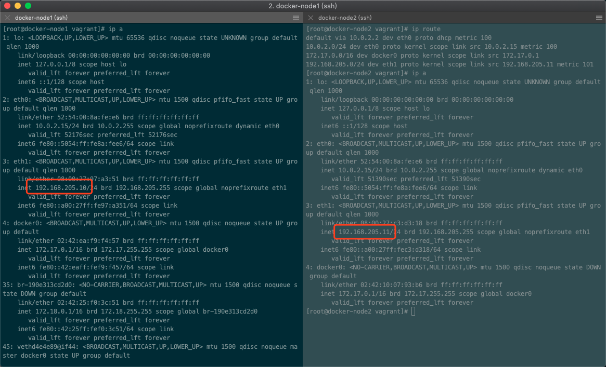

Docker 默认的网络环境下，单台主机上的 Docker 容器可以通过 docker0 网桥直接通信，

首先是启动我们前面准备的虚拟机，docker-node1和docker-node2

并且两台机器是能互相 通信的

## [Docker容器跨主机通信之：直接路由方式](<https://juejin.im/post/5b27a9d96fb9a00e973c455e>)

## [Docker的网络模式和如何跨主机通信](<https://blog.csdn.net/smooth00/article/details/82842234>)

