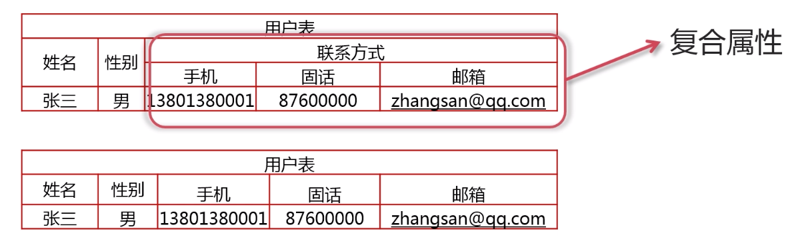
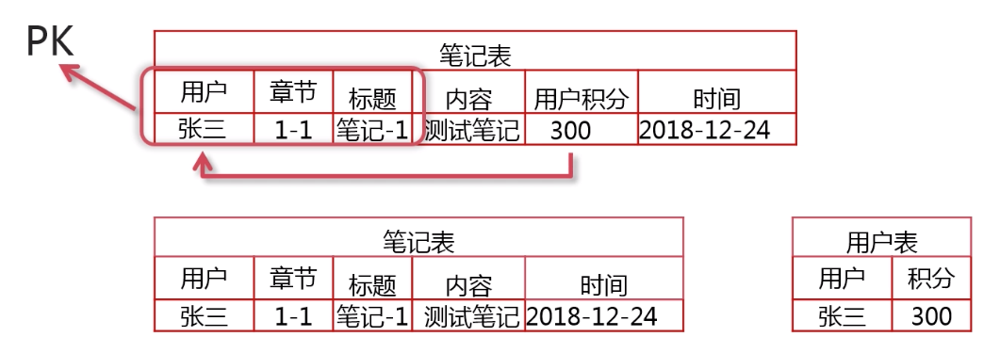
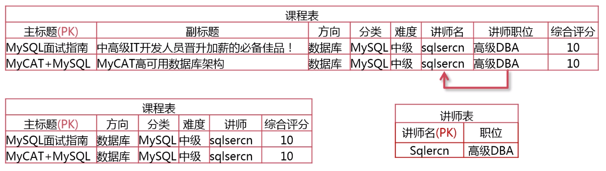
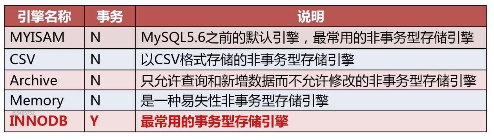
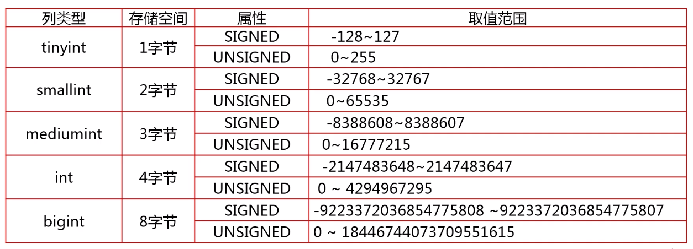
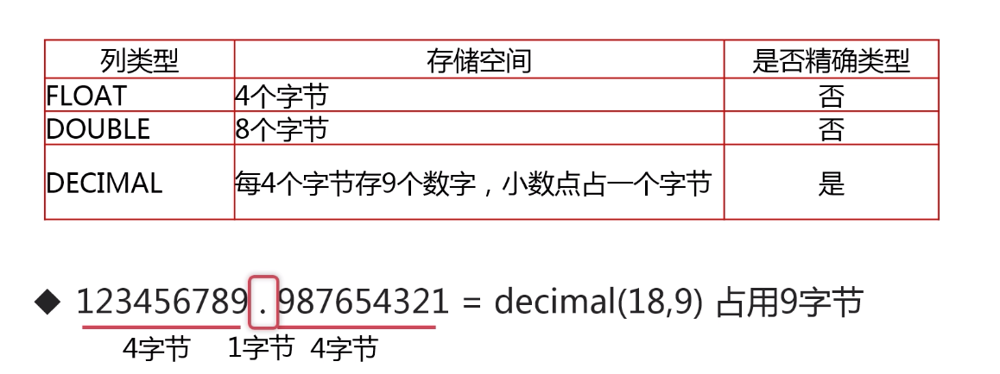
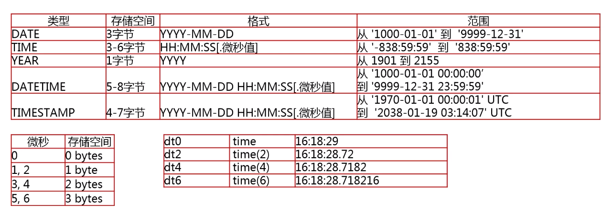
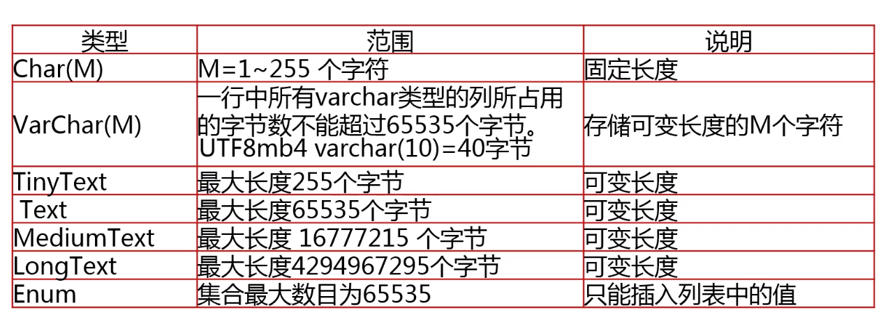

###宽表模式   

 	从字面上意思理解就是将 很多的字段都存入一张表中。通常是指业务主体相关的指标、维度、属性关联在一起的一张数据库表。

#### ​存在的问题：

- 数据冗余：相同的数据在一个表中出现了多次

- 数据更新异常：修改一行中某列的值时，同时修改了多行数据
- 数据插入异常：部分数据由于缺失主键（非空且唯一）信息而无法写入表中
- 数据删除异常：删除某一数据时不得不删除另一数据

#### 适合的应用场景：

- 配合列存储的数据报表应用（数据不需要关联多个表）


### 数据库设计范式

#### 第一范式

> 表中的所有字段都是不可再分的，强调列的原子性




#### 第二范式

> 表中必须存在业务主键，并且非主键依赖于 *全部* 业务主键




#### 第三范式

> 表中的非主键列之间不能相互依赖




#### 范式化的优点

> 减少数据冗余
>
> 减少数据的插入、更新、删除异常
>
> 让数据之间的关系更清晰


范式化的缺点

> 查询需要关联多个表
>
> 对查询性能有一定的影响


#### 反范式化设计

 	在范式化设计的基础上，针对范式化的缺点，对于需要提高查询运行效率的地方，降低范式标准，适当保留冗余数据，能够减少查询时候需要关联多张变的情况，控制好这种反范式的度可以大大提高优化性能。这样就是前面说的数据报表类的应用使用反范式的宽表模式设计的一个体现


### 物理设计

#### MySQL常见的存储引擎

​	**使用命令查看MySQL使用的引擎**

```mysql
mysql> show engines \G;
*************************** 1. row ***************************
      Engine: BLACKHOLE
     Support: YES
     Comment: /dev/null storage engine (anything you write to it disappears)
Transactions: NO
          XA: NO
  Savepoints: NO
*************************** 2. row ***************************
      Engine: MyISAM
     Support: YES
     Comment: MyISAM storage engine
Transactions: NO
          XA: NO
  Savepoints: NO
*************************** 3. row ***************************
      Engine: FEDERATED
     Support: NO
     Comment: Federated MySQL storage engine
Transactions: NULL
          XA: NULL
  Savepoints: NULL
*************************** 4. row ***************************
      Engine: MRG_MYISAM
     Support: YES
     Comment: Collection of identical MyISAM tables
Transactions: NO
          XA: NO
  Savepoints: NO
*************************** 5. row ***************************
      Engine: PERFORMANCE_SCHEMA
     Support: YES
     Comment: Performance Schema
Transactions: NO
          XA: NO
  Savepoints: NO
*************************** 6. row ***************************
      Engine: InnoDB
     Support: DEFAULT
     Comment: Supports transactions, row-level locking, and foreign keys
Transactions: YES
          XA: YES
  Savepoints: YES
*************************** 7. row ***************************
      Engine: MEMORY
     Support: YES
     Comment: Hash based, stored in memory, useful for temporary tables
Transactions: NO
          XA: NO
  Savepoints: NO
*************************** 8. row ***************************
      Engine: CSV
     Support: YES
     Comment: CSV storage engine
Transactions: NO
          XA: NO
  Savepoints: NO
*************************** 9. row ***************************
      Engine: ARCHIVE
     Support: YES
     Comment: Archive storage engine
Transactions: NO
          XA: NO
  Savepoints: NO
9 rows in set (0.00 sec)
```



#### InnoDB存储引擎的特点

- 特性
  1. 具有较好的事务支持：支持4个事务隔离级别，支持多版本读
  2. 行级锁定：通过索引实现，全表扫描仍然会是表锁，注意间隙锁的影响
  3. 读写阻塞与事务隔离级别相关
  4. 具有非常高效的缓存特性：能缓存索引，也能缓存数据
  5. 整个表和主键以Cluster方式存储，组成一颗平衡树
  6. 所有Secondary Index都会保存主键信息
- 适用场景
  1. 需要事务支持（具有较好的事务特性）
  2. 行级锁定对高并发有很好的适应能力，但需要确保查询是通过索引完成
  3. 数据更新较为频繁的场景
  4. 数据一致性要求较高
  5. 硬件设备内存较大，可以利用InnoDB较好的缓存能力来提高内存利用率，尽可能减少磁盘 IO
- 最佳实践
  1. 主键尽可能小，避免给Secondary index带来过大的空间负担
  2. 避免全表扫描，因为会使用表锁
  3. 尽可能缓存所有的索引和数据，提高响应速度
  4. 在大批量小插入的时候，尽量自己控制事务而不要使用autocommit自动提交
  5. 合理设置innodb_flush_log_at_trx_commit参数值，不要过度追求安全性


#### 常用的整数类型

MySQL没有内置的布尔类型。 但是它使用[TINYINT(1)](http://www.yiibai.com/mysql/int.html)。 为了更方便，MySQL提供`BOOLEAN`或`BOOL`作为`TINYINT(1)`的同义词。https://www.yiibai.com/mysql/boolean.html

 


#### 常用的浮点类型 



##### DECIMAL(M,D)用法小结

- 引言：对于精度比较高的东西，一般要求比较高，所以一般用DECIMAL会好一点

- DECIMAL

  DECIMAL列的声明语法是DECIMAL(M,D)。在MySQL 5.1中，参量的取值范围如下：

  1.M是数字的最大数（精度）。其范围为1～65（在较旧的MySQL版本中，允许的范围是1～254）。

  2.D是小数点右侧数字的数目（标度）。其范围是0～30，但不得超过M。

  说明：float占4个字节，double占8个字节，decimail(M,D)占M+2个字节（M>D的时候）

- 例子,比如：

  DECIMAL(5, 2) 的最大值为999.99，最小值为-999.99 ，所以有7 个字节可用。   


#### 常用的时间类型 




#### 常用的字符串类型



 

#### 如何为数据选择合适的数据类型

- 优先选择符合存储数据需求的最小数据类型。
- 谨慎使用ENUM，TEXT字符串类型。
- 同财务相关的数据型数据，必须使用DECIMAL类型，防止精度丢失。


#### 如何为表和列选择适合的名字

- 所有数据库对象名称必须使用小写字母可选用下划线分割。
- 所有数据库对象名称定义禁止使用MySQL保留关键字
- 数据库对象的命名要能做到见名思意，并且最好不好超过32个字符  
- 临时库表必须以 `tmp` 为前缀并以日期为后缀
- 用于备份的库，表必须以 `bak` 为前缀并以日期为后缀
- 所有存储相同数据的列名和列类型必须一致


