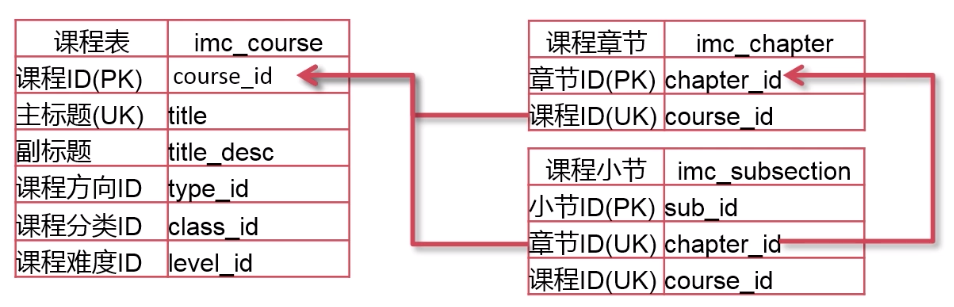

##  初始SQL	

- 什么是SQL：是结构化查询语言（Structured Query Language），一种用于存储、操作或者检索存储在关系型数据库中数据的计算机语言。

- 为什么要用SQL：

  - 允许用户访问关系型数据库中的数据
  - 允许用户对数据做出描述
  - 允许用于定义数据库中的数据，并对其进行操作
  - 允许通过 SQL 模块、库或者预编译器的等方式，嵌入到其他语言中
  - 允许用户创建或删除数据库和表
  - 允许用户在数据库中创建视图、存储过程和函数
  - 允许用户对表、过程和视图设进行权限设置

- 常用的SQL命令：用于与关系型数据库交互的标准 SQL 命令有 CREATE、SELECT、INSERT、UPDATE、DELETE 和 DROP，这些命令按用途分成如下几组：

  - **DDL（Data Definition Language，数据定义语言**)

    | 命令   | 描述                                   |
    | ------ | -------------------------------------- |
    | CREATE | 创建新的表、视图或者其他数据库中的对象 |
    | ALTER  | 修改现存数据库对象，比如一张表         |
    | DROP   | 删除表、视图或者数据库中的其他对象     |

  - **DML（Data Manipulation Language，数据操纵语言）**

    | 命令   | 描述                             |
    | ------ | -------------------------------- |
    | SELECT | 从一张或者多张表中检索特定的数据 |
    | INSERT | 创建一条新记录                   |
    | UPDATE | 修改记录                         |
    | DELETE | 删除记录                         |

  - **DCL（Data Control Language，数据控制语言）**

    | 命令   | 描述               |
    | ------ | ------------------ |
    | GRANT  | 赋予用户特权       |
    | REVOKE | 收回赋予用户的特权 |


## 访问控制

**DCL**

- 建立数据库账号 ：create user
- 对用户授权： grant
- 收回用户权限： revoke

  

### 创建项目数据库账号

```mysql
# 创建一个 mc_test 账户，并设置访问密码，以及最大访问连接数, 允许 xx.xx.xx.% 自己设置的ip端下所有访问 
CREATE USER mc_test@'22.22.22.%' IDENTIFIED BY '123456' WITH MAX_USER_CONNECTIONS 1;
```

账号创建好 了之后 ，我通过本机终端去访问启用的这个  mysql 。发现当开启第二个终端访问的时候触发了上面 的这个账号的最大访问链接限制 。


 

### 给账号授权、回收权限

- MySQL 的常用权限

  | 权限名称 | 说明                 |
  | -------- | -------------------- |
  | Insert   | 向表中插入数据的权限 |
  | Delete   | 删除表中数据的权限   |
  | Update   | 修改表中数据的权限   |
  | Select   | 查询表中数据的权限   |
  | Execute  | 执行存储过程的权限   |

- Grant 命令的注意事项
  - 使用 grant 授权的数据账户必须存在
  - 用户使用 grant 命令授权必须具有 grant option 的权限
  - 获取命令帮助   help  grant  或者  \h  grant

**示例：**

```mysql
# 给账号属于  ‘增删改查’ 的权限
GRANT  select,delete,insert,update  ON  mysql.*  TO mc_class@'192.168.1.%'

# 收回改账号的  ‘增删改’  权限
REVOKE  delete,insert,update  ON    mysql.*   from   mc_class@'192.168.1.%'
```


## 创建数据库对象

**DDL**

- 建立/修改/删除数据库：create/alter/drop  database
- 建立/修改/删除表：create/alter/drop  table
- 建立/删除索引：create/drop  index
- 清空表：truncate  table    相当于先 drop table  然后在 create table
- 重命名：rename  table
- 建立/修改/删除视图：create/alter/drop  view


## 操作表

**DML**

- 新增表中的数据：insert into
- 删除表中的数据：delete
- 修改表中的数据：update
- 查询表中的数据：select


### insert into 

> 语法：
>
> ```sql
> INSERT INTO table(column1,column2...)
> VALUES (value1,value2,...);
> ```
>
> **首先**，在`INSERT INTO`子句之后，在括号内指定表名和逗号分隔列的列表。
> **然后**，将括号内的相应列的逗号分隔值放在`VALUES`关键字之后。

实例：

```mysql
# 使用数据库
use imc_db

# 查看创建表的 SQL 语句
SHOW CREATE TABLE imc_class;

# 1、增加课程分类表数据
insert into imc_class (class_name) 
VALUES ('MySql'),('Redis'),('MongoDB'),('Oracle');

# 2.创建以 class_name 为唯一索引
CREATE UNIQUE INDEX uqx_classname ON imc_class(class_name);

# 3、再次执行插入语句，这时候由于有了唯一索引，重复的值无法插入成功，提示如下：
# 1062 - Duplicate entry 'MySql' for key 'uqx_classname', Time: 0.004000s
insert into imc_class (class_name) VALUES ('MySql');

# 4、执行 INSERT 的时候使用 ON DUPLICATE KEY UPDATE 在遇到违反上述错误时候进行数据更新操作。
# 结果可以发现  add_time 发生了修改达到效果，虽然操作的一行却受影响的是两行原因是：先删除在插入。
insert into imc_class (class_name) VALUES ('MySql') ON DUPLICATE KEY UPDATE add_time = CURRENT_TIME;

```


### select 

通常最简单的 select 语句示范：

```mysql
# 最简单的 select，只跟一个从句，这就相当于  其他语言的 print 函数 
SELECT 'hello','golang',2019+1;

# 从指定表中查询所有列数据 
SELECT * from imc_db.imc_class;

# 通常查询应该减少使用  * ，而是指定要查询的列，减少性能消耗
SELECT class_name from imc_class;
 
# 查询表中的 title 字段，过滤包含  ’MySQL’ 字样的数据
SELECT title FROM imc_course where title LIKE '%MySql%';
```


#### **where 条件中比较运算符，来进行数据过滤**

| 比较运算符              | 说明                                                         |
| ----------------------- | ------------------------------------------------------------ |
| =  >  <  >=  <=  <>  != | <> 和 != 都表示不等于                                        |
| BETWEEN min AND max     | 选取介于两个值之间的数据范围内的值。这些值可以是数值、文本或者日期。 |
| IS NULL、IS NOT NULL    | 判断列的值是否是  NULL                                       |
| LIKE、NOT LIKE          | % 代表任何数量的字符，_代表任何一个字符                      |
| IN、NOT  IN             | 判断列的值是否在指定的范围内                                 |

示例：

```MySQL
# 学习人数大于1000人的课程有哪些，列出他们的课程标题和学习人数 
select title,study_cnt from imc_course where study_cnt>1000;


# 学习人数大于等于1000人并且小于等于2000人的课程有哪些，列出他们的课程标题和学习人数 
select title,study_cnt from imc_course where study_cnt BETWEEN 1000 AND 2000;


# 创建一个 test_is 表 设置字段可为空
CREATE TABLE test_is(id INT,c1 VARCHAR(10),PRIMARY KEY(id));
# 插入一些数据，其中包括职位 Null 的数据
INSERT INTO test_is values(1,'aa'),(2,NULL),(3,'cc');
# 查询 test_is 中  c1 值不为 null 的数据 
SELECT * FROM test_is WHERE c1 IS NOT NULL;


# 从句字符串中使用  % 和 _ 的区别
SELECT 'this  is  mysql course ' LIKE '%ysq%';
SELECT 'tesXXXXXXXXMysql' LIKE '%ysq';
SELECT 'tesXXXXXXXXMysql' LIKE '%ysql_';


# 查询课程id 在给定结合中的课程标题
SELECT title  from imc_course WHERE course_id in (1,5,6,7);
```


#### **where 中使用关联符，关联多个过滤条件**

| 逻辑运算符 | 说明                                       |
| ---------- | ------------------------------------------ |
| AND，&&    | 两边表达式都是真，返回结果才是真           |
| OR，\|\|   | 两边表达式只要有一方为真，返回结果为真     |
| XOR        | 量表表达式只能一真一假时返回真，否则返回假 |

示例:

```mysql
#  查询出课程标题含有 ‘MySQL’ 关键字，并且学习人数大于 5000人的课程标题和学习人数
SELECT title,study_cnt FROM imc_course WHERE title LIKE '%mysql%' and study_cnt>5000;


#  查询出课程标题含有 ‘MySQL’ 关键字，或者学习人数大于 5000人的课程标题和学习人数
SELECT title,study_cnt FROM imc_course WHERE title LIKE '%mysql%' or study_cnt>5000;


#  查询课程标题中含有 ’MySQL‘ 关键字并且学习人数小于5000，
#  课程标题中不含有 ’MySQL‘ 关键字但学习人数大于5000 的课程标题和学习人数

# 方案一：分开查询并合并结果 
SELECT title,study_cnt FROM  imc_course WHERE title LIKE  '%mytsql%' AND study_cnt<5000
UNION ALL
SELECT title,study_cnt FROM  imc_course WHERE title NOT LIKE  '%mytsql%' AND study_cnt>5000;

# 方案二：使用 XOR 异或关联两个互斥表达式
SELECT title,study_cnt FROM  imc_course WHERE title LIKE  '%mytsql%' XOR study_cnt>5000;

```


- **Tips：任何运算符和 Null 值运算结果都为 Null**


#### 如何从多个表中获取数据？

表与表之间要存在一定的关联关系



SQL join 用于把来自两个或多个表的行结合来。下图展示了关于 join 的7中用法


#### Inner join

> 内关联 inner join ,如果表中至少有一个匹配，则返回行。实际可以看成求两个表的交集合成一张新的临时表，然后在从临时表中去使用 where 条件过滤查询。inner join 与 join 是相同的


```MySQL
# 查询出每一门课程的课程id，课程名称和章节名称。这就需要从课程表和章节表中查询
select a.course_id,a.title,b.chapter_name
	FROM imc_course a join imc_chapter b 
	on b.course_id = a.course_id

# 往课程表中插入一条数据，但不在章节表中插入相关联的数据
INSERT INTO imc_course (title,title_desc,type_id,class_id,level_id,online_time,user_id) 
	VALUES("MySQL关联测试", "测试关联查询MySQL",8,1,1,NOW(),29)

# 查询刚才插入的数据
SELECT  * FROM imc_course WHERE title = "MySQL关联测试"

# 再次使用上面的关联查询，加入过滤条件可以看出由于章节表中没有相关联的数据就查不到了交集。
select a.course_id,a.title,b.chapter_name
	FROM imc_course a join imc_chapter b 
	on b.course_id = a.course_id
	WHERE title = "MySQL关联测试"
```


#### left join

> 外关联之 left join。从左表（table1）返回所有的行，即使右表（table2）中没有匹配。如果右表中没有匹配，则结果为 NULL。


```MySQL
# 查询出在存在于课程表中，但不存在于章节表中的课程的课程名称和课程id信息

# 方案一：先查询章节表中的所有课程id作为子集，然后查询课程表中 not in 这个子集的结果
SELECT a.course_id,a.title
	FROM imc_course a 
	WHERE course_id NOT IN (SELECT b.course_id FROM imc_chapter b)
+-----------+-------------------+
| course_id | title             |
+-----------+-------------------+
|       101 | MySQL关联测试     |
+-----------+-------------------+

# 方案二：使用left join 以课程表为基准表返回所有行，章节表中没有匹配的数据值为null做为过滤条件
SELECT a.course_id,a.title,b.chapter_name 
	FROM imc_course a  
	LEFT JOIN imc_chapter b  
	ON a.course_id = b.course_id 
	limit 5
+-----------+-------------------+---------------------------+
| course_id | title             | chapter_name              |
+-----------+-------------------+---------------------------+
|       101 | MySQL关联测试     | NULL                      |
|        89 | MySQL课程-04045   | MySQL课程-04045第 1章     |
|        89 | MySQL课程-04045   | MySQL课程-04045第 2章     |
|        89 | MySQL课程-04045   | MySQL课程-04045第 3章     |
|        89 | MySQL课程-04045   | MySQL课程-04045第 4章     |
+-----------+-------------------+---------------------------+

# 可以看到由于章节表中没有对应课程id为 101 的数据，为了便于查看结果多查询的章节名称结果看出是 null 。
# 就利用left join 后章节表中的 course_id 为 Null 作为过滤条件
SELECT a.course_id,a.title 
	FROM imc_course a  
	LEFT JOIN imc_chapter b  
	ON a.course_id = b.course_id 
	WHERE b.course_id IS NULL
+-----------+-------------------+
| course_id | title             |
+-----------+-------------------+
|       101 | MySQL关联测试     |
+-----------+-------------------+

# 利用外关联 left join 加 where 过滤条件可以获得左表相对于右边中不相同的所有数据。
```


#### right join

> 外关联之 right join。与左关联 left join 反之。


#### Group by 

> 把结果集按照某些列分成不同的组，并对分组后的数据进行聚合操作
>
> Tips:所有在 select 子句中的非聚合函数，都必须出现在 group by 子句中，否则只有在 MySQL 宽松模式下执行才会通过，且数据是不准确的

```mysql
# 查看当前 sql_mode 的模式。当前为宽松模式
show variables like 'sql_mode';
+---------------+--------------------------------------------+
| Variable_name | Value                                      |
+---------------+--------------------------------------------+
| sql_mode      | STRICT_TRANS_TABLES,NO_ENGINE_SUBSTITUTION |
+---------------+--------------------------------------------+
1 row in set (0.01 sec)


# 统计出每个分类下不同难度的课程的数量
SELECT level_name,class_name,COUNT(*)
	FROM imc_course a
	JOIN imc_class b on a.class_id = b.class_id
	JOIN imc_level c on a.level_id = c.level_id
	GROUP BY level_name;
# 可以看出来宽松模式下能查询到数据，但是数据是不准确的
+------------+------------+----------+
| level_name | class_name | COUNT(*) |
+------------+------------+----------+
| 入门       | 大数据     |       21 |
| 初级       | Hbase      |       28 |
| 高级       | 大数据     |       24 |
| 中级       | MySQL      |       27 |
+------------+------------+----------+
4 rows in set (0.01 sec)


# 修改 MySQL 的 sql_mode 模式
set session sql_mode='ONLY_FULL_GROUP_BY';
Query OK, 0 rows affected (0.00 sec)


# 再次尝试查询
SELECT level_name,class_name,COUNT(*)
	FROM imc_course a
	JOIN imc_class b on a.class_id = b.class_id
	JOIN imc_level c on a.level_id = c.level_id
	GROUP BY level_name;
# 结果出现了错误提示
ERROR 1055 (42000): Expression #2 of SELECT list is not in GROUP BY clause and contains nonaggregated column 'imc_db.b.class_name' which is not functionally dependent on columns in GROUP BY clause; this is incompatible with sql_mode=only_full_group_by


# 修改查询语句，group by 子句中加上所有select 子句的非聚合函数列
SELECT level_name,class_name,COUNT(*)
	FROM imc_course a
	JOIN imc_class b on a.class_id = b.class_id
	JOIN imc_level c on a.level_id = c.level_id
	GROUP BY level_name,class_name;
# 得出正确结果
+------------+-----------------+----------+
| level_name | class_name      | COUNT(*) |
+------------+-----------------+----------+
| 入门       | 大数据          |        1 |
| 初级       | Hbase           |        4 |
| 高级       | 大数据          |        2 |
| 中级       | MySQL           |        1 |
| 入门       | MySQL           |        1 |
| 中级       | 安全测试        |        3 |
... ...			# 为避免篇幅占用，这里用省略代替
| 初级       | HadoopDock      |        1 |
| 中级       | SQL Server      |        1 |
| 中级       | Linux           |        2 |
+------------+-----------------+----------+
45 rows in set (0.00 sec)
```


#### having

> SQL中增加  having 子句的原因是，WHERE 关键字无法和聚合函数一起使用
>
> 可以通过可选的 having 子句对聚合（group by）后的数据进行过滤

```mysql
# 统计每个分类下不同难度的课程数量大于3门的有哪些, 在上面的语句中加上 having 过滤语句就可以了
select class_name,level_name,count(*)
	from imc_course a
	join imc_class b on a.class_id = b.class_id
	join imc_level c on a.level_id = c.level_id
	group by  class_name,level_name 
	having count(*)>3
# 结果：count 数量过滤了小于等于3的所有结果
+------------+------------+----------+
| class_name | level_name | count(*) |
+------------+------------+----------+
| Hbase      | 初级       |        4 |
| Oracle     | 初级       |        4 |
| Hbase      | 高级       |        5 |
| 运维       | 高级       |        4 |
| MySQL      | 高级       |        4 |
| Redis      | 初级       |        4 |
| MongoDB    | 入门       |        4 |
| HadoopDock | 中级       |        4 |
| Docker     | 中级       |        4 |
| 运维       | 中级       |        4 |
+------------+------------+----------+
```

#### 

#### 常用聚合函数

| 聚合函数                 | 说明                                   |
| ------------------------ | -------------------------------------- |
| COUNT(*)/COUNT(col_name) | 计算负荷条件的数据行数                 |
| SUM(col_name)            | 计算表中符合条件的数值列的合计值       |
| AVG(col_name)            | 计算表中符合条件的数值列的平均值       |
| MAX(col_name)            | 计算表中符合条件的任意列中数据的最大值 |
| MIN(col_name)            | 计算表中符合条件的任意列中数据的最小值 |

演示：

```MySQL
# 统计课程表的总课程数，
select count(*)
    from imc_course
# 结果
+----------+
| count(*) |
+----------+
|      100 |
+----------+


# 统计不同课程的id的总数，以及课程讲师数    distinct:去除重复数据
select count(course_id),count(distinct user_id) 
	from imc_course
# 结果
+------------------+-------------------------+
| count(course_id) | count(distinct user_id) |
+------------------+-------------------------+
|              100 |                       5 |
+------------------+-------------------------+


# 统计所有课程总的学习人数
select sum(study_cnt)
	from imc_course
# 结果
+----------------+
| sum(study_cnt) |
+----------------+
|         482882 |
+----------------+


# 统计不通难度等级的总学习人数
select level_name,sum(study_cnt)
	from imc_course a
	join imc_level b on a.level_id = b.level_id
	group by level_name
# 结果
+------------+----------------+
| level_name | sum(study_cnt) |
+------------+----------------+
| 入门       |          94927 |
| 初级       |         142641 |
| 高级       |         116819 |
| 中级       |         128495 |
+------------+----------------+


# 统计出每门课程的平均学习人数 
# 1、总人数除以课程数   2、AVG 直接取平均值
select class_name,sum(study_cnt)/count(study_cnt),avg(study_cnt)
	from imc_course a
	join imc_class b on a.class_id = b.class_id
	group by class_name
# 结果
| class_name      | sum(study_cnt)/count(study_cnt) | avg(study_cnt) |
+-----------------+---------------------------------+----------------+
| 大数据          |                       6323.0000 |      6323.0000 |
| Hbase           |                       5107.1538 |      5107.1538 |
| MySQL           |                       6364.2857 |      6364.2857 |
| 安全测试        |                       5092.1250 |      5092.1250 |
| Oracle          |                       3648.5714 |      3648.5714 |
| MongoDB         |                       5352.5000 |      5352.5000 |
| 运维            |                       3939.9000 |      3939.9000 |
| Redis           |                       6090.5000 |      6090.5000 |
| SQL Server      |                       4579.0000 |      4579.0000 |
| Docker          |                       4331.5000 |      4331.5000 |
| Linux           |                       5032.1250 |      5032.1250 |
| HadoopDock      |                       3625.8333 |      3625.8333 |
| 自动化运维      |                       3161.0000 |      3161.0000 |
+-----------------+---------------------------------+----------------+


# 查询出课程中学习人数最多的课程名称
select title,study_cnt
	from imc_course
	where study_cnt = 
		(select max(study_cnt) from imc_course)		# 使用子查询将最大人数当做结果使用
# 结果
+------------------------+-----------+
| title                  | study_cnt |
+------------------------+-----------+
| PostgreSQL课程-64209   |      9939 |
+------------------------+-----------+
```


#### Order by 

> - 使用  order by 子句是对查询结果进行排序的最安全方法
> - 列名后增加 asc 关键字指定改列的升序进行排序，或者是指定 desc 管家你指定降序排序
> - order by  子句和 group by 不同的是也可以使用 select 子句中未出现的列或者函数，

```MySQL
# 查询出每门课程的学习人数并按照学习人数从高到低排列
select title,study_cnt
	from imc_course
	order by study_cnt desc
# 结果
+------------------------+-----------+
| title                  | study_cnt |
+------------------------+-----------+
| PostgreSQL课程-64209   |      9939 |
| SQLServer课程-68633    |      9731 |
... ...
| PostgreSQL课程-76943   |       143 |
| PostgreSQL课程-82453   |       118 |
| PostgreSQL课程-71564   |        60 |
+------------------------+-----------+
100 rows in set (0.00 sec)
```


#### limit 

> 使用 limit 子句限制返回结果集的行数
>
> - 常用于数据列表分页
> - 一定要喝 Order  by  子句配合使用
> - limit 起始偏移量，结果集的行数

```MySQL
# 分页返回课程id 和 课程名称，每页返回10行记录
select course_id,title
	from imc_course
	order by study_cnt desc
	limit 0,10
+-----------+------------------------+
| course_id | title                  |
+-----------+------------------------+
|        46 | PostgreSQL课程-64209   |
|        31 | SQLServer课程-68633    |
|        45 | MySQL课程-86475        |
|        39 | PostgreSQL课程-33460   |
|        57 | SQLServer课程-82618    |
|        86 | PostgreSQL课程-37929   |
|        47 | MySQL课程-89370        |
|        52 | SQLServer课程-63362    |
|        99 | SQLServer课程-17974    |
|        66 | MySQL课程-74850        |
+-----------+------------------------+
```


### 视图 （Views）

> 视图是从一个或几个基本表（或视图）导出的表。它与基本表不同，是一个虚表。数据库只存放视图的定义，而不存放视图对应的数据，这些数据仍存放在原来的基本表中。所以基本表中的数据发生变化，从视图中查询出的数据也就随之改变了。从这个意义上讲，视图就像一个窗口，透过它可以看到数据库中自己感兴趣的数据及其变化。


#### 视图的作用：

- 视图隐藏了底层的表结构，简化了数据访问操作，客户端不再需要知道底层表的结构及其之间的关系。

- 视图提供了一个统一访问数据的接口。（即可以允许用户通过视图访问数据的安全机制，而不授予用户直接访问底层表的权限）

- 从而加强了安全性，使用户只能看到视图所显示的数据。

- 视图还可以被嵌套，一个视图中可以嵌套另一个视图。


#### create view

> CREATE VIEW  view_name  AS  SELECT ....

> ​	

> ​	

```mysql
# 定义一个包含课程id，课程名称，课程分类，课程方向一级课程难度的视图
create view vm_course
	as
    select a.course_id,a.title,b.class_name,c.type_name,d.level_name 
        from imc_course a
        join imc_class b on a.class_id = b.class_id
        join imc_type c on a.type_id = c.type_id
        join imc_level d on a.level_id = d.level_id
# 结果
Query OK, 0 rows affected (0.02 sec)


# 创建好视图后，我们就可以直接通过这个视图来执行查询
select * from vm_course
# 结果
+-----------+------------------------+-----------------+---------------------+------------+
| course_id | title                  | class_name      | type_name           | level_name |
+-----------+------------------------+-----------------+---------------------+------------+
|         1 | MySQL课程-79889        | 大数据          | 算法&数学           | 入门       |
|         2 | MySQL课程-69546        | Hbase           | 云计算&大数据       | 初级       |
|         3 | PostgreSQL课程-43917   | 大数据          | 前端开发            | 高级       |
... ....
|        99 | SQLServer课程-17974    | Linux           | 游戏                | 中级       |
|       100 | PostgreSQL课程-58169   | 安全测试        | 移动开发            | 初级       |
+-----------+------------------------+-----------------+---------------------+------------+
100 rows in set (0.17 sec)
	
```


### delete

> DELETE FROM *table_name*
>
> ​        WHERE *some_column*=*some_value*;

```mysql
# 删除课程表中没有章节信息的课程
# 首先查询一下
select a.course_id,a.title
	from imc_course a
	left join imc_chapter b on a.course_id = b.course_id
	where b.course_id is null
# 结果
+-----------+-------------------+-----------+
| course_id | title             | course_id |
+-----------+-------------------+-----------+
|       101 | MySQL关联测试     |      NULL |
+-----------+-------------------+-----------+

# 使用 delete 语句进行删除
delete a
	from imc_course a
	left join imc_chapter b on a.course_id = b.course_id
	where b.course_id is null
# 结果
Query OK, 1 row affected (0.01 sec) 


# 删除课程方向标中重复的课程方向
# 并且保留方向id最小的一条，并在方向名称字段上建立唯一索引
# 1、首先尝试查询出重复课程方向的数据
select type_name,min(type_id) as min_type_id,count(*)
	from imc_type
	group by type_name having count(*)>1
+--------------+-------------+----------+
| type_name    | min_type_id | count(*) |
+--------------+-------------+----------+
| 后端开发     |           2 |        2 |
| 前沿技术     |           5 |        3 |
| 数据库       |           8 |        2 |
+--------------+-------------+----------+

# 2、以上面查询语句结果作为子表，进行关联删除
delete a
	from imc_type a
	join (
    	select type_name,min(type_id) as min_type_id,count(*)
        	from imc_type
        	group by type_name having count(*)>1
    ) b 
    on a.type_name = b.type_name and a.type_id > b.min_type_id
# 结果
Query OK, 4 rows affected (0.00 sec)

# 3、保留最小方向id，去除重复数据后，就可以建立唯一索引
create unique index uqx_typename on imc_type(type_name)
# 结果
Query OK, 0 rows affected (0.06 sec)

# 索引建立成功后，尝试加入同名的数据会提示唯一索引，失败
insert into imc_type (type_name) value ('后端开发');
# 结果
ERROR 1062 (23000): Duplicate entry '后端开发' for key 'uqx_typename'
```


> ​	

### update

> UPDATE *table_name*
>
> ​        SET *column1*=*value1*,*column2*=*value2*,...
>
> ​        WHERE *some_column*=*some_value*;
>
> ​	
>
> ​	

```mysql
# 冻结用户 ”沙占“ 的账号
# 首先查询一下该账号状态
select user_nick,user_status
	from imc_user
	where user_nick="沙占"
# 结果
+-----------+-------------+
| user_nick | user_status |
+-----------+-------------+
| 沙占      |           1 |
+-----------+-------------+

# 在使用 Update 语句修改 user_status 的状态
update imc_user
	set user_status = 0
	where user_nick = "沙占"
# 结果
Query OK, 1 row affected (0.05 sec)
Rows matched: 1  Changed: 1  Warnings: 0


# 课程表中增加一个 是否随机推荐的字段。并随机选择10门课程修改状态为推荐
# 增加字段
alter table imc_course
	add is_recommand tinyint default 0
	comment '是否推荐，0不推荐，1推荐'
# 结果
Query OK, 0 rows affected (0.08 sec)
Records: 0  Duplicates: 0  Warnings: 0

# 随机选择10门课程进修推荐状态修改
update imc_course 
	set is_recommand=1
	order by rand()
	limit 10
# 结果
Query OK, 10 rows affected (0.00 sec)
Rows matched: 10  Changed: 10  Warnings: 0

# 查询出看看是那10条记录被修改了
select course_id,title
	from imc_course
	where is_recommand = 1
# 结果： 可以看出被修改的数据是随机的
+-----------+------------------------+
| course_id | title                  |
+-----------+------------------------+
|         3 | PostgreSQL课程-43917   |
|         4 | MySQL课程-88343        |
|         6 | PostgreSQL课程-69538   |
|        15 | SQLServer课程-67682    |
|        22 | SQLServer课程-49466    |
|        34 | SQLServer课程-81160    |
|        56 | MySQL课程-58054        |
|        70 | MySQL课程-72699        |
|        91 | SQLServer课程-09426    |
|        94 | PostgreSQL课程-49682   |
+-----------+------------------------+

# 利用课程评分表中的数据计算出平均评分，并更新到课程表中
# 将课程评分表中查询出的平均评分作为子表，和课程表进行 join 然后根据条件进行 update
update imc_course a
	join (
    	select course_id
        		,avg(content_score) as avg_content
        		,avg(level_score) as avg_level
        		,avg(logic_score) as avg_logic
        		,avg(score) as avg_score
        	from imc_classvalue
        	group by course_id
    ) b on a.course_id = b.course_id
    set a.content_score = b.avg_content,
    	a.level_score = b.avg_level,
    	a.logic_score = b.avg_logic,
    	a.score = b.avg_score
# 结果
Query OK, 0 rows affected, 187 warnings (0.00 sec)
Rows matched: 96  Changed: 0  Warnings: 187
```


### 系统函数

#### 常用的时间函数

| 函数名                            | 说明                                                         |
| --------------------------------- | ------------------------------------------------------------ |
| CURDATE()/CURTIME()               | 返回当前日期/返回当前时间                                    |
| NOW()                             | 返回当前的日期和时间                                         |
| DATE_FORMAT(date,fmt)             | 按照 fmt 的格式，对日期 date 进行格式化<br />%Y:四位的年     %m:月份(00..12)    %d:天(00..31)<br />%H:小时(00..24)     %i:分钟(00..59)    %s:秒(00..59) |
| SEC_TO_TIME(seconds)              | 把秒数转换为（小时：分：秒）                                 |
| TIME_TO_SEC(time)                 | 把时间（小时：分：秒）转换为秒数                             |
| DATEDIFF(date1,date2)             | 返回 date1 和 date2 两个日期相差的天数                       |
| DATE_ADD(date,INTERVAL expr unit) | 对给定的日期增加或减少指定的时间单元(unit:DAY天/HOUR小时/MINUTES分钟/SECOND秒) |
| EXTRACT(unit FROM date)           | 提取日期 date 的指定部分                                     |
| UNIX_TIMESTAMP()                  | 返回 unix  时间戳                                            |
| FROM_UNIXTIME()                   | 把 Unix 时间戳转换为日期时间                                 |

```MySQL
# curdate()/curtime/now 的区别
+------------+-----------+---------------------+
| curdate()  | curtime() | now()               |
+------------+-----------+---------------------+
| 2020-04-06 | 08:43:18  | 2020-04-06 08:43:18 |
+------------+-----------+---------------------+

# 使用 date_format() 对时间进行转换
select now(),date_format(now(),'%Y%m%d %H-%i-%s');
+---------------------+--------------------------------------+
| now()               | date_format(now(),'%Y%m%d %H-%i-%s') |
+---------------------+--------------------------------------+
| 2020-04-06 08:49:33 | 20200406 08-49-33                    |
+---------------------+--------------------------------------+

# sec_to_time/time_to_sec
select sec_to_time(60),time_to_sec('1:00:00')
+-----------------+------------------------+
| sec_to_time(60) | time_to_sec('1:00:00') |
+-----------------+------------------------+
| 00:01:00        |                   3600 |
+-----------------+------------------------+

# 计算每门课程，上线时间距当前时间的天数
select title,datediff(now(),online_time)
	from imc_course
	order by online_time desc
# 结果
+------------------------+-----------------------------+
| title                  | datediff(now(),online_time) |
+------------------------+-----------------------------+
| SQLServer课程-09426    |                         376 |
| PostgreSQL课程-58169   |                         379 |
...   ...
| PostgreSQL课程-86934   |                         823 |
| SQLServer课程-63362    |                         823 |
+------------------------+-----------------------------+
100 rows in set (0.01 sec)
	

#
select now()
	,date_add(now(),interval 1 day) as date1
	,date_add(now(),interval 1 year) as date2
	,date_add(now(),interval -1 day) as date3
	,date_add(now(),interval '1:30' hour_minute) as date4
# 结果
+---------------------+---------------------+---------------------+---------------------+---------------------+
| now()               | date1               | date2               | date3               | date4               |
+---------------------+---------------------+---------------------+---------------------+---------------------+
| 2020-04-07 07:50:55 | 2020-04-08 07:50:55 | 2021-04-07 07:50:55 | 2020-04-06 07:50:55 | 2020-04-07 09:20:55 |
+---------------------+---------------------+---------------------+---------------------+---------------------+
	

#
select now()
	,extract(year from now()) as 'year'
	,extract(month from now()) as 'month'
	,extract(day from now()) as 'day'
	,extract(hour from now()) as 'hour'
	,extract(minute from now()) as 'minutes'
#
+---------------------+------+-------+------+------+---------+
| now()               | year | month | day  | hour | minutes |
+---------------------+------+-------+------+------+---------+
| 2020-04-08 07:43:57 | 2020 |     4 |    8 |    7 |      43 |
+---------------------+------+-------+------+------+---------+
	
```


#### 常用的字符串函数 

| 函数名                           | 说明                                                         |
| -------------------------------- | ------------------------------------------------------------ |
| CONCAT(str1,str2,…)              | 把字符串 str1，str2 链接成一个字符串                         |
| CONCAT_WS(setp,str1,str2,…)      | 用指定的分割符 sep 链接字符串                                |
| CHAR_LENGTH(str)                 | 返回字符串 str 的字符个数                                    |
| LENGTH(str)                      | 返回字符串 str 的字节个数                                    |
| FORMAT(X,D[,locale])             | 将数字 N 格式化为格式，如”#,###,###.##“ ,并舍入到 D 位小数   |
| LEFT(str,len)/RIGHT(str,len)     | 从字符串的左/右边起返回 len 长度的子字符串                   |
| SUBSTRING(str,pos,[len])         | 从字符串str的pos 位置起返回长度为 len 的子串，若未指定 len 则返回到结尾为止 |
| SUBSTRING_INDEX(str,delim,count) | 返回字符串 str 按 delim 分割的前 count 个子字符串            |
| LOCATE(substr,str)               | 在字符串 str 中返回子串 substr 第一次出现的位置              |
| TRIM([remstr FROM] str)          | 从字符串 str 两端删除不需要的字符 remstr                     |

示例：

```MySQL
# 处于 SEO 优化的目的，我们需要合并显示课程分类名称和课程标题,concat_ws 还可以添加分隔符
select concat_ws("_",class_name,title)
	from imc_course a
	join imc_class b on a.class_id = b.class_id
# 结果
+----------------------------------------+
| concat_ws("_",class_name,title)        |
+----------------------------------------+
| 大数据_MySQL课程-79889                 |
| Hbase_MySQL课程-69546                  |
...	...
| Linux_SQLServer课程-17974              |
| 安全测试_PostgreSQL课程-58169          |
+----------------------------------------+
100 rows in set (0.00 sec)


# char_length 和 length 的区别
select class_name,length(class_name),char_length(class_name)
	from imc_class
# 结果：可以看出在有中文情况下，一个中文是占了 3 个字节
+-----------------+--------------------+-------------------------+
| class_name      | length(class_name) | char_length(class_name) |
+-----------------+--------------------+-------------------------+
| MySQL           |                  5 |                       5 |
| Redis           |                  5 |                       5 |
| MongoDB         |                  7 |                       7 |
| 安全测试        |                 12 |                       4 |
| Oracle          |                  6 |                       6 |
| SQL Server      |                 10 |                      10 |
| Hbase           |                  5 |                       5 |
| 大数据          |                  9 |                       3 |
| HadoopDock      |                 10 |                      10 |
| Docker          |                  6 |                       6 |
| 运维            |                  6 |                       2 |
| Linux           |                  5 |                       5 |
| 自动化运维      |                 15 |                       5 |
+-----------------+--------------------+-------------------------+


# 金额格式转换
select format(123456.789,4)
# 
+----------------------+
| format(123456.789,4) |
+----------------------+
| 123,456.7890         |
+----------------------+

# 字符串截取
select left("www.baidu.com",3)
	   ,right("www.baidu.com",3)
	   ,substring("www.baidu.com",4,5)
# 
+-------------------------+--------------------------+--------------------------------+
| left("www.baidu.com",3) | right("www.baidu.com",3) | substring("www.baidu.com",4,5) |
+-------------------------+--------------------------+--------------------------------+
| www                     | com                      | .baid                          |
+-------------------------+--------------------------+--------------------------------+


#
select substring_index('192.168.0.100','.',-3) ;
+-----------------------------------------+
| substring_index('192.168.0.100','.',-3) |
+-----------------------------------------+
| 168.0.100                               |
+-----------------------------------------+


# 截取课程标题中横线之前的部分
# 使用 substring + locate 实现
select title,locate('-',title),substring(title,1,locate('-',title)-1)
	from imc_course
#
+------------------------+-------------------+----------------------------------------+
| title                  | locate('-',title) | substring(title,1,locate('-',title)-1) |
+------------------------+-------------------+----------------------------------------+
| MySQL课程-04045        |                 8 | MySQL课程                              |
| MySQL课程-04097        |                 8 | MySQL课程                              |
... ...
| MySQL课程-98454        |                 8 | MySQL课程                              |
| PostgreSQL课程-00168   |                13 | PostgreSQL课程                         |
| PostgreSQL课程-00789   |                13 | PostgreSQL课程                         |
... ...
| PostgreSQL课程-94074   |                13 | PostgreSQL课程                         |
| SQLServer课程-00610    |                12 | SQLServer课程                          |
| SQLServer课程-02477    |                12 | SQLServer课程                          |
... ...
| SQLServer课程-98961    |                12 | SQLServer课程                          |
+------------------------+-------------------+----------------------------------------+

# 直接使用 substring_index 实现
select title,substring_index(title,"-",1) 
	from imc_course
# 
+------------------------+------------------------------+
| title                  | substring_index(title,"-",1) |
+------------------------+------------------------------+
| MySQL课程-04045        | MySQL课程                    |
... ...
| MySQL课程-98454        | MySQL课程                    |
| PostgreSQL课程-00168   | PostgreSQL课程               |
... ...
| SQLServer课程-00610    | SQLServer课程                |
...	...
| SQLServer课程-97024    | SQLServer课程                |
| SQLServer课程-98961    | SQLServer课程                |
+------------------------+------------------------------+
100 rows in set (0.00 sec)


#
select trim('   baidu   '),trim('x' from 'xx23xxbaidu22x31xx')
+---------------------+-------------------------------------+
| trim('   baidu   ') | trim('x' from 'xx23xxbaidu22x31xx') |
+---------------------+-------------------------------------+
| baidu               | 23xxbaidu22x31                      |
+---------------------+-------------------------------------+
```


#### 其他常用函数

| 函数名                                                       | 说明                                                    |
| ------------------------------------------------------------ | ------------------------------------------------------- |
| ROUND(X，D)                                                  | 对数值X进行四舍五入保留D位小数                          |
| RAND()                                                       | 返回一个在0和1之间的随机数                              |
| CASE WHEN [condition]<br /> THEN result<br /> [<br />     WHEN [conditioin] THEN result ...<br />]<br /> [ELSE result] <br />END | 用于实现其他语言中的 case ... when 功能，提供数据流控制 |
| MD5(str)                                                     | 返回 str  的MD5值                                       |

```MySQL
# 显示每个用户的昵称和性别
select user_nick
        ,case when sex=1 then '男'
              when sex=0 then '女'
              else '位置'
        end as '性别'
	from imc_user
# 结果
+-----------+--------+
| user_nick | 性别   |
+-----------+--------+
| 沿舟侨    | 男     |
| 窦貌      | 女     |
... ...
| 晏返      | 女     |
| 邱黄      | 男     |
| 温语      | 男     |
+-----------+--------+
# 还可以使用到 where 条件语句中，
select user_nick
        ,case when sex=1 then '男'
              when sex=0 then '女'
              else '位置'
        end as '性别'
	from imc_user
	where 
		case when sex=1 then '男'
              when sex=0 then '女'
              else '位置'
        end = '男'
#
+-----------+--------+
| user_nick | 性别   |
+-----------+--------+
| 沿舟侨    | 男     |
| 侯鹿焦    | 男     |
| 项讽巡    | 男     |
... ... 
| 郜杨      | 男     |
| 向艳      | 男     |
+-----------+--------+
```


## SQL高级特性

### 公共表表达式 CTE（Common Table Expressions）

- MySQL8.0 之后的版本才可以使用
- CTE 生成一个命名临时表，并且只有查询期间有效（View 视图长期有效，占用服务器资源）
- CTE 临时表在一个查询中可以多次引用及自引用（子查询只能引用一次）


*CTE*的结构包括名称，可选列列表和定义*CTE*的查询。 定义*CTE*后，可以像`SELECT`，`INSERT`，`UPDATE`，`DELETE`或`CREATE VIEW`语句中的视图一样使用它。

#### *CTE*的基本语法：

> WITH cte_name (column_list) AS (
>
> ​       query
>
> ) 
>
> SELECT * FROM cte_name;
>
> tips：查询中的列数必须与`column_list`中的列数相同。 如果省略`column_list`，*CTE*将使用定义*CTE*的查询的列列表。

```mysql
# 查询学生人数大于2000的课程标题和id
with result as (
	select title,study_cnt,class_id
    	from imc_course
    	where study_cnt > 2000
)
select * from result
# 
+------------------------+-----------+----------+
| title                  | study_cnt | class_id |
+------------------------+-----------+----------+
| MySQL课程-79889        |      3503 |        8 |
| MySQL课程-69546        |      3921 |        7 |
... ...
| PostgreSQL课程-58169   |      3765 |        4 |
+------------------------+-----------+----------+
80 rows in set (0.05 sec)


# 多次引用
with result as (
	select title,study_cnt,class_id
    	from imc_course
    	where study_cnt > 2000
)
select * from result
	union all
select * from result
	order by title
#
+------------------------+-----------+----------+
| title                  | study_cnt | class_id |
+------------------------+-----------+----------+
| MySQL课程-04045        |      6646 |        2 |
| MySQL课程-04045        |      6646 |        2 |
| MySQL课程-04097        |      5245 |        5 |
| MySQL课程-04097        |      5245 |        5 |
| MySQL课程-06710        |      8471 |        2 |
... ...
| SQLServer课程-98961    |      3602 |        8 |
| SQLServer课程-98961    |      3602 |        8 |
+------------------------+-----------+----------+
160 rows in set (0.01 sec)

```


#### 递归[公用表表达式(CTE)](http://www.yiibai.com/mysql/cte.html)

是一个具有引用*CTE*名称本身的子查询的*CTE*。以下说明递归*CTE*的语法

[MySQL递归CTE简介](<https://www.yiibai.com/mysql/recursive-cte.html>)

```mysql

# cte 递归生成序列
with recursive  test as (
	select 1 as n
    union all
    select 1+n from test where n<10
)
select * from test
# 
+------+
| n    |
+------+
|    1 |
|    2 |
|    3 |
|    4 |
|    5 |
|    6 |
|    7 |
|    8 |
|    9 |
|   10 |
+------+


# 递归查询课程id为59的评论信息
with recursive replay as(
	select quest_id,quest_title,user_id,replyid,cast(quest_id as char(200)) as path
		from imc_question 
    	where replyid>0 and course_id=59
    union all
    select a.quest_id,a.quest_title,a.user_id,a.replyid,concat(b.path,"-->",a.quest_id) as path
    	from imc_question a
    	join replay b on a.replyid = b.quest_id
)
select * from replay
#
+----------+------------------------------------------------------------------------------------------+---------+---------+-------------+
| quest_id | quest_title                                                                              | user_id | replyid | path        |
+----------+------------------------------------------------------------------------------------------+---------+---------+-------------+
|     2246 | 用户:2991对于 用户:324关于 MySQL课程-98454第 4章第 2节的问答的回复                       |    2991 |    1471 | 2246        |
|     2257 | 用户:2832对于 用户:2214关于 MySQL课程-98454第 10章第 2节的问答的回复                     |    2832 |    1379 | 2257        |
|     2320 | 用户:2476对于 用户:2832对于 用户:2214关于 MySQL课程-98454第 10章第                       |    2476 |    2257 | 2320        |
|     2320 | 用户:2476对于 用户:2832对于 用户:2214关于 MySQL课程-98454第 10章第                       |    2476 |    2257 | 2257-->2320 |
+----------+------------------------------------------------------------------------------------------+---------+---------+-------------+
```


### 窗口函数

MySQL8.0 之后开始支持，窗口函数，也叫OLAP函数（Online Anallytical Processing，联机分析处理），可以对数据库数据进行实时分析处理。

窗口函数的基本语法如下：

```mysql
<窗口函数> over (partition by <用于分组的列名>
                order by <用于排序的列名>)
```

[通俗易懂的学会：SQL窗口函数](<https://zhuanlan.zhihu.com/p/92654574>)

<窗口函数>的位置，可以放以下两种函数：

1） 专用窗口函数，包括后面要讲到的rank, dense_rank, row_number等专用窗口函数。

2） 聚合函数，如sum. avg, count, max, min等

| 函数名       | 说明                                                         |
| ------------ | ------------------------------------------------------------ |
| 聚合函数     | 聚合函数都可以作为窗口函数使用                               |
| ROW_NUMBER() | 返回窗口分区内数据的行号                                     |
| RANK()       | 类似于 row_number，只是对于想听数据会产生重复的行号，之后的数据行号会产生间隔 |
| DENSE_RANK() | 类似于 rank 区别在于当组内某行数据重复时，虽然行号会重复，但后续的行号不会产生间隔 |


**Tips：因为窗口函数是对where或者group by子句处理后的结果进行操作，所以窗口函数原则上只能写在select子句中。**


示例：

```MySQL
# row_number   rank   dense_rank 的区别
with test(name,class,score) as(
	select 'sqlercn','MySql',95
    union all
    select 'tom','MySql',99
    union all
    select 'jerry','MySql',99
    union all
    select 'gavin','MySql',98
    union all
    select 'sqlercn','PostGreSql',99
    union all
    select 'tom','PostGreSql',99
    union all
    select 'jerry','PostGreSql',98
)
select *
	,row_number() over (partition by class order by score desc) as rw
	,dense_rank() over (partition by class order by score desc) as dr
	,rank() over (partition by class order by score desc) as rk
	from test
# 结果 rw/dr/rk 行号的不同就体现出来了
+---------+------------+-------+----+----+----+
| name    | class      | score | rw | dr | rk |
+---------+------------+-------+----+----+----+
| tom     | MySql      |    99 |  1 |  1 |  1 |
| jerry   | MySql      |    99 |  2 |  1 |  1 |
| gavin   | MySql      |    98 |  3 |  2 |  3 |
| sqlercn | MySql      |    95 |  4 |  3 |  4 |
| sqlercn | PostGreSql |    99 |  1 |  1 |  1 |
| tom     | PostGreSql |    99 |  2 |  1 |  1 |
| jerry   | PostGreSql |    98 |  3 |  2 |  3 |
+---------+------------+-------+----+----+----+


# 按学习人数对课程进行排名，并列出每类课程学习人数排名前3的课程名称，学习人数，以及名次
with tmp as (
    select class_name,title,study_cnt
    	,dense_rank() over (partition by class_name order by study_cnt desc) as  dr
        from imc_course a
        join imc_class b on a.class_id = b.class_id
)
select * from tmp where dr<=3
# 基于CTE 查询相应字段并且class_name 用于分组， study_cnt 用于排序生成临时表 tem。在 tem 基础上过滤出 dr 排序小于等于3的数据
+-----------------+------------------------+-----------+----+
| class_name      | title                  | study_cnt | dr |
+-----------------+------------------------+-----------+----+
| Docker          | PostgreSQL课程-33460   |      9588 |  1 |
| Docker          | SQLServer课程-90092    |      6818 |  2 |
| Docker          | SQLServer课程-41163    |      6252 |  3 |
| HadoopDock      | SQLServer课程-09426    |      6529 |  1 |
| HadoopDock      | PostgreSQL课程-71352   |      6100 |  2 |
| HadoopDock      | PostgreSQL课程-00924   |      3819 |  3 |
| Hbase           | PostgreSQL课程-01562   |      8814 |  1 |
| Hbase           | PostgreSQL课程-00168   |      7244 |  2 |
| Hbase           | SQLServer课程-67682    |      6762 |  3 |
| Linux           | MySQL课程-86475        |      9716 |  1 |
| Linux           | SQLServer课程-17974    |      9191 |  2 |
| Linux           | PostgreSQL课程-33638   |      5856 |  3 |
| MongoDB         | PostgreSQL课程-64209   |      9939 |  1 |
| MongoDB         | SQLServer课程-68633    |      9731 |  2 |
| MongoDB         | MySQL课程-40766        |      8875 |  3 |
| MySQL           | MySQL课程-89370        |      9258 |  1 |
| MySQL           | MySQL课程-15198        |      8284 |  2 |
| MySQL           | PostgreSQL课程-03245   |      8130 |  3 |
| Oracle          | MySQL课程-56069        |      8044 |  1 |
| Oracle          | SQLServer课程-73954    |      6740 |  2 |
| Oracle          | MySQL课程-04097        |      5245 |  3 |
| Redis           | SQLServer课程-63362    |      9205 |  1 |
| Redis           | MySQL课程-46814        |      8532 |  2 |
| Redis           | MySQL课程-06710        |      8471 |  3 |
| SQL Server      | PostgreSQL课程-37929   |      9277 |  1 |
| SQL Server      | MySQL课程-21930        |      7433 |  2 |
| SQL Server      | MySQL课程-32611        |      4270 |  3 |
| 大数据          | SQLServer课程-82618    |      9502 |  1 |
| 大数据          | PostgreSQL课程-86934   |      8067 |  2 |
| 大数据          | PostgreSQL课程-43917   |      6941 |  3 |
| 安全测试        | MySQL课程-72699        |      8886 |  1 |
| 安全测试        | MySQL课程-18622        |      8745 |  2 |
| 安全测试        | MySQL课程-59671        |      6774 |  3 |
| 自动化运维      | MySQL课程-74850        |      9030 |  1 |
| 自动化运维      | SQLServer课程-00610    |      4589 |  2 |
| 自动化运维      | SQLServer课程-81160    |      3705 |  3 |
| 运维            | PostgreSQL课程-64847   |      7091 |  1 |
| 运维            | SQLServer课程-58488    |      6923 |  2 |
| 运维            | PostgreSQL课程-80528   |      4372 |  3 |
+-----------------+------------------------+-----------+----+


# 每门课程的学习人数占本类课程总学习人数的百分比
with tmp as (
	select class_name,title,study_cnt
    	,sum(study_cnt) over (partition by class_name) as  class_total
        from imc_course a
        join imc_class b on a.class_id = b.class_id
)
select *,concat(study_cnt/class_total*100,'%') as 人数百分比
	from tmp 
	order by class_name
#
+-----------------+------------------------+-----------+-------------+-----------------+
| class_name      | title                  | study_cnt | class_total | 人数百分比      |
+-----------------+------------------------+-----------+-------------+-----------------+
| Docker          | SQLServer课程-90092    |      6818 |       34652 | 19.6756%        |
| Docker          | PostgreSQL课程-85484   |      3104 |       34652 | 8.9576%         |
| Docker          | PostgreSQL课程-33460   |      9588 |       34652 | 27.6694%        |
| Docker          | SQLServer课程-41163    |      6252 |       34652 | 18.0422%        |
| Docker          | PostgreSQL课程-55484   |       551 |       34652 | 1.5901%         |
| Docker          | SQLServer课程-60895    |      4585 |       34652 | 13.2316%        |
| Docker          | PostgreSQL课程-27822   |       192 |       34652 | 0.5541%         |
| Docker          | MySQL课程-57732        |      3562 |       34652 | 10.2793%        |
| HadoopDock      | PostgreSQL课程-00924   |      3819 |       21755 | 17.5546%        |
| HadoopDock      | SQLServer课程-63911    |      1498 |       21755 | 6.8858%         |
| HadoopDock      | SQLServer课程-52859    |      3513 |       21755 | 16.1480%        |
| HadoopDock      | SQLServer课程-06325    |       296 |       21755 | 1.3606%         |
| HadoopDock      | PostgreSQL课程-71352   |      6100 |       21755 | 28.0395%        |
| HadoopDock      | SQLServer课程-09426    |      6529 |       21755 | 30.0115%        |
| Hbase           | PostgreSQL课程-87282   |      3486 |       66393 | 5.2506%         |
| Hbase           | SQLServer课程-73909    |      6760 |       66393 | 10.1818%        |
| Hbase           | SQLServer课程-09746    |      2783 |       66393 | 4.1917%         |
| Hbase           | PostgreSQL课程-90898   |      6331 |       66393 | 9.5356%         |
| Hbase           | PostgreSQL课程-57259   |      4524 |       66393 | 6.8140%         |
| Hbase           | PostgreSQL课程-82453   |       118 |       66393 | 0.1777%         |
| Hbase           | SQLServer课程-67682    |      6762 |       66393 | 10.1848%        |
| Hbase           | PostgreSQL课程-01562   |      8814 |       66393 | 13.2755%        |
| Hbase           | PostgreSQL课程-58091   |      6756 |       66393 | 10.1758%        |
| Hbase           | SQLServer课程-49466    |      4270 |       66393 | 6.4314%         |
| Hbase           | PostgreSQL课程-00789   |      4624 |       66393 | 6.9646%         |
| Hbase           | MySQL课程-69546        |      3921 |       66393 | 5.9057%         |
| Hbase           | PostgreSQL课程-00168   |      7244 |       66393 | 10.9108%        |
| Linux           | MySQL课程-86475        |      9716 |       40257 | 24.1349%        |
| Linux           | SQLServer课程-23078    |      1859 |       40257 | 4.6178%         |
| Linux           | MySQL课程-37030        |      3205 |       40257 | 7.9613%         |
| Linux           | SQLServer课程-17974    |      9191 |       40257 | 22.8308%        |
| Linux           | MySQL课程-86636        |      5808 |       40257 | 14.4273%        |
| Linux           | PostgreSQL课程-33638   |      5856 |       40257 | 14.5465%        |
| Linux           | MySQL课程-35983        |      1887 |       40257 | 4.6874%         |
| Linux           | SQLServer课程-97024    |      2735 |       40257 | 6.7938%         |
| MongoDB         | PostgreSQL课程-25532   |      2034 |       42820 | 4.7501%         |
| MongoDB         | SQLServer课程-23955    |      3043 |       42820 | 7.1065%         |
| MongoDB         | MySQL课程-40766        |      8875 |       42820 | 20.7263%        |
| MongoDB         | PostgreSQL课程-94074   |      5301 |       42820 | 12.3797%        |
| MongoDB         | PostgreSQL课程-63566   |      3749 |       42820 | 8.7553%         |
| MongoDB         | PostgreSQL课程-61594   |       148 |       42820 | 0.3456%         |
| MongoDB         | SQLServer课程-68633    |      9731 |       42820 | 22.7254%        |
| MongoDB         | PostgreSQL课程-64209   |      9939 |       42820 | 23.2111%        |
| MySQL           | SQLServer课程-08590    |      4245 |       44550 | 9.5286%         |
| MySQL           | MySQL课程-89370        |      9258 |       44550 | 20.7811%        |
| MySQL           | MySQL课程-15198        |      8284 |       44550 | 18.5948%        |
| MySQL           | MySQL课程-88343        |      6252 |       44550 | 14.0337%        |
| MySQL           | PostgreSQL课程-42349   |      5161 |       44550 | 11.5847%        |
| MySQL           | PostgreSQL课程-03245   |      8130 |       44550 | 18.2492%        |
| MySQL           | PostgreSQL课程-81095   |      3220 |       44550 | 7.2278%         |
| Oracle          | PostgreSQL课程-49682   |      3206 |       25540 | 12.5529%        |
| Oracle          | MySQL课程-53657        |       363 |       25540 | 1.4213%         |
| Oracle          | MySQL课程-04097        |      5245 |       25540 | 20.5364%        |
| Oracle          | MySQL课程-84741        |      1334 |       25540 | 5.2232%         |
| Oracle          | SQLServer课程-84646    |       608 |       25540 | 2.3806%         |
| Oracle          | SQLServer课程-73954    |      6740 |       25540 | 26.3900%        |
| Oracle          | MySQL课程-56069        |      8044 |       25540 | 31.4957%        |
| Redis           | MySQL课程-04045        |      6646 |       48724 | 13.6401%        |
| Redis           | MySQL课程-46814        |      8532 |       48724 | 17.5109%        |
| Redis           | PostgreSQL课程-62156   |      6302 |       48724 | 12.9341%        |
| Redis           | SQLServer课程-04813    |      1558 |       48724 | 3.1976%         |
| Redis           | SQLServer课程-02477    |      6131 |       48724 | 12.5831%        |
| Redis           | SQLServer课程-63362    |      9205 |       48724 | 18.8921%        |
| Redis           | MySQL课程-98454        |      1879 |       48724 | 3.8564%         |
| Redis           | MySQL课程-06710        |      8471 |       48724 | 17.3857%        |
| SQL Server      | PostgreSQL课程-02802   |      3072 |       27474 | 11.1815%        |
| SQL Server      | MySQL课程-32611        |      4270 |       27474 | 15.5420%        |
| SQL Server      | SQLServer课程-60476    |      2374 |       27474 | 8.6409%         |
| SQL Server      | MySQL课程-21930        |      7433 |       27474 | 27.0547%        |
| SQL Server      | MySQL课程-58054        |      1048 |       27474 | 3.8145%         |
| SQL Server      | PostgreSQL课程-37929   |      9277 |       27474 | 33.7665%        |
| 大数据          | MySQL课程-79889        |      3503 |       31615 | 11.0802%        |
| 大数据          | PostgreSQL课程-43917   |      6941 |       31615 | 21.9548%        |
| 大数据          | PostgreSQL课程-86934   |      8067 |       31615 | 25.5164%        |
| 大数据          | SQLServer课程-82618    |      9502 |       31615 | 30.0554%        |
| 大数据          | SQLServer课程-98961    |      3602 |       31615 | 11.3933%        |
| 安全测试        | SQLServer课程-29287    |       745 |       40737 | 1.8288%         |
| 安全测试        | MySQL课程-86041        |      1304 |       40737 | 3.2010%         |
| 安全测试        | MySQL课程-59671        |      6774 |       40737 | 16.6286%        |
| 安全测试        | MySQL课程-72699        |      8886 |       40737 | 21.8131%        |
| 安全测试        | PostgreSQL课程-58169   |      3765 |       40737 | 9.2422%         |
| 安全测试        | PostgreSQL课程-69538   |      6393 |       40737 | 15.6934%        |
| 安全测试        | MySQL课程-18622        |      8745 |       40737 | 21.4670%        |
| 安全测试        | PostgreSQL课程-64305   |      4125 |       40737 | 10.1259%        |
| 自动化运维      | MySQL课程-74850        |      9030 |       18966 | 47.6115%        |
| 自动化运维      | SQLServer课程-00610    |      4589 |       18966 | 24.1959%        |
| 自动化运维      | MySQL课程-19182        |      1439 |       18966 | 7.5873%         |
| 自动化运维      | SQLServer课程-81160    |      3705 |       18966 | 19.5350%        |
| 自动化运维      | PostgreSQL课程-76943   |       143 |       18966 | 0.7540%         |
| 自动化运维      | PostgreSQL课程-71564   |        60 |       18966 | 0.3164%         |
| 运维            | SQLServer课程-84135    |      3090 |       39399 | 7.8428%         |
| 运维            | SQLServer课程-04195    |      3620 |       39399 | 9.1881%         |
| 运维            | PostgreSQL课程-05653   |      2565 |       39399 | 6.5103%         |
| 运维            | SQLServer课程-90742    |      3410 |       39399 | 8.6550%         |
| 运维            | PostgreSQL课程-64847   |      7091 |       39399 | 17.9979%        |
| 运维            | PostgreSQL课程-80528   |      4372 |       39399 | 11.0967%        |
| 运维            | PostgreSQL课程-01815   |       288 |       39399 | 0.7310%         |
| 运维            | PostgreSQL课程-68152   |      3935 |       39399 | 9.9876%         |
| 运维            | MySQL课程-64146        |      4105 |       39399 | 10.4190%        |
| 运维            | SQLServer课程-58488    |      6923 |       39399 | 17.5715%        |
+-----------------+------------------------+-----------+-------------+-----------------+
```


## SQL开发中易犯的错误

| 错误                                                         | 推荐做法                          |
| ------------------------------------------------------------ | --------------------------------- |
| 使用 count(*) 判断是否存在符合条件的数据                     | 使用  select ...limit 1           |
| 在执行一个更新语句后，使用查询方式判断<br />此更新语句是否有执行成功 | 使用 row_count() 函数判断修改行数 |
| 试图在关联查询  on 条件中过滤不满足条件的记录<br />在某些外关联下，条件会导致数据不精准 | 在 where 条件中进行过滤，         |
| 在使用 in  进行子查询的判断时，在列中为指定正确的表名，如：<br />select  A1 from A where A1 in (select A1 from B)<br />这时尽管B中并不存在A1列数据库也不会报错，而是会累出A表中的所有数据，这就导致查询有误且没有处罚sql 错误。 | 使用  join  关联代替子查询        |
| 对于表中定义的具有 not null 和 default 值的列，在插入数据时直接插入NULL值 | 不要这样操作                      |


