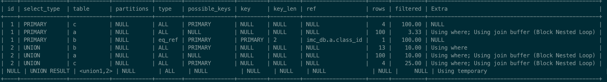
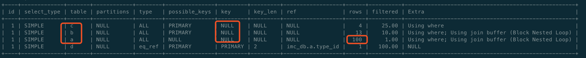
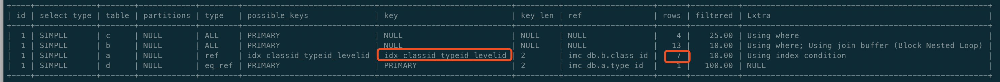
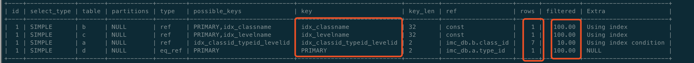

## SQL优化的一般步骤


## 发现问题

### 常见问题发现渠道

- 用户主动上报因应用性能问题
- 分析慢查询日志发现存在问题的SQL
- 数据库实时监控长时间运行的SQL


### 配置MySQL慢查询日志

和 Redis 一样可以通过配置参数设置并开启慢查询日志记录功能

| 命令                                                       | 作用                                                         |
| ---------------------------------------------------------- | ------------------------------------------------------------ |
| set  global  slow_query_log = [ NO \| OFF ]                | 是否开启慢查询日志记录                                       |
| set  global slow_query_log_file= /sql_log/slowlog.log      | 设置日志记录文件路径以及文件名。不设置默认为host_name-slow.log |
| set  global long_query_time = xx.xxx 秒                    | 设置慢查询时间阈值，超过这个时间就会记录到日志<br />想要记录所有,设置为 0 |
| set  global  log_queries_not_using_indexes = [ NO \| OFF ] | 是否记录没有使用索引的 SQL 查询                              |


### 分析MySQL慢查询日志

#### mysqldumpslow

`Mysqldumpslow`是mysql自带的用来分析慢查询的工具，将相同的慢SQL归类，并统计出相同的SQL执行的次数，每次执行耗时多久、总耗时，每次返回的行数、总行数，以及客户端连接信息等。

[mysqldumpslow使用说明 分析慢日志](https://mhl.xyz/MySQL/mysqldumpslow.html)


#### pt-query-digest

 pt-query-digest 就是专门针对 MySQL 数据库慢查询日志的一个强力分析工具，相比于 mysqldumpslow ，其分析结果更加具体和完善。

pt-query-digest 属于 Percona Toolkit 工具集中最常用的一种，号称 MySQL DBA 必备工具之一，其能够分析MySQL数据库的 slow log 、 general log 、 binary log 文件，同时也可以使用 show processlist 或从tcpdump 抓取的 MySQL 协议数据来进行分析。

```sh
# 到官网 https://www.percona.com/downloads/percona-toolkit/LATEST/ 上去找到适合自己版本的下载地址
# 下载
wget https://www.percona.com/downloads/percona-toolkit/3.1.0/binary/redhat/7/x86_64/percona-toolkit-3.1.0-2.el7.x86_64.rpm
....

# 下载完成使用 rpm 安装
[root@localhost percona-toolkit]# rpm -ivh percona-toolkit-3.1.0-2.el7.x86_64.rpm
warning: percona-toolkit-3.1.0-2.el7.x86_64.rpm: Header V4 RSA/SHA256 Signature, key ID 8507efa5: NOKEY
error: Failed dependencies:
	perl(DBI) >= 1.13 is needed by percona-toolkit-3.1.0-2.el7.x86_64
	perl(DBD::mysql) >= 1.0 is needed by percona-toolkit-3.1.0-2.el7.x86_64
	perl(IO::Socket::SSL) is needed by percona-toolkit-3.1.0-2.el7.x86_64
	perl(Digest::MD5) is needed by percona-toolkit-3.1.0-2.el7.x86_64
	perl(Term::ReadKey) is needed by percona-toolkit-3.1.0-2.el7.x86_64
	
	
# PT工具是使用Perl语言编写和执行的，所以需要系统中有Perl环境
[root@localhost percona-toolkit]# yum install -y perl-DBI perl-DBD-MySQL perl-Time-HiRes perl-IO-Socket-SSL perl-Digest-MD5 perl-TermReadKey
.....
Complete!

# 再次尝试 rpm 安装
[root@localhost percona-toolkit]# rpm -ivh percona-toolkit-3.1.0-2.el7.x86_64.rpm
warning: percona-toolkit-3.1.0-2.el7.x86_64.rpm: Header V4 RSA/SHA256 Signature, key ID 8507efa5: NOKEY
Preparing...                          ################################# [100%]
Updating / installing...
   1:percona-toolkit-3.1.0-2.el7      ################################# [100%]
   
# 输入 pt-  加 tab 键可以看到可用的相关 percon-toolkit 命令
[root@localhost percona-toolkit]# pt-
pt-align                  pt-fingerprint            pt-mongodb-summary        pt-sift                   pt-table-usage
pt-archiver               pt-fk-error-logger        pt-mysql-summary          pt-slave-delay            pt-upgrade
pt-config-diff            pt-heartbeat              pt-online-schema-change   pt-slave-find             pt-variable-advisor
pt-deadlock-logger        pt-index-usage            pt-pg-summary             pt-slave-restart          pt-visual-explain
pt-diskstats              pt-ioprofile              pt-pmp                    pt-stalk
pt-duplicate-key-checker  pt-kill                   pt-query-digest           pt-summary
pt-fifo-split             pt-mext                   pt-secure-collect         pt-table-checksum
pt-find                   pt-mongodb-query-digest   pt-show-grants            pt-table-sync
```

工具安装好之后我们进入MySQL ，进行慢查询日志功能的开启，和配置，并且执行几条SQL命令

```mysql
# 查询下目前的 慢查询配置
mysql> show variables where variable_name in ('long_query_time','slow_query_log','slow_query_log_file');
+---------------------+--------------------------------------+
| Variable_name       | Value                                |
+---------------------+--------------------------------------+
| long_query_time     | 10.000000                            |
| slow_query_log      | OFF                                  |
| slow_query_log_file | /usr/local/mysql/sql_log/slowlog.log |
+---------------------+--------------------------------------+
3 rows in set (0.00 sec)

# 开启慢查询，并且设置超时时间为0 记录所有的日志
mysql> set global long_query_time=0;
Query OK, 0 rows affected (0.00 sec)

mysql> set global slow_query_log=ON;
Query OK, 0 rows affected (0.01 sec)

# 随意执行几条SQL
mysql> show database;
mysql> use imc_db
mysql> select count(*) from imc_user;
mysql> select count(*) from imc_course;
...
退出
```

查看日志并使用工具进行分析

```sh
# 进入到日志目录，并查看  slowlog.log
[root@localhost percona-toolkit]# cd /usr/local/mysql/sql_log/
[root@localhost sql_log]# ls
mysql-bin.000023  mysql-bin.000024  mysql-bin.000025  mysql-bin.index  mysql-error.log  slowlog.log

# 使用自带工具 MySQLdumpslow 
[root@localhost sql_log]# mysqldumpslow slowlog.log

Reading mysql slow query log from slowlog.log
Count: 1  Time=0.00s (0s)  Lock=0.00s (0s)  Rows=3.0 (3), root[root]@localhost
  show variables where variable_name in ('S','S','S')

Count: 1  Time=0.00s (0s)  Lock=0.00s (0s)  Rows=1.0 (1), root[root]@localhost
  select count(*) from imc_class

Count: 1  Time=0.00s (0s)  Lock=0.00s (0s)  Rows=6.0 (6), root[root]@localhost
  show databases

Count: 1  Time=0.00s (0s)  Lock=0.00s (0s)  Rows=1.0 (1), root[root]@localhost
  select count(*) from imc_course

Count: 1  Time=0.00s (0s)  Lock=0.00s (0s)  Rows=1.0 (1), root[root]@localhost
  SELECT DATABASE()

Count: 1  Time=0.00s (0s)  Lock=0.00s (0s)  Rows=1.0 (1), root[root]@localhost
  select @@version_comment limit N

Count: 2  Time=0.00s (0s)  Lock=0.00s (0s)  Rows=0.5 (1), root[root]@localhost
  #

Count: 1  Time=0.00s (0s)  Lock=0.00s (0s)  Rows=0.0 (0), 0users@0hosts
  administrator command: Quit

Count: 1  Time=0.00s (0s)  Lock=0.00s (0s)  Rows=0.0 (0), 0users@0hosts
  administrator command: Init DB
  
  
  
# 使用 pt-query-digest 对比两者的数据就可以看着这个工具信息更丰富且格式更友好
[root@localhost sql_log]# pt-query-digest slowlog.log

# 100ms user time, 40ms system time, 25.80M rss, 220.26M vsz
# Current date: Mon Apr 13 04:10:34 2020
# Hostname: localhost.localdomain
# Files: slowlog.log
# Overall: 8 total, 8 unique, 0.15 QPS, 0.00x concurrency ________________
# Time range: 2020-04-13T04:05:58 to 2020-04-13T04:06:50
# Attribute          total     min     max     avg     95%  stddev  median
# ============     ======= ======= ======= ======= ======= ======= =======
# Exec time            6ms     5us     3ms   765us     3ms     1ms   452us
# Lock time            3ms       0     2ms   334us     2ms   681us   163us
# Rows sent             13       0       6    1.62    5.75    1.78    0.99
# Rows examine       1.13k       0   1.10k  144.12   1.09k  367.93       0
# Query size           277      14      96   34.62   92.72   23.15   28.75

# Profile
# Rank Query ID                          Response time Calls R/Call V/M
# ==== ================================= ============= ===== ====== =====
#    1 0x65B95DD948E938A46B3EC2468D33...  0.0026 42.9%     1 0.0026  0.00 SHOW VARIABLES
#    2 0x751417D45B8E80EE5CBA2034458B...  0.0024 39.0%     1 0.0024  0.00 SHOW DATABASES
#    3 0xFAAA041B3E800DCD0F9CAED83D3F...  0.0007 10.9%     1 0.0007  0.00 SELECT imc_class
#    4 0xB1D4F88B1115C3B5D8D05AAE0167...  0.0003  4.1%     1 0.0003  0.00 SELECT imc_course
# MISC 0xMISC                             0.0002  3.1%     4 0.0000   0.0 <4 ITEMS>

# Query 1: 0 QPS, 0x concurrency, ID 0x65B95DD948E938A46B3EC2468D33310D at byte 419
# This item is included in the report because it matches --limit.
# Scores: V/M = 0.00
# Time range: all events occurred at 2020-04-13T04:06:15
# Attribute    pct   total     min     max     avg     95%  stddev  median
# ============ === ======= ======= ======= ======= ======= ======= =======
# Count         12       1
# Exec time     42     3ms     3ms     3ms     3ms     3ms       0     3ms
# Lock time      6   175us   175us   175us   175us   175us       0   175us
# Rows sent     23       3       3       3       3       3       0       3
# Rows examine  97   1.10k   1.10k   1.10k   1.10k   1.10k       0   1.10k
# Query size    34      96      96      96      96      96       0      96
# String:
# Hosts        localhost
# Users        root
# Query_time distribution
#   1us
#  10us
# 100us
#   1ms  ################################################################
#  10ms
# 100ms
#    1s
#  10s+
show variables where variable_name in ('long_query_time','slow_query_log','slow_query_log_file')\G

# Query 2: 0 QPS, 0x concurrency, ID 0x751417D45B8E80EE5CBA2034458B5BC9 at byte 707
# This item is included in the report because it matches --limit.
# Scores: V/M = 0.00
# Time range: all events occurred at 2020-04-13T04:06:24
# Attribute    pct   total     min     max     avg     95%  stddev  median
# ============ === ======= ======= ======= ======= ======= ======= =======
# Count         12       1
# Exec time     39     2ms     2ms     2ms     2ms     2ms       0     2ms
# Lock time     79     2ms     2ms     2ms     2ms     2ms       0     2ms
# Rows sent     46       6       6       6       6       6       0       6
# Rows examine   2      31      31      31      31      31       0      31
# Query size     5      14      14      14      14      14       0      14
# String:
# Hosts        localhost
# Users        root
# Query_time distribution
#   1us
#  10us
# 100us
#   1ms  ################################################################
#  10ms
# 100ms
#    1s
#  10s+
show databases\G

# Query 3: 0 QPS, 0x concurrency, ID 0xFAAA041B3E800DCD0F9CAED83D3FF15D at byte 1349
# This item is included in the report because it matches --limit.
# Scores: V/M = 0.00
# Time range: all events occurred at 2020-04-13T04:06:43
# Attribute    pct   total     min     max     avg     95%  stddev  median
# ============ === ======= ======= ======= ======= ======= ======= =======
# Count         12       1
# Exec time     10   666us   666us   666us   666us   666us       0   666us
# Lock time      7   197us   197us   197us   197us   197us       0   197us
# Rows sent      7       1       1       1       1       1       0       1
# Rows examine   0       0       0       0       0       0       0       0
# Query size    10      30      30      30      30      30       0      30
# String:
# Databases    imc_db
# Hosts        localhost
# Users        root
# Query_time distribution
#   1us
#  10us
# 100us  ################################################################
#   1ms
#  10ms
# 100ms
#    1s
#  10s+
# Tables
#    SHOW TABLE STATUS FROM `imc_db` LIKE 'imc_class'\G
#    SHOW CREATE TABLE `imc_db`.`imc_class`\G
# EXPLAIN /*!50100 PARTITIONS*/
select count(*) from imc_class\G

# Query 4: 0 QPS, 0x concurrency, ID 0xB1D4F88B1115C3B5D8D05AAE01679700 at byte 1569
# This item is included in the report because it matches --limit.
# Scores: V/M = 0.00
# Time range: all events occurred at 2020-04-13T04:06:48
# Attribute    pct   total     min     max     avg     95%  stddev  median
# ============ === ======= ======= ======= ======= ======= ======= =======
# Count         12       1
# Exec time      4   252us   252us   252us   252us   252us       0   252us
# Lock time      6   165us   165us   165us   165us   165us       0   165us
# Rows sent      7       1       1       1       1       1       0       1
# Rows examine   0       0       0       0       0       0       0       0
# Query size    11      31      31      31      31      31       0      31
# String:
# Databases    imc_db
# Hosts        localhost
# Users        root
# Query_time distribution
#   1us
#  10us
# 100us  ################################################################
#   1ms
#  10ms
# 100ms
#    1s
#  10s+
# Tables
#    SHOW TABLE STATUS FROM `imc_db` LIKE 'imc_course'\G
#    SHOW CREATE TABLE `imc_db`.`imc_course`\G
# EXPLAIN /*!50100 PARTITIONS*/
select count(*) from imc_course\G
```

### 通过实时监控发现问题

监控长时间运行的SQL

```mysql
select id,'user','host',DB,command,'time',state,info 
	from informatioin_schema.processlist
	where time>60
```


## 分析执行计划

### 为什么要关注执行计划？

- 了解SQL如何访问表中的数据
- 了解SQL如何使用表中的索引
- 了解SQL所使用的查询类型


### 如何获取执行计划

#### 什么是 explain？

explain是Mysql的一个关键字，用来分析某条SQL语句执行过程和执行效率。

explain又叫执行计划，主要是用来查看优化器将决定如何执行查询过程，比如究竟是全表扫描还是索查询，还可以看到那种访问策略是优化器使用的，比如究竟是直接访问索引内容，还是又进行了筛选过滤，亦或者回查聚合索引等等

```mysql
EXPLAIN
	{explainable_stmt  |  FOR CONNECTION connection_id}
	
explainable_stmt:{
	SELECT	statement
	DELETE	statement
	INSERT	statement
	REPLACE	statement
	UPDATE	statement
}
```


### 执行计划内容分析

[Mysql中explain分析SQL语句执行效率](<https://blog.csdn.net/CringKong/article/details/80903858>)

#### id

tips：执行编号，表示SELECT所属的行。如果SQL语句中没有子查询或者关联查询，那么id只有唯一的1，如果有子查询和关联查询，那么就会有多个id。

- ID表示查询执行的顺序
- ID相同时由上到下执行
- ID不同时，由大到小执行

```MySQL
# 只有一个id单一的查询计划
explain
select course_id,title,study_cnt
	from imc_course
	where study_cnt>3000
	\G							# 将输出格式的行转化为类显示 
# 分析结果
*************************** 1. row ***************************
           id: 1
  select_type: SIMPLE
        table: imc_course
   partitions: NULL
         type: ALL
possible_keys: NULL
          key: NULL
      key_len: NULL
          ref: NULL
         rows: 100
     filtered: 33.33
        Extra: Using where
1 row in set, 1 warning (0.00 sec)


# 有多个id的执行计划分析
explain
select course_id,class_name,level_name,title,study_cnt
	from imc_course a
	join imc_class b on a.class_id = b.class_id
	join imc_level c on a.level_id = c.level_id
	where study_cnt>300
	\G
# 分析结果：id值相同，则由上到下执行
*************************** 1. row ***************************
           id: 1
  select_type: SIMPLE
        table: c
   partitions: NULL
         type: ALL
possible_keys: PRIMARY
          key: NULL
      key_len: NULL
          ref: NULL
         rows: 4
     filtered: 100.00
        Extra: NULL
*************************** 2. row ***************************
           id: 1
  select_type: SIMPLE
        table: a
   partitions: NULL
         type: ALL
possible_keys: NULL
          key: NULL
      key_len: NULL
          ref: NULL
         rows: 100
     filtered: 3.33
        Extra: Using where; Using join buffer (Block Nested Loop)
*************************** 3. row ***************************
           id: 1
  select_type: SIMPLE
        table: b
   partitions: NULL
         type: eq_ref
possible_keys: PRIMARY
          key: PRIMARY
      key_len: 2
          ref: imc_db.a.class_id
         rows: 1
     filtered: 100.00
        Extra: NULL
3 rows in set, 1 warning (0.00 sec)


#
explain
select a.course_id,a.title
	from imc_course a
	where a.course_id 
	not in (
    	select course_id 
        	from imc_chapter b
    )
    \G
# 分析结果：id不同由大到小执行，可以看出是先执行子查询后 b 表，后执行 a 表
*************************** 1. row ***************************
           id: 1
  select_type: PRIMARY
        table: a
   partitions: NULL
         type: index
possible_keys: NULL
          key: udx_title
      key_len: 62
          ref: NULL
         rows: 100
     filtered: 100.00
        Extra: Using where; Using index
*************************** 2. row ***************************
           id: 2
  select_type: DEPENDENT SUBQUERY
        table: b
   partitions: NULL
         type: index_subquery
possible_keys: udx_couseid
          key: udx_couseid
      key_len: 4
          ref: func
         rows: 13
     filtered: 100.00
        Extra: Using index
2 rows in set, 1 warning (0.00 sec)
```


#### select_type

- 标志本行是简单查询还是其他复杂查询

| 值                 | 含义                                                         |
| ------------------ | ------------------------------------------------------------ |
| SIMPLE             | 不包含子查询或者 union 操作的查询                            |
| PRIMARY            | 查询中如果包含任何子查询，那么最外层的查询则被标记为 PRIMARY |
| SUBQUERY           | select  列表中的子查询                                       |
| DEPENDENT SUBQUERY | 依赖外部结果的子查询                                         |
| UNION              | union 操作的第二个或者之后的查询的值为 union                 |
| DEPENDENT  UNION   | 当 union 作为子查询时，第二或是第二个后的查询的 select_type 值 |
| UNION RESULT       | union 产生的结果集                                           |
| DERIVED            | 出现在FROM子句中的子查询                                     |

```MySQL
# 
explain 
select course_id,class_name,level_name,title,study_cnt
	from imc_course a
	join imc_class b on a.class_id = b.class_id
	join imc_level c on a.level_id = c.level_id
	where study_cnt > 3000
union
select course_id,class_name,level_name,title,study_cnt
	from imc_course a
	join imc_class b on a.class_id = b.class_id
	join imc_level c on a.level_id = c.level_id
	where class_name = 'MySQL'
	\G
# 结果为了方便展示，截图显示
```




#### table

tips：标识本行查询是访问了哪个表

- 直接表名
- <union M,N> 由id为 M，N查询 union 产生的结果集
- < derived N>/< subquery N> 由Id 为N 的查询产生的结果


#### partitions

- 对于分区表，显示查询的分区ID
- 对于非分区表，显示NULL


#### type

tips：**标识本行查询优化器会使用什么方式进行查询，这个很重要，是我们进行分析的重点内容。**

| 性能 | 值          | 含义                                                         |
| ---- | ----------- | ------------------------------------------------------------ |
| 低   | ALL         | FULL TABLE Scan 全表扫描，这是效率最差的联接方式             |
| ⇣    | index       | FULL index  Scan 全索引扫描，同ALL的区别是，遍历的是索引树读取的数据相对全表更少 |
| ⇣    | range       | 索引范围扫描，常见于 between , > , < 这样的查询条件          |
| ⇣    | index_merge | 该联接类型表示使用了索引合并优化方法                         |
| ⇣    | ref_or_null | 类似 ref  类型的查询，但是附加了对 NULL 值列的查询           |
| ⇣    | ref         | 非唯一索引查找，返回匹配某个单独值的所有行                   |
| ⇣    | eq_ref      | 唯一索引或主键查找，对于每个索引键，表中只有一条记录与之匹配 |
| ⇣    | const       | 表中有且只有一个匹配的行时使用，如对主键或是唯一索引的查询，这是效率最高的联接方式 |
| 高   | system      | 这是 const 联接类型的一个特列，当查询的表只有一行时使用      |


#### possible_keys、key、ken_len

- possible_keys 标识本行查询可能使用到的全部索引
- key 标识本次查询真实使用的索引
- ken_len 标识本次查询使用索引的长度，单位是字节数


#### ref

- 标识使用索引查询时，使用了那种数据值进行选择，可以是常量，也可以是其余表的字段值


#### rows、filtered

- rows：显示本次查询会有多少行结果被影响
- filtered：表示返回结果的行数占所需读取行数的百分比，百分比越高越准确


#### Extra

tips：**一些额外信息，但也很重要**

| 值                           | 含义                                                         |
| ---------------------------- | ------------------------------------------------------------ |
| Distinct                     | 优化 distinct 操作，在找到第一匹配的元组后即可停止找同样值的动作 |
| Not exists                   | 使用  not  exists 来优化查询                                 |
| Using filesort               | 使用文件来进行排序，通常户出现在 order by  或 group  by 查询中 |
| Using index                  | 使用了覆盖索引进行查询                                       |
| Using temporary              | MySQL 需要使用临时表来处理查询， 常见于排序，子查询，和分组查询 |
| Using  where                 | 需要在MySQL服务器层使用 where 条件来过滤数据                 |
| select tables optimized away | 直接通过索引来获得数据，不用访问表                           |


## 索引优化

[数据库索引是什么？新华字典来帮你](<https://juejin.im/post/5c67be206fb9a049b13ebdbe>)

**索引优化是对查询性能优化的最有效手段**，它能够轻松地将查询的性能提高几个数量级。

#### 索引的作用是什么

- 告诉存储引擎如何快速的查找到所需要的数据


#### Innodb支持的索引类型

- Btree 索引
- 自适应 HASH 索引
- 全文索引
- 空间索引


#### Btree 索引的特点

- Btree 使用与全职匹配的查询，例如：

  class_name = 'mysql'

  class_name in ('mysql','php')  #  in 方式也是可以使用到 Btree 索引的，只有当 in 中的值太多存储引擎觉得全表扫描由于使用索引才会放弃使用索引

- Btree 索引适合范围查找

  study_cnt between 1000 and 300

  study_cnt > 3000

- Btree 索引从`联合索引`的最左侧列开始匹配查找列

  create index idx_title_studyCnt on imc_course(title,study_cnt)

  a、study_cnt >3000       # 无法使用索引

  b、study_cnt > 3000 and titile='mysql'  # 可以使用索引，查询书写顺序和定义索引顺序不同也可以使用，只要索引值都满足

  c、title='mysql'    # 可以使用，在索引值不完全匹配的情况下，从左测匹配开始


#### 应该在什么列上建立索引？

- where 子句中的列
- 包含在 order by ,group by ,distinct 中的字段
- 多表 join 的关联列

```MySQL
# 查询下例如下面这个的执行计划
explain
select course_id,b.class_name,d.type_name,c.level_name,title,score
	from imc_course a
	join imc_class b on b.class_id = a.class_id
	join imc_level c on c.level_id = a.level_id
	join imc_type d on d.type_id = a.type_id
where c.level_name = '高级' and b.class_name = 'MySQL'
```



```MySQL
# 从上图结果可以看出，只有 d 表中使用到了主键索引。a 表执行了100行，我们查看下 a 表的建表语句
show create table imc_course;
# 只有一个 course_id 主键索引和一个 title 唯一建索引
CREATE TABLE `imc_course` (
  `course_id` int(10) unsigned NOT NULL AUTO_INCREMENT COMMENT '课程ID',
  `title` varchar(20) NOT NULL DEFAULT '' COMMENT '课程主标题',
  `title_desc` varchar(50) NOT NULL DEFAULT '' COMMENT '课程副标题',
  `type_id` smallint(5) unsigned NOT NULL DEFAULT '0' COMMENT '课程方向ID',
  `class_id` smallint(5) unsigned NOT NULL DEFAULT '0' COMMENT '课程分类ID',
  `level_id` smallint(5) unsigned NOT NULL DEFAULT '0' COMMENT '课程难度ID',
  `online_time` datetime NOT NULL DEFAULT CURRENT_TIMESTAMP COMMENT '课程上线时间',
  `study_cnt` int(10) unsigned NOT NULL DEFAULT '0' COMMENT '学习人数',
  `course_time` time NOT NULL DEFAULT '00:00:00' COMMENT '课程时长',
  `intro` varchar(200) NOT NULL DEFAULT '' COMMENT '课程简介',
  `info` varchar(200) NOT NULL DEFAULT '' COMMENT '学习需知',
  `harvest` varchar(200) NOT NULL DEFAULT '' COMMENT '课程收获',
  `user_id` int(10) unsigned NOT NULL DEFAULT '0' COMMENT '讲师ID',
  `main_pic` varchar(200) NOT NULL DEFAULT '' COMMENT '课程主图片',
  `content_score` decimal(3,1) NOT NULL DEFAULT '0.0' COMMENT '内容评分',
  `level_score` decimal(3,1) NOT NULL DEFAULT '0.0' COMMENT '简单易懂',
  `logic_score` decimal(3,1) NOT NULL DEFAULT '0.0' COMMENT '逻辑清晰',
  `score` decimal(3,1) NOT NULL DEFAULT '0.0' COMMENT '综合评分',
  `is_recommand` tinyint(4) DEFAULT '0' COMMENT '是否推荐，0不推荐，1推荐',
  PRIMARY KEY (`course_id`),
  UNIQUE KEY `udx_title` (`title`)
) ENGINE=InnoDB AUTO_INCREMENT=102 DEFAULT CHARSET=utf8 COMMENT='课程主表'

# 在 join 语句中的字段进行索引创建，提高
create index idx_classid_typeid_levelid on imc_course(class_id,type_id,level_id)
# 再次查看执行计划
explain
select course_id,b.class_name,d.type_name,c.level_name,title,score
	from imc_course a
	join imc_class b on b.class_id = a.class_id
	join imc_level c on c.level_id = a.level_id
	join imc_type d on d.type_id = a.type_id
where c.level_name = '高级' and b.class_name = 'MySQL'
```



```MySQL
# 从上图可以看出，a 表这次试用到了刚创建的联合索引，并且执行行数也从 100 降到了 7
# 但是我们的 b、c 表都还没有使用索引，还有优化的空间，除了 join 条件中的 id 外在 where 条件中还是用到了
# c表  level_name 
create index idx_levelname on imc_level(level_name)
# d表的 class_name 
create index idx_classname on imc_class(class_name)
# 再次查看执行计划
explain
select course_id,b.class_name,d.type_name,c.level_name,title,score
	from imc_course a
	join imc_class b on b.class_id = a.class_id
	join imc_level c on c.level_id = a.level_id
	join imc_type d on d.type_id = a.type_id
where c.level_name = '高级' and b.class_name = 'MySQL'

# 从下图的结果可以看出，执行计划中涉及的四张表都使用到了所以，并且执行行数从最开始的 4*13*100*1 指数下降到 1*1*7*1 ，其中三张表的过滤达到了 100% 通过建立大大优化提升了查询效率 
```




#### 如何选择复合索引键的顺序？

- 区分度最高的列放假联合索引的最左侧
- 使用最频繁的列放到联合索引的最左侧
- 尽量把字段长度小的列放在联合索引的最左侧


#### Btree 索引的限制

- 只能从最左侧开始按索引键的顺序使用索引，不能跳过索引键

  例如：联合索引为   create index idx_a_b_c on tableName(a,b,c)

  查询条件： where  a="xx" and c>"xx"    # 此时只有 a 会使用到索引，c 虽然在过滤条件但是不能跳过 b 使用索引。因此 b 和  c  索引都无法别使用

- NOT IN  和 <> 操作无法使用索引

- 索引列上不能使用表达式 或是 函数


## SQL改写

- 使用 outer join 代替  not in
- 8.0后使用 CTE 公共表表达式 代替子查询
- 拆分复杂的大 SQL 为多个简单的小SQL
- 巧用计算列优化查询

#### 计算列优化

```MySQL
# 查询对于内容，逻辑和难度三项评分之和大于28的用户评分
explain
select * 
	from imc_classvalue
	where (content_score+level_score+logic_score) > 28
	\G
# 可以看到完全没有使用到所以，并且执行了300行，全表扫描
*************************** 1. row ***************************
           id: 1
  select_type: SIMPLE
        table: imc_classvalue
   partitions: NULL
         type: ALL
possible_keys: NULL
          key: NULL
      key_len: NULL
          ref: NULL
         rows: 300
     filtered: 100.00
        Extra: Using where
1 row in set, 1 warning (0.00 sec)

# 类似这种有计算需求的，如果使用几个值建立联合索引是无效的，查询的时候依然无法使用到索引 
# 5.7 之后新增的功能：计算列，可以使用表中的一些列，新增一个列
alter table imc_classvalue
	add column total_score decimal(3,1) as
	(content_score+level_score+logic_score)
#
Query OK, 0 rows affected (0.01 sec)
Records: 0  Duplicates: 0  Warnings: 0

# 查看下我们创建表的语句，是否有上面新增的列
show create table imc_classvalue
#
CREATE TABLE `imc_classvalue` (
  `value_id` int(10) unsigned NOT NULL AUTO_INCREMENT COMMENT '评价ID',
  `user_id` int(10) unsigned NOT NULL DEFAULT '0' COMMENT '用户ID',
  `course_id` int(10) unsigned NOT NULL DEFAULT '0' COMMENT '课程ID',
  `content_score` decimal(3,1) NOT NULL DEFAULT '0.0' COMMENT '内容评分',
  `level_score` decimal(3,1) NOT NULL DEFAULT '0.0' COMMENT '简单易懂',
  `logic_score` decimal(3,1) NOT NULL DEFAULT '0.0' COMMENT '逻辑清晰',
  `score` decimal(3,1) NOT NULL DEFAULT '0.0' COMMENT '综合评分',
  `add_time` datetime NOT NULL DEFAULT CURRENT_TIMESTAMP COMMENT '发布时间',
  `total_score` decimal(3,1) GENERATED ALWAYS AS (((`content_score` + `level_score`) + `logic_score`)) VIRTUAL,
  PRIMARY KEY (`value_id`)
) ENGINE=InnoDB AUTO_INCREMENT=301 DEFAULT CHARSET=utf8 COMMENT='课程评价表'

# 这时候利用计算列建立索引
create index idx_totalscore on imc_classvalue(total_score)

# 修改下SQL 直接使用  total_score 字段的执行计划
explain
select * 
	from imc_classvalue
	where total_score > 28
	\G
# 这次就是用到了我们的 idx_totalscore 索引，执行行数减少到了51行
*************************** 1. row ***************************
           id: 1
  select_type: SIMPLE
        table: imc_classvalue
   partitions: NULL
         type: range
possible_keys: idx_totalscore
          key: idx_totalscore
      key_len: 3
          ref: NULL
         rows: 51
     filtered: 100.00
        Extra: Using where
```


