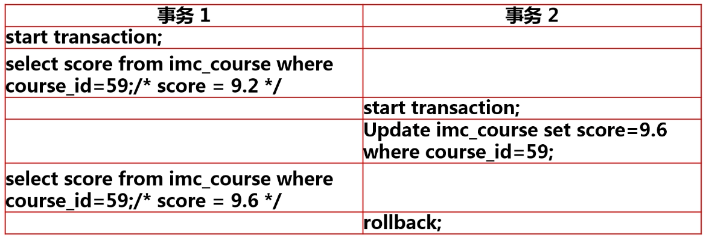
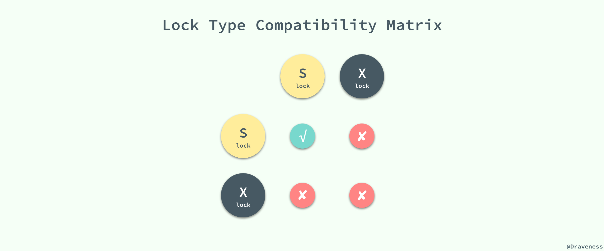

### 什么是事务

- 事务是数据库执行操作的最小逻辑单元
- 事务可以由一个SQL组成也可以由多个SQL组成
- 组成事务的SQL要么全执行成功要么全执行失败


### 事务的ACID特性

一般来说，事务是必须满足4个条件（ACID）：：原子性（**A**tomicity，或称不可分割性）、一致性（**C**onsistency）、隔离性（**I**solation，又称独立性）、持久性（**D**urability）。

- **原子性：**一个事务（transaction）中的所有操作，要么全部完成，要么全部不完成，不会结束在中间某个环节。事务在执行过程中发生错误，会被回滚（Rollback）到事务开始前的状态，就像这个事务从来没有执行过一样。
- **一致性：**在事务开始之前和事务结束以后，数据库的完整性没有被破坏。这表示写入的资料必须完全符合所有的预设规则，这包含资料的精确度、串联性以及后续数据库可以自发性地完成预定的工作。
- **隔离性：**数据库允许多个并发事务同时对其数据进行读写和修改的能力，隔离性可以防止多个事务并发执行时由于交叉执行而导致数据的不一致。事务隔离分为不同级别，包括读未提交（Read uncommitted）、读提交（read committed）、可重复读（repeatable read）和串行化（Serializable）。
- **持久性：**事务处理结束后，对数据的修改就是永久的，即便系统故障也不会丢失。


### 事务在并发下带来的问题

#### 脏读

- 一个事务读取了另一个事务 **未提交** 的数据




#### 不可重复读

- 一个事务前后两次重复读取的 **`同一数据`** 不一致。


tips：与脏读主要不同点在于，事务1 两次读取期间，事务2是否是 commit  还是  rollback 。commit 导致的效果就是 事务1最有一次读取的数据结果有效，rollback 导致 事务1 最后读取的结果是脏数据，甚至无效


#### 幻读 

- 指一个事务两次查询的 **`结果集`** 记录数不一致，是一种特殊的不可重复读


### 事务的隔离级别


### 设置事务的隔离级别

```mysql
# 语法
set [persist | global | session]
	transaction isolation level
    {
    read uncommitted
    | read committed
    | repeatable read
    | serializable
    }
```

- persist：会对当前的session，以及后续新的mysql 链接都有效，并且mysql 重启后也不会丢失。
- global：只会对后续新的MySQL链接有效，并且MySQL重启后修改也会丢失
- session：只会对当前的链接有效，链接断开后修改失效。（开发人员常用的）

 

### 事务隔离的实现

此部分内容引用 [『浅入浅出』MySQL 和 InnoDB](<https://draveness.me/mysql-innodb/>)

数据库对于隔离级别的实现就是使用**并发控制机制**对在同一时间执行的事务进行控制，限制不同的事务对于同一资源的访问和更新

#### 并发控制

我们都知道锁的种类一般分为乐观锁和悲观锁两种，InnoDB 存储引擎中使用的就是悲观锁，而按照锁的粒度划分，也可以分成行锁和表锁。

乐观锁和悲观锁其实都是并发控制的机制，同时它们在原理上就有着本质的差别；

- 乐观锁是一种思想，它其实并不是一种真正的『锁』，它会先尝试对资源进行修改，在写回时判断资源是否进行了改变，如果没有发生改变就会写回，否则就会进行重试，在整个的执行过程中其实都**没有对数据库进行加锁**；
- 悲观锁就是一种真正的锁了，它会在获取资源前对资源进行加锁，确保同一时刻只有有限的线程能够访问该资源，其他想要尝试获取资源的操作都会进入等待状态，直到该线程完成了对资源的操作并且释放了锁后，其他线程才能重新操作资源


虽然乐观锁和悲观锁在本质上并不是同一种东西，一个是一种思想，另一个是一种真正的锁，但是它们都是一种并发控制机制。


乐观锁不会存在死锁的问题，但是由于更新后验证，所以当**冲突频率**和**重试成本**较高时更推荐使用悲观锁，而需要非常高的**响应速度**并且**并发量**非常大的时候使用乐观锁就能较好的解决问题，在这时使用悲观锁就可能出现严重的性能问题；在选择并发控制机制时，需要综合考虑上面的四个方面（冲突频率、重试成本、响应速度和并发量）进行选择。

#### 锁的种类

对数据的操作其实只有两种，也就是读和写，而数据库在实现锁时，也会对这两种操作使用不同的锁；InnoDB 实现了标准的行级锁，也就是共享锁（Shared Lock）和互斥锁（Exclusive Lock）；共享锁和互斥锁的作用其实非常好理解：

- **共享锁（读锁）**：允许事务对一条行数据进行读取；
- **互斥锁（写锁）**：允许事务对一条行数据进行删除或更新；

而它们的名字也暗示着各自的另外一个特性，共享锁之间是兼容的，而互斥锁与其他任意锁都不兼容：



稍微对它们的使用进行思考就能想明白它们为什么要这么设计，因为共享锁代表了读操作、互斥锁代表了写操作，所以我们可以在数据库中**并行读**，但是只能**串行写**，只有这样才能保证不会发生线程竞争，实现线程安全。


### 阻塞和死锁

#### **什么是阻塞**

- 由于不同锁之间的兼容关系，造成的一事无成需要等待另一个事务释放其所占用的资源的现象


#### 如何发现阻塞

```mysql
# MySQL8.0 可以使用这个SQL，sys.ininodb_lock_waits 记录了所有阻塞的等待的事件
# where 条件过滤阻塞等待时间大于30秒的数据
SELECT waiting_pid as 'blocked pid',
			 waiting_query as 'blocked sql',
			 blocking_pid as 'running pid',
			 blocking_query as 'running sql',
			 wait_age as 'blocked time',
			 sql_kill_blocking_query as 'info'
FROM sys.innodb_lock_waits
WHERE (UNIX_TIMESTAMP()-UNIX_TIMESTAMP(wait_started))>30
```


#### 什么是死锁

- 并行执行的多个事务相互之间占有了对方所需要的资源

MySQL 内部会对死锁进行监控并处理，主动回滚两个事务中占用资源较少的那个事务，让另一个事务继续执行。尽管如此我们还是需要对死锁进行监控，找出死锁发生的原因，虽然死锁不会对数据库产生影响，但是会对我们的业务产生影响，例如由于死锁导致业务中下单操作时而成功时而失败的情况。


#### 如何发现死锁？

将 死锁 记录到MySQL的日志中

- set  global innodb_print_all_deadlocks = on