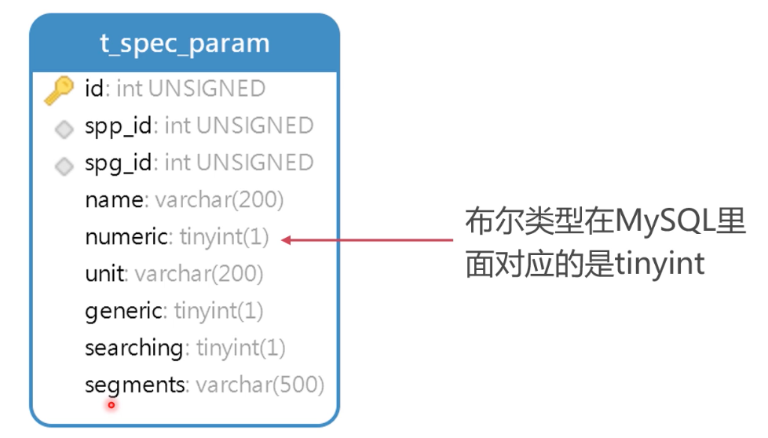
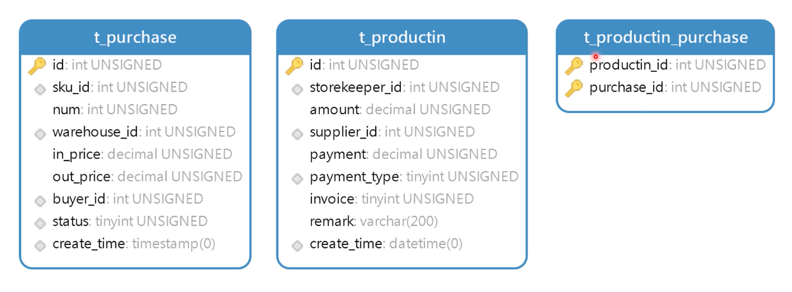

### 前言

新零售数据库系统设计是相对于其他系统数据库更难的设计，

#### 什么是新零售

线上加线下结合的零售系统


#### 什么是 SPU

- SPU(Standard Product Unit) 是标准产品单位，SPU描述一个产品的各种特性

- 产品和商品

  iPhone手机就是一个产品，iPhone6/iPhone11 就是一个个商品，可以相对理解为编程语言中，类和实例的关系


#### 什么是 SKU

- SKU（Stock Keeping Unit）是库存进出计量的单位，SKU是物理上不可分割的最小存货单元。其实就是是具体的某个商品

- SKU 与参数如何对应？

  商品品类不同，参数也就不同。例如衣服和手机，如果所有参数都涉及在一个表中就会是如下结构，非常糟糕
  

- 如何设计品类参数：将品类表对应的参数提取出来单独建表，建立1对多的关系。将来对于品类对应的参数需要修改的时候，找到对应参数表进行数据修改，而不需想上面的表设计一样去修改表。

  

- 参数与SKU的关系

  


### 数据结构设计

#### 设计品类和参数表

##### 品类表


语句：

```mysql

CREATE TABLE t_spec_group(
	id INT UNSIGNED PRIMARY KEY AUTO_INCREMENT COMMENT "主键",
	spg_id INT UNSIGNED NOT NULL COMMENT "品类编号",
	spg_name VARCHAR(200) NOT NULL COMMENT "品类名称",
	UNIQUE INDEX unq_spg_id(spg_id),
	UNIQUE INDEX unq_name(spg_name),
	INDEX idx_spg_id(spg_id)
)COMMENT "品类表"

# 插入数据
INSERT INTO t_spec_group (spg_id,`name`)
VALUES (10001, '手机'),	
			 (10002, '手机线'),
			 (10003, '手机电池'),
			 (11001, '液晶电视'),
			 (11002, '投影电视');
			 
```

疑问：

> 有了主键ID为什么还要设计一个 spg_id 品类编号ID？
>
> 主键自增ID，功能有限。定义个 spg_id 可以从字段数值上进行一个产品归类，例如：10000-19999 算作手机类的产品ID，20000-29999 算作电器类的产品，这种自增主键就无法满足。并且如果在分布式数据库中，自增主机是会重复的可能。
>
> ———————————————————————————————————————————————
>
> spg_id 字段为什么重复添加了两次索引（index）?
>
> 唯一性约束(unqiue index) 自带索引功能，所以一般情况下加了唯一性约束的字段就可以不用加索引了。但是 MySQL的索引分为 HASH 和 BTREE 两种。这里给 spg_id 字段设置了唯一性约束和索引，是为了留出后面修改演示使用索引类型的接口，比如 unqiue index 用 BTREE ，index 用 HASH


##### 参数表



语句

```mysql
CREATE TABLE t_spec_param(
	id INT UNSIGNED PRIMARY KEY AUTO_INCREMENT COMMENT "主键",
	spg_id INT UNSIGNED NOT NULL COMMENT "品类编号",
	spp_id INT UNSIGNED NOT NULL COMMENT "参数编号",
	`name` VARCHAR(200) NOT NULL COMMENT "参数名称",
	`numeric` BOOLEAN NOT NULL COMMENT "是否为数字参数",
	unit VARCHAR(200)  COMMENT "单位(量词)",
	generic BOOLEAN NOT NULL COMMENT "是否为通用参数",
	searching BOOLEAN NOT NULL COMMENT "是否用于通用搜索",
	segements VARCHAR(200) COMMENT "参数值",
	INDEX idx_spg_id(spg_id),
	INDEX idx_spp_id(spp_id)
)COMMENT "参数表"

# 插入数据
INSERT INTO t_spec_param (spg_id,spp_id,`name`,`numeric`,unit,generic,searching,segements)
VALUES (10001, 1, 'CPU', 0, NULL, 1, 0, NULL),
			(10001, 2, '运存', 1, 'GB', 1, 1, NULL),
			(10001, 3, '内存', 1, 'GB', 1, 1, NULL),
			(10001, 4, '屏幕尺寸', 1, '英寸', 1, 1, NULL),
			(10001, 5, '电池', 1, '毫安时', 1, 0, NULL),
			(11001, 1, '屏幕尺寸', 1, '英寸', 1, 1, NULL),
			(11001, 2, '长度', 1, '厘米', 1, 0, NULL),
			(11001, 3, '高度', 1, '厘米', 1, 0, NULL),
			(11001, 4, '宽度', 1, '厘米', 1, 0, NULL),
			(11001, 5, '分辨率', 0, '像素', 1, 1, '720P\\1080P\\4K\\8K');
```


#### 设计品牌和分类表

##### 品牌表


语句：

```MySQL
CREATE TABLE t_brand(
	id INT UNSIGNED PRIMARY KEY AUTO_INCREMENT COMMENT "主键",
	`name` VARCHAR(200) NOT NULL COMMENT "名称",
	image VARCHAR(500) COMMENT "图片地址",
	letter CHAR(1) NOT NULL COMMENT "品牌首字母",
	UNIQUE unq_name(`name`),
	INDEX idx_letter(letter)
)COMMENT "品牌表"

# 插入数据
INSERT INTO t_brand (`name`,image,letter)
VALUES ('联想', NULL, 'L'),
				('华为', NULL, 'H'),
				('小米', NULL, 'X'),
				('苹果', NULL, 'A'),
				('OPPO', NULL, 'O'),
				('三星', NULL, 'S'),
				('LG', NULL, 'L'),
				('vivo', NULL, 'V'),
				('飞利浦', NULL, 'F'),
				('红米', NULL, 'H'),
				('IBM', NULL, 'I'),
				('戴尔', NULL, 'D');
```


##### 分类表


语句：

```MySQL
CREATE TABLE t_category(
	id INT UNSIGNED PRIMARY KEY AUTO_INCREMENT COMMENT "主键",
	`name` VARCHAR(200) NOT NULL COMMENT "分类名称",
	parent_id INT UNSIGNED COMMENT "上级分类ID",
	if_parent BOOLEAN NOT NULL COMMENT "是否含有下级分类",
	sort INT UNSIGNED NOT NULL COMMENT "排名指数",
	index idx_parent_id(parent_id),
	INDEX idx_sort(sort)
)COMMENT "分类表"

# 插入数据
INSERT INTO t_category (`name`,parent_id,if_parent,sort)
VALUES ('手机/数码/配件', NULL, 1, 1),
			 ('手机通讯', 1, 1, 1),
			 ('手机', 2, 0, 1),
			 ('手机配件', 1, 1, 2),
			 ('移动电源', 4, 0, 2),
			 ('蓝牙耳机', 4, 0, 5),
			 ('保护壳', 4, 0, 2),
			 ('数码配件', 1, 1, 3),
			 ('存储卡', 8, 0, 10),
			 ('读卡器', 8, 0, 10),
			 ('电脑/办公/外设', NULL, 1, 1),
			 ('电脑整机', 11, 1, 1),
			 ('笔记本', 12, 0, 1),
			 ('台式电脑', 12, 0, 1),
			 ('平板电脑', 12, 0, 1);
```


##### 分类与品牌关联表


语句：

```MySQL
CREATE TABLE t_category_brand(
	category_id INT UNSIGNED NOT NULL COMMENT "分类ID",
	brand_id INT UNSIGNED NOT NULL COMMENT "品牌ID",
	PRIMARY KEY(category_id,brand_id)
)COMMENT "分类与品牌关联表"

# 插入数据

INSERT INTO t_category_brand (category_id,brand_id)
VALUES (3, 1),
			 (3, 2),
			 (3, 3),
			 (3, 4),
			 (3, 5),
			 (3, 6),
			 (3, 8),
			 (3, 10),
			 (13, 1),
			 (13, 2),
			 (13, 12);
```


#### 设计产品和商品表

#####  产品表


语句：

```mysql
 
CREATE TABLE t_spu(
	id INT UNSIGNED PRIMARY KEY AUTO_INCREMENT COMMENT "主键",
	title VARCHAR(200) NOT NULL COMMENT "标题",
	sub_title VARCHAR(200) COMMENT "副标题",
	category_id INT UNSIGNED NOT NULL COMMENT "分类ID",
	brand_id INT UNSIGNED COMMENT "品牌ID",
	spg_id INT UNSIGNED NOT NULL COMMENT "品类ID",
	saleable BOOLEAN NOT NULL COMMENT "是否上架",
	valid BOOLEAN NOT NULL COMMENT "是否有效",
	create_time TIMESTAMP NOT NULL DEFAULT	NOW() COMMENT "添加时间",
	last_uupdate_time TIMESTAMP NOT NULL DEFAULT	NOW() COMMENT "最后修改时间",
	INDEX idx_brand_id(brand_id),
	INDEX idx_category_id(category_id),
	INDEX idx_spg_id(spg_id),
	INDEX idx_saleable(saleable),
	INDEX idx_valid(valid)
)COMMENT "产品表"

# 插入数据
INSERT INTO `t_spu` 
VALUES (1, '小米9', NULL, 3, 3, 10001, 1, 1, '2019-04-05 18:45:40', '2019-04-05 18:45:40', 0);
```


##### 商品表

 


语句：

```MySQL
CREATE TABLE t_sku(
	id INT UNSIGNED PRIMARY KEY AUTO_INCREMENT COMMENT "主键",
	spu_id INT UNSIGNED NOT NULL COMMENT "产品ID",
	title VARCHAR(200) NOT NULL COMMENT "商品标题",
	images JSON COMMENT "商品图片",
	price DECIMAL(10,2) UNSIGNED NOT NULL COMMENT "价格",
	param JSON NOT NULL COMMENT "参数",
	saleable BOOLEAN NOT NULL COMMENT "是否上架",
	valid BOOLEAN NOT NULL COMMENT "是否有效",
	create_time TIMESTAMP NOT NULL DEFAULT	NOW() COMMENT "添加时间",
	last_uupdate_time TIMESTAMP NOT NULL DEFAULT	NOW() COMMENT "最后修改时间",
	INDEX idx_spu_id(spu_id),
	INDEX idx_saleable(saleable),
	INDEX idx_valid(valid)
)COMMENT "产品表"

# 插入数据
INSERT INTO t_sku (spu_id,title,images,price,param,saleable,valid)
VALUES (1, 'Xiaomi/小米 小米9 8GB+128GB 全息幻彩紫 移动联通电信全网通4G手机', '{\"desc\": [\"http://127.0.0.1/3.jpg\", \"http://127.0.0.1/4.jpg\"], \"facade\": [\"http://127.0.0.1/1.jpg\", \"http://127.0.0.1/2.jpg\"]}', 3299.00, '{\"CPU\": \"骁龙855\", \"内存\": 128, \"电池\": 4000, \"运存\": 8, \"屏幕尺寸\": 6.39}', 1, 1),
			 (1, 'Xiaomi/小米 小米9 8GB+128GB 全息幻彩蓝 移动联通电信全网通4G手机', '{\"desc\": [\"http://127.0.0.1/3.jpg\", \"http://127.0.0.1/4.jpg\"], \"facade\": [\"http://127.0.0.1/1.jpg\", \"http://127.0.0.1/2.jpg\"]}', 3299.00, '{\"CPU\": \"骁龙855\", \"内存\": 128, \"电池\": 4000, \"运存\": 8, \"屏幕尺寸\": 6.39}', 1, 1),
			 (1, 'Xiaomi/小米 小米9 6GB+128GB 全息幻彩蓝 移动联通电信全网通4G手机', '{\"desc\": [\"http://127.0.0.1/3.jpg\", \"http://127.0.0.1/4.jpg\"], \"facade\": [\"http://127.0.0.1/1.jpg\", \"http://127.0.0.1/2.jpg\"]}', 2999.00, '{\"CPU\": \"骁龙855\", \"内存\": 128, \"电池\": 4000, \"运存\": 6, \"屏幕尺寸\": 6.39}', 1, 1),
			 (1, 'Xiaomi/小米 小米9 6GB+128GB 深空灰 移动联通电信全网通4G手机', '{\"desc\": [\"http://127.0.0.1/3.jpg\", \"http://127.0.0.1/4.jpg\"], \"facade\": [\"http://127.0.0.1/1.jpg\", \"http://127.0.0.1/2.jpg\"]}', 2999.00, '{\"CPU\": \"骁龙855\", \"内存\": 128, \"电池\": 4000, \"运存\": 6, \"屏幕尺寸\": 6.39}', 1, 1)
```

关于json:

[MySQL 5.7 新特性 JSON 的创建，插入，查询，更新](<http://www.lnmp.cn/mysql-57-new-features-json.html>)


#### 如何设计商品的库存

疑问：

- 库存能直接定义打商品表吗？

  > 不能。新零售的系统是存在很多线下的分店，分店在不同地区，不同城市都有自己的库存数量，所以不能直接把库存定义在商品表中

- 零售店与仓库还有商品的对应关系？

  

  > 一个零售店，可以从多个不同仓库调货
  >
  > 一个仓库，也可以往多个不同的零售店发货
  >
  > 
  >
  > 一个零售店里面，可以有多种商品
  >
  > 一种商品，可以在多个零售店销售
  >
  > 通过建立 `零售店—商品` 关联表来定义保存商品库存字段
  >
  > 
  >
  > 一个仓库中，可以有多重商品
  >
  > 一种商品，也可以在多个仓库中存货
  >
  > 通过建立  `仓库-商品`  关联表来定义保存商品库存字段

  

##### 省份和城市表

为了区分不同地区、分店的信息。首先建立省份和城市表


语句：

```MySQL
 CREATE TABLE t_province(
	id INT UNSIGNED PRIMARY KEY AUTO_INCREMENT COMMENT "主键",
	province VARCHAR(200) NOT NULL COMMENT "省份",
	UNIQUE unq_province(province)
)COMMENT "省份表"

# 插入数据
INSERT INTO t_province (province)
VALUES ('北京'),('上海'),('天津'),('重庆'),('辽宁'),('吉林'),('黑龙江'),('山东'),('江苏'),('浙江'),('安徽'),('福建'),('江西'),('广东'),('广西'),('海南'),('河南'),('湖南'),('湖北'),('河北'),('山西'),('内蒙古'),('宁夏'),('青海'),('陕西'),('甘肃'),('新疆'),('四川'),('贵州'),('云南'),('西藏'),('香港'),('澳门'),('台湾')


CREATE TABLE t_city(
	id INT UNSIGNED PRIMARY KEY AUTO_INCREMENT COMMENT "主键",
	city VARCHAR(200) NOT NULL COMMENT "城市",
	province_id INT UNSIGNED NOT NULL COMMENT "省份ID"
)COMMENT "城市表"

# 插入数据
INSERT INTO t_city (city,province_id)
VALUES ('沈阳', 5),
			 ('大连', 5),
			 ('鞍山', 5),
			 ('长春', 6),
			 ('吉林', 6),
			 ('哈尔滨', 7),
			 ('齐齐哈尔', 7),
			 ('牡丹江', 7)
```


##### 仓库与商品仓库关联表


语句：

```mysql
REATE TABLE t_warehouse(
	id INT UNSIGNED PRIMARY KEY AUTO_INCREMENT COMMENT "主键",
	city_id INT UNSIGNED NOT NULL COMMENT "城市ID",
	address VARCHAR(200) NOT NULL COMMENT "地址",
	tel VARCHAR(20) NOT NULL COMMENT "电话",
	INDEX idx_city_id(city_id)
)COMMENT "仓库表"

# 插入数据
INSERT INTO t_warehouse (city_id,address,tel)
VALUES (1, '辽宁省沈阳市沈河区青年大街100号', '024-12345678'),
			 (1, '辽宁省沈阳市皇姑区崇山路41号', '024-22331234'),
			 (2, '辽宁省大连市西岗区五四路38号', '0411-12345678'),
			 (2, '辽宁省大连市沙河口区星云街1号', '0411-98213210')
			 

CREATE TABLE t_warehouse_sku(
	warehouse_id INT UNSIGNED COMMENT "仓库ID",
	sku_id INT UNSIGNED COMMENT "商品ID",
	num INT UNSIGNED NOT NULL COMMENT "库存数量",
	unit VARCHAR(200) NOT NULL COMMENT "库存单位",
	PRIMARY KEY (warehouse_id,sku_id)
) COMMENT "仓库商品库存表"

# 插入数据
INSERT INTO t_warehouse_sku (warehouse_id,sku_id,num,unit)
VALUES (1, 1, 20, '部'),
			 (1, 2, 15, '部'),
			 (1, 3, 40, '部'),
			 (1, 4, 0, '部'),
			 (2, 1, 0, '部'),
			 (2, 2, 0, '部'),
			 (2, 3, 5, '部'),
			 (2, 4, 19, '部')
```


##### 零售店与商品零售店关联表


语句：

```mysql

CREATE TABLE t_shop(
	id INT UNSIGNED PRIMARY KEY AUTO_INCREMENT COMMENT "主键",
	city_id INT UNSIGNED NOT NULL COMMENT "城市ID",
	address VARCHAR(200) NOT NULL COMMENT "地址",
	tel VARCHAR(20) NOT NULL COMMENT "电话",
	INDEX idx_city_id(city_id)
)COMMENT "零售店表"

# 插入数据
INSERT INTO t_shop (city_id,address,tel)
VALUES (1, '辽宁省沈阳市黄河北大街12号', '024-11112222'),
			 (1, '辽宁省沈阳市皇姑区长江街40号', '024-12341234'),
			 (1, '辽宁省沈阳市铁西区卫工街19号', '024-12312345'),
			 (2, '大连市西岗区五四路38号', '0411-12345678'),
			 (2, '大连市沙河口区星云街1号', '0411-98213210')

CREATE TABLE t_shop_sku(
	shop_id INT UNSIGNED COMMENT "零售店ID",
	sku_id INT UNSIGNED COMMENT "商品ID",
	num INT UNSIGNED NOT NULL COMMENT "库存数量",
	unit VARCHAR(200) NOT NULL COMMENT "库存单位",
	PRIMARY KEY (shop_id,sku_id)
) COMMENT "零售店商品库存表"

# 插入数据
INSERT INTO t_shop_sku (shop_id,sku_id,num,unit)
VALUES (1, 1, 3, '部'),
			 (1, 2, 3, '部'),
			 (1, 3, 1, '部'),
			 (1, 4, 0, '部'),
			 (2, 1, 3, '部'),
			 (2, 2, 0, '部'),
			 (2, 3, 0, '部'),
			 (2, 4, 1, '部')
```


#### 设计客户表

##### 会员等级表


语句：

```MySQL
CREATE TABLE t_level(
	id INT UNSIGNED PRIMARY KEY AUTO_INCREMENT  COMMENT "主键",
	`level` VARCHAR(200) NOT NULL COMMENT "等级",
	discount DECIMAL(10,2) NOT NULL COMMENT "折扣"
)COMMENT "会员等级表"

# 插入数据
INSERT INTO t_level (`level`,discount)
values ('铜牌会员', 0.99),
		('银牌会员', 0.98),
		('金牌会员', 0.97),
		('白金会员', 0.95),
		('钻石会员', 0.92)
```


##### 客户表

这里的密码采用 AES 对称加密算法加密，为了增加破解难度，秘钥可以不使用同一个，我们采取这条记录的用户名的前6个字符作为秘钥，这样每条记录的秘钥都不同。


语句：

```mysql
CREATE TABLE t_customer(
	id INT UNSIGNED PRIMARY KEY AUTO_INCREMENT COMMENT "主键",
	username VARCHAR(200) NOT NULL COMMENT "用户名",
	`password` VARCHAR(2000) NOT NULL COMMENT "密码（AES加密）",
	wechat VARCHAR(200) COMMENT "微信号",
	tel CHAR(11) COMMENT "手机号",
	level_id INT UNSIGNED COMMENT "会员等级",
	create_time TIMESTAMP NOT NULL DEFAULT	NOW() COMMENT "添加时间",
	last_uupdate_time TIMESTAMP NOT NULL DEFAULT	NOW() COMMENT "最后修改时间",
	INDEX idx_username(username),
	UNIQUE unq_username(username)
)COMMENT "客户表"

# 使用 MySQL 函数进行密码加密存储

# hex：可以用HEX()函数将一个字符串或数字转换为十六进制格式的字符串
# unhex：把十六进制格式的字符串转化为原来的格式

# AES_ENCRYPT(str,key_str):使用秘钥key_str 对字符串 str 进行 AES 加密
# AES_DECRYPT(crypt_str,key_str):使用秘钥key_str 对已加密字符串 crypt_str 进行 AES 解密

# 插入数据
INSERT INTO t_customer (username,`password`,wechat,tel,level_id)
VALUES ("double-test",HEX(AES_ENCRYPT("abc123123","double")),"double","13888888888",1),
		("marryy-new",HEX(AES_ENCRYPT("abc123123","marryy")),"marryy","13890909090",2)
```


##### 客户收货地址表


语句：

```MySQL
CREATE TABLE t_customer_address(
	id INT UNSIGNED PRIMARY KEY AUTO_INCREMENT COMMENT "主键",
	customer_id INT UNSIGNED NOT NULL COMMENT "客户ID",
	`name` VARCHAR(200) NOT NULL COMMENT "收货人姓名",
	tel CHAR(11) NOT NULL COMMENT "收货人电话",
	address VARCHAR(200) NOT NULL COMMENT "收货人地址",
	prime BOOLEAN NOT NULL COMMENT "是否为缺省收货地址",
	INDEX idx_customer_id(customer_id)
)COMMENT "客户收货地址表"

# 插入数据
INSERT INTO t_customer_address(customer_id,`name`,tel,address,prime)
VALUES (1, '陈浩', '13312345678', '辽宁省大连市高新园区6号9#11-1', 0),
		(1, '李娜', '18912345678', '辽宁省大连市沙河口区星月街17号2#1-3', 0),
		(2, '徐亮', '13723567412', '辽宁省营口市盼盼工业园1-1', 1)

```


#### 设计购物券表

##### 购物券表


语句：

```mysql
CREATE TABLE t_voucher(
	id INT UNSIGNED PRIMARY KEY AUTO_INCREMENT COMMENT "主键",
	deno DECIMAL(10,2) UNSIGNED NOT NULL COMMENT "面值",
	`condition` DECIMAL(10,2) UNSIGNED NOT NULL COMMENT "订单满多少钱可以使用",
	start_date DATE COMMENT "起始日期",
	end_date DATE COMMENT "截止日期",
	max_num INT COMMENT "代金券发放最大数量"
)COMMENT "购物券表"

# 插入数据

# 时间转日期  2020-06-05 03:08:21--->2020-06-05
select DATE_FORMAT(now(),'%Y-%m-%d')

# 时间加一个月	2020-06-05 03:08:21--->2020-07-05 03:08:21
select date_add(now(),interval 1 month)

# 时间加一个月在转日期  2020-06-05 03:08:21--->2020-07-05
select DATE_FORMAT(date_add(now(),interval 1 month),'%Y-%m-%d')

INSERT INTO t_voucher (deno,`condition`,start_date,end_date,max_num)
values (50.00,1000.00,DATE_FORMAT(now(),'%Y-%m-%d'),DATE_FORMAT(date_add(now(),interval 1 month),'%Y-%m-%d'),1000),
			(20.00,500.00,DATE_FORMAT(now(),'%Y-%m-%d'),DATE_FORMAT(date_add(now(),interval 1 month),'%Y-%m-%d'),NULL)

```

##### 客户关联购物券表


语句：

```MySQL
CREATE TABLE t_voucher_customer(
	id INT UNSIGNED PRIMARY KEY AUTO_INCREMENT COMMENT "主键",
	voucher_id INT UNSIGNED NOT NULL COMMENT "购物券ID",
	customer_id INT UNSIGNED NOT NULL COMMENT "客户ID"
)COMMENT "客户关联购物券数据表"

# 插入数据
INSERT INTO t_voucher_customer (voucher_id,customer_id)
VALUES (1, 1),
		(1, 1),
		(1, 1),
		(2, 1),
		(2, 1)
```


#### 设计订单表

疑问：一张订单中可以包含多个商品记录，可不可以用json存储这些商品信息

- mysql 5.7 提供的json 字段合适存储数据，不适合检索数据
- 应该建立两张表，一张订单表，一张订单明细表。既满足数据存储显示，也可以提供友好的检索数据

##### 订单表


语句：

```mysql
CREATE TABLE t_order(
	id INT UNSIGNED PRIMARY KEY AUTO_INCREMENT COMMENT "主键",
	`code` VARCHAR(200) NOT NULL COMMENT "流水号",
	type TINYINT UNSIGNED NOT NULL COMMENT "订单类型：1实体销售，2网络销售",
	shop_id INT UNSIGNED COMMENT "零售店ID",
	customer_id INT UNSIGNED COMMENT "会员ID",
	amount DECIMAL(10,2) UNSIGNED NOT NULL COMMENT "总金额",
	payment_type TINYINT UNSIGNED NOT NULL COMMENT "支付方式：1借记卡，2信用卡，3微信，4支付宝，5现金",
	`status` TINYINT UNSIGNED NOT NULL COMMENT "状态：1未付款，2已付款，3已发货，4已签收",
	postage DECIMAL(10,2) UNSIGNED COMMENT "邮费",
	weight INT UNSIGNED COMMENT "重量（克）",
	voucher_id INT UNSIGNED COMMENT "购物券ID",
	create_time TIMESTAMP NOT NULL DEFAULT now() COMMENT "创建时间",
	INDEX idx_code(`code`),
	INDEX idx_customer_id(customer_id),
	INDEX idx_status(`status`),
	INDEX idx_create_time(create_time),
	INDEX idx_type(type),
	INDEX idx_shop_id(shop_id),
	UNIQUE unq_code(`code`)
)COMMENT "客户关联购物券数据表"

# 插入数据 
INSERT INTO t_order (`code`,type,shop_id,customer_id,amount,payment_type,`status`,postage,weight,voucher_id)
VALUES ('CX0000000120160522', 1, 3, 1, 5998.00, 5, 2, NULL, NULL, NULL),
		('CX0000000120160523', 2, NULL, 1, 5998.00, 1, 2, 60.00, 530, NULL)
```


##### 订单详情表


语句：

```mysql
CREATE TABLE t_order_detail(
	order_id INT UNSIGNED NOT NULL COMMENT "订单ID",
	sku_id INT UNSIGNED NOT NULL COMMENT "商品ID",
	price DECIMAL(10,2) UNSIGNED NOT NULL COMMENT "原价格",
	actual_price DECIMAL(10,2) UNSIGNED NOT NULL COMMENT "实际购买价",
	num INT UNSIGNED NOT NULL COMMENT "购买数量",
	PRIMARY KEY (order_id,sku_id)
)COMMENT "订单详情表"

# 插入数据
INSERT INTO t_order_detail (order_id,sku_id,price,actual_price,num)
VALUES (1, 3, 2999.00, 2999.00, 1),
		(1, 4, 2999.00, 2999.00, 1),
		(2, 3, 2999.00, 2999.00, 2)
```


#### 设计员工与用户表

-  新零售系统具有 进销存  属性，所以需要先设计出员工表、用户表和角色表 

  

##### 部门、职位与员工表


语句：

```mysql
CREATE TABLE t_dept(
	id INT UNSIGNED PRIMARY KEY AUTO_INCREMENT COMMENT "主键",
	dname VARCHAR(20) NOT NULL COMMENT "部门名称",
	UNIQUE unq_dname(dname)
)COMMENT "部门表"

# 插入数据
INSERT INTO t_dept (dname)
VALUES ('董事会'),('总裁办'),('零售部'),('网商部'),('技术部'),('售后部')


CREATE TABLE t_job(
	id INT UNSIGNED PRIMARY KEY AUTO_INCREMENT COMMENT "主键",
	job VARCHAR(20) NOT NULL COMMENT "职位名称",
	UNIQUE unq_job(job)
)COMMENT "职位表"

# 插入数据
INSERT INTO t_job (job)
VALUES ('董事长'),('总经理'),('部门经理'),('主管'),('店长'),('售货员'),('保安'),('保管员'),('实习生')


CREATE TABLE t_emp(
	id INT UNSIGNED PRIMARY KEY AUTO_INCREMENT COMMENT "主键",
	wid VARCHAR(20) NOT NULL COMMENT "工号",
	ename VARCHAR(20) NOT NULL COMMENT "姓名",
	sex CHAR(1) NOT NULL COMMENT "性别",
	married BOOLEAN NOT NULL COMMENT "婚否",
	education TINYINT NOT NULL COMMENT "学历:1大专，2本科，3研究生，4博士，5其他",
	tel CHAR(11) NOT NULL COMMENT "电话",
	email VARCHAR(200) COMMENT "邮箱",
	address VARCHAR(200) COMMENT "住址",
	job_id INT UNSIGNED NOT NULL COMMENT "职务ID",
	dept_id INT UNSIGNED NOT NULL COMMENT "部门ID",
	mgr_id INT UNSIGNED COMMENT "上司ID",
	hiredate DATE NOT NULL COMMENT "入职日期",
	termdate DATE NULL DEFAULT NULL COMMENT "离职日期",
	`status` TINYINT UNSIGNED NOT NULL COMMENT "状态：1在职，2休假，3离职，4死亡",
	INDEX idx_job_id(job_id),
	INDEX idx_dept_id(dept_id),
	INDEX idx_status(`status`),
	INDEX idx_mgr_id(mgr_id),
	UNIQUE unq_wid(wid)
) COMMENT "员工表"

# 插入数据
INSERT INTO t_emp (wid,ename,sex,married,education,tel,email,address,job_id,dept_id,mgr_id,hiredate,termdate,`status`)
VALUES ('S10010E', '李娜', '女', 1, 2, '18912345678', NULL, NULL, 5, 3, NULL, '2018-12-06', NULL, 1),
		('S10014A', '刘畅', '女', 1, 2, '13312345678', NULL, NULL, 6, 3, 1, '2019-04-11', NULL, 1),
		('TE0023', '陈婷婷', '女', 0, 1, '13322334545', NULL, NULL, 9, 3, NULL, '2019-05-16', NULL, 1),
		('TE0024', '徐刚', '男', 0, 1, '13322334545', NULL, NULL, 9, 4, NULL, '2019-05-16', NULL, 1)

```


##### 用户角色表


语句：

```mysql
CREATE TABLE t_role(
	id INT UNSIGNED PRIMARY KEY AUTO_INCREMENT COMMENT "主键",
	role VARCHAR(20) NOT NULL COMMENT "角色",
	UNIQUE unq_role(role)
)COMMENT "角色表"

# 插入数据
INSERT INTO t_role (role)
VALUES ('超级管理员'),('管理员'),('售货员'),('零售店长'),('客服'),('保管员'),('质检员')


CREATE TABLE t_user(
	id INT UNSIGNED PRIMARY KEY AUTO_INCREMENT COMMENT "主键",
	username VARCHAR(200) NOT NULL COMMENT "用户名",
	`password` VARCHAR(200) NOT NULL COMMENT "密码（AES加密）",
	emp_id INT UNSIGNED NOT NULL COMMENT "员工ID",
	role_id INT UNSIGNED NOT NULL COMMENT "角色ID",
	`status` TINYINT UNSIGNED NOT NULL COMMENT "状态：1可用，2禁用",
	create_time TIMESTAMP NOT NULL DEFAULT now() COMMENT "添加时间",
	last_update_time TIMESTAMP NOT NULL DEFAULT now() COMMENT "最后修改时间",
	UNIQUE unq_username(username),
	INDEX idx_username(username),
	INDEX idx_emp_id(emp_id),
	INDEX idx_role_id(role_id),
	INDEX idx_stataus(`status`)
)COMMENT "用户表"

# 插入数据
INSERT INTO t_user(username,`password`,emp_id,role_id,`status`)
VALUES ( 'demo123', HEX(AES_ENCRYPT("abc123123","demo12")), 1, 4, 1)

```


#### 设计快递表和退货表

##### 快递表


语句：

```mysql
CREATE TABLE t_delivery(
	id INT UNSIGNED PRIMARY KEY AUTO_INCREMENT COMMENT "主键",
	order_id INT UNSIGNED NOT NULL COMMENT "订单ID",
	sku JSON NOT NULL COMMENT "商品",
	qa_id INT UNSIGNED NOT NULL	 COMMENT "质检员ID",
	de_id INT UNSIGNED NOT NULL	 COMMENT "发货员ID",
	postid INT UNSIGNED NOT NULL	 COMMENT "快递单号",
	price DECIMAL(10,2) UNSIGNED NOT NULL COMMENT "快递费",
	ecp  TINYINT UNSIGNED NOT NULL COMMENT "快递公司编号",
	address_id INT UNSIGNED NOT NULL	 COMMENT "收货地址ID",
	warehouse_id INT UNSIGNED NOT NULL	 COMMENT "仓库ID",
	create_time TIMESTAMP NOT NULL DEFAULT now() COMMENT "添加时间",
	INDEX idx_order_id(order_id),
	INDEX idx_qa_id(qa_id),
	INDEX idx_de_id(de_id),
	INDEX idx_postid(postid),
	INDEX idx_address_id(address_id),
	INDEX idx_warehouse_id(warehouse_id),
	INDEX idx_ecp(ecp)
)COMMENT "快递表"

# 修改表字段
ALTER TABLE t_delivery CHANGE postid postid varchar(20);
ALTER TABLE t_delivery CHANGE address_id address VARCHAR(200);

# 插入数据

INSERT INTO t_delivery (order_id,sku,qa_id,de_id,postid,price,ecp,address,warehouse_id)
VALUES (2, '[3, 3]', 15, 17, '125488611212545', 60, 1, '辽宁省大连市高新园区6号9#11-1', 1);

```


##### 退货表


语句：

```mysql
CREATE TABLE t_backstock(
	id INT UNSIGNED PRIMARY KEY AUTO_INCREMENT COMMENT "主键",
	order_id INT UNSIGNED NOT NULL COMMENT "订单ID",
	sku JSON NOT NULL COMMENT "退货商品",
	reason VARCHAR(200) NOT NULL COMMENT "退货原因",
	qa_id INT UNSIGNED NOT NULL COMMENT "质检员ID",
	payment DECIMAL(10,2) UNSIGNED NOT NULL	COMMENT "退款金额",
	payment_type TINYINT UNSIGNED NOT NULL COMMENT "退款方式：1借记卡，2信用卡，3微信，4支付宝，5现金",
	`status` TINYINT UNSIGNED NOT NULL COMMENT "状态：1退款成功，2无法退货",
	create_time TIMESTAMP NOT NULL DEFAULT now() COMMENT "添加时间",
	INDEX idx_order_id(order_id),
	INDEX idx_qa_id(qa_id),
	INDEX idx_status(`status`)
)COMMENT "退货表"

# 插入数据
INSERT INTO t_backstock (order_id,sku,reason,qa_id,payment,payment_type,`status`)
VALUES (2, '[3]', '质量问题', 15, 2999.00, 5, 1);
```

#### 设计评价表 

##### 评价表


语句：

```mysql
CREATE TABLE t_rating(
	id INT UNSIGNED PRIMARY KEY AUTO_INCREMENT COMMENT "主键",
	order_id INT UNSIGNED NOT NULL COMMENT "订单ID",
	sku_id INT UNSIGNED NOT NULL COMMENT "商品ID",
	img JSON COMMENT "买家晒图",
	rating TINYINT UNSIGNED NOT NULL COMMENT "评分",
	`comment` VARCHAR(200) COMMENT "评论",
	create_time TIMESTAMP NOT NULL DEFAULT now() COMMENT "添加时间",
	INDEX idx_order_id(order_id),
	INDEX idx_sku_id(sku_id),
	INDEX idx_create_time(create_time)
)COMMENT "评价表"

# 插入数据
INSERT INTO t_rating (order_id,sku_id,img,rating,`comment`)
VALUES (2, 3, '[\"http://192.168.99.184/1.jpg\"]', 5, '很好用，很漂亮');
```


#### 设计供应商数据表

##### 供应商和供应商关联商品表


语句：

```mysql
CREATE TABLE t_supplier(
	id INT UNSIGNED PRIMARY KEY AUTO_INCREMENT COMMENT "主键",
	`code` VARCHAR(200) NOT NULL COMMENT "供货商编号",
	`name` VARCHAR(200) NOT NULL COMMENT "供货商名称",
	type TINYINT UNSIGNED NOT NULL COMMENT "类型：1厂家，2代理商，3个人",
	link_man VARCHAR(20) NOT NULL COMMENT "联系人",
	tel VARCHAR(20) NOT NULL COMMENT "联系电话",
	address VARCHAR(200) NOT NULL COMMENT "联系地址",
	bank_name VARCHAR(200) COMMENT "开户银行名称",
	bank_account VARCHAR(200) COMMENT "银行账号",
	`status` TINYINT UNSIGNED NOT NULL COMMENT "状态：1可用，2不可用",
	INDEX idx_code(`code`),
	INDEX idx_type(type),
	INDEX idx_status(`status`),
	UNIQUE unq_code(`code`)
)COMMENT "供货商表"

# 插入数据
INSERT INTO t_supplier	       	(`code`,`name`,type,link_man,tel,address,bank_name,bank_account,`status`)
VALUES ('2394125', 'A供货商', 1, '李强', '13312345678', '辽宁省大连市高新园区121号', NULL, NULL, 1);


 CREATE TABLE t_supplier_sku(
	supplier_id INT UNSIGNED NOT NULL COMMENT "供应商ID",
	sku_id INT UNSIGNED NOT NULL COMMENT "商品ID",
	PRIMARY KEY (supplier_id,sku_id)
)COMMENT "供应商关联商品表"

# 插入数据
INSERT INTO t_supplier_sku (supplier_id,sku_id)
VALUES (1, 1),
		(1, 2),
		(1, 3)
```


#### 设计采购和入库数据表

##### 商品采购与入库流程


##### 采购与入库表，采购入库关联表



语句：

```mysql
CREATE TABLE t_purchase(
	id INT UNSIGNED PRIMARY KEY AUTO_INCREMENT COMMENT "主键",
	sku_id INT UNSIGNED NOT NULL COMMENT "商品ID",
	num INT UNSIGNED NOT NULL COMMENT "数量",
	warehouse_id INT UNSIGNED NOT NULL COMMENT "仓库ID",
	in_price DECIMAL(10,2) UNSIGNED NOT NULL COMMENT "采购价格",
	out_price DECIMAL(10,2) UNSIGNED NOT NULL COMMENT "建议零售价",
	buyer_id INT UNSIGNED NOT NULL COMMENT "采购员ID",
	`status` TINYINT UNSIGNED NOT NULL COMMENT "状态：1未完成，2已完成",
	create_time TIMESTAMP NOT NULL DEFAULT now() COMMENT "添加时间",
	INDEX idx_sku_id(sku_id),
	INDEX idx_warehouse_id(warehouse_id),
	INDEX idx_buyler_id(buyer_id),
	INDEX idx_status(`status`),
	INDEX idx_create_time(create_time)
)COMMENT "采购表"

# 插入数据
INSERT INTO t_purchase (sku_id,num,warehouse_id,in_price,out_price,buyer_id,`status`)
VALUES (1, 50, 1, 3000.00, 3299.00, 20, 2);


CREATE TABLE t_productin(
	id INT UNSIGNED PRIMARY KEY AUTO_INCREMENT COMMENT "主键",
	storekeeper_id INT UNSIGNED NOT NULL COMMENT "保管员ID",
	amount DECIMAL(10,2) UNSIGNED NOT NULL COMMENT "总金额",
	supplier_id INT UNSIGNED NOT NULL COMMENT "供应商ID",
	payment DECIMAL(10,2) UNSIGNED NOT NULL COMMENT "实付金额",
	payment_type TINYINT UNSIGNED NOT NULL COMMENT "支付方式",
	invoice BOOLEAN NOT NULL COMMENT "是否开票",
	remark VARCHAR(200) COMMENT "备注",
	create_time TIMESTAMP NOT NULL DEFAULT now() COMMENT "添加时间",
	INDEX idx_storekeeper_id(storekeeper_id),
	INDEX idx_supplier_id(supplier_id),
	INDEX idx_payment_type(payment_type),
	INDEX idx_create_time(create_time)
)COMMENT "入库信息表"

# 插入数据
INSERT INTO t_productin (storekeeper_id,amount,supplier_id,payment,payment_type,invoice,remark)
VALUES (42, 150000.00, 1, 150000.00, 1, 1, NULL);


 
CREATE TABLE t_productin_purchase(
	productin_id INT UNSIGNED NOT NULL COMMENT "入库ID",
	purchase_id INT UNSIGNED NOT NULL COMMENT "采购ID",
	PRIMARY KEY (productin_id,purchase_id)
)COMMENT "入库商品表"

# 插入数据
INSERT INTO t_productin_purchase (productin_id,purchase_id)
VALUES (1, 1);
```

### 要点回顾

| 知识点                           | 备注说明                                                     |
| -------------------------------- | ------------------------------------------------------------ |
| 掌握产品、商品之间的关系         | 一种产品可以对应多种商品                                     |
| 掌握品类与参数之间的关系         | 商品参数繁多，组合多变，将参数与品类提取出单独表进行记录，后续增加也方便扩展 |
| 掌握客户、订单、购物券相关数据表 |                                                              |
| 掌握进销存相关数据表设计         |                                                              |

