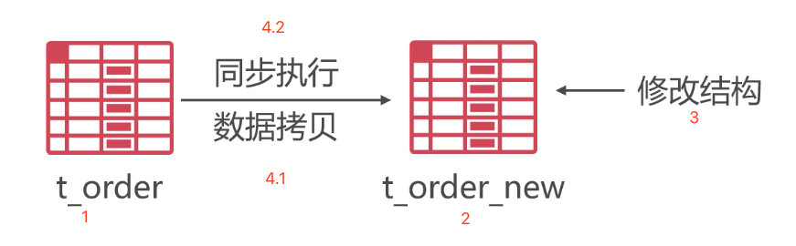
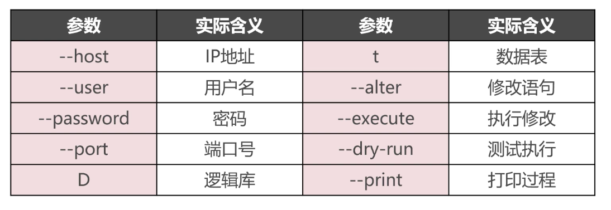
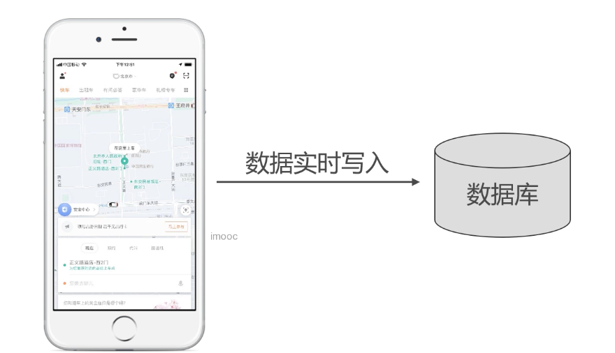
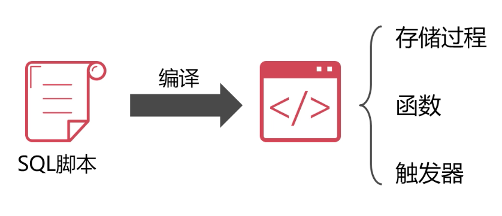
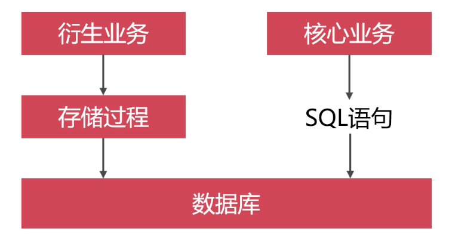
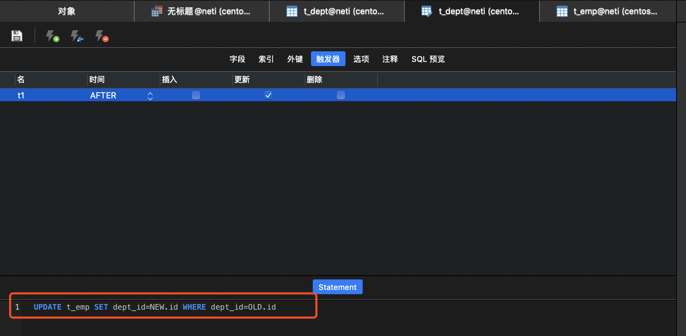

## 初级

### 主键用数字还是UUID

- UUID（Universally Unique Identifier） 是通用唯一识别码的缩写，其目的是让分布式系统中的所有元素，都能有唯一的辨识信息，而不需要通过中央控制端来做辨识信息的指定。

  

#### 疑问？

在**数据库集群**中，为了避免每个mysql 各自生成的主键产生重复，所以有人考虑采用UUID的方式。但是这种方式就真的很好么，分下各种情况的利弊如下


#### UUID 做主键的好处

- 使用 UUID，分布式生成主键，降低了全局节点的压力，使得主键生成速度更快
- 使用 UUID 生成的主键值全局且唯一
- 跨服务器合并数据很方便


#### UUID 做主键的缺点

- UUID 占用16个字节，比4个字节的 INT 类型和8个字节的 BIGINT 类型更加占用存储空间
- UUID 是字符串类型，查询速度很慢
- UUID 不是顺序增长，作为主键，数据写入 IO 随机性很大


#### 主键自动增长的优点

- INT 和 BIGINT 类型占用存储空间较小
- MySQL 检索数字类型速度远快过字符串
- 主键值是自动增长的，所以 IO 写入连续性较好


#### 分布式环境下的主键自动增长

通过上面的分析，无论什么场合，单机或分布式集群，都不推荐使用 UUID 作为数据表的主键。特别对查询性能要求较高的

##### 最简单的思路：

为了保留主键自动增长的全部优点，集中解决一个避免主键产生重复的问题。我们可以采取设置主键起始偏移量和自增步长来避免重复问题。如果我们有三个数据库实例，我们可以将主键自增步长设置为 3 ，这样对于第一个数据库实例而言，主键自增就是 1、4、7、10...，对于第二个数据库实例而言，主键自增就是 2、5、8、11...，对于第三个数据库实例而言，主键自增就是 3、6、9、12....。

##### 分布式数据库主键方案详解

<https://blog.csdn.net/chenshun123/article/details/79588208>


### 在线修改表结构

#### 问题

- 在业务系统运行的过程中随意删改字段，会造成重大事故
- 常规的做法是业务停机，维护表结构
- 但是不影响正常业务的表结构是允许在线修改的（比如增加或去除字段索引）

#### alter table 修改表结构的弊病

- 由于修改表结构是表级锁，因此在修改表结构式，影响表写入操作
- 如果修改表结构失败，必须还原表结构，耗时更长
- 大数据表记录多，修改表结构锁表时间更久


#### PerconaTookit 工具介绍

Percona 公司提供了维护 MySQL 的 PerconaTookit 工具包，MySQL DBA 必备工具之一。[percona toolkit 学习记录](<https://blog.csdn.net/wsk1103/article/details/80960300>)，通过该工具提供的 `pt-online-schema-change`  模块可以进行在线修改表结构。

| 分类   | 工具命令                 | 工具作用                           | 备注           |
| ------ | ------------------------ | ---------------------------------- | -------------- |
| 开发类 | pt-duplicate-key-checker | 列出并删除重复的索引和外键         |                |
|        | pt-online-schema-change  | 在线修改表结构                     |                |
|        | pt-query-advisor         | 分析查询语句，并给出建议，有bug    | 已废弃         |
|        | pt-show-grants           | 规范化和打印权限                   |                |
|        | pt-upgrade               | 在多个服务器上执行查询，并比较不同 |                |
| 性能类 | pt-index-usage           | 分析日志中索引使用情况，并出报告   |                |
|        | pt-pmp                   | 为查询结果跟踪，并汇总跟踪结果     |                |
|        | pt-visual-explain        | 格式化执行计划                     |                |
|        | pt-table-usage           | 分析日志中查询并分析表使用情况     | pt 2.2新增命令 |
| 配置类 | pt-config-diff           | 比较配置文件和参数                 |                |
|        | pt-mysql-summary         | 对mysql配置和status进行汇总        |                |
|        | pt-variable-advisor      | 分析参数，并提出建议               |                |
| 监控类 | pt-deadlock-logger       | 提取和记录mysql死锁信息            |                |
|        | pt-fk-error-logger       | 提取和记录外键信息                 |                |
|        | pt-mext                  | 并行查看status样本信息             |                |
|        | pt-query-digest          | 分析查询日志，并产生报告           | 常用命令       |
|        | pt-trend                 | 按照时间段读取slow日志信息         | 已废弃         |
| 复制类 | pt-heartbeat             | 监控mysql复制延迟                  |                |
|        | pt-slave-delay           | 设定从落后主的时间                 |                |
|        | pt-slave-find            | 查找和打印所有mysql复制层级关系    |                |
|        | pt-slave-restart         | 监控salve错误，并尝试重启salve     |                |
|        | pt-table-checksum        | 校验主从复制一致性                 |                |
|        | pt-table-sync            | 高效同步表数据                     |                |
| 系统类 | pt-diskstats             | 查看系统磁盘状态                   |                |
|        | pt-fifo-split 模         | 拟切割文件并输出                   |                |
|        | pt-summary               | 收集和显示系统概况                 |                |
|        | pt-stalk                 | 出现问题时，收集诊断数据           |                |
|        | pt-sift                  | 浏览由pt-stalk创建的文件           | pt 2.2新增命令 |
|        | pt-ioprofile             | 查询进程IO并打印一个IO活动表       | pt 2.2新增命令 |
| 实用类 | pt-archiver              | 将表数据归档到另一个表或文件中     |                |
|        | pt-find                  | 查找表并执行命令                   |                |
|        | pt-kill                  | Kill掉符合条件的sql                | 常用命令       |
|        | pt-align                 | 对齐其他工具的输出                 | pt 2.2新增命令 |
|        | pt-fingerprint           | 将查询转成密文                     | pt 2.2新增命令 |

- 安装可以参考 [4.0-SQL优化---pt-query-digest](4.0-SQL优化.md#pt-query-digest)。**tips：这里建议使用老师提供的版本percona-toolkit-3.0.13。我自己在安装新版本使用的时候会遇到如下错误，网上暂时没找到解决方案**

  ```shell
  [root@localhost vagrant]# pt-online-schema-change --host=192.168.0.109 --port=3306 --user=root --password=123456 --alter "MODIFY name VARCHAR(50) NOT NULL COMMENT '收货人（改)'" D=neti,t=t_customer_address --print --execute --charset=utf8
  No slaves found.  See --recursion-method if host localhost.localdomain has slaves.
  Not checking slave lag because no slaves were found and --check-slave-lag was not specified.
  Operation, tries, wait:
    analyze_table, 10, 1
    copy_rows, 10, 0.25
    create_triggers, 10, 1
    drop_triggers, 10, 1
    swap_tables, 10, 1
    update_foreign_keys, 10, 1
  There is an error in MySQL that makes the server to die when trying to rename a table with FKs. See https://bugs.mysql.com/bug.php?id=96145
  Since pt-online-schema change needs to rename the old <-> new tables as the final step, and the requested table has FKs, it cannot be executed under the current MySQL version
  ```

  

- pt-online-schema-change 在线修改表结构原理

  

  - 在原表 t_order 基础上创建一个一样结构的新表 t_order_new

  - 在 t_order_new 上执行修改表结构的语句

  - 在 t_order 表中的创建触发器，当数据产生的时候进行同步到 t_order_new 中，与此同时，还将 t_order 中的原始数据进行拷贝到 t_order_new 中。

  - 当数据都同步完成后， t_order 中也没有数据写入的时候，删除 t_order 表，并将 t_order_new 改成 t_order 。最终完成了在线修改操作。全程无锁表操作，不耽误正常业务读写。

    
    

#### pt-online-schema-change  使用

```
# OPTIONS 各种参数   DNS 需要操作的逻辑库数据表
pt-online-schema-change OPTIONS DNS
```

参数表：



演示：

```shell
# 把客户收货地址表中的 name 字段改成 varchar(20)

# 首先进入 mysql 执行这两句话
# 原因是由于 mysql8.0 引入了新的密码认证方式，而 percona toolkit 目前还不支持，所以就修改mysql的密码认证方式为老版本的方式
ALTER USER 'root'@'%' IDENTIFIED BY 'password' PASSWORD EXPIRE NEVER;
ALTER USER 'root'@'%' IDENTIFIED WITH mysql_native_password BY '123456';

# 从新开一台机器安装好  percona-tookit 工具包，并执行详细命令参数，执行在线修改表结构
[root@localhost vagrant]# pt-online-schema-change --host=192.168.0.109 --port=3306 --user=root --password=123456 --alter "MODIFY name VARCHAR(20) NOT NULL COMMENT '收货人（改)'" D=neti,t=t_customer_address --print --execute --charset=utf8
No slaves found.  See --recursion-method if host localhost.localdomain has slaves.
Not checking slave lag because no slaves were found and --check-slave-lag was not specified.
Operation, tries, wait:
  analyze_table, 10, 1
  copy_rows, 10, 0.25
  create_triggers, 10, 1
  drop_triggers, 10, 1
  swap_tables, 10, 1
  update_foreign_keys, 10, 1
Altering `neti`.`t_customer_address`...
Creating new table...
CREATE TABLE `neti`.`_t_customer_address_new` (
  `id` int(10) unsigned NOT NULL AUTO_INCREMENT COMMENT '主键',
  `customer_id` int(10) unsigned NOT NULL COMMENT '客户ID',
  `name` varchar(30) NOT NULL COMMENT '收货人（改)',
  `tel` char(11) NOT NULL COMMENT '收货人电话',
  `address` varchar(200) NOT NULL COMMENT '收货人地址',
  `prime` tinyint(1) NOT NULL COMMENT '是否为缺省收货地址',
  PRIMARY KEY (`id`),
  KEY `idx_customer_id` (`customer_id`)
) ENGINE=InnoDB AUTO_INCREMENT=4 DEFAULT CHARSET=utf8 COMMENT='客户收货地址表'
Created new table neti._t_customer_address_new OK.
Altering new table...
ALTER TABLE `neti`.`_t_customer_address_new` MODIFY name VARCHAR(20) NOT NULL COMMENT '收货人（改)'
Altered `neti`.`_t_customer_address_new` OK.
2020-06-08T09:35:26 Creating triggers...
2020-06-08T09:35:26 Created triggers OK.
2020-06-08T09:35:26 Copying approximately 3 rows...
INSERT LOW_PRIORITY IGNORE INTO `neti`.`_t_customer_address_new` (`id`, `customer_id`, `name`, `tel`, `address`, `prime`) SELECT `id`, `customer_id`, `name`, `tel`, `address`, `prime` FROM `neti`.`t_customer_address` LOCK IN SHARE MODE /*pt-online-schema-change 3324 copy table*/
2020-06-08T09:35:26 Copied rows OK.
2020-06-08T09:35:26 Analyzing new table...
2020-06-08T09:35:26 Swapping tables...
RENAME TABLE `neti`.`t_customer_address` TO `neti`.`_t_customer_address_old`, `neti`.`_t_customer_address_new` TO `neti`.`t_customer_address`
2020-06-08T09:35:26 Swapped original and new tables OK.
2020-06-08T09:35:26 Dropping old table...
DROP TABLE IF EXISTS `neti`.`_t_customer_address_old`
2020-06-08T09:35:26 Dropped old table `neti`.`_t_customer_address_old` OK.
2020-06-08T09:35:26 Dropping triggers...
DROP TRIGGER IF EXISTS `neti`.`pt_osc_neti_t_customer_address_del`
DROP TRIGGER IF EXISTS `neti`.`pt_osc_neti_t_customer_address_upd`
DROP TRIGGER IF EXISTS `neti`.`pt_osc_neti_t_customer_address_ins`
2020-06-08T09:35:26 Dropped triggers OK.
Successfully altered `neti`.`t_customer_address`.


###########################################################################
# 再次查询表结构，name字段已经改了
show create table t_customer_address

CREATE TABLE `t_customer_address` (
  `id` int(10) unsigned NOT NULL AUTO_INCREMENT COMMENT '主键',
  `customer_id` int(10) unsigned NOT NULL COMMENT '客户ID',
  `name` varchar(20) NOT NULL COMMENT '收货人（改)',
  `tel` char(11) NOT NULL COMMENT '收货人电话',
  `address` varchar(200) NOT NULL COMMENT '收货人地址',
  `prime` tinyint(1) NOT NULL COMMENT '是否为缺省收货地址',
  PRIMARY KEY (`id`),
  KEY `idx_customer_id` (`customer_id`)
) ENGINE=InnoDB AUTO_INCREMENT=4 DEFAULT CHARSET=utf8 COMMENT='客户收货地址表'

```


### 订单号和流水号的区别

- 订单号即是订单的唯一编号，而且经常被用来检索，所以应当是数字类型的主键

- 流水号是打印在购物单据上的字符串，便于阅读，但是由于是字符串，存储内容也长不利于用作查询。例如这里的流水号方式设计如下：

  


### 逻辑删除 VS 物理删除

##### 物理删除的代价

- 由于物理删除是真删除，将数据从磁盘抹除，所以数据恢复起来难度大，很多时候需要停机业务，进行操作导致线上业务暂停。
- 物理删除会造成主键的不连续，导致分页查询变慢

##### 逻辑删除

- 逻辑删除就是在数据表添加一个字段（is_deleted）,用字段值标记该数据已经逻辑删除，查询的时候跳过这些数据

  > select ..... from …… where  is_deleted=0;

- 核心业务数据表，必须要采用逻辑删除

  

### 千万记录，如何快速商品分页

下面一组分页查询的耗时记录

```mysql
SELECT id,val FROM t_test LIMIT 100,10;					# OK, Time: 0.000000s
SELECT id,val FROM t_test LIMIT 10000,10;				# OK, Time: 0.004000s
SELECT id,val FROM t_test LIMIT 1000000,10;				# OK, Time: 0.353000s
SELECT id,val FROM t_test LIMIT 5000000,10;				# OK, Time: 1.257000s
SELECT id,val FROM t_test LIMIT 9000000,10;				# OK, Time: 1.579000s
```

从耗时结果可以发现，越往 limit 起始数据越大，越耗时。


##### 利用主键索引来加速分页查询

这种方式优化的前提是，主键值是连续没有进行过删除。从耗时可以看出查询时间的极大差异

```mysql
# 方式一
SELECT id,val FROM t_test WHERE id>=9000000 LIMIT 10;		# OK, Time: 0.001000s

# 方式二
SELECT id,val FROM t_test WHERE id>=9000000 AND id<=9000010;	# OK, Time: 0.001000s
```


##### 再利用主键索引加速，再做表连接查询

如果主键是不连续的情况下，如何做优化？

```mysql
# 通过单独查询主键（索引加速）作为一张临时表，然后进行表连接查询
SELECT t.id,t.val 
	FROM t_test t 
	JOIN (SELECT id FROM t_test LIMIT 5000000,10) temp 
	ON t.id=temp.id
# OK, Time: 0.829000s

SELECT t.id,t.val 
	FROM t_test t 
	JOIN (SELECT id FROM t_test LIMIT 9000000,10) temp 
	ON t.id=temp.id
# OK, Time: 1.321000s
```

从查询时间结果可以看出，相对于直接使用 limit 查询时间还是有所提升，但是对于主键连续情况下直接进行where 过滤主键加速还是差很远。所以业务中竟可能保持业务数据主键连续，也利于查询。


##### 其他

业务设置查询上限，很早期的数据不提供查询业务。


### 读写份量不同情况分析

#### 读多写少的业务场景

- 普遍来说，大多数系统都是读多写少的，mysql足以满足


#### 写多读少的业务场景

例如：滴滴，实时上传写入你的位置信息等数据，但是除非出现事故，否则一般不回去查询这些数据



（一）

- 如果是低价值的数据，可以采用 NoSQL 数据库来存储这些数据
- NoSQL 抛弃了复杂的表结构和约束，数据的写入速度很快

（二）

- 如果是高价值的数据，可以mysql采用 TokuDB 引擎来保存数据
- TokuDB 的写入速度是 InnoDB 的 9-20 倍


#### 写多读多的业务场景

例如：QQ、微信这种即时通信的应用，实时都在不断的读写


## 进阶



- 存储过程
  - 存储过程是一个编译后的 sql 脚本集合，可以执行增删改查、但是不能写在sql语句里面，只能单独调用
- 函数
  - 是一种特殊的存储过程，不能单独调用，必须写在sql里面。相对于存储过程返回值只能有一个
- 触发器
  - 是一种特殊的存储过程，不用主动调用，只要触发条件就会执行


### 什么是存储过程？

[MySQL 存储过程](<https://www.runoob.com/w3cnote/mysql-stored-procedure.html>)

> 是一种在数据库中存储复杂程序，以便外部程序调用的一种数据库对象。
>
> 存储过程是为了完成特定功能的SQL语句集，经编译创建并保存在数据库中，用户可通过指定存储过程的名字并给定参数(需要时)来调用执行。
>
> 存储过程思想上很简单，就是数据库 SQL 语言层面的代码封装与重用。



#### 优点

- 存储过程是编译过的SQL脚本，所以执行的速度非常快
- 实现了SQL编程，可以降低锁表的时间和锁表的范围

- 存储过程可封装，并隐藏复杂的商业逻辑。
- 存储过程可以回传值，并可以接受参数。
- 存储过程无法使用 SELECT 指令来运行，因为它是子程序，与查看表，数据表或用户定义函数不同。
- 存储过程可以用在数据检验，强制实行商业逻辑等。

#### 缺点

- 存储过程，往往定制化于特定的数据库上，因为支持的编程语言不同。当切换到其他厂商的数据库系统时，需要重写原有的存储过程。
- 存储过程的性能调校与撰写，受限于各种数据库系统。


#### 案例

```mysql
# 编写存储过程，根据部门名称，查询部门用户信息
CREATE DEFINER=`root`@`%` PROCEDURE `p1`(IN `p_dname` VARCHAR(20) )
BEGIN
  #Routine body goes here...
	SELECT e.id,e.ename,e.sex,e.married,j.job
	FROM t_emp e JOIN t_dept d ON e.dept_id=d.id
	JOIN t_job j ON e.job_id = j.id
	WHERE d.dname=p_dname;
END

# 调用
call p1("零售部");
+----+-----------+-----+---------+-----------+
| id | ename     | sex | married | job       |
+----+-----------+-----+---------+-----------+
|  1 | 李娜      | 女  |       1 | 店长      |
|  2 | 刘畅      | 女  |       1 | 售货员    |
|  3 | 陈婷婷    | 女  |       0 | 实习生    |
+----+-----------+-----+---------+-----------+
3 rows in set (0.00 sec)
# 存储过程不能当函数调用
select p1('零售部');
ERROR 1305 (42000): FUNCTION neti.p1 does not exist


# 编写存储过程，插入实习员工数据的时候，如果是男性，分配到网商部实习；如果是女性，分配到零售部实习
CREATE DEFINER=`root`@`%` PROCEDURE `p2`(IN `p_wid` VARCHAR(20),IN `p_ename` VARCHAR(20),IN `p_sex` CHAR(1),IN `p_married` boolean,IN `p_education` TINYINT,IN `p_tel` VARCHAR(11))
BEGIN
  #Routine body goes here...
	DECLARE dept_id INT;
	CASE 
		WHEN p_sex='女' THEN
			set dept_id=3;
		ELSE
			set dept_id=4;
	END CASE;
	INSERT INTO t_emp(wid,ename,sex,married,education,tel,dept_id,hiredate,job_id,`status`,is_deleted)
	VALUES(p_wid,p_ename,p_sex,p_married,p_education,p_tel,dept_id,CURDATE(),9,1,0);
END

# 调用，在 t_emp 表中已经插入这条数据了
call p2("TE1122","陈冠希","男",false,1,"13124321341");
Query OK, 1 row affected, 4 warnings (0.04 sec)
```


### 什么是函数

[mysql自定义函数详解](<https://blog.csdn.net/yhl_jxy/article/details/52290407>)

```mysql
# 编写根据成绩返回等级的函数
CREATE DEFINER=`root`@`%` FUNCTION `f1`(`fraction` INT) RETURNS char(20) CHARSET utf8
BEGIN
  #Routine body goes here...
	DECLARE v_grade CHAR(20);
	CASE  
		WHEN fraction<=60 THEN
			SET v_grade="不及格";
		WHEN fraction>60 AND fraction<=90 THEN
			SET v_grade="良好";
		WHEN fraction>90 AND fraction<=100 THEN
			SET v_grade="优秀";
		ELSE
			SET v_grade="未知信息";
	END CASE;
	RETURN v_grade;
END

# 调用
select f1(10);
+-----------+
| f1(10)    |
+-----------+
| 不及格    |
+-----------+

select f1(1001);
+--------------+
| f1(1001)     |
+--------------+
| 未知信息     |
+--------------+

# 如果当存储过程调用会出错
call f1(10);
ERROR 1305 (42000): PROCEDURE neti.f1 does not exist
```


### 什么是触发器

> SQL触发器是一种特殊类型的[存储过程](http://www.yiibai.com/mysql/stored-procedure-tutorial.html)。 这是特别的，因为它不像直接像存储过程那样调用。 触发器和存储过程之间的主要区别在于，当对表执行数据修改事件时，会自动调用触发器，而存储过程必须要明确地调用。

```mysql
# 编写触发器，修改部门编号，同步更新改部门员工的 dept_id 字段

# 看下图，在部门表中定义触发器，当部门表中字段改变的时候，修改对应员工表中的部门ID字段
UPDATE t_emp SET dept_id=NEW.id WHERE dept_id=OLD.id
```




## 高阶