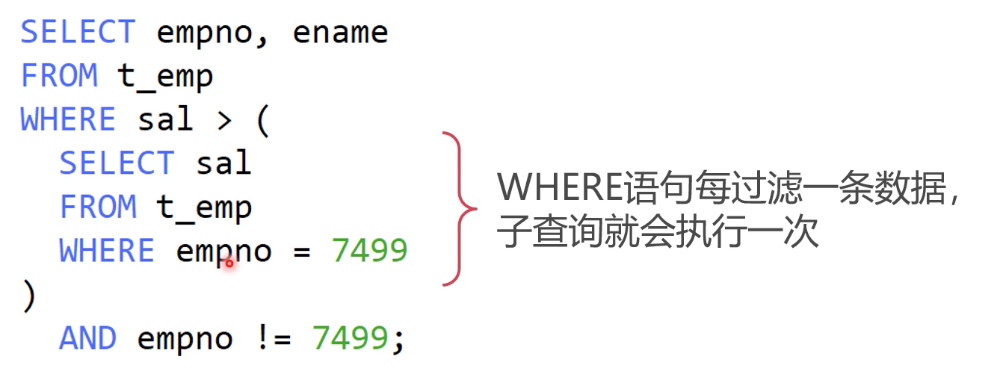
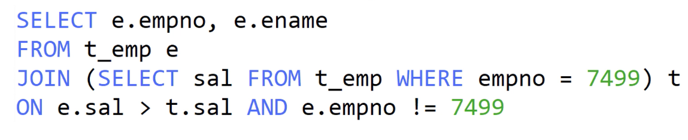
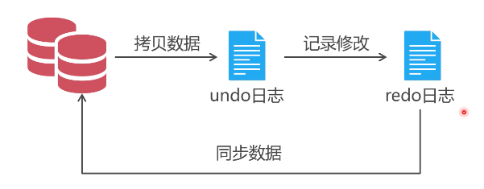
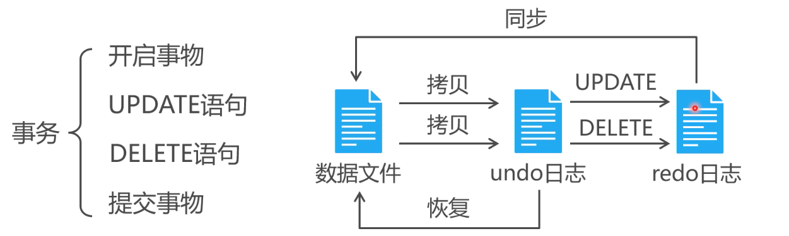

## CRUD的一些操作注意事项

### 批量插入数据，因为一条记录的问题，全部数据都写入失败

```mysql
insert into t_dept(deptno,dname,loc)
values (40,"企划部","北京"),			
	   (50,"企划部1","北京1"),
	   (60,"企划部2","北京2"),
	   (70,"企划部3","北京3"),
	   (80,"企划部4","北京4"),
	   
# 由于 deptno 是主键，并且已经存在一条 deptno=40 的数据，会导致 innoDB 回滚所有数据，导致全部写入失败，可以通过  ignore 关键来，忽略又错误的数据，让其他数据正常写入
insert ignore into t_dept(deptno,dname,loc)
values (40,"企划部","北京"),			
	   (50,"企划部1","北京1"),
	   (60,"企划部2","北京2"),
	   (70,"企划部3","北京3"),
	   (80,"企划部4","北京4"),
```


### 如何实现不存在就插入，存在就更新？

```mysql
insert into t_emp_ip(id,empno,ip) 
value (5,8004,"192.168.99.44")
      (6,8005,"192.168.99.45")
      (7,8006,"192.168.99.46")
      (8,8001,"192.168.99.47")
     
# 由于 empno 是主键，又唯一约束。所以 t_emp_ip=8001 已经有这条数据了，我们希望在批量插入的时候这条相关记录是执行更新 update 操作，这时候可以使用 ON DUPLICATE KEY UPDATE
insert into t_emp_ip(id,empno,ip) 
value (5,8004,"192.168.99.44")
      (6,8005,"192.168.99.45")
      (7,8006,"192.168.99.46")
      (8,8001,"192.168.99.47")
ON DUPLICATE KEY UPDATE ip = values(ip)
```


### 要不要使用子查询

- MySQL 默认关闭了缓存，所以每个子查询都是相关子查询

- 相关子查询就是要循环执行多次的子查询

  

  所以当数据有一万条的时候，子查询就要执行一万次。相当消耗性能。

- 使用 FROM 子查询，替代 where 子查询

  from 语句最先被执行，且只会执行一次，所以先将子查询的结果通过 from 执行得到一份，然后通过 join 关联执行得到结果，子查询就避免了出现在 where 中相关子查询出现许多次的情况

  

### 外连接的 join 条件

- 内连接里 inner join ，查询条件写在  ON 子句或者 where 子句，效果相同。取的是数据结果的交集

  ```mysql
  select e.ename,d.dname
  from t_emp e
  join t_dept d on e.deptno = d.deptno and d.deptno=10;
  
  # 上面这条语句结果和下面这条语句查询结果一样
  
  select e.ename,d.dname
  from t_emp e
  join t_dept d on e.deptno = d.deptno
  where d.deptno=10;
  ```

  

- 外连接里，查询条件写在 on 子句或者 where 子句，效果不同。

  ```MySQL 
  # 外连接中，条件写在 on 子句。查询结果会保留左表所有数据，右表中不符合条件的字段为nil
  select e.ename,d.dname
  from t_emp e
  left join t_dept d on e.deptno = d.deptno and d.deptno=10;
  
  # 外链接中，条件写在 where 子句。查询结果会在左右表结果集中，在进行一次过滤
  select e.ename,d.dname
  from t_emp e
  left join t_dept d on e.deptno = d.deptno
  where d.deptno=10;
  ```

### 表连接修改

- update 语句中的 where 子查询如何改成表连接

- ```mysql 
  update t_emp set sal=10000
  where deptno = 
  	(select deptno from t_dept where dname = 'SALES');
  	
  # 前面提到子查询写在 where 中。属于相关子查询，会随着数据的增多执行很多次，改用 join 
  
  update t_emp e 
  join t_dept d on e.deptno = d.deptno and d.dname='SALES'
  set e.sal=10000,d.dname="销售部";
  ```

### 表连接删除

- delete 语句中也可以使用表连接

  ```mysql
  delete e,d
  from t_emp e
  join t_dept d on e.deptno=d.deptno and d.dname='销售部'
  
  # delete 后面更别名，就指定要删除那个表中符合条件的数据
  ```

  

## 事物机制的原理

- 避免写入直接操作数据文件，如果遇到中途出错，宕机情况就会导致分不清数据的实际情况如何

- 利用日志来实现间接写入

  - MySQL 总共又5中日志，其中只有redo日志和undo日志与事物有关

    

### 事物案例

- 把 10 部门中的  manager 员工调往 20 部门，其他岗位的员工调往 30 不猛，然后删除 10 部门

  